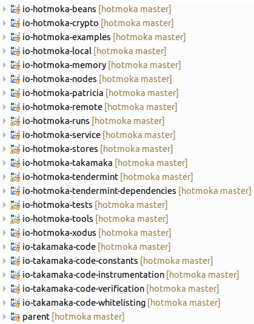
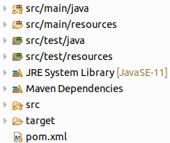
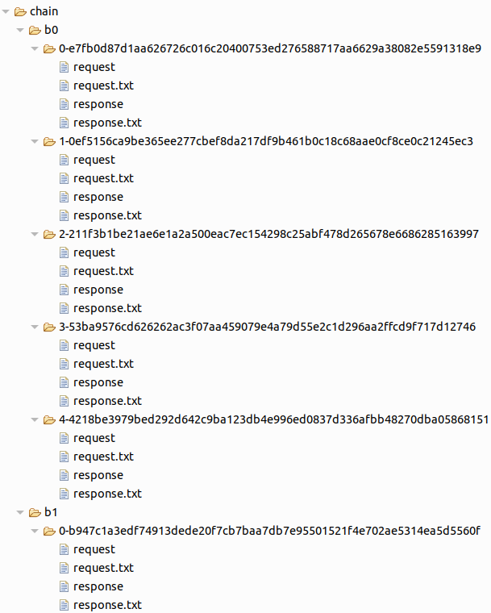
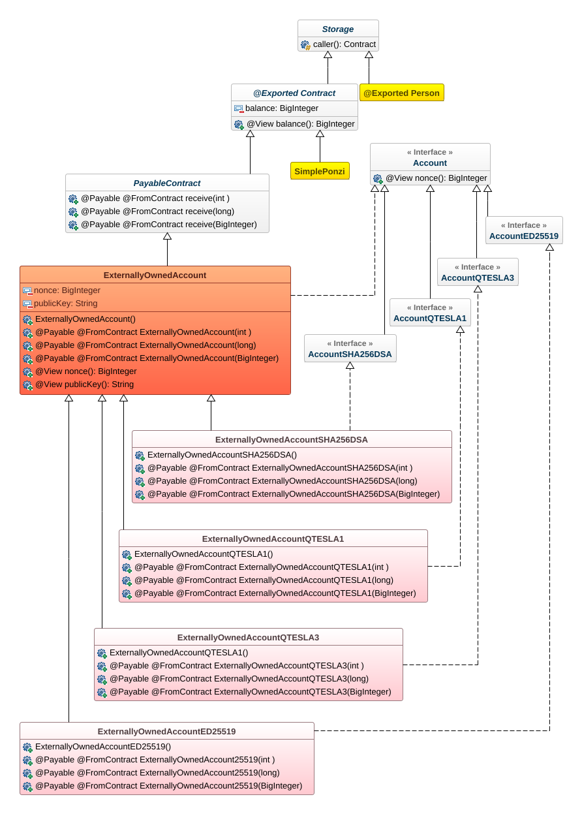
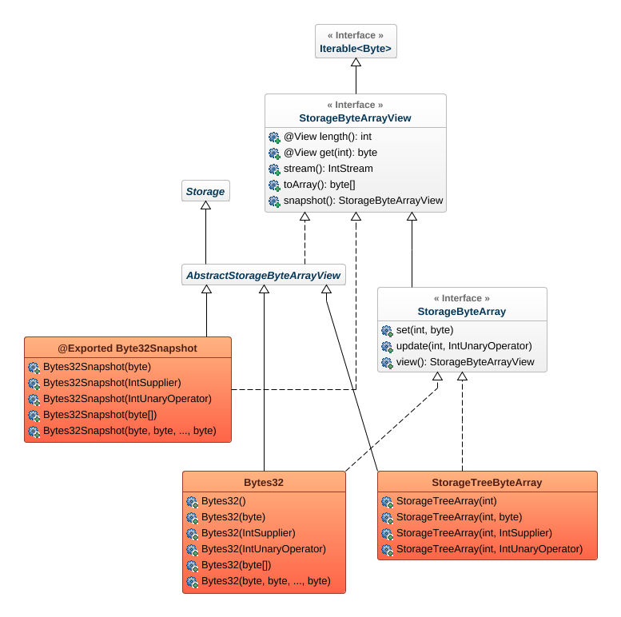
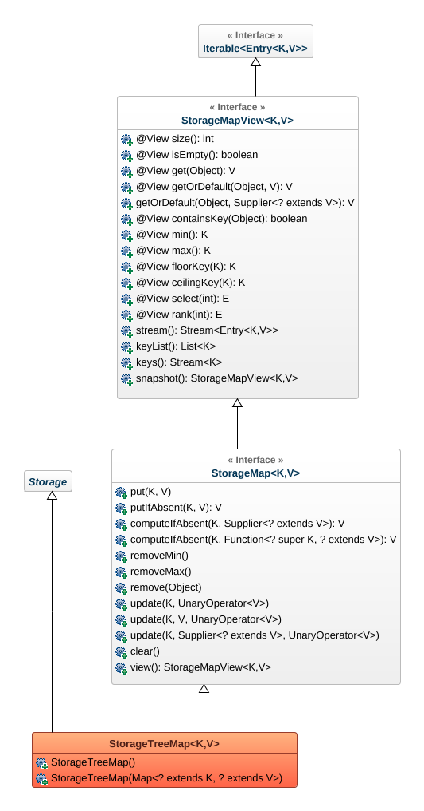
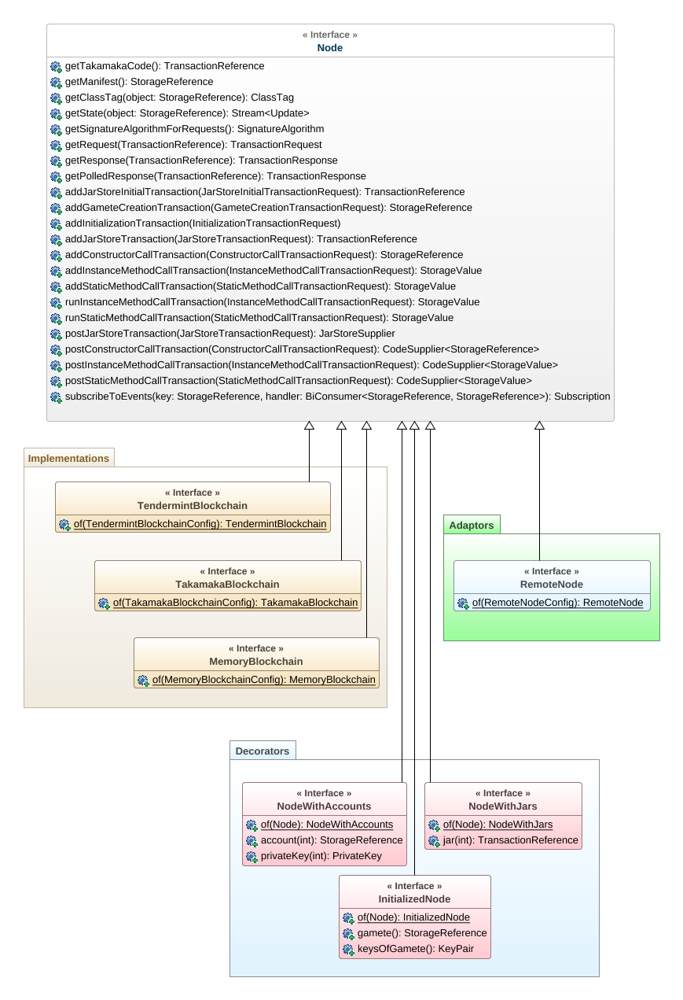

# Hotmoka

[](https://github.com/spoto/hotmoka/actions)

Hotmoka is a framework for programming a network of communicating nodes, in a subset of Java called Takamaka. Nodes can belong to a blockchain or can be Internet of Things devices.

# Table of Contents
1. [Introduction](#introduction)
2. [Installation of Hotmoka](#installation)
3. [A First Program](#first-program)
    - [Creation of the Eclipse Project](#creation-eclipse-project)
    - [Creation of a Hotmoka Node in Memory](#memory-blockchain)
    - [A Transaction that Stores a Jar in a Hotmoka Node](#jar-transaction)
    - [Configuration of the Logging File](#logging)
    - [A Transaction that Creates an Account](#account-creation)
    - [Using Views to Simplify the Code](#using-views)
    - [A Transaction that Creates an Object of our Program](#constructor-transaction)
    - [A Transaction that Invokes a Method](#method-transaction)
    - [Storage Types and Constraints on Storage Classes](#storage-types)
    - [Transactions Can Be Added, Posted and Run](#transactions)
    - [Running on Tendermint](#tendermint)
4. [The Notion of Smart Contract](#smart-contracts)
    - [A Simple Ponzi Scheme Contract](#simple-ponzi)
    - [The `@FromContract` and `@Payable` Annotations](#fromcontract-payable)
    - [Payable Contracts](#payable-contracts)
    - [The `@View` Annotation](#view)
    - [The Hierarchy of Contracts](#hierarchy-contracts)
    - [Red/Green Contracts](#red-green-contracts)
5. [The Support Library](#support-library)
    - [Storage Lists](#storage-lists)
        - [A Gradual Ponzi Contract](#a-gradual-ponzi-contract)
        - [A Note on Re-entrancy](#a-note-on-re-entrancy)
        - [Running the Gradual Ponzi Contract](#running-the-gradual-ponzi-contract)
    - [Storage Arrays](#storage_arrays)
        - [A Tic-Tac-Toe Contract](#a-tic-tac-toe-contract)
        - [A More Realistic Tic-Tac-Toe Contract](#a-more-realistic-tic-tac-toe-contract)
        - [Running the Tic-Tac-Toe Contract](#running-the-tic-tac-toe-contract)
        - [Specialized Storage Array Classes](#specialized-storage-array-classes)
    - [Storage Maps](#storage_maps)
        - [A Blind Auction Contract](#a-blind-auction-contract)
        - [Events](#events)
        - [Running the Blind Auction Contract](#running-the-blind-auction-contract)
        - [Listening to Events](#listening-to-events)
6. [Hotmoka Nodes](#hotmoka-nodes)
    - [Publishing a Hotmoka Node Online](#publishing-a-hotmoka-node-online)
        - [Publishing a Hotmoka Node on Amazon EC2](#publishing-a-hotmoka-node-on-amazon-ec2)
    - [Building a Hotmoka Remote Node from an Online Service](#building-a-hotmoka-remote-node-from-an-online-service)
        - [Creating Sentry Nodes](#creating-sentry-nodes)
    - [Signatures and Quantum-Resistance](#signatures-and-quantum-resistance)
7. [Tokens](#tokens)
8. [Code Verification](#code-verification)
    - [JVM Bytecode Verification](#jvm-bytecode-verification)
    - [Takamaka Bytecode Verification](#takamaka-bytecode-verification)
    - [Command-Line Verification and Instrumentation](#command-line-verification-and-instrumentation)
9. [References](#references)

# Introduction <a name="introduction"></a>

More than a decade ago, Bitcoin [[Nakamoto08]](#Nakamoto08)
swept the computer industry
as a revolution, providing, for the first time, a reliable technology
for building trust over an inherently untrusted computing
infrastructure, such as a distributed network of computers.
Trust immediately translated into money and Bitcoin became
an investment target, exactly at the moment of one of the worst
economical turmoil of recent times. Central(-_ized_) banks,
fighting against the crisis, looked like dinosaurs in comparison
to the _decentralized_ nature of Bitcoin.

Nevertheless, the novelty of Bitcoin was mainly related to its
_consensus_ mechanism based on a _proof of work_, while the
programmability of Bitcoin transactions was limited due
to the use of a non-Turing-equivalent scripting
bytecode [[Antonopoulos17]](#Antonopoulos17).

The next step was hence the use of a Turing-equivalent
programming language (up to _gas limits_) over an abstract
store of key/value pairs, that can be
efficiently kept in a Merkle-Patricia trie.
That was Ethereum [[AntonopoulosW19]](#AntonopoulosW19), whose
Solidity programming language allows one
to code any form of _smart contract_, that is, code
that becomes an agreement between parties, thanks to
the underlying consensus enforced by the blockchain.

Solidity looks familiar to most programmers. Conditionals, loops and
structures are there since more than half a century. Programmers
assumed that they _knew_ Solidity. However, the intricacies of
its semantics made learning Solidity harder than expected.
Finding good Solidity programmers is still difficult and
they are consequently expensive. It is, instead, way too easy
to write buggy code in Solidity, that _seems_ to work perfectly,
up to _that_ day when things go wrong, very wrong [[AtzeiBC17]](#AtzeiBC17).

It is ungenerous to blame Solidity for all recent attacks to smart contracts
in blockchain. That mainly happened because of the same success of Solidity,
that made it the natural target of the attacks. Moreover, once the
Pandora's box of Turing equivalence has been opened, you cannot expect anymore to
keep the devils at bay, that is, to be able to
decide and understand, exactly, what your code will do at run time.
And this holds for every programming language, past, present or future.

I must confess that my first encounter with Solidity
was a source of frustration. Why was I expected to learn another programming
language? and another development environment? and another testing framework?
Why was I expected to write code without a support library that provides
proved solutions to frequent problems?
What was so special with Solidity after all? Things became even more difficult when
I tried to understand the semantics of the language. After twenty-five years of studying
and teaching programming languages, compilation, semantics and code analysis
(or, possibly, just because of that) I still cannot explain exactly why there
are structures and contracts instead of a single composition mechanism in Solidity;
nor what is indeed the meaning of `memory` and `storage` and why
it is not the compiler that takes care of such gritty details; nor why
externally owned accounts are not just a special kind of contracts;
nor why Solidity needs such low-level (and uncontrollable)
call instructions, that make Java's (horrible) reflection, in comparison, look like
a monument to clarity;
nor why types are weak in Solidity, so that contracts are held in `address`
variables, whose actual type is unknown and cannot be easily
enforced at run time [[CrafaPZ19]](#CrafaPZ19), with all consequent
programming monsters, such as unchecked casts. It seems that the evolution
of programming languages has brought us back to C's `void*` type.

Hence, when I first met people from Ailia SA in fall 2018, I was not surprised
to realize that they were looking for a new way of programming smart contracts
over the new blockchain that they were developing. I must thank them and our useful
discussions, that pushed me to dive in blockchain technology and
study many programming languages for smart contracts. The result
is Takamaka, a Java framework for writing smart contracts.
This means that it allows programmers to use a subset of Java for writing code
that can be installed and run in blockchain. Programmers will not have
to deal with the storage of objects in blockchain: this is completely
transparent to them. This makes Takamaka completely different from other
attempts at using Java for writing smart contracts, where programmers
must use explicit method calls to persist data to blockchain.

Writing smart contracts in Java entails that programmers
do not have to learn yet another programming language.
Moreover, they can use a well-understood and stable development
platform, together with all its modern tools. Programmers can use
features from the latest versions of Java, such as streams and lambda
expressions.
There are, of course, limitations to the kind of code that can
be run inside a blockchain. The most important limitation is
that programmers can only call a portion of the huge Java library,
whose behavior is deterministic and whose methods are guaranteed
to terminate.

Takamaka is included in the Hotmoka project, a framework
for collaborating nodes, whose long-term goal is to unify the programming
model of blockchain and internet of things.
The more scientific aspects of Takamaka have been published
in the last years [[Spoto19]](#Spoto19)[[Spoto20]](#Spoto20).

**Acknowledgments**.
I thank the people at Ailia SA, in particular Giovanni Antino, Mario Carlini,
Iris Dimni and Francesco Pasetto, who decided to invest in this project and who are building their own
blockchain that can be programmed in Takamaka. My thank goes also to all students and
colleagues who have read and proof-checked this document and its examples, finding
bugs and inconsistencies; in particular to
Luca Olivieri and Fabio Tagliaferro.
Chapter [Hotmoka Nodes](#hotmoka-nodes) is a shared work with Dinu Berinde.

_Verona, August 2020_.

# Installation of Hotmoka <a name="installation">

Takamaka is part of the Hotmoka project. The compiled jars
of the Hotmoka and Takamaka projects are not yet available
on a public repository such as Maven Central. Hence, the simplest
way for using Takamaka is to clone and install the Hotmoka project inside
your local Maven repository. You need Java JDK version at least 11 for
compiling the Hotmoka project.

Clone the project with:

```shell
$ git clone git@github.com:Hotmoka/hotmoka.git
```

then `cd` to the `hotmoka` directory and
compile, package, test and install the Hotmoka jars:

```shell
$ mvn clean install
```

If you want to generate the JavaDocs as well, you can use the following
Maven incantation instead:

```shell
$ JAVA_HOME=/usr/lib/jvm/default-java mvn clean install javadoc:aggregate-jar
```

placing, after `JAVA_HOME=`, the correct path inside your computer (which might not be
that reported in the example above), pointing to your Java installation directory.

In both cases, all tests should pass and all projects should be successfully installed:

```
[INFO] ------------------------------------------------------------------------
[INFO] Reactor Summary:
[INFO] 
[INFO] Hotmoka dev ........................................ SUCCESS [ 19.818 s]
[INFO] io-takamaka-code 1.0.0 ............................. SUCCESS [  3.359 s]
[INFO] io-takamaka-code-constants 1.0.0 ................... SUCCESS [  0.138 s]
[INFO] io-takamaka-code-whitelisting 1.0.0 ................ SUCCESS [  0.546 s]
[INFO] io-takamaka-code-verification 1.0.0 ................ SUCCESS [  0.938 s]
[INFO] io-hotmoka-crypto 1.0.0 ............................ SUCCESS [  0.524 s]
[INFO] io-hotmoka-beans 1.0.0 ............................. SUCCESS [  1.096 s]
[INFO] io-takamaka-code-instrumentation 1.0.0 ............. SUCCESS [  0.772 s]
[INFO] io-hotmoka-nodes 1.0.0 ............................. SUCCESS [  0.478 s]
[INFO] io-hotmoka-local 1.0.0 ............................. SUCCESS [  0.944 s]
[INFO] io-hotmoka-memory 1.0.0 ............................ SUCCESS [  0.329 s]
[INFO] io-hotmoka-service 1.0.0 ........................... SUCCESS [  0.966 s]
[INFO] io-hotmoka-remote 1.0.0 ............................ SUCCESS [  0.635 s]
[INFO] io-hotmoka-patricia 1.0.0 .......................... SUCCESS [  0.247 s]
[INFO] io-hotmoka-tools 1.0.0 ............................. SUCCESS [  0.245 s]
[INFO] io-hotmoka-xodus 1.0.0 ............................. SUCCESS [  0.213 s]
[INFO] io-hotmoka-stores 1.0.0 ............................ SUCCESS [  0.698 s]
[INFO] io-hotmoka-tendermint-dependencies 1.0.0 ........... SUCCESS [  3.739 s]
[INFO] io-hotmoka-tendermint 1.0.0 ........................ SUCCESS [  0.480 s]
[INFO] io-hotmoka-takamaka 1.0.0 .......................... SUCCESS [  0.325 s]
[INFO] io-hotmoka-runs 1.0.0 .............................. SUCCESS [  0.593 s]
[INFO] io-hotmoka-examples 1.0.0 .......................... SUCCESS [  3.586 s]
[INFO] io-hotmoka-tests 1.0.0 ............................. SUCCESS [04:46 min]
[INFO] ------------------------------------------------------------------------
[INFO] BUILD SUCCESS
[INFO] ------------------------------------------------------------------------
[INFO] Total time:  05:29 min
[INFO] Finished at: 2021-02-24T16:32:58+01:00
[INFO] ------------------------------------------------------------------------
```

> If you are not interested in running the tests, append `-DskipTests` after
> the word `install`.

 <p align="center"></p>


If you want to see and edit the sources of the Hotmoka project, it is well possible
to import them inside the Eclipse IDE, but this is not needed for
running the examples in the next sections of this tutorial. For that,
use the File &rarr; Import &rarr; Existing Maven Projects menu item in Eclipse and import
the parent Maven project contained in the `hotmoka` directory that you cloned from
GitHub. This should create, inside Eclipse, also its submodule projects.
You should see, inside Eclipse's project explorer, something like Figure 1.

You can compile, package, test and install the Hotmoka jars inside
Eclipse itself, by right-clicking on the `parent` project and selecting
`Run As` and then the `Mavel install` target. You can also run the tests inside
the Eclipse JUnit runner, by right-clicking on the `io-hotmoka-tests` subproject
and selecting `Run As` and then the `JUnit Test` target.

The Maven configuration of the project specifies that all modules and their dependencies
get copied into the `modules` directory, classified as automatic, explicit and unnamed
modules (as from Java 9 onwards). You can see this by typing:

```shell
$ ls -R modules

modules/:
automatic  explicit  unnamed

modules/automatic:
bcel-6.2.jar
spring-beans-5.2.7.RELEASE.jar
spring-core-5.2.7.RELEASE.jar
...
io-hotmoka-tendermint-dependencies-1.0.0.jar
io-hotmoka-xodus-1.0.0.jar
...

modules/explicit:
bcprov-jdk15on-1.67.jar
io-hotmoka-local-1.0.0.jar
io-hotmoka-remote-1.0.0.jar
io-hotmoka-takamaka-1.0.0.jar
io-takamaka-code-constants-1.0.0.jar
it-univr-bcel-1.1.0.jar
gson-2.8.6.jar
io-hotmoka-memory-1.0.0.jar
io-hotmoka-runs-1.0.0.jar
io-hotmoka-tendermint-1.0.0.jar
io-takamaka-code-instrumentation-1.0.0.jar
slf4j-api-1.7.30.jar
io-hotmoka-beans-1.0.0.jar
io-hotmoka-nodes-1.0.0.jar
io-hotmoka-service-1.0.0.jar
io-hotmoka-tools-1.0.0.jar
io-takamaka-code-verification-1.0.0.jar
io-hotmoka-crypto-1.0.0.jar
io-hotmoka-patricia-1.0.0.jar
io-hotmoka-stores-1.0.0.jar
io-takamaka-code-1.0.0.jar
io-takamaka-code-whitelisting-1.0.0.jar

modules/unnamed:
animal-sniffer-annotations-1.18.jar
jakarta.el-3.0.3.jar
...
```

It is not possible to discuss here the difference between
these kinds of modules (see [[MakB17]](#MakB17) for that).
Just remember that explicit and
automatic modules must be put in the module path, while
unnamed modules must stay in the class path. Eclipse tries
to do this automatically for us, but often gets confused and
you will have to specify a run configuration sometime.
In any case, it is always possible to run Java from command-line
and specify where to put each category of modules. We will show examples
later. For now, let us define some shell variables that will help
us later to put the modules in the module path or in the class path.
Assuming that you are inside the parent project of Hotmoka, execute:

```shell
$ cwd=$(pwd)
$ explicit=$cwd"/modules/explicit"
$ automatic=$cwd"/modules/automatic"
$ unnamed=$cwd"/modules/unnamed"
```

or execute the `set_variables.sh` shell script, that runs the same commands:

```shell
$ . set_variables.sh
```

Variable `cwd` contains the current directory, where the parent project
of Hotmoka lies. The other three variables contain the directory of the
explicit, automatic and unnamed modules, respectively.

> The space between the dot and `set_variables.sh` guarantees that the
> variables remain set after the script terminates.

The experiments that we will perform in the rest of the tutorial will
require to create Eclipse projects inside a directory that we will name
`tutorial`. This directory will be a sibling of the `hotmoka`
repository that you have just cloned. Hence, go out of the `hotmoka`
repository, create the `tutorial` directory and move inside it:

```shell
$ cd ..
$ mkdir tutorial
$ cd tutorial
```

It is suggested that you experiment with the tutorial examples yourself and
build their projects inside the `tutorial` directory.
However, if you want to jump to the result directly or if you want to compare your work
with the expected result, there is another repository that you can clone
and that contains the examples of this tutorial, at each step of development.
Each section of this document will report
the project of the repository that you can check out to see the experiments,
as they result after reading that section.
Clone the tutorial examples as a sibling of the `hotmoka` repository:

```shell
$ git clone git@github.com:Hotmoka/hotmoka_tutorial.git
```

This will create a `hotmoka_tutorial` directory. Inside that directory, you will
find Java Maven projects that show the files at different steps of this tutorial.
For instance, the files at the end of [Creation of the Eclipse Project](#creation-eclipse-project),
are inside the project `family` of the
`hotmoka_tutorial` repository. You can import all those projects into Eclipse (File &rarr; Import; then specify
*Existing Maven Projects* and finally select the `hotmoka_tutorial` directory).

# A First Program <a name="first-program"></a>

Let us start from a simple example of Takamaka code. Since we are
writing Java code, there is nothing special to learn or install
before starting writing programs in Takamaka. Just use your
preferred integrated development environment (IDE) for Java. Or even
do everything from command-line, if you prefer. Our examples below will be
shown for the Eclipse IDE, using Java 11 or later.

Our goal will be to create a Java class that we will instantiate
and use in blockchain. Namely, we will learn how to create an object
of the class that will persist in blockchain and how we can later
call the `toString()` method on that instance in blockchain.

## Creation of the Eclipse Project <a name="creation-eclipse-project"></a>

__[See the `family` project inside the `hotmoka_tutorial` repository]__

Let us create a Maven project `family` inside Eclipse,
in the `tutorial` directory.
For that, in the Eclipse's Maven wizard
(New &rarr; Maven project) specify the options
*Create a simple project (skip archetype selection)*
and deselect the *Use default Workspace directory* option,
specifying a subdirectory `family` of the `tutorial` directory as *Location* instead.
Hence, *Location* should be something that ends with `.../tutorial/family`.
Do not add the project to any working set. Use `io.hotmoka`
as Group Id and `family` as Artifact Id.

> The reason to create the `tutorial` directory as a sibling of the `hotmoka`
> directory is only to simplify
> cross-access to the compiled jar containing the runtime
> classes of the smart contracts, without using machine-dependent
> absolute paths to the local Maven repository.
> The Group Id can be changed as you prefer, but we will stick
> to `io.hotmoka` to show the exact files that you will see in Eclipse.

By clicking *Finish* in the Eclipse's Maven wizard, you should see
a new Maven project in the Eclipse's explorer.
Currently, Eclipse creates a default `pom.xml` file that uses Java 5
and has no dependencies. Replace hence
the content of the `pom.xml` file of the `family` project with the code that follows:

```xml
<project xmlns="http://maven.apache.org/POM/4.0.0"
    xmlns:xsi="http://www.w3.org/2001/XMLSchema-instance"
    xsi:schemaLocation="http://maven.apache.org/POM/4.0.0
                        http://maven.apache.org/xsd/maven-4.0.0.xsd">

  <modelVersion>4.0.0</modelVersion>
  <groupId>io.hotmoka</groupId>
  <artifactId>family</artifactId>
  <version>0.0.1-SNAPSHOT</version>

  <properties>
    <project.build.sourceEncoding>UTF-8</project.build.sourceEncoding>
    <maven.compiler.source>11</maven.compiler.source>
    <maven.compiler.target>11</maven.compiler.target>
    <failOnMissingWebXml>false</failOnMissingWebXml>
  </properties>

  <dependencies>
    <dependency>
      <groupId>io.hotmoka</groupId>
      <artifactId>io-takamaka-code</artifactId>
      <version>1.0.0</version>
    </dependency>
  </dependencies>

  <build>
    <plugins>
      <plugin>
        <groupId>org.apache.maven.plugins</groupId>
        <artifactId>maven-compiler-plugin</artifactId>
        <version>3.8.1</version>
        <configuration>
          <release>11</release>
        </configuration>
      </plugin>
    </plugins>
  </build>

</project>
```

that specifies to use Java 11 and provides the dependency that we need,
to the run-time classes of the Takamaka smart contracts.

> We are using `1.0.0` here, as version of the Hotmoka and Takamaka
> projects. Replace that, if needed, with the current version of such projects,
> as printed during their compilation with Maven.

Since the `pom.xml` file has changed, Eclipse will normally show an error
on the `family` project. To solve it,
you need to update the Maven dependencies of the project:
right-click on the `family` project &rarr; Maven &rarr; Update Project...

As you can see, we are importing the dependency `io-takamaka-code`,
that contains the Takamaka runtime.
If you have installed the Hotmoka project, this
jar has been installed inside your local Maven repository
(as well as in the `modules/explicit` directory), hence it is
possible to refer to it in the `pom.xml` of our project
and everything should compile without errors.
The result in Eclipse should look similar to what is
shown in Figure 2.

 <p align="center"></p>


Create a `module-info.java` file inside `src/main/java`
(right-click on the `family` project &rarr; Configure &rarr; Create module-info.java &rarr; Create),
to state that this project depends
on the module containing the runtime of Takamaka, needed for development:

```java
module family {
  requires io.takamaka.code;
}
```

Create a package `io.takamaka.family` inside `src/main/java`. Inside that package,
create a Java source `Person.java`, by copying and pasting the following code:

```java
package io.takamaka.family;

public class Person {
  private final String name;
  private final int day;
  private final int month;
  private final int year;
  public final Person parent1;
  public final Person parent2;

  public Person(String name, int day, int month, int year,
                Person parent1, Person parent2) {

    this.name = name;
    this.day = day;
    this.month = month;
    this.year = year;
    this.parent1 = parent1;
    this.parent2 = parent2;
  }

  public Person(String name, int day, int month, int year) {
    this(name, day, month, year, null, null);
  }

  @Override
  public String toString() {
    return name + " (" + day + "/" + month + "/" + year + ")";
  }
}
```

This is a plain old Java class and should not need any comment.

Package the project into a jar, by running the following shell command inside
the directory of the project (that is, the subdirectory `family` of the
directory `tutorial`):

```shell
$ mvn package
```

A `family-0.0.1-SNAPSHOT.jar` file should appear inside the `target` directory.
Only the compiled
class files will be relevant: Takamaka will ignore source files, manifest
and any resources in the jar; the same compiled
`module-info.class` is irrelevant for Takamaka.
All such files can be removed from the jar, to reduce the gas cost of their
installation in the store of a node, but we do not care about this optimization here.
The result should look as in Figure 3:

 <p align="center"></p>


## Creation of a Hotmoka Node in Memory <a name="memory-blockchain"></a>

__[See the `blockchain1` project inside the `hotmoka_tutorial` repository]__

The next step is to install in blockchain the jar of the `family` project,
use it to create an instance
of `Person` and call `toString()` on that instance. For that, we need a local blockchain
consisting of a single node.

> We will perform this process first with a simulation of a blockchain, whose use is simpler
> and faster, and subsequently with a real blockchain.

Let us hence create another Eclipse Maven project
`blockchain`, inside `tutorial`,
exactly as we did in the previous section for the `family` project.
We will specify Java 11 (or later) in its build path. This project will start
a local simulation of a blockchain node, actually working over the disk memory
of our local machine. Hence this project depends on the jar that implements
that blockchain simulation in memory. The latter simulation is an example of a Hotmoka node.
Use `io.hotmoka` as Group Id and `blockchain` as Artifact Id.
This is specified in the following `pom.xml`, that we will copy inside
the `blockchain` project, replacing that generated by Eclipse:

```xml
<project xmlns="http://maven.apache.org/POM/4.0.0"
  xmlns:xsi="http://www.w3.org/2001/XMLSchema-instance"
  xsi:schemaLocation="http://maven.apache.org/POM/4.0.0
                      http://maven.apache.org/xsd/maven-4.0.0.xsd">

  <modelVersion>4.0.0</modelVersion>

  <groupId>io.hotmoka</groupId>
  <artifactId>blockchain</artifactId>
  <version>0.0.1-SNAPSHOT</version>
  <packaging>jar</packaging>

  <properties>
    <project.build.sourceEncoding>UTF-8</project.build.sourceEncoding>
    <maven.compiler.source>11</maven.compiler.source>
    <maven.compiler.target>11</maven.compiler.target>
    <failOnMissingWebXml>false</failOnMissingWebXml>
  </properties>

  <build>
    <plugins>
      <plugin>
        <groupId>org.apache.maven.plugins</groupId>
        <artifactId>maven-compiler-plugin</artifactId>
        <version>3.8.1</version>
        <configuration>
          <release>11</release>
        </configuration>
      </plugin>
    </plugins>
  </build>

  <dependencies>
    <dependency>
      <groupId>io.hotmoka</groupId>
      <artifactId>io-hotmoka-memory</artifactId>
      <version>1.0.0</version>
    </dependency>
  </dependencies>

</project>
```

It specifies as dependency the `io-hotmoka-memory` module, that contains
a Hotmoka node that implements
a disk memory simulation of a blockchain. It has been installed in our
local Maven repository previously, when we packaged and installed the Hotmoka project.

Since we modified the file `pom.xml`, Eclipse should show an error
for the `blockchain` project. To fix it,
you need to update the Maven dependencies of the project:
right-click on the `blockchain` project &rarr; Maven &rarr; Update Project...

Leave directory `src/test/java` empty, by deleting its content, if not already empty.

The result should look like as in Figure 4.

 <p align="center"></p>


Create a `module-info.java` inside `src/main/java`, containing:

```java
module blockchain {
  requires io.hotmoka.memory;
  requires io.hotmoka.beans;
  requires io.hotmoka.nodes;
}
```

Create a package
`io.takamaka.family` inside `src/main/java` and add the following class `Main.java` inside it:

```java
package io.takamaka.family;

import io.hotmoka.memory.MemoryBlockchain;
import io.hotmoka.memory.MemoryBlockchainConfig;
import io.hotmoka.nodes.ConsensusParams;
import io.hotmoka.nodes.Node;

public class Main {

  public static void main(String[] args) throws Exception {
    MemoryBlockchainConfig config = new MemoryBlockchainConfig.Builder().build();
    ConsensusParams consensus = new ConsensusParams.Builder().build();

    try (Node node = MemoryBlockchain.init(config, consensus)) {
      // the node is closed automatically at the end of this block
    }
  }
}
```
As you can see, this class simply creates an instance of the blockchain on disk memory.
The blockchain is an `AutoCloseable` Hotmoka node, hence it is placed inside a
try with resource that guarantees its release at the end of the `try` block.
The `config` parameter allows us to provide some initialization options to the node of the
blockchain. The `consensus` parameter allows us to specify the consensus parameters
of the network the node belongs to. We have used its default values for both here.

Like every Hotmoka node, the observable state of the blockchain can only evolve through
*transactions*, that modify its state in an atomic way.

An important point is that this blockchain is completely empty after creation. It does not contain
data, but it does not contain code either. It is not even possible
to invoke static methods of the standard Java library, since the invocation of code in a Hotmoka
node requires to identify an object, the *caller*, ie. an instance of
`io.takamaka.code.lang.ExternallyOwnedAccount` that pays for the execution
of the transaction that runs the code. But also that class is not
installed in the store of the node yet. Hence, we cannot actually run any transaction
on this brand new node. To solve this problem, Hotmoka nodes can execute
*initial* transactions that do not require any caller. In that sense, they
are executed *for free*. Thus, what we need is to run a sequence of initial
transactions that perform the following tasks:

1. install `io.takamaka.code-1.0.0.jar` inside the store of the node. That jar contains
   the `io.takamaka.code.lang.ExternallyOwnedAccount` class and many other classes
   that we can use for programming our smart contracts. They form the runtime of Takamaka;
2. choose a pair of private and public keys and
   create, in the store of the node,
   an object of class `io.takamaka.code.lang.ExternallyOwnedAccount`,
   controlled by those keys,
   that holds all money initially provided to the node.
   This object is called *gamete* and can be used later to fund other accounts;
3. create an object of class `io.takamaka.code.governance.Validators`, that
   describes the nodes that are in charge of validating the transactions
   of the node (currently, this will be empty);
4. create an object of class `io.takamaka.code.governance.Manifest`, that is used to publish
   information about the node. For instance, it tells who is the gamete of the node and
   which is the chain identifier of the node, and gives access to the container of validators
   created at point 3 above;
5. state that the node has been initialized. After this statement, no more
   initial transactions can be run with this node (they would be rejected).

It is interesting to know how this initialization process works, but users
of a Hotmoka node are very unlikely interested in these details.
Hence, we do not discuss it further and, instead, use a node decorator
that performs, for us, the above transactions, effectively initializing a node
that needs initialization:

```java
package io.takamaka.family;

import java.math.BigInteger;
import java.nio.file.Path;
import java.nio.file.Paths;

import io.hotmoka.memory.MemoryBlockchain;
import io.hotmoka.memory.MemoryBlockchainConfig;
import io.hotmoka.nodes.ConsensusParams;
import io.hotmoka.nodes.Node;
import io.hotmoka.nodes.views.InitializedNode;

public class Main {
  public final static BigInteger GREEN_AMOUNT = BigInteger.valueOf(100_000_000);
  public final static BigInteger RED_AMOUNT = BigInteger.ZERO;

  public static void main(String[] args) throws Exception {
    MemoryBlockchainConfig config = new MemoryBlockchainConfig.Builder().build();
    ConsensusParams consensus = new ConsensusParams.Builder().build();

    // the path of the packaged runtime Takamaka classes
    Path takamakaCodePath = Paths.get
      ("../../hotmoka/modules/explicit/io-takamaka-code-1.0.0.jar");

    try (Node node = MemoryBlockchain.init(config, consensus)) {
      InitializedNode initialized = InitializedNode.of
        (node, consensus, takamakaCodePath, GREEN_AMOUNT, RED_AMOUNT);
    }
  }
}
```

The code above initializes the node, performing steps
1-5 above. It installs the runtime of Takamaka,
that we had previously packaged inside the project `io-takamaka-code`
(the relative path works since we put `tutorial` as a sibling of the `hotmoka` directory).
It sets the empty string as its chain identifier.

> The chain identifier is used to avoid replaying of transactions across distinct networks.
> That is, a transaction sent to a network must specify the same chain identifier reported
> in the manifest of the nodes of the network, or otherwise it will be rejected.

It is important to observe that both `node` and `initialized` are views of the
same Hotmoka node. Hence, if we run `Main`, both get initialized and both will contain
the `io-takamaka-code-1.0.0.jar` archive and a new object, the gamete, initialized
with the given amounts of green and red coins.

Package the `blockchain` project and run it (the `java` invocation command is on a single line):

```shell
$ cd blockchain
$ mvn package
$ java --module-path $explicit:$automatic:target/blockchain-0.0.1-SNAPSHOT.jar
       -classpath $unnamed"/*"
       --module blockchain/io.takamaka.family.Main
```

> In the following, when we say to run a `main()` method of a class
> of the `blockchain` project,
> we mean to use a `java` invocation as the one given above.
> You can also right-click on the `Main.java` file in Eclipse and select
> Run as &rarr; Java Application. 
> As another alternative, you can create a run configuration in Eclipse
> and edit its dependencies in such a way to add all explicit and automatic modules
> in its module path and all unnamed modules in its class path.

Refresh the `blockchain` project in Eclipse now
(click on it and push the F5 key).
You will see that a new directory `chain` appeared, that contains blocks such as `b0` and `b1`.
Inside these blocks, there are transactions, implementing
the five steps above, that initialize a Hotmoka node
(see Figure 5).

 <p align="center"></p>


Each transaction is specified by a request and a corresponding
response. They are kept in serialized form (`request` and `response`) but are also
reported in textual form (`request.txt` and `response.txt`). Such textual
representations do not exist in a real blockchain, but are useful here, for debugging
and for learning. We do not investigate further the content of the `chain` directory,
for now. Later, when we will run our own transactions, we will see these files in more detail.

## A Transaction that Stores a Jar in a Hotmoka Node <a name="jar-transaction"></a>

__[See project `blockchain2` inside the `hotmoka_tutorial` repository]__

The previous section has shown how to create a brand new blockchain and
initialize it with the runtime of Takamaka and a gamete. Our original goal was to
use that blockchain to store an instance of the `Person` class.
That class is not in the build path of the `blockchain` project,
nor in its class or module path at run time.
If we want to call the constructor of `Person`, that class must somehow be accessible.
In order to make `Person` accessible, we must run a transaction that installs
`family-0.0.1-SNAPSHOT.jar` inside the blockchain, so that we can later refer to it and call
the constructor of `Person`. This will not be an initial transaction
(the node has been already definitely initialized). Hence, it must be
paid by an externally owned account. The only such account that is
available by now is the gamete that has been created during initialization.

Let us hence use that gamete as caller of a transaction that stores
`family-0.0.1-SNAPSHOT.jar` in blockchain. This seems like a very easy task,
but actually hides many smaller problems. We have said that the
gamete must pay for that transaction. Then it must sign the
transaction request with its private key. Where are the gamete and the key?
It turns out that the `InitializedNode` view has a `gamete()` method that
yields the storage reference of the gamete and a `keysOfGamete()` method
that allows one
to read the keys of the gamete. Note that its private key is not in blockchain,
but only in the view, that is a Java object in RAM.
There is a last problem to solve before we can put everything in place.
Transaction requests include a nonce, to avoid replaying of transactions and to ensure that they are
executed in the right order. Hence the request to install a new jar in blockchain must specify
the nonce of the caller, that is, the nonce of the gamete. In order to get that nonce,
we can call the `nonce()` method of the gamete. But which account do we use as caller of this
other transaction? It turns out that we can use the gamete itself... this is possible since the
`nonce()` method is declared as `@View`. We will see later what this means.
For now, it is relevant to know that calls to `@View` methods can be run
with _any_ nonce, since it will not be used nor checked. Let us just use zero for that nonce then.

A final consideration is related to gas. As in Ethereum, transactions are paid
in terms of gas consumed for their execution. In the following, we will use
zero as gas price when running calls to `@View` methods. This is because such calls
do not actually modify the state of the node and are executed locally, on the
node that receives the request of the transaction. Hence, they can be considered
as run *for free*. Instead, we will use an actual gas price for the last
transaction that installs the jar in blockchain. This could be computed with
a sequence of cllas to `@View` methods (get the manifest, them the gas station
inside the manifest, then the gas price inside the gas station). In order to
simplify the code, we will use the `GasHelper` class, that does exactly that for us.

The result is the following code. It first initializes a new blockchain and then
installs the archive `family-0.0.1-SNAPSHOT.jar` in it:

```java
package io.takamaka.family;

import static java.math.BigInteger.ONE;
import static java.math.BigInteger.ZERO;

import java.math.BigInteger;
import java.nio.file.Files;
import java.nio.file.Path;
import java.nio.file.Paths;

import io.hotmoka.beans.references.TransactionReference;
import io.hotmoka.beans.requests.InstanceMethodCallTransactionRequest;
import io.hotmoka.beans.requests.JarStoreTransactionRequest;
import io.hotmoka.beans.requests.SignedTransactionRequest;
import io.hotmoka.beans.requests.SignedTransactionRequest.Signer;
import io.hotmoka.beans.signatures.NonVoidMethodSignature;
import io.hotmoka.beans.types.ClassType;
import io.hotmoka.beans.values.BigIntegerValue;
import io.hotmoka.beans.values.StorageReference;
import io.hotmoka.crypto.SignatureAlgorithm;
import io.hotmoka.memory.MemoryBlockchain;
import io.hotmoka.memory.MemoryBlockchainConfig;
import io.hotmoka.nodes.ConsensusParams;
import io.hotmoka.nodes.GasHelper;
import io.hotmoka.nodes.Node;
import io.hotmoka.nodes.views.InitializedNode;

public class Main {
  public final static BigInteger GREEN_AMOUNT = BigInteger.valueOf(100_000_000);
  public final static BigInteger RED_AMOUNT = BigInteger.ZERO;

  public static void main(String[] args) throws Exception {
    MemoryBlockchainConfig config = new MemoryBlockchainConfig.Builder().build();
    ConsensusParams consensus = new ConsensusParams.Builder().build();

    // the path of the packaged runtime Takamaka classes
    Path takamakaCodePath = Paths.get
      ("../../hotmoka/modules/explicit/io-takamaka-code-1.0.0.jar");

    // the path of the user jar to install
    Path familyPath = Paths.get("../family/target/family-0.0.1-SNAPSHOT.jar");

    try (Node node = MemoryBlockchain.init(config, consensus)) {
      // we store io-takamaka-code-1.0.0.jar and create the manifest and the gamete
      InitializedNode initialized = InitializedNode.of
        (node, consensus, takamakaCodePath, GREEN_AMOUNT, RED_AMOUNT);

      // we get a reference to where io-takamaka-code-1.0.0.jar has been stored
      TransactionReference takamakaCode = node.getTakamakaCode();

      // we get a reference to the gamete
      StorageReference gamete = initialized.gamete();

      // we get the signing algorithm to use for requests
      SignatureAlgorithm<SignedTransactionRequest> signature
        = node.getSignatureAlgorithmForRequests();

      // we create a signer that signs with the private key of the gamete
      Signer signerOnBehalfOfGamete = Signer.with
        (signature, initialized.keysOfGamete().getPrivate());

      // we get the nonce of the gamete: we use the gamete as caller and
      // an arbitrary nonce (ZERO in the code) since we are running
      // a @View method of the gamete
      BigInteger nonce = ((BigIntegerValue) node
        .runInstanceMethodCallTransaction(new InstanceMethodCallTransactionRequest
          (signerOnBehalfOfGamete, // an object that signs with the payer's private key
          gamete, // payer
          ZERO, // nonce: irrelevant for calls to a @View method
          "", // chain identifier: irrelevant for calls to a @View method
          BigInteger.valueOf(10_000), // gas limit
          ZERO, // gas price: irrelevant for calls to a @View method
          takamakaCode, // class path for the execution of the transaction

          // method
          new NonVoidMethodSignature
            ("io.takamaka.code.lang.Account", "nonce", ClassType.BIG_INTEGER),

          gamete))) // receiver of the method call
        .value;

      GasHelper gasHelper = new GasHelper(node);

      // we install family-0.0.1-SNAPSHOT.jar in blockchain: the gamete will pay
      TransactionReference family = node
        .addJarStoreTransaction(new JarStoreTransactionRequest
          (signerOnBehalfOfGamete, // an object that signs with the payer's private key
          gamete, // payer
          nonce, // payer's nonce: relevant since this is not a call to a @View method!
          "", // chain identifier: relevant since this is not a call to a @View method!
          BigInteger.valueOf(10_000), // gas limit: enough for this very small jar
          gasHelper.getSafeGasPrice(), // gas price: at least the current gas price
          takamakaCode, // class path for the execution of the transaction
          Files.readAllBytes(familyPath), // bytes of the jar to install
          takamakaCode)); // dependencies of the jar that is being installed

      System.out.println("manifest: " + node.getManifest());
      System.out.println("gamete: " + gamete);
      System.out.println("nonce of gamete: " + nonce);
      System.out.println("family-0.0.1-SNAPSHOT.jar: " + family);

      // we increase to nonce, ready for further transactions having the gamete as payer
      nonce = nonce.add(ONE);
    }
  }
}
```

Package the `blockchain` project and run this class, as explained in
the previous section. Its execution should print something like this on the screen:
```
manifest: 7d86cb8b8fc905bd7ea4cde5d1003f495e521b25ed3e864ce7c2d41cf67bf524#0
gamete: c943faf51f9567d7fa2d76770132a633e7e1b771d9f5cb0473e44dc131388385#0
nonce of gamete: 3
family-0.0.1-SNAPSHOT.jar: 4c5977f8f621cfeca03b903ab3a69b2cbf1ea76ca1138a312900ad...
```

> Different runs will print different values, since the key pair of the
> gamete will vary randomly.

The `addJarStoreTransaction()` method executes a new transaction on the node, whose goal
is to install a jar inside it. The jar is provided as a sequence of bytes
(`Files.readAllBytes(Paths.get("../family/target/family-0.0.1-SNAPSHOT.jar"))`, assuming that the
`family` project is a sibling of the project `blockchain`). This transaction, as all
non-initial transactions, must be paid. We use the `gamete` as payer. We compute its
`nonce` with a call to method
`runInstanceMethodCallTransaction()` on the `gamete` object.
The request passed to `addJarStoreTransaction()` specifies that the transaction can cost up
to 10,000 units of gas, that can be bought at a price returned by the `gasHelper` object. The request
specifies that its class path is `node.getTakamakaCode()`: this is the reference to the
`io-takamaka-code-1.0.0.jar` installed by the `InitializedNode` decorator.
Finally, the request specifies that `family-0.0.1-SNAPSHOT.jar` has only
a single dependency: `io-takamaka-code-1.0.0.jar`. This means that when, below, we will refer to
`family-0.0.1-SNAPSHOT.jar` in a class path, this will indirectly include its dependency
`io-takamaka-code-1.0.0.jar` as well.

Refresh the parent project and see how the `chain` directory
is one transaction longer now (see Figure 6).

 <p align="center"></p>


The new transaction reports a `request` that corresponds to the request that we have
coded in the `Main` class. Namely, its textual representation `request.txt` is:

```
JarStoreTransactionRequest:
  caller: 9af31c9fb995cf1a32b3589b2df29276a4388f3207560896e5f971a86aec1eba#0
  nonce: 3
  gas limit: 10000
  gas price: 200
  class path: 0e13b558c03ededf19319a5b1b42b0efb1cf820316016893c01cc4b0ed48a6d1
  chainId: 
  dependencies: [0e13b558c03ededf19319a5b1b42b0efb1cf820316016893c01cc4b0ed48a6d1]
  jar: 504b03040a0000000000a4885a52000000000000000000000000090000004d4554412d49...
  signature: 7fc3f2bb770de510915d351b71b98116659b4119dfb4ee636ee76183e8b8aba9d1...
```

Note that objects, such as the caller account
`gamete`, are represented here as _storage references_ such as `9af31c9fb995cf1a32b3589b2df29276a4388f3207560896e5f971a86aec1eba#0`. You can
think at a storage reference as a machine-independent, deterministic pointer to an object
in the store of the node. Also the dependency `io-takamaka-code-1.0.0.jar` is represented
as a _transaction reference_ `0e13b558c03ededf19319a5b1b42b0efb1cf820316016893c01cc4b0ed48a6d1`,
that is, a reference to the transaction that installed
`io-takamaka-code-1.0.0.jar` in the node. Note that, in this case, it coincides
with the class path of the transaction. The jar in the request is the hexadecimal
representation of its byte sequence.

Let us have a look at the `response.txt` file, that
is the textual representation of the outcome of the transaction:

```
JarStoreTransactionSuccessfulResponse:
  gas consumed for CPU execution: 259
  gas consumed for RAM allocation: 1286
  gas consumed for storage consumption: 1647
  updates:
    <9af31c9fb995cf1a32b3589b2df29276a4388f3207560896e5f971a86aec1eba#0|
      io.takamaka.code.lang.Contract.balance:java.math.BigInteger
      |99361600>
    <9af31c9fb995cf1a32b3589b2df29276a4388f3207560896e5f971a86aec1eba#0|
      io.takamaka.code.lang.RedGreenExternallyOwnedAccount.nonce
      :java.math.BigInteger|4>
  instrumented jar: 504b0304140008080800000021000000000000000000000000001f00...
```

The first bits of information tell us that the transaction costed some units of gas, split between
CPU, RAM and node storage space. We had accepted to spend up to
10,000 units of gas, hence the transaction could complete correctly.
The response reports also the hexadecimal representation
of a jar, qualified as _instrumented_. This is because what gets installed in the store of the node
is not exactly the jar sent
with the transaction request, but an instrumentation of that, that adds features specific to Takamaka code.
For instance, the instrumented code will charge gas during its execution.
Finally, the response reports _updates_. These are
state changes occurred during the execution of the transaction.
In other terms, updates are the side-effects of the transaction,
ie., the fields of the objects modified by the transaction.
In this case, the balance of the gamete
has been reduced to 99,361,600, since it paid for the gas
(we have initially funded that gamete with 100,000,000 units of coin)
and its nonce has been incremented to 4, since the gamete has been
used to run another transaction.

> The actual amount of gas consumed by this transaction, the bytes of the jars
> and the final balance of the payer might change in different versions of Takamaka.

Before concluding this section, note that the call to
`runInstanceMethodCallTransaction()` has not generated any entry among the
transactions recorded in the `chain` folder. As we said before, that method
runs `@View` methods, that induce no updates and that can hence be executed
by a single node, without need of consensus with the other nodes. The advantage
is that we do not pay for those transactions and do not need to compute a
correct nonce for them. Such requests do not need a chain identifier and do not need
to be signed. The drawback is that their transactions are not
checked by consensus, hence we have to trust the node we ask. Moreover, they can only
read, never write the data in the store of the node. Since method
`runInstanceMethodCallTransaction()` does not need all fields of the request to be filled,
there is a simpler constructor for the request that can be used here. Namely,
the code that computes the nonce can be simplified into:

```java
BigInteger nonce = ((BigIntegerValue) node
  .runInstanceMethodCallTransaction(new InstanceMethodCallTransactionRequest
    (gamete, // payer
     BigInteger.valueOf(10_000), // gas limit
     takamakaCode, // class path for the execution of the transaction
     CodeSignature.NONCE, // method
     gamete))) // receiver of the method call
  .value;
```

## Configuration of the Logging File <a nem="logging"></a>

Our Hotmoka node can generate a log file, that reports which transactions have been
processed and potential errors.
This file is generated only if you specify a logging configuration in the
`src/main/reources/log4j.properties` file of your `blockchain` project, such as:

```
# Root logger option
log4j.rootLogger=INFO, fileAppender
 
log4j.appender.fileAppender=org.apache.log4j.FileAppender
log4j.appender.fileAppender.ImmediateFlush=true
log4j.appender.fileAppender.Threshold=debug
log4j.appender.fileAppender.Append=false
log4j.appender.fileAppender.layout=org.apache.log4j.PatternLayout
log4j.appender.fileAppender.layout.ConversionPattern
              =%5p: %m [%d{dd-MM-yyyy HH:mm:ss}]%n
log4j.appender.fileAppender.File=hotmoka.log
```

With that logging configuration, the `hotmoka.log` file looks like the following:

```
INFO: No roots found: the database is empty [16-06-2020 11:45:58]
INFO: Exodus environment created: chain/state [16-06-2020 11:45:58]
INFO: The Tendermint process is up and running [16-06-2020 11:46:00]
INFO: a18c0a...: posting (JarStoreInitialTransactionRequest) [16-06-2020 11:46:00]
INFO: a18c0a...: checking start [16-06-2020 11:46:00]
INFO: a18c0a...: checking success [16-06-2020 11:46:00]
INFO: a18c0a...: delivering start [16-06-2020 11:46:01]
INFO: a18c0a...: delivering success [16-06-2020 11:46:04]
INFO: 3cbaa2...: posting (RedGreenGameteCreationTransactionRequest)
      [16-06-2020 11:46:04]
INFO: 3cbaa2...: checking start [16-06-2020 11:46:04]
INFO: 3cbaa2...: checking success [16-06-2020 11:46:04]
INFO: 3cbaa2...: checking start [16-06-2020 11:46:05]
INFO: 3cbaa2...: checking success [16-06-2020 11:46:05]
INFO: 3cbaa2...: delivering start [16-06-2020 11:46:06]
INFO: 3cbaa2...: delivering success [16-06-2020 11:46:06]
INFO: 6ed545...: posting (ConstructorCallTransactionRequest) [16-06-2020 11:46:07]
...
INFO: Store get cache hit rate: 0.0% [16-06-2020 11:46:15]
INFO: Exodus log cache hit rate: 36.7% [16-06-2020 11:46:15]
INFO: Time spent in state procedures: 138ms [16-06-2020 11:46:15]
INFO: Time spent checking requests: 8ms [16-06-2020 11:46:15]
INFO: Time spent delivering requests: 2213ms [16-06-2020 11:46:15]
INFO: The Tendermint process has been shut down [16-06-2020 11:46:15]
```

## A Transaction that Creates an Account <a name="account-creation"></a>

__[See project `blockchain2` inside the `hotmoka_tutorial` repository]__

We state again that our goal is to create an instance of the `Person` class
whose bytecode is inside `family-0.0.1-SNAPSHOT.jar`, that is now installed
in blockchain at the transaction reference held in variable `family`. We could do that
by letting the gamete pay for the creation of a `Person`. However,
we will follow a longer procedure, that corresponds to the reality in blockchain,
where who starts the blockchain is the only one who has
access to the gamete and uses it to fund
other accounts, that are in control of users to run transactions or fund other
accounts in turn.

Hence, let us show how a new account can be created and funded by the gamete.
In the next section, we will later use that account to create a `Person`.

Modify the `main()` method of the previous section by adding some instructions, as follows:

```java
package io.takamaka.family;

import static java.math.BigInteger.ONE;

import java.math.BigInteger;
import java.nio.file.Files;
import java.nio.file.Path;
import java.nio.file.Paths;
import java.security.KeyPair;
import java.util.Base64;

import io.hotmoka.beans.references.TransactionReference;
import io.hotmoka.beans.requests.ConstructorCallTransactionRequest;
import io.hotmoka.beans.requests.InstanceMethodCallTransactionRequest;
import io.hotmoka.beans.requests.JarStoreTransactionRequest;
import io.hotmoka.beans.requests.SignedTransactionRequest;
import io.hotmoka.beans.requests.SignedTransactionRequest.Signer;
import io.hotmoka.beans.signatures.CodeSignature;
import io.hotmoka.beans.signatures.ConstructorSignature;
import io.hotmoka.beans.types.ClassType;
import io.hotmoka.beans.values.BigIntegerValue;
import io.hotmoka.beans.values.StorageReference;
import io.hotmoka.beans.values.StringValue;
import io.hotmoka.crypto.SignatureAlgorithm;
import io.hotmoka.memory.MemoryBlockchain;
import io.hotmoka.memory.MemoryBlockchainConfig;
import io.hotmoka.nodes.ConsensusParams;
import io.hotmoka.nodes.GasHelper;
import io.hotmoka.nodes.Node;
import io.hotmoka.nodes.views.InitializedNode;

public class Main {
  public final static BigInteger GREEN_AMOUNT = BigInteger.valueOf(100_000_000);
  public final static BigInteger RED_AMOUNT = BigInteger.ZERO;

  public static void main(String[] args) throws Exception {
    MemoryBlockchainConfig config = new MemoryBlockchainConfig.Builder().build();
    ConsensusParams consensus = new ConsensusParams.Builder().build();

    // the path of the packaged runtime Takamaka classes
    Path takamakaCodePath = Paths.get
      ("../../hotmoka/modules/explicit/io-takamaka-code-1.0.0.jar");

    // the path of the user jar to install
    Path familyPath = Paths.get("../family/target/family-0.0.1-SNAPSHOT.jar");

    try (Node node = MemoryBlockchain.init(config, consensus)) {
      // we store io-takamaka-code-1.0.0.jar and create the manifest and the gamete
      InitializedNode initialized = InitializedNode.of
        (node, consensus, takamakaCodePath, GREEN_AMOUNT, RED_AMOUNT);

      // we get a reference to where io-takamaka-code-1.0.0.jar has been stored
      TransactionReference takamakaCode = node.getTakamakaCode();

      // we get a reference to the gamete
      StorageReference gamete = initialized.gamete();

      // we get the signing algorithm to use for requests
      SignatureAlgorithm<SignedTransactionRequest> signature
        = node.getSignatureAlgorithmForRequests();

      // we create a signer that signs with the private key of the gamete
      Signer signerOnBehalfOfGamete = Signer.with
        (signature, initialized.keysOfGamete().getPrivate());

      // we get the nonce of the gamete: we use the gamete as caller and
      // an arbitrary nonce (ZERO in the code) since we are running
      // a @View method of the gamete
      BigInteger nonce = ((BigIntegerValue) node
        .runInstanceMethodCallTransaction(new InstanceMethodCallTransactionRequest
          (gamete, // payer
          BigInteger.valueOf(10_000), // gas limit
          takamakaCode, // class path for the execution of the transaction
          CodeSignature.NONCE, // method
          gamete))) // receiver of the method call
        .value;

      GasHelper gasHelper = new GasHelper(node);

      // we install family-0.0.1-SNAPSHOT.jar in blockchain: the gamete will pay
      TransactionReference family = node
        .addJarStoreTransaction(new JarStoreTransactionRequest
          (signerOnBehalfOfGamete, // an object that signs with the payer's private key
          gamete, // payer
          nonce, // payer's nonce: relevant since this is not a call to a @View method!
          "", // chain identifier: relevant since this is not a call to a @View method!
          BigInteger.valueOf(10_000), // gas limit: enough for this very small jar
          gasHelper.getSafeGasPrice(), // gas price: at least the current gas price of the network
          takamakaCode, // class path for the execution of the transaction
          Files.readAllBytes(familyPath), // bytes of the jar to install
          takamakaCode)); // dependencies of the jar that is being installed

      // we increase to nonce, ready for further transactions having the gamete as payer
      nonce = nonce.add(ONE);

      // create a new public/private key pair to control the new account
      KeyPair keys = signature.getKeyPair();

      // transform the public key in string, Base64 encoded
      String publicKey = Base64.getEncoder().encodeToString
        (keys.getPublic().getEncoded());

   	  // call constructor io.takamaka.code.lang.ExternallyOwnedAccount
      // with arguments (BigInteger funds, String publicKey)
      StorageReference account = node
        .addConstructorCallTransaction(new ConstructorCallTransactionRequest
          (signerOnBehalfOfGamete, // an object that signs with the payer's private key
           gamete, // payer
           nonce, // nonce of the payer, relevant
           "", // chain identifier, relevant
           BigInteger.valueOf(10_000), // gas limit: enough for the creation of an account
           gasHelper.getSafeGasPrice(), // gas price
           takamakaCode, // class path for the execution of the transaction

           // signature of the constructor to call
           new ConstructorSignature("io.takamaka.code.lang.ExternallyOwnedAccount",
             ClassType.BIG_INTEGER, ClassType.STRING),

           // actual arguments passed to the constructor:
           // we fund it with 100,000 units of green coin
           new BigIntegerValue(BigInteger.valueOf(100_000)), new StringValue(publicKey)));

      System.out.println("manifest: " + node.getManifest());
      System.out.println("gamete: " + gamete);
      System.out.println("nonce of gamete: " + nonce);
      System.out.println("family-0.0.1-SNAPSHOT.jar: " + family);
      System.out.println("account: " + account);

      // we increase to nonce, ready for further transactions having the gamete as payer
      nonce = nonce.add(ONE);
    }
  }
}
```
As you can see, the code creates a pair of public and private keys that will be used
to control the new account. The public key, Based64-encoded as a string, is passed as actual
argument to the constructor of the account, together with its initial funds.
The payer that runs the constructor is the gamete, hence the transaction is signed
with its signer.

> In this example, who controls the gamete is creating a pair of public and private keys
> for the new account.
> Note that only the public key is needed, to initialize the account.
> This is to show, in code, how transactions work. However, in practice, the future
> owner of the new account will generate the public and private keys offline and
> only provide the public key to the owner of the gamete. She will keep the private key
> secret and use it later to sign transactions on behalf of the new account.

If you package the `blockchain` project and
run the `main()` method, modified as above, it should print something like:

```
manifest: 7d86cb8b8fc905bd7ea4cde5d1003f495e521b25ed3e864ce7c2d41cf67bf524#0
gamete: c943faf51f9567d7fa2d76770132a633e7e1b771d9f5cb0473e44dc131388385#0
nonce of gamete: 4
family-0.0.1-SNAPSHOT.jar: 4c5977f8f621cfeca03b903ab3a69b2cbf1ea76ca1138a312900ad...
account: bf611f33d602daa1917984c8a4a52c372b38adf404cebb7c0649e9d239869440#0
```
showing that a new account has been created in blockchain and can be
referenced with the storage address
`bf611f33d602daa1917984c8a4a52c372b38adf404cebb7c0649e9d239869440#0`. If you refresh
the `chain` folder, you will see that a new transaction has been created.
Its `request.txt` file shows that this is the transaction
we used to call the constructor for creating a new account:

```
ConstructorCallTransactionRequest:
  caller: c943faf51f9567d7fa2d76770132a633e7e1b771d9f5cb0473e44dc131388385#0
  nonce: 4
  chainId:
  gas limit: 10000
  gas price: 200
  class path: a060e7288df17bc918e4d87edfb1c2d7611a9e908958561593a205820f23d54c
  constructor: io.takamaka.code.lang.ExternallyOwnedAccount
                         (java.math.BigInteger,java.lang.String)
  actuals:
    100000
    MIIDQjCCAjUGByqGSM44BAEwggIoAoIBAQCPeTXZuarpv6vtiHrPSVG28y7FnjuvNxjo6sSWHz79N...
  signature: 303c021c4eb4d85f0fd359f3d2857c841d04c81bd5e74a603cc2...
```

Its corresponding `response.txt` file reports the storage address of the new account object
that has been created and enumerates the initial values of its fields, as updates:

```
ConstructorCallTransactionSuccessfulResponse:
  gas consumed for CPU execution: 393
  gas consumed for RAM allocation: 1335
  gas consumed for storage consumption: 1306
  updates:
    <bf611f33d602daa1917984c8a4a52c372b38adf404cebb7c0649e9d239869440#0.class
      |io.takamaka.code.lang.ExternallyOwnedAccount
      |@a060e7288df17bc918e4d87edfb1c2d7611a9e908958561593a205820f23d54c>
    <bf611f33d602daa1917984c8a4a52c372b38adf404cebb7c0649e9d239869440#0
      |io.takamaka.code.lang.Contract.balance:java.math.BigInteger|100000>
    <bf611f33d602daa1917984c8a4a52c372b38adf404cebb7c0649e9d239869440#0
      |io.takamaka.code.lang.ExternallyOwnedAccount.nonce:java.math.BigInteger|0>
    <bf611f33d602daa1917984c8a4a52c372b38adf404cebb7c0649e9d239869440#0
      |io.takamaka.code.lang.ExternallyOwnedAccount.publicKey:java.lang.String
      |MIIDQjCCAjUGByqGSM44BAEwggIoAoIBAQCPeTXZuarpv6vtiHrPSVG28y7FnjuvNxjo6sSWH...>
    <c943faf51f9567d7fa2d76770132a633e7e1b771d9f5cb0473e44dc131388385#0
      |io.takamaka.code.lang.Contract.balance:java.math.BigInteger|99895268>
    <c943faf51f9567d7fa2d76770132a633e7e1b771d9f5cb0473e44dc131388385#0
      |io.takamaka.code.lang.RedGreenExternallyOwnedAccount.nonce
        :java.math.BigInteger|3>
  new object: bf611f33d602daa1917984c8a4a52c372b38adf404cebb7c0649e9d239869440#0
  events:
```

Note, among the updates, that the balance of the new account
has been set to 100,000, its nonce has been initialized to 0
and its public key has been set to the Base64-encoded string provided
as last argument to the constructor.
Moreover, the first update states that the new object
has class `io.takamaka.code.lang.ExternallyOwnedAccount`
and that class belongs to
the jar stored at the transaction
`a060e7288df17bc918e4d87edfb1c2d7611a9e908958561593a205820f23d54c`
(that is, `io-takamaka-code-1.0.0.jar`).

> In comparison to Ethereum, we observe that accounts are just normal
> objects in Takamaka,
> of class `io.takamaka.code.lang.ExternallyOwnedAccount` (or subclass).
> They are not special in any way,
> but for the fact that transactions require an account as payer and a signature
> on their behalf, that must be valid or the transaction will be rejected.
> As a consequence, accounts are identified with a storage reference, like any
> other object in blockchain. They are not identified by a value derived from their
> public key, as in Ethereum. Instead, the public key is stored inside the object, as
> a `final` field named `publicKey`. Hence, it is not sent at each transaction,
> which reduces their size.

## Using Views to Simplify the Code <a name="using-views"></a>

__[See project `blockchain4` inside the `hotmoka_tutorial` repository]__

The previous sections have shown in detail how to install `family-0.0.1-SNAPSHOT.jar`
in the node and create an account. The code has immediately become large and repetitive.
If we had to install more jars and create more accounts, the code would become
still larger. Fortunately, such frequent, repetitive operations can be simplified
by using *views*, that is, node decorators that run transactions on the node and
yield the node itself, decorated with an interface that lets one access the effects
of such transactions. For instance, there is a view for installing one or more jars
in a node and another view to create one or more accounts, each funded with its own
initial amount of coins. Such decorators allow one to specify who will pay for
the transactions: the gamete or a specific already existing account.

Below, we see how the code of the previous sections can be hugely simplified with
the use of such views. We have decided to let the gamete pay for the transactions:

```java
package io.takamaka.family;

import java.math.BigInteger;
import java.nio.file.Path;
import java.nio.file.Paths;

import io.hotmoka.memory.MemoryBlockchain;
import io.hotmoka.memory.MemoryBlockchainConfig;
import io.hotmoka.nodes.ConsensusParams;
import io.hotmoka.nodes.Node;
import io.hotmoka.nodes.views.InitializedNode;
import io.hotmoka.nodes.views.NodeWithAccounts;
import io.hotmoka.nodes.views.NodeWithJars;

public class Main {
  public final static BigInteger GREEN_AMOUNT = BigInteger.valueOf(100_000_000);
  public final static BigInteger RED_AMOUNT = BigInteger.ZERO;

  public static void main(String[] args) throws Exception {
    MemoryBlockchainConfig config = new MemoryBlockchainConfig.Builder().build();
    ConsensusParams consensus = new ConsensusParams.Builder().build();

    // the path of the packaged runtime Takamaka classes
    Path takamakaCodePath = Paths.get
      ("../../hotmoka/modules/explicit/io-takamaka-code-1.0.0.jar");

    // the path of the user jar to install
    Path familyPath = Paths.get("../family/target/family-0.0.1-SNAPSHOT.jar");

    try (Node node = MemoryBlockchain.init(config, consensus)) {
      // first view: store io-takamaka-code-1.0.0.jar and create manifest and gamete
      InitializedNode initialized = InitializedNode.of
        (node, consensus, takamakaCodePath, GREEN_AMOUNT, RED_AMOUNT);

      // second view: store family-0.0.1-SNAPSHOT.jar: the gamete will pay for that
      NodeWithJars nodeWithJars = NodeWithJars.of
        (node, initialized.gamete(), initialized.keysOfGamete().getPrivate(),
        familyPath);

      // third view: create two accounts, the first with 10,000,000 units of green coin
      // and the second with 20,000,000 units of green coin
      NodeWithAccounts nodeWithAccounts = NodeWithAccounts.of
        (node, initialized.gamete(), initialized.keysOfGamete().getPrivate(),
        BigInteger.valueOf(10_000_000), BigInteger.valueOf(20_000_000));

      System.out.println("manifest: " + node.getManifest());
      System.out.println("family-0.0.1-SNAPSHOT.jar: " + nodeWithJars.jar(0));
      System.out.println("account #0: " + nodeWithAccounts.account(0) +
                         "\n  with private key " + nodeWithAccounts.privateKey(0));
      System.out.println("account #1: " + nodeWithAccounts.account(1) +
                         "\n  with private key " + nodeWithAccounts.privateKey(1));
    }
  }
}
```

If you package the `blockchain` project and
run the `Main` class, it should print something like this on the screen:

```
manifest: 5f1ebc34f4aef10e2c2eeac3558aae7d4df97f676f29ba9d7e28d0d1713c5ad5#0
family-0.0.1-SNAPSHOT.jar: 7d6b33133647f0c84cc9550cc0010eab35329e0822df9706...
account #0: 64fd4337475541ed2aeb3d49149603142b5ec275d41bfc9ec29555c41739ea8e#0
  with private key Ed25519 Private Key [ab:69:96:b0:9c:24:6d:a2:d2:d9:97:b4:...]
    public data: 4e1d5299f31e19315e4f59c3ade35a8b8f1d1bf5feb9b042c349cc5e051e8e55

account #1: f0840b73741d3fceefc4e87a4d055a7044dbcbdeb8213636c0d810eba4cf60cc#0
  with private key Ed25519 Private Key [cb:a5:ce:79:9b:98:25:3c:4d:44:7b:93:...]
    public data: 46d9cbcbad683d1d21079558a20fbfb7c1feb6f9c07e33c0288d939df5...
```

As we have already said, views are the same object, just seen through different lenses
(Java interfaces). Hence, further transactions can be run on
`node` or `initialized` or `nodeWithJars` or `nodeWithAccounts`, with the same
effects. Moreover, it is not necessary to close all such nodes: closing `node` at
the end of the try-with-resource will actually close all of them, since they are the same object.

## A Transaction that Creates an Object of our Program <a name="constructor-transaction"></a>

__[See projects `blockchain5` and `family_storage` inside the `hotmoka_tutorial` repository]__

We are now in condition to call the constructor of `Person` and create an instance of that class in blockchain.
First of all, we must identify the class path where the constructor will run. Since the class `Person` is inside
the `family-0.0.1-SNAPSHOT.jar` archive, the class path is simply `family`, if you refer to the
extensive code that does not use views, or `nodeWithJars.jar(0)` if you refer to the version
of the code in the previous section, simplified by using views. In both cases, that jar was installed
in blockchain with `io-takamaka-code-1.0.0.jar` as its only dependency.
Hence, if we run some code with
`nodeWithJars.jar(0)` as class path, also `io-takamaka-code-1.0.0.jar` will be in the class path,
recursively. This is important when, very soon, we will use some support classes that
Takamaka provides, in `io-takamaka-code-1.0.0.jar`, to simplify the life of developers.

Clarified which class path to use, let us trigger a transaction that tries to run
the constructor and add the brand
new `Person` object into the store of the node. The situation is conceptually similar to when, in
[A Transaction that Creates an Account](#account-creation),
we called the constructor of `io.takamaka.code.lang.ExternallyOwnedAccount`. The fact that `Person` is
a class of our program does not change the way it is instantiated.
Hence, modify `io.takamaka.family.Main.java` as follows:

```java
package io.takamaka.family;

import static io.hotmoka.beans.Coin.panarea;
import static io.hotmoka.beans.types.BasicTypes.INT;
import static java.math.BigInteger.ZERO;

import java.math.BigInteger;
import java.nio.file.Path;
import java.nio.file.Paths;

import io.hotmoka.beans.requests.ConstructorCallTransactionRequest;
import io.hotmoka.beans.requests.SignedTransactionRequest.Signer;
import io.hotmoka.beans.signatures.ConstructorSignature;
import io.hotmoka.beans.types.ClassType;
import io.hotmoka.beans.values.IntValue;
import io.hotmoka.beans.values.StorageReference;
import io.hotmoka.beans.values.StringValue;
import io.hotmoka.memory.MemoryBlockchain;
import io.hotmoka.memory.MemoryBlockchainConfig;
import io.hotmoka.nodes.ConsensusParams;
import io.hotmoka.nodes.GasHelper;
import io.hotmoka.nodes.Node;
import io.hotmoka.nodes.views.InitializedNode;
import io.hotmoka.nodes.views.NodeWithAccounts;
import io.hotmoka.nodes.views.NodeWithJars;


public class Main {
  public final static BigInteger GREEN_AMOUNT = BigInteger.valueOf(100_000_000);
  public final static BigInteger RED_AMOUNT = BigInteger.ZERO;
  private final static ClassType PERSON = new ClassType("io.takamaka.family.Person");

  public static void main(String[] args) throws Exception {
    MemoryBlockchainConfig config = new MemoryBlockchainConfig.Builder().build();
    ConsensusParams consensus = new ConsensusParams.Builder().build();

    // the path of the packaged runtime Takamaka classes
    Path takamakaCodePath = Paths.get
      ("../../hotmoka/modules/explicit/io-takamaka-code-1.0.0.jar");

    // the path of the user jar to install
    Path familyPath = Paths.get("../family/target/family-0.0.1-SNAPSHOT.jar");

    try (Node node = MemoryBlockchain.init(config, consensus)) {
      // first view: store io-takamaka-code-1.0.0.jar and create manifest and gamete
      InitializedNode initialized = InitializedNode.of
        (node, consensus, takamakaCodePath, GREEN_AMOUNT, RED_AMOUNT);

      // second view: store family-0.0.1-SNAPSHOT.jar: the gamete will pay for that
      NodeWithJars nodeWithJars = NodeWithJars.of
        (node, initialized.gamete(), initialized.keysOfGamete().getPrivate(),
        familyPath);

      // third view: create two accounts, the first with 10,000,000 units of green coin
      // and the second with 20,000,000 units of green coin
      NodeWithAccounts nodeWithAccounts = NodeWithAccounts.of
        (node, initialized.gamete(), initialized.keysOfGamete().getPrivate(),
        BigInteger.valueOf(10_000_000), BigInteger.valueOf(20_000_000));

      GasHelper gasHelper = new GasHelper(node);

      // call the constructor of Person and store in albert the new object in blockchain
      StorageReference albert = node.addConstructorCallTransaction
        (new ConstructorCallTransactionRequest(

          // signer on behalf of the first account
          Signer.with(node.getSignatureAlgorithmForRequests(),
            nodeWithAccounts.privateKey(0)),

          // the first account pays for the transaction
          nodeWithAccounts.account(0),

          // nonce: we know this is the first transaction
          // with nodeWithAccounts.account(0)
          ZERO,

          // chain identifier
          "",

          // gas provided to the transaction
          BigInteger.valueOf(10_000),

          // gas price
          panarea(gasHelper.getSafeGasPrice()),

          // reference to family-0.0.1-SNAPSHOT.jar
          // and its dependency io-takamaka-code-1.0.0.jar
          nodeWithJars.jar(0),

          // constructor Person(String,int,int,int)
          new ConstructorSignature(PERSON, ClassType.STRING, INT, INT, INT),

          // actual arguments
          new StringValue("Albert Einstein"), new IntValue(14),
          new IntValue(4), new IntValue(1879)
      ));

      System.out.println("manifest: " + node.getManifest());
      System.out.println("family-0.0.1-SNAPSHOT.jar: " + nodeWithJars.jar(0));
      System.out.println("account #0: " + nodeWithAccounts.account(0) +
                         "\n  with private key " + nodeWithAccounts.privateKey(0));
      System.out.println("account #1: " + nodeWithAccounts.account(1) +
                         "\n  with private key " + nodeWithAccounts.privateKey(1));
    }
  }
}
```

The `addConstructorCallTransaction()` method expands the blockchain with a new transaction that calls
a constructor. We use `nodeWithAccounts.account(0)` as payer for the transaction, hence we sign
the request with its private key `nodeWithAccounts.privateKey(0)`.
The class path includes `family-0.0.1-SNAPSHOT.jar` and its dependency `io-takamaka-code-1.0.0.jar`.
The signature of the constructor specifies that we are referring to the second
constructor of `Person`, the one that assumes `null` as parents. The actual parameters
are provided; they must be instances of the `io.hotmoka.beans.values.StorageValue` interface.
We provide 10,000 units of gas, which should be enough for a constructor that just initializes a few fields.
We are ready to pay `panarea(gasHelper.getSafeGasPrice())` units of coin for each unit of gas.
This price could have been
specified simply as `gasHelper.getSafeGasPrice()`
but we used the static method `io.hotmoka.beans.Coin.panarea()`
to generate a `BigInteger` corresponding to the smallest coin unit of Hotmoka nodes, a *panarea*.
Namely, the following units of coin exist:

| Value (in panas) | Exponent           | Name | Short Name |
| --------------------- |:-------------:| ----- | ----- |
| 1      | 1 | panarea | pana |
| 1,000  | 10<sup>3</sup> | alicudi | ali |
| 1,000,000 | 10<sup>6</sup> | filicudi | fili |
| 1,000,000,000 | 10<sup>9</sup> | stromboli | strom |
| 1,000,000,000,000 | 10<sup>12</sup> | vulcano | vul |
| 1,000,000,000,000,000 | 10<sup>15</sup> | salina | sali |
| 1,000,000,000,000,000,000 | 10<sup>18</sup> | lipari | lipa |
| 1,000,000,000,000,000,000,000 | 10<sup>21</sup> | takamaka | taka |

with corresponding static methods in `io.hotmoka.beans.Coin`.

Let us package the `blockchain` project and
run the `Main` class now. The result is disappointing:

```
Exception in thread "main" io.hotmoka.beans.TransactionException:
  an object of class io.takamaka.family.Person cannot be kept in store
  since it does not implement io.takamaka.code.lang.Storage
```

The transaction failed. Nevertheless, a transaction has been added to the blockchain: refresh the
`chain` folder and look at the last transaction (or the one but last, if the last
is a `InstanceSystemMethodCallTransactionRequest`). There is a `request.txt`, that contains
the information that we provided in the `addConstructorCallTransaction()` specification, and there is
a `response.txt` that contains the (disappointing) outcome:

```
ConstructorCallTransactionFailedResponse:
  gas consumed for CPU execution: 300
  gas consumed for RAM allocation: 1240
  gas consumed for storage consumption: 329
  gas consumed for penalty: 8131
  updates:
    <01486584b4458512c3c8cc61fae2f6d1a24040929d494ebbf9155c7cfcd6eef5#0
      |io.takamaka.code.lang.Contract.balance:java.math.BigInteger|8000000>
    <01486584b4458512c3c8cc61fae2f6d1a24040929d494ebbf9155c7cfcd6eef5#0
      |io.takamaka.code.lang.ExternallyOwnedAccount.nonce:java.math.BigInteger|1>
  cause: an object of class io.takamaka.family.Person cannot be kept in store
         since it does not implement io.takamaka.code.lang.Storage
```

Note that the transaction costed a lot: all 10,000 gas units have been withdrawn from the
balance of the contract, that remained with 8,000,000 panas (*panareas*) at the end! This is a sort
of penalty for running a transaction that fails. The rationale is that this penalty should
discourage potential denial-of-service attacks, when a huge number of failing transactions are thrown
at a blockchain. At least, that attack will cost a lot. Moreover, note that the
transaction, although *failed*, does exist. Indeed, the nonce of the caller has been updated to 1.

But we still have not understood why the transaction failed. The reason is in the exception
message: `an object of class io.takamaka.family.Person cannot be kept in store since it does not implement io.takamaka.code.lang.Storage`.
Takamaka requires
that all objects stored in blockchain extend the `io.takamaka.code.lang.Storage` class. That superclass
provides all the machinery needed in order to keep track of updates to such objects and persist them
in the store of the node, automatically.

> Do not get confused here. Takamaka does **not** require all objects to extend
> `io.takamaka.code.lang.Storage`. You can use objects that do not extend that superclass in your
> Takamaka code, both instances of your classes and instances of library classes
> from the `java.*` hierarchy, for instance. What Takamaka does require, instead, is that objects
> _that must be kept in the store of a node_ do extend `io.takamaka.code.lang.Storage`. This
> must be the case, for instance, for objects created by the constructor invoked through the
> `addConstructorCallTransaction()` method.

Let us modify the `io.takamaka.family.Person.java` source code, inside the `family` project then:

```java
package io.takamaka.family;

import io.takamaka.code.lang.Storage;

public class Person extends Storage {
  ... unchanged code ...
}
```

> Extending `io.takamaka.code.lang.Storage` is all a programmer needs to do in order to let instances
> of a class be stored in the store of a node. There is no explicit method to call to keep track
> of updates to such objects and persist them in the store of the node:
> Takamaka will automatically deal with them.

Regenerate `family-0.0.1-SNAPSHOT.jar`, by running `mvn package` again,
inside the `family` project, since class `Person` has changed.
Run again the `io.takamaka.family.Main` class now.

> We can use the `io.takamaka.code.lang.Storage` class and we can run the resulting compiled code
> since that class is inside `io-takamaka-code-1.0.0.jar`, that has been included in the
> class path as a dependency of `family-0.0.1-SNAPSHOT.jar`.

This time, the execution should
complete without exception. Refresh the `chain` directory and look at the
`response.txt` file of the last transaction again. The transaction was indeed successful:

```
ConstructorCallTransactionSuccessfulResponse:
  gas consumed for CPU execution: 301
  gas consumed for RAM allocation: 1251
  gas consumed for storage consumption: 1635
  updates:
    <01486584b4458512c3c8cc61fae2f6d1a24040929d494ebbf9155c7cfcd6eef5#0
      |io.takamaka.code.lang.Contract.balance:java.math.BigInteger|9362600>
    <01486584b4458512c3c8cc61fae2f6d1a24040929d494ebbf9155c7cfcd6eef5#0
      |io.takamaka.code.lang.ExternallyOwnedAccount.nonce:java.math.BigInteger|1>
    <db724f565222ef8b3da0ba3196a72a10af614ba12fc04b05c87298da4bda33e2#0.class
      |io.takamaka.family.Person
      |@7ca9a691db154d26bfe3c2a8fe7bc4c59f971a0edff5e8755c7e36976813ea32>
    <db724f565222ef8b3da0ba3196a72a10af614ba12fc04b05c87298da4bda33e2#0
      |io.takamaka.family.Person.day:int|14>
    <db724f565222ef8b3da0ba3196a72a10af614ba12fc04b05c87298da4bda33e2#0
      |io.takamaka.family.Person.month:int|4>
    <db724f565222ef8b3da0ba3196a72a10af614ba12fc04b05c87298da4bda33e2#0
      |io.takamaka.family.Person.year:int|1879>
    <db724f565222ef8b3da0ba3196a72a10af614ba12fc04b05c87298da4bda33e2#0
      |io.takamaka.family.Person.name:java.lang.String|Albert Einstein>
    <db724f565222ef8b3da0ba3196a72a10af614ba12fc04b05c87298da4bda33e2#0
      |io.takamaka.family.Person.parent1:io.takamaka.family.Person|null>
    <db724f565222ef8b3da0ba3196a72a10af614ba12fc04b05c87298da4bda33e2#0
      |io.takamaka.family.Person.parent2:io.takamaka.family.Person|null>
  new object: db724f565222ef8b3da0ba3196a72a10af614ba12fc04b05c87298da4bda33e2#0
  events:
```

You do not need to understand the content of this response file in order to program
in Takamaka. However, it can be interesting to get an idea of its meaning.
The file tells us that a new object has been created and stored in the node.
It is identified by storage reference
`db724f565222ef8b3da0ba3196a72a10af614ba12fc04b05c87298da4bda33e2#0`
since it is the first (0th) object created during this transaction,
that is itself identified as
`db724f565222ef8b3da0ba3196a72a10af614ba12fc04b05c87298da4bda33e2`.
Its fields are initialized as required:

```
<db724f565222ef8b3da0ba3196a72a10af614ba12fc04b05c87298da4bda33e2#0
  |io.takamaka.family.Person.day:int|14>
<db724f565222ef8b3da0ba3196a72a10af614ba12fc04b05c87298da4bda33e2#0
  |io.takamaka.family.Person.month:int|4>
<db724f565222ef8b3da0ba3196a72a10af614ba12fc04b05c87298da4bda33e2#0
  |io.takamaka.family.Person.year:int|1879>
<db724f565222ef8b3da0ba3196a72a10af614ba12fc04b05c87298da4bda33e2#0
  |io.takamaka.family.Person.name:java.lang.String|Albert Einstein>
<db724f565222ef8b3da0ba3196a72a10af614ba12fc04b05c87298da4bda33e2#0
  |io.takamaka.family.Person.parent1:io.takamaka.family.Person|null>
<db724f565222ef8b3da0ba3196a72a10af614ba12fc04b05c87298da4bda33e2#0
  |io.takamaka.family.Person.parent2:io.takamaka.family.Person|null>
```

The account that paid for the transaction sees its balance decrease:

```
<01486584b4458512c3c8cc61fae2f6d1a24040929d494ebbf9155c7cfcd6eef5#0
  |io.takamaka.code.lang.Contract.balance:java.math.BigInteger|9362600>
```

and its nonce increase:

```
<01486584b4458512c3c8cc61fae2f6d1a24040929d494ebbf9155c7cfcd6eef5#0
  |io.takamaka.code.lang.ExternallyOwnedAccount.nonce:java.math.BigInteger|1>
```

There is a very interesting piece of information here, saying that
the new object has class `io.takamaka.family.Person`, whose definition
can be found in the jar installed at transaction
`7ca9a691db154d26bfe3c2a8fe7bc4c59f971a0edff5e8755c7e36976813ea32`
(that is, in `family-0.0.1-SNAPSHOT.jar`):

```
<db724f565222ef8b3da0ba3196a72a10af614ba12fc04b05c87298da4bda33e2#0.class
  |io.takamaka.family.Person
  |@7ca9a691db154d26bfe3c2a8fe7bc4c59f971a0edff5e8755c7e36976813ea32>
```

> Compared with Solidity, where contracts and accounts are just untyped *addresses*,
> objects (and hence accounts) are strongly-typed in Takamaka.
> This means that they are tagged with their run-time type, in a boxed representation,
> so that it is possible to check that they are used correctly, ie., in accordance
> with the declared type of variables, or to check their run-time type with checked casts
> and the `instanceof` operator; moreover, Takamaka has information to check
> that such objects have been created by using the same
> jar that stays in the class path later, every time an object gets used.

These triples that we see in the `response.txt` file
are called _updates_, since they describe how the store of the node was
updated to reflect the creation of a new object. We can say that the
creation of an object, or the modification of an object, is just the
addition of new updates into the store of the node.

So where is this new `Person` object, actually? Well, it does exist in the store of the node only,
as a set of updates.
It did exist in RAM during the execution of the constructor. But, at the end
of the constructor,
it was deallocated from RAM and serialized in store, in the form
of the above set of updates.
Its storage reference `db724f565222ef8b3da0ba3196a72a10af614ba12fc04b05c87298da4bda33e2#0`
has been returned to the caller of `addConstructorCallTransaction()`:

```java
StorageReference albert = node.addConstructorCallTransaction(...)
```

and can be used later to invoke methods on that object or to pass it
as a parameter of methods or constructors: when that will occur, the object
will be deserialized from its updates in store and recreated in RAM.
All this is automatic: programmers do not need to care about that.
They do not need do declare variables as `memory` and `store` for instance.

## A Transaction that Invokes a Method <a name="method-transaction"></a>

__[See projects `blockchain6` and `family_exported` inside the `hotmoka_tutorial` repository]__

In our `Main` class, variable `albert` holds a machine-independent reference
to an object of class `Person`,
that has just been created in the store of the node. Let us invoke the
`toString()` method on that object now. For that, we run a transaction
using `albert` as _receiver_ of `toString()`.

> In object-oriented languages, the _receiver_ of a call to a non-`static`
> method is the object over which the method is executed, that is accessible
> as `this` inside the code of the method. In our case, we want to invoke
> `albert.toString()`, hence `albert` holds the receiver of the call.
> The receiver can be seen as an implicit actual argument passed to a
> (non-`static`) method.

The code is the following now:

```java
package io.takamaka.family;

import static io.hotmoka.beans.Coin.panarea;
import static io.hotmoka.beans.types.BasicTypes.INT;
import static java.math.BigInteger.ZERO;

import java.math.BigInteger;
import java.nio.file.Path;
import java.nio.file.Paths;

import io.hotmoka.beans.requests.ConstructorCallTransactionRequest;
import io.hotmoka.beans.requests.InstanceMethodCallTransactionRequest;
import io.hotmoka.beans.requests.SignedTransactionRequest.Signer;
import io.hotmoka.beans.signatures.ConstructorSignature;
import io.hotmoka.beans.signatures.NonVoidMethodSignature;
import io.hotmoka.beans.types.ClassType;
import io.hotmoka.beans.values.IntValue;
import io.hotmoka.beans.values.StorageReference;
import io.hotmoka.beans.values.StorageValue;
import io.hotmoka.beans.values.StringValue;
import io.hotmoka.memory.MemoryBlockchain;
import io.hotmoka.memory.MemoryBlockchainConfig;
import io.hotmoka.nodes.ConsensusParams;
import io.hotmoka.nodes.GasHelper;
import io.hotmoka.nodes.Node;
import io.hotmoka.nodes.views.InitializedNode;
import io.hotmoka.nodes.views.NodeWithAccounts;
import io.hotmoka.nodes.views.NodeWithJars;


public class Main {
  public final static BigInteger GREEN_AMOUNT = BigInteger.valueOf(100_000_000);
  public final static BigInteger RED_AMOUNT = BigInteger.ZERO;
  private final static ClassType PERSON = new ClassType("io.takamaka.family.Person");

  public static void main(String[] args) throws Exception {
    MemoryBlockchainConfig config = new MemoryBlockchainConfig.Builder().build();
    ConsensusParams consensus = new ConsensusParams.Builder().build();

    // the path of the packaged runtime Takamaka classes
    Path takamakaCodePath = Paths.get
      ("../../hotmoka/modules/explicit/io-takamaka-code-1.0.0.jar");

    // the path of the user jar to install
    Path familyPath = Paths.get("../family/target/family-0.0.1-SNAPSHOT.jar");

    try (Node node = MemoryBlockchain.init(config, consensus)) {
      // first view: store io-takamaka-code-1.0.0.jar and create manifest and gamete
      InitializedNode initialized = InitializedNode.of
        (node, consensus, takamakaCodePath, GREEN_AMOUNT, RED_AMOUNT);

      // second view: store family-0.0.1-SNAPSHOT.jar: the gamete will pay for that
      NodeWithJars nodeWithJars = NodeWithJars.of
        (node, initialized.gamete(), initialized.keysOfGamete().getPrivate(),
        familyPath);

      // third view: create two accounts, the first with 10,000,000 units of green coin
      // and the second with 20,000,000 units of green coin
      NodeWithAccounts nodeWithAccounts = NodeWithAccounts.of
        (node, initialized.gamete(), initialized.keysOfGamete().getPrivate(),
        BigInteger.valueOf(10_000_000), BigInteger.valueOf(20_000_000));

      GasHelper gasHelper = new GasHelper(node);

      // call the constructor of Person and store in albert the new object in blockchain
      StorageReference albert = node.addConstructorCallTransaction
        (new ConstructorCallTransactionRequest(

          // signer on behalf of the first account
          Signer.with(node.getSignatureAlgorithmForRequests(),
            nodeWithAccounts.privateKey(0)),

          // the first account pays for the transaction
          nodeWithAccounts.account(0),

          // nonce: we know this is the first transaction
          // with nodeWithAccounts.account(0)
          ZERO,

          // chain identifier
          "",

          // gas provided to the transaction
          BigInteger.valueOf(10_000),

          // gas price
          panarea(gasHelper.getSafeGasPrice()),

          // reference to family-0.0.1-SNAPSHOT.jar
          // and its dependency io-takamaka-code-1.0.0.jar
          nodeWithJars.jar(0),

          // constructor Person(String,int,int,int)
          new ConstructorSignature(PERSON, ClassType.STRING, INT, INT, INT),

          // actual arguments
          new StringValue("Albert Einstein"), new IntValue(14),
          new IntValue(4), new IntValue(1879)
      ));

      StorageValue s = node.addInstanceMethodCallTransaction(new InstanceMethodCallTransactionRequest(

        // signer on behalf of the second account
        Signer.with(node.getSignatureAlgorithmForRequests(), nodeWithAccounts.privateKey(1)),

        // the second account pays for the transaction
        nodeWithAccounts.account(1),

        // nonce: we know this is the first transaction
        // with nodeWithAccounts.account(1)
        ZERO,
 
        // chain identifier
        "",

        // gas provided to the transaction
        BigInteger.valueOf(10_000),

        // gas price
        panarea(gasHelper.getSafeGasPrice()),

        // reference to family-0.0.1-SNAPSHOT.jar
        // and its dependency io-takamaka-code-1.0.0.jar
        nodeWithJars.jar(0),

        // method to call: String Person.toString()
        new NonVoidMethodSignature(PERSON, "toString", ClassType.STRING),

        // receiver of the method to
        albert
      ));

      // print the result of the call
      System.out.println(s);
    }
  }
}
```

Look at the call to `addInstanceMethodCallTransaction()` appended at its end.
This time, we let the second account `nodeWithAccounts.account(1)` pay for the transaction.
We require to resolve method `Person.toString()` using `albert` as receiver
(the type `ClassType.STRING` is the return type of the method) and
to run the resolved method. The result is stored in
`s`, that we subsequently print on the standard output.
If you package the project `blockchain` and
run its class `Main`, the result will be disappointing, again:

```
Exception in thread "main" io.hotmoka.beans.TransactionRejectedException:
  cannot pass as argument a value of the non-exported type io.takamaka.family.Person
```

This exception occurs when the `Main` class tries to pass the `Person` object
`albert` as receiver of `toString()` (the receiver is a particular case of an actual
argument). That object has been created in store, has escaped the blockchain
and has been bound to variable `albert`. However, it cannot be passed back
into the blockchain as argument of a call since it is not _exported_. This is a security feature of
Hotmoka. Its reason is that the store of a blockchain is public and can be read
by every node of the network. Everybody can see the objects created in blockchain
and their storage references can be used to invoke their methods and modify their state.
This is true also for objects meant to be private state of other objects and that
are not expected to be freely modifiable from outside the blockchain. Because of this,
Hotmoka requires that classes, whose instances can be passed into the blockchain as
arguments to methods or constructors,
must be annotated as `@Exported`. This means that the programmer acknowledges the
use of these instances from outside the blockchain.

> Note that all objects can be passed, from _inside_ the blockchain, as arguments to methods
> of code in blockchain. The above limitation applies to objects passed from _outside_ the
> blochchain only.

Let us modify the `Person` class again:

```java
...
import io.takamaka.code.lang.Exported;
...

@Exported
public class Person extends Storage {
  ...
}
```

If you package the project `family` and
run the class `Main` of the project `blockchain`,
you will see the following on the screen:

```
Albert Einstein (14/4/1879)
```

> In Ethereum, the only objects that can be passed, from outside the blockchain,
> as argument to method calls into blockchain are contracts. Namely, in Solidity
> it is possible to pass such objects as their untyped _address_ that can only
> be cast to contract classes. Takamaka allows more, since _any_ object can be passed as
> argument, not only contracts, as long as its class is annotated as `@Exported`.
> This includes all contracts since the class `io.takamaka.code.lang.Contract`, that
> we will present later, is annotated as `@Exported`. Note that `@Exported` is an
> inherited Java annotation.

After refreshing the `chain` directory, you will see that a new last transaction
appeared, whose `request.txt` describes the transaction that we have requested:

```
InstanceMethodCallTransactionRequest:
  caller: 73816ea7498f119281d83accc56de3f0c42d80689c26a564202a908c1dc91187#0
  nonce: 0
  chainId: 
  gas limit: 10000
  gas price: 200
  class path: 7ca9a691db154d26bfe3c2a8fe7bc4c59f971a0edff5e8755c7e36976813ea32
  signature: 303c021c766f3189706dce5a3494d8ee5579...
  method: java.lang.String io.takamaka.family.Person.toString()
  receiver: 5720eca1714361a94bf5912b437cae3e546a1e07917a4a9f71d487cda673eb61#0
```

while the `response.txt` file reports the outcome of the transaction:

```
MethodCallTransactionSuccessfulResponse:
  gas consumed for CPU execution: 272
  gas consumed for RAM allocation: 1223
  gas consumed for storage consumption: 674
  updates:
    <73816ea7498f119281d83accc56de3f0c42d80689c26a564202a908c1dc91187#0
      |io.takamaka.code.lang.Contract.balance:java.math.BigInteger|19566200>
    <73816ea7498f119281d83accc56de3f0c42d80689c26a564202a908c1dc91187#0
      |io.takamaka.code.lang.ExternallyOwnedAccount.nonce:java.math.BigInteger|1>
  returned value: Albert Einstein (14/4/1879)
  events:
```

Note that, this time, the payer is
the second account, that is kept in the store of the node at storage reference
`73816ea7498f119281d83accc56de3f0c42d80689c26a564202a908c1dc91187#0`.
Consequently, it is its balance and its nonce
that have been updated during the transaction.

> This `response.txt` could be surprising: by looking at the code
> of method `toString()` of `Person`, you can see that it computes a string
> concatenation `name + " (" + day + "/" + month + "/" + year + ")"`. As any
> Java programnmer knows, that is just syntactical sugar for a very
> complex sequence of operations, involving the construction of a
> `java.lang.StringBuilder` and its repeated update through a sequence of
> calls to its `concat()` methods, finalized with a call to `StringBuilder.toString()`.
> So, why are those updates
> not reported in `response.txt`? Simply because they are not updates
> to the store of the node but rather updates to a `StringBuilder` object,
> local to the activation of `Person.toString()`, that dies at its end and
> is not accessible anymore afterwards. In other terms, the updates reported in
> the `response.txt` files are those observable outside the method or constructor, to
> objects that existed in store before the call or that are returned by the
> method or constructor itself.

As we have shown, method `addInstanceMethodCallTransaction()` can be used to
invoke an instance method on an object in the store of the node. This requires some
clarification. First of all, note that the signature of the method to
call is resolved and the resolved method is then invoked. If
such resolved method is not found (for instance, if we tried to call `tostring` instead
of `toString`), then `addInstanceMethodCallTransaction()` would end up in
a failed transaction. Moreover, the usual resolution mechanism of Java methods applies.
If, for instance, we invoked
`new NonVoidMethodSignature(ClassType.OBJECT, "toString", ClassType.STRING)`
instead of
`new NonVoidMethodSignature(PERSON, "toString", ClassType.STRING)`,
then method `toString` would be resolved from the run-time class of
`albert`, looking for the most specific implementation of `toString()`,
up to the `java.lang.Object` class, which would anyway end up in
running `Person.toString()`.

Method `addInstanceMethodCallTransaction()` can be used to invoke instance
methods with parameters. If a `toString(int)` method existed in `Person`,
then we could call it and pass 2019 as its argument, by writing:

```java
StorageValue s = node.addInstanceMethodCallTransaction
  (new InstanceMethodCallTransactionRequest(
    ...

    // method to call: String Person.toString(int)
    new NonVoidMethodSignature(PERSON, "toString", ClassType.STRING, INT),

    // receiver of the method to call
    albert,
  
    // actual argument(s)
    new IntValue(2019)
  ));
```

where we have added the formal argument `INT`
(ie., `io.hotmoka.beans.types.BasicTypes.INT`)
and the actual argument `new IntValue(2019)`.

Method `addInstanceMethodCallTransaction()` cannot be used to call a static
method. For that, use `addStaticMethodCallTransaction()` instead, that accepts
a request similar to that for `addInstanceMethodCallTransaction()`, but without a receiver.

## Storage Types and Constraints on Storage Classes <a name="storage-types"></a>

We have seen how to invoke a constructor of a class to build an object in
the store of a node or to invoke a method on an object in the store of a node. Both constructors and
methods can receive arguments. Constructors yield a reference to a new
object, freshly allocated; methods might yield a returned value, if they are
not declared as `void`. This means that there is a bidirectional
exchange of data from outside the node to inside it, and back. But not any
kind of data can be exchanged:

1. values that can be exchanged from inside the blockchain to
   outside the blockchain are _storage values_;
2. values that can be exchanged from outside the blockchain to
   inside the blockchain are _storage values_, with the extra constraint
   that objects must have an `@Exported` class.

The set of _storage values_ is the union of

1. primitive values of Java (characters, bytes, shorts, integers, longs, floats,
doubles and booleans), or
2. reference values whose class extends `io.takamaka.code.lang.Storage` (that is, _storage objects_), or
3. `null`, or
4. elements of an `enum` without instance non-transient fields, or
5. a few special reference values: `java.math.BigInteger`s and `java.lang.String`s.

Storage values cross the
node's boundary inside wrapper objects. For instance the integer 2,019
is first wrapped into `new IntValue(2019)` and then passed
as a parameter of a method or constructor. In our previous example,
when we called `Person.toString()`, the result `s` was actually a wrapper
of a `java.lang.String` object. Boxing and unboxing into/from wrapper objects
is automatic: our class `Person` does not show that machinery.

What should be retained of the above discussion is that constructors and
methods of Takamaka classes, if we want them to be called from outside the
node, must receive storage values as parameters and must return storage
values (if they are not `void` methods). A method that expects a parameter of
type `java.util.HashSet`, for instance, can be defined and called
from inside the Takamaka code, but cannot be called from outside the node,
such as, for instance, from our `Main` class or from a wallet. The same
occurs if the method returns a `java.util.HashSet`.

We conclude this section with a formal definition of storage objects.
We have already said that storage objects can be kept in the store of a node
and their class must extend
`io.takamaka.code.lang.Storage`. But there are extra constraints. Namely,
fields of a storage objects are part of the representation of such
objects and must, themselves, be kept in store. Hence, a storage object:

1. has a class that extends (directly or indirectly) `io.takamaka.code.lang.Storage`, and
2. is such that all its fields hold storage values (primitives, storage objects, `null`,
elements of `enum`s without instance non-transient fields, a `java.math.BigInteger` or a `java.lang.String`).

Note that the above conditions hold for the class `Person` defined above. Instead,
the following are examples of what is **not** allowed in a field of a storage object:

1. arrays
2. collections from `java.util.*`

We will see later how to overcome these limitations.

> Again, we stress that such limitations only apply to storage objects.
> Other objects, that needn't be kept in the store of a node but are useful for
> the implementation of Takamaka code, can be defined in a completely free way
> and used in code that runs in the node.

## Transactions Can Be Added, Posted and Run <a name="transactions"></a>

We have executed transactions on a Hotmoka node with methods
`addJarStoreTransaction()`, `addConstructorCallTransaction()`
and `addInstanceMethodCallTransaction()`. These methods, whose name
starts with `add`,
are *synchronous*, meaning that they block until the transaction is
executed (or fails). If they are invoked on a node with a notion of
commit, such as a blockchain, they guarantee to block until
the transaction is actually committed.
In many cases, when we immediately need the result of a transaction
before continuing with the execution of the
subsequent statements,
these methods are the right choice. In many other cases, however,
it is unnecessary to wait until a transaction has completed
its execution and has been committed. In those cases, it can
be faster to execute a transaction through a method whose name
starts with `post`, such as
`postJarStoreTransaction()`, `postConstructorCallTransaction()`
or `postInstanceMethodCallTransaction()`. These methods are called
*asynchronous*, since they terminate
immediately, without waiting for the outcome of the transaction
they trigger. Hence they cannot return their outcome immediately
but return a *future*
instead, whose `get()` value, if and when invoked, will block
until the outcome of the transaction is finally available.

For instance, instead of the inefficient:

```java
StorageValue s = node.addInstanceMethodCallTransaction
  (new InstanceMethodCallTransactionRequest(
    Signer.with(node.getSignatureAlgorithmForRequests(), nodeWithAccounts.privateKey(1)),
    nodeWithAccounts.account(1),
    ZERO,
    "",
    BigInteger.valueOf(10_000),
    panarea(gasHelper.getSafeGasPrice()),
    nodeWithJars.jar(0),
    new NonVoidMethodSignature(PERSON, "toString", ClassType.STRING),
    albert
  ));

// code that does not use s
// .....
```

one can write the more efficient:

```java
CodeSupplier<StorageValue> future = node.postInstanceMethodCallTransaction
  (new InstanceMethodCallTransactionRequest(
    Signer.with(node.getSignatureAlgorithmForRequests(), nodeWithAccounts.privateKey(1)),
    nodeWithAccounts.account(1),
    ZERO,
    "",
    BigInteger.valueOf(10_000),
    panarea(gasHelper.getSafeGasPrice()),
    nodeWithJars.jar(0),
    new NonVoidMethodSignature(PERSON, "toString", ClassType.STRING),
    albert
  ));

// code that does not use s
// .....

// the following is needed only if s is used later
StorageValue s = future.get();
```

There is a third way to execute a transaction. Namely, calls to methods
annotated as `@View` can be performed through the
`runInstanceMethodCallTransaction()` (for instance methods) and
`runStaticMethodCallTransaction()` (for static methods).
As we have hinted before, these executions are performed
locally, on the node they are addressed to, and do not add a transaction
that must be replicated in each node of the network, for consensus, and
that costs gas for storage.
These executions are free and do not require a correct nonce, nor a signature,
nor a chain identifier, which is a great simplification.

## Running on Tendermint <a name="tendermint"></a>

__[See project `blockchain7` inside the `hotmoka_tutorial` repository]__

Up to now, we have run our experiments on a node returned
by the `MemoryBlockchain.init(config, consensus)` call. It is an instance
of `MemoryBlockchain` itself, that implements
`io.hotmoka.nodes.Node`, that is, a Hotmoka node.
`MemoryBlockchain` is not an actual blockchain node,
since transactions are not duplicated on a network, where
consensus is imposed. Instead, it is meant for testing
and easy experimentation, which is exactly what we are doing
in this tutorial. In particular, a `MemoryBlockchain` is very
handy because it allows one to inspect, very easily, the requests sent to
the node and the corresponding responses, as we have done in the previous sections.

However, running our experiments on a real blockchain is very easy as well.
We only have to change the implementation of the `Node`. Instead
of `MemoryBlockchain`, we will select an implementation that corresponds
to a node of a real blockchain, that can be duplicated and can run a consensus
algorithm. For instance, let us use a `Node` built over the Tendermint
generic blockchain. Tendermint [[Tendermint]](#tendermint) is a
Byzantine-fault tolerant engine for building blockchains, that
replicates a finite-state machine on a network of nodes across the world.
The finite-state machine is often referred to as a *Tendermint app*.
The Hotmoka node that we are going to create is just one such app.
Since we are going to build over the core of Tendermint, this must be
installed in our machine, or experiments will fail. Out Hotmoka node
works with Tendermint version 0.32.11, that can be downloaded in executable
form from [https://github.com/tendermint/tendermint/releases/tag/v0.32.11](https://github.com/tendermint/tendermint/releases/tag/v0.32.11).
Be sure that you download that executable and install it on a place that is
part of the command-line path of your computer. This means that,
if you run the following command from a shell:

```shell
$ tendermint version
```

the answer must be

```
0.32.11-d85e2e52
```

or similar, as long as the version is 0.32.11. Our Hotmoka node built on Tendermint is known
to work on both Windows and Linux machines.

Assuming that you have correctly installed the Tendermint executable in
your machine, you can now use it in our experiments. For that,
make the following changes to the `blockchain` Eclipse project:
modify `module-info.java`, since the code will now depend on
the Tendermint node of Hotmoka:

```java
module blockchain {
  requires io.hotmoka.tendermint; // this has been swapped
  requires io.hotmoka.beans;
  requires io.hotmoka.nodes;
}
```
After that change, the code will not compile anymore. since you must also modify
its `pom.xml` file by replacing its dependency:
```xml
<dependencies>
  <dependency>
    <groupId>io.hotmoka</groupId>
    <artifactId>io-hotmoka-tendermint</artifactId>
    <version>1.0.0</version>
  </dependency>
</dependencies>
```
You must also use the `TendermintBlockchain` class instead of `MemoryBlockchain`
in class `Main.java` of project `blockchain`:

```java
...
import io.hotmoka.tendermint.TendermintBlockchain;
import io.hotmoka.tendermint.TendermintBlockchainConfig;
...
public class Main {
  ...
    TendermintBlockchainConfig config = new TendermintBlockchainConfig.Builder().build();
    ...
    try (Node node = TendermintBlockchain.init(config, consensus)) {
      ...
    }
  ...
}
```

> Since we modified the `pom.xml` file,
> Eclipse might show an error for the `blockchain` project. To fix it,
> update the Maven dependencies of the project:
> right-click on the `blockchain` project &rarr; Maven &rarr; Update Project...

Then package the blockchain project and run `Main.java` from command-line,
as already done before. It should still print `Albert Einstein (14/4/1879)`
on the standard output, but it will take more time then before, since it spawns a real
blockchain this time.

As you can see, the interface of the nodes (such as that in memory and that based on Tendermint)
is the same, hence we could easily
swap `MemoryBlockchain` with `TendermintBlockchain`, by programming
against their common `Node` interface.

If you refresh the `blockchain`
project, you will see that the `chain` folder contains two subfolders now: `blocks`
is where the Tendermint executable stores the blocks of the chain;
`store` is where the Hotmoka-Tendermint app stores its state, containing the
storage objects created in blockchain, such as our `Person` object.

There is a log file that can be useful
to inspect what occurs in a our Hotmoka-Tendermint app.
Namely, `tendermint.log` contains the log of Tendermint itself. It can be interesting
to inspect which blocks are committed and when:

```
I[2020-06-16|11:46:00.113] Version info, software=0.32.11 block=10 p2p=7
I[2020-06-16|11:46:00.248] Starting Node, impl=Node
I[2020-06-16|11:46:00.364] Started node, nodeInfo=
  "{ProtocolVersion:{P2P:7 Block:10 App:0}
   ID_:6615dcd76f7ecd1bde824c45f316c719b6bfe55c  ListenAddr:tcp://0.0.0.0:26656
   Network:test-chain-ZCf6sk  Version:0.32.11  Channels:4020212223303800
   Moniker:penelope  Other:{TxIndex:on RPCAddress:tcp://127.0.0.1:26657}}"
I[2020-06-16|11:46:04.597] Executed block, height=1 validTxs=1 invalidTxs=0
I[2020-06-16|11:46:04.657] Committed state, height=1 txs=1 appHash=E83360...
I[2020-06-16|11:46:05.377] Executed block, height=2 validTxs=0 invalidTxs=0
I[2020-06-16|11:46:05.441] Committed state, height=2 txs=0 appHash=E83360...
...
I[2020-06-16|11:46:15.501] Executed block, height=9 validTxs=1 invalidTxs=0
I[2020-06-16|11:46:15.568] Committed state, height=9 txs=1 appHash=4876BD...
I[2020-06-16|11:46:15.715] captured terminated, exiting...
I[2020-06-16|11:46:15.715] Stopping Node, impl=Node
...
```
Note how the block height increases and that the application hash changes whenever a block
contains transactions (`validTxs`>0), reflecting the fact that the state has been modified.

In the next sections, you can continue your experiments with this Tendermint-based
blockchain, or you can swap back to the previous `MemoryBlockchain` implementation.
The results will be the same, hence choose whichever you prefer.
We actually suggest you to specify both dependencies in the `pom.xml` file
of the `blockchain` project, so that
you can easily swap from one implementation to the other:

```xml
<dependencies>
  <dependency>
    <groupId>io.hotmoka</groupId>
    <artifactId>io-hotmoka-tendermint</artifactId>
    <version>1.0.0</version>
  </dependency>
  <dependency>
    <groupId>io.hotmoka</groupId>
    <artifactId>io-hotmoka-memory</artifactId>
    <version>1.0.0</version>
  </dependency>
</dependencies>
```

# The Notion of Smart Contract <a name="smart-contracts"></a>

A contract is a legal agreement among two or more parties. A good contract
should be unambiguous, since otherwise its interpretation could be
questioned or misunderstood. A legal system normally enforces the
validity of a contract. In the context of software development, a *smart contract*
is a piece of software with deterministic behavior, whose semantics should be
clear and enforced by a consensus system. Blockchains provide the perfect
environment where smart contracts can be deployed and executed, since their
(typically) non-centralized nature reduces the risk that a single party
overthrows the rules of consensus, by providing for instance a non-standard
semantics for the code of the smart contract.

Contracts are allowed to hold and transfer money to other contracts. Hence,
traditionally, smart contracts are divided into those that hold money
but have no code (*externally owned accounts*), and those that,
instead, contain code (*smart contracts*).
The formers are typically controlled by an external agent (a wallet,
a human or a software application, on his behalf)
while the latters are typically controlled by their code.
Takamaka implements both alternatives as instances of the abstract library class
`io.takamaka.code.lang.Contract` (inside `io-takamaka-code-1.0.0.jar`). That class extends
`io.takamaka.code.lang.Storage`, hence its instances can be kept in the store
of the node. Moreover, that class is annotated as `@Exported`, hence nodes can receive
references to contract instances from the outside world.
The Takamaka library defines subclasses of `io.takamaka.code.lang.Contract`, that
we will investigate later. Programmers can define their own subclasses as well.

This chapter presents a simple smart contract, whose goal is to
enforce a Ponzi investment scheme: each investor pays back the previous investor,
with at least a 10% reward; as long as new
investors keep coming, each investor gets at least a 10% reward; the last
investor, instead, will never see his/her investment back.
The contract has been inspired by a similar Ethereum contract, shown
at page 145 of [[IyerD08]](#IyerD08).

We will develop the contract in successive versions, in order to highlight
the meaning of different language features of Takamaka.

## A Simple Ponzi Scheme Contract <a name="simple-ponzi"></a>

__[See project `ponzi_simple` inside the `hotmoka_tutorial` repository]__

Create a new Maven Java 11 (or later) project in Eclipse, named `ponzi`.
You can do this by duplicating the project `family` (make sure to store
the project inside the `tutorial` directory, as a sibling of `family` and
`blockchain`). Use the following `pom.xml`:

```xml
<project xmlns="http://maven.apache.org/POM/4.0.0"
    xmlns:xsi="http://www.w3.org/2001/XMLSchema-instance"
    xsi:schemaLocation="http://maven.apache.org/POM/4.0.0
                        http://maven.apache.org/xsd/maven-4.0.0.xsd">

  <modelVersion>4.0.0</modelVersion>
  <groupId>io.hotmoka</groupId>
  <artifactId>ponzi</artifactId>
  <version>0.0.1-SNAPSHOT</version>

  <properties>
    <project.build.sourceEncoding>UTF-8</project.build.sourceEncoding>
    <maven.compiler.source>11</maven.compiler.source>
    <maven.compiler.target>11</maven.compiler.target>
    <failOnMissingWebXml>false</failOnMissingWebXml>
  </properties>

  <dependencies>
    <dependency>
      <groupId>io.hotmoka</groupId>
      <artifactId>io-takamaka-code</artifactId>
      <version>1.0.0</version>
    </dependency>
  </dependencies>

  <build>
    <plugins>
      <plugin>
        <groupId>org.apache.maven.plugins</groupId>
        <artifactId>maven-compiler-plugin</artifactId>
        <version>3.8.1</version>
        <configuration>
          <release>11</release>
        </configuration>
      </plugin>
    </plugins>
  </build>

</project>
```

and the following `module-info.java`:

```java
module ponzi {
  requires io.takamaka.code;
}
```

Create package `io.takamaka.ponzi` inside `src/main/java` and add
the following `SimplePonzi.java` source inside that package:

```java
package io.takamaka.ponzi;

import static io.takamaka.code.lang.Takamaka.require;

import java.math.BigInteger;

import io.takamaka.code.lang.Contract;

public class SimplePonzi extends Contract {
  private final BigInteger _10 = BigInteger.valueOf(10L);
  private final BigInteger _11 = BigInteger.valueOf(11L);
  private Contract currentInvestor;
  private BigInteger currentInvestment = BigInteger.ZERO;

  public void invest(Contract investor, BigInteger amount) {
    // new investments must be at least 10% greater than current
    BigInteger minimumInvestment = currentInvestment.multiply(_11).divide(_10);
    require(amount.compareTo(minimumInvestment) >= 0,
      () -> "you must invest at least " + minimumInvestment);

    // document new investor
    currentInvestor = investor;
    currentInvestment = amount;
  }
}
```

> This code is only the starting point of our discussion and is not functional yet.
> The real final version of this contract will appear at the end of this section.

Look at the code of `SimplePonzi.java` above. The contract has a single
method, named `invest`. This method lets a new `investor` invest
a given `amount` of coins. This amount must be at least 10% higher than
the current investment. The expression `amount.compareTo(minimumInvestment) >= 0`
is a comparison between two Java `BigInteger`s and should be read as the
more familiar `amount >= minimumInvestment`: the latter cannot be
written in this form, since Java does not allow comparison operators
to work on reference types.
The static method `io.takamaka.code.lang.Takamaka.require()` is used to require
some precondition to hold. The `require(condition, message)` call throws an
exception if `condition` does not hold, with the given `message`.
If the new investment is at least 10% higher than the current one, it will be
saved in the state of the contract, together with the new investor.

> You might wonder why we have written
> `require(..., () -> "you must invest at least " + minimumInvestment)`
> instead of the simpler
> `require(..., "you must invest at least " + minimumInvestment)`.
> Both are possible and semantically almost identical. However, the former
> uses a lambda expression that computes the string concatenaton lazily, only if
> the message is needed; the latter always computes the string concatenation, instead.
> Hence, the first version consumes less gas, in general, and is consequently
> preferrable. This technique simulates lazy evaluation in a language, like
> Java, that has only eager evaluation for actual parameters. This technique
> has been used since years, for instance in JUnit assertions.

## The `@FromContract` and `@Payable` Annotations <a name="fromcontract-payable"></a>

__[See project `ponzi_annotations` inside the `hotmoka_tutorial` repository]__

The previous code of `SimplePonzi.java` is unsatisfactory, for at least two
reasons, that we will overcome in this section:

1. any contract can call `invest()` and let _another_ `investor` contract invest
   in the game. This is against our intuition that each investor decides when
   and how much he (himself) decides to invest;
2. there is no money transfer. Anybody can call `invest()`, with an arbitrary
   `amount` of coins. The previous investor does not get the investment back
   when a new investor arrives since, well, he never really invested anything.

Let us rewrite `SimplePonzi.java` in the following way:

```java
package io.takamaka.ponzi;

import static io.takamaka.code.lang.Takamaka.require;

import java.math.BigInteger;

import io.takamaka.code.lang.Contract;
import io.takamaka.code.lang.FromContract;

public class SimplePonzi extends Contract {
  private final BigInteger _10 = BigInteger.valueOf(10L);
  private final BigInteger _11 = BigInteger.valueOf(11L);
  private Contract currentInvestor;
  private BigInteger currentInvestment = BigInteger.ZERO;

  public @FromContract void invest(BigInteger amount) {
    // new investments must be at least 10% greater than current
    BigInteger minimumInvestment = currentInvestment.multiply(_11).divide(_10);
    require(amount.compareTo(minimumInvestment) >= 0,
      () -> "you must invest at least " + minimumInvestment);

    // document new investor
    currentInvestor = caller();
    currentInvestment = amount;
  }
}
```

The difference with the previous version of `SimplePonzi.java`
is that the `investor` argument of `invest()` has disappeared.
At its place, `invest()` has been annotated as `@FromContract`. This annotation
**restricts** the possible uses of method `invest()`. Namely, it can
only be called from a contract object *c* or from an external wallet,
with a paying contract *c*, that pays for a transaction that runs
`invest()`. It cannot, instead, be called from
the code of a class that is not a contract.
The instance of contract *c* is available, inside
`invest()`, as `caller()`. This is, indeed, saved, in the above code,
into `currentInvestor`.

The annotation `@FromContract` can be applied to both methods and constructors.
If a `@FromContract` method is redefined, the redefinitions must also be
annotated as `@FromContract`.

> Method `caller()` can only be used inside a `@FromContract` method or
> constructor and refers to the contract that called that method or constructor
> or to the contract that pays for a call, from a wallet, to the method or constructor.
> Hence, it will never yield `null`. If a `@FromContract` method or constructor
> calls another method *m*, then the `caller()` of the former is **not** available
> inside *m*, unless the call occurs, syntactically, on `this`, in which case
> the `caller()` is preserved. By _syntactically_, we mean through expressions such as
> `this.m(...)` or `super.m(...)`.

The use of `@FromContract` solves the first problem: if a contract invests in the game,
then it is the caller of `invest()`. However, there is still no money
transfer in this version of `SimplePonzi.java`. What we still miss is to require
the caller of `invest()` to actually pay for the `amount` units of coin.
Since `@FromContract` guarantees that the caller of `invest()` is a contract and since
contracts hold money, this means that the caller contract of `invest()`
can be charged `amount` coins at the moment of calling `invest()`.
This can be achieved with the `@Payable` annotation, that we apply to `invest()`:

```java
package io.takamaka.ponzi;

import static io.takamaka.code.lang.Takamaka.require;

import java.math.BigInteger;

import io.takamaka.code.lang.Contract;
import io.takamaka.code.lang.FromContract;
import io.takamaka.code.lang.Payable;

public class SimplePonzi extends Contract {
  private final BigInteger _10 = BigInteger.valueOf(10L);
  private final BigInteger _11 = BigInteger.valueOf(11L);
  private Contract currentInvestor;
  private BigInteger currentInvestment = BigInteger.ZERO;

  public @Payable @FromContract void invest(BigInteger amount) {
    // new investments must be at least 10% greater than current
    BigInteger minimumInvestment = currentInvestment.multiply(_11).divide(_10);
    require(amount.compareTo(minimumInvestment) >= 0,
      () -> "you must invest at least " + minimumInvestment);

    // document new investor
    currentInvestor = caller();
    currentInvestment = amount;
  }
}
```

When a contract calls `invest()` now, that contract will be charged `amount` coins,
automatically. This means tha these coins will be automatically transferred to the
balance of the instance of `SimplePonzi` that receives the call.
If the balance of the calling contract is too low for that, the call
will be automatically rejected with an insufficient funds exception. The caller
must be able to pay for both `amount` and the gas needed to run `invest()`. Hence,
he must hold a bit more than `amount` coins at the moment of calling `invest()`.

> The `@Payable` annotation can only be applied to a method or constructor that
> is also annotated as `@FromContract`. If a `@Payable` method is redefined, the redefinitions
> must also be annotated as `@Payable`. A `@Payable` method or constructor
> must have a first argument of type `int`, `long` or `java.math.BigInteger`,
> dependending on the amount of coins that the programmer allows one to transfer
> at call time. The name of that argument is irrelevant, but we will keep
> using `amount` for it.

## Payable Contracts <a name="payable-contracts"></a>

__[See project `ponzi_payable` inside the `hotmoka_tutorial` repository]__

The `SimplePonzi.java` class is not ready yet. Namely, the code
of that class specifies that investors have to pay
an always increasing amount of money to replace the current investor.
However, in the current version of the code,
the replaced investor never gets his previous investment back, plus the 10% award
(at least): money keeps flowing inside the `SimplePonzi` contract and remains
stuck there, forever. The code needs an apparently simple change: just add a single line
before the update of the new current investor. That line should send
`amount` units of coin back to `currentInvestor`, before it gets replaced:

```java
// document new investor
currentInvestor.receive(amount);
currentInvestor = caller();
currentInvestment = amount;
```

In other words, a new investor calls `invest()` and pays `amount` coins to
the `SimplePonzi` contract (since `invest()` is `@Payable`); then
this `SimplePonzi` contract transfers the same `amount` of coins to pay back the
previous investor. Money flows through the `SimplePonzi` contract but
does not stay there for long.

The problem with this simple line of code is that it does not compile.
There is no `receive()` method in `io.takamaka.code.lang.Contract`:
a contract can receive money only through calls to its `@Payable`
constructors and methods. Since `currentInvestor` is, very generically,
an instance of `Contract`, that has no `@Payable` methods,
there is no method
that we can call here for sending money back to `currentInvestor`.
This limitation is a deliberate design choice of Takamaka.

> Solidity programmers will find this very different from what happens
> in Solidity contracts. Namely, these always have a _fallback function_ that
> can be called for sending money to a contract. A problem with Solidity's approach
> is that the balance of a contract is not fully controlled by its
> payable methods, since money can always flow in through the fallback
> function (and also in other, more surprising ways).
> This led to software bugs, when a contract found itself
> richer then expected, which violated some (wrong) invariants about
> its state. For more information, see page 181 of
> [[AntonopoulosW19]](#AntonopoulosW19) (*Unexpected Ether*).

So how do we send money back to `currentInvestor`? The solution is to
restrict the kind of contracts that can participate to the Ponzi scheme.
Namely, we limit the game to contracts that implement class
`io.takamaka.code.lang.PayableContract`, a subclass of `io.takamaka.code.lang.Contract`
that, yes, does have a payable `receive()` method. This is not really a restriction,
since the typical players of our Ponzi contract are externally
owned accounts, that are instances of `PayableContract`.

Let us hence apply the following small changes to our `SimplePonzi.java` class:

1. the type of `currentInvestment` must be restricted to `PayableContract`;
2. the `invest()` method must be callable by `PayableContract`s only;
3. the return value of `caller()` must be cast to `PayableContract`, which is
   safe because of point 2 above.

The result is the following:

```java
package io.takamaka.ponzi;

import static io.takamaka.code.lang.Takamaka.require;

import java.math.BigInteger;

import io.takamaka.code.lang.Contract;
import io.takamaka.code.lang.FromContract;
import io.takamaka.code.lang.Payable;
import io.takamaka.code.lang.PayableContract;

public class SimplePonzi extends Contract {
  private final BigInteger _10 = BigInteger.valueOf(10L);
  private final BigInteger _11 = BigInteger.valueOf(11L);
  private PayableContract currentInvestor;
  private BigInteger currentInvestment = BigInteger.ZERO;

  public @Payable @FromContract(PayableContract.class) void invest(BigInteger amount) {
    // new investments must be at least 10% greater than current
    BigInteger minimumInvestment = currentInvestment.multiply(_11).divide(_10);
    require(amount.compareTo(minimumInvestment) >= 0,
      () -> "you must invest at least " + minimumInvestment);

    // document new investor
    currentInvestor.receive(amount);
    currentInvestor = (PayableContract) caller();
    currentInvestment = amount;
  }
}
```

Note the use of `@FromContract(PayableContract.class)` in the code above:
a method or constructor
annotated as `@FromContract(C.class)` can only be called by a contract whose class
is `C` or a subclass of `C`. Otherwise, a run-time exception will occur.

## The `@View` Annotation <a name="view"></a>

__[See project `ponzi_view` inside the `hotmoka_tutorial` repository]__

Our `SimplePonzi.java` code can still be improved. As it is now,
an investor must call `invest()` and be ready to pay a sufficiently
large `amount` of coins to pay back and replace the previous investor.
How much is *large* actually large enough? Well, it depends on the
current investment. But that information is kept inside the contract
and there is no easy way to access it from outside.
An investor can only try with something that looks large enough,
running a transaction that might end up in two scenarios,
both undesirable:

1. the amount invested was actually large enough, but larger than needed: the investor
   invested more than required in the Ponzi scheme, risking that no one
   will ever invest more and pay him back;
2. the amount invested might not be enough: the `require()` function
   will throw an exception that makes the transaction running `invest()` fail.
   The investment will not be transferred to the `SimplePonzi` contract, but
   the investor will be penalized by charging him all the gas provided for
   the transaction. This is unfair since, after all, the investor had no
   way to know that the proposed investment was not large enough.

Hence, it would be nice and fair to provide investors with a way to access
the value in the `currentInvestment` field.
This is actually a piece of cake: just add
this method to `SimplePonzi.java`:

```java
public BigInteger getCurrentInvestment() {
  return currentInvestment;
}
```

This solution is perfectly fine but can be improved. Written this way,
an investor that wants to call `getCurrentInvestment()` must run a
Hotmoka transaction through the `addInstanceMethodCallTransaction()`
method of the node, creating a new transaction that ends up in
the store of the node. That transaction will cost gas, hence its side-effect will
be to reduce the balance of the calling investor. But the goal of the caller
was just to access information in the store of the node, not to modify the store through
side-effects. The balance reduction for the caller is, indeed, the only
side-effect of that call! In cases like this, Takamaka allows one to
specify that a method is expected to have no side-effects on the visible
state of the node, but for the change of the balance of the caller.
This is possible through the `@View` annotation. Import that
class in the Java source and edit the declaration of `getCurrentInvestment()`
as follows:

```java
import io.takamaka.code.lang.View;
...
  public @View BigInteger getCurrentInvestment() {
    return currentInvestment;
  }
```

An investor can now call that method through another API method of the Hotmoka
nodes, called `runInstanceMethodCallTransaction()`, that does not expand the
store of the node, but yields the response of the transaction, including the
returned value of the call. If method
`getCurrentInvestment()` had side-effects beyond that on the balance of
the caller, then the execution will fail with a run-time exception.
Note that the execution of a `@View` method still requires gas,
but that gas is given back at the end of the call.
The advantage of `@View` is hence that of allowing the execution
of `getCurrentInvestment()` for free and without expanding the store of the node
with useless transactions, that do not modify its state. Moreover,
transactions run through `runInstanceMethodCallTransaction()` do not need
a correct nonce, nor a correct chain identifier, nor a correct signature,
hence any constant value can be used for them.
This simplifies the call. For the same reason, transactions run
through `runInstanceMethodCallTransaction()` do not count for the computation of
the nonce of the caller.

> The annotation `@View` is checked at run time if a transaction calls the
> `@View` method from outside the blockchain, directly. It is not checked if,
> instead, the method is called indirectly, from other Takamaka code.
> The check occurs at run time, since the presence of side-effects in
> computer code is undecidable. Future versions of Takamaka might check
> `@View` at the time of installing a jar in a node, as part of
> bytecode verification. That check can only be an approximation of the
> run-time check.

## The Hierarchy of Contracts <a name="hierarchy-contracts"></a>

Figure 7 shows the hierarchy of Takamaka contract classes.
The topmost abstract class `io.takamaka.code.lang.Contract`
extends `io.takamaka.code.lang.Storage`, since contracts are meant to be
stored in blockchain (as well as other classes that are not contracts,
such as our first `Person` example).
Programmers typically extend `Contract` to define their own contracts.
This is the case, for instance, of our `SimplePonzi` class.
Class `Storage` provides a `caller()` final protected method that can be called inside
`@FromContract` methods and constructors, to access the calling contract.
Class `Contract` provides a final protected method `balance()` that
can be used to access the private `balance` field of the contract.
Note that class `Contract` is annotated with the inherited annotation `@Exported`,
hence contracts, such as instances of `SimplePonzi`, can be receivers of calls
from outside the node and can be passed as arguments to calls from outside the node.
Instances of `Storage` are not normally `@Exported`, unless their class
is explicitly annotated as `@Exported`, as we did for `Person`.

 <p align="center"></p>


The abstract subclass `PayableContract` is meant for contracts that
can receive coins from other contracts, through their final
`receive()` methods. Its concrete subclass `ExternallyOwnedAccount` is
a payable contract that can be used to pay for a transaction.
Such _accounts_ are typically controlled by humans, through a wallet, but can be
subclassed and instantiated freely in Takamaka code. Their constructors
allow one to build an externally owned account and fund it with an initial
amount of coins. As we have seen in sections
[A Transaction that Stores a Jar in a Hotmoka Node](#jar-transaction),
[A Transaction that Invokes a Constructor](#constructor-transaction) and
[A Transaction that Invokes a Method](#method-transaction),
the methods of Hotmoka nodes that start a transaction require to specify a payer
for that transaction. Such a payer is required to be an instance of
`ExternallyOwnedAccount`, or an exception will be thrown. In our previous examples,
the expressions
`nodeWithAccounts.account(0)` and `nodeWithAccounts.account(1)` actually refer to
`ExternallyOwnedAccount`s created during initialization transactions triggered
inside the `InitializedNode.of()` method.
`ExternallyOwnedAccount`s have a private field `nonce` that can be accessed through
the public `@View` method `nonce()`: it yields a `BigInteger`
that specifies the next nonce to use for the next transaction having that
account as caller. This nonce gets automatically increased after each such transaction.

Instances of `ExternallyOwnedAccount`s hold their public key in their
private `publicKey` field, that cannot be accessed programmatically.
That key is used to verify the signature of the transactions
having that account as caller. As we will see later, there is a default signature
algorithms for transactions and that is what `ExternallyOwnedAccount`s use.
However, it is possible to require a specific signature algorithm, that overrides the default
for the node. For that, it is enough to instantiate classes `ExternallyOwnedAccountSHA256DSA`,
`ExternallyOwnedAccountED25519`, `ExternallyOwnedAccountQTESLA1`
or `ExternallyOwnedAccountQTESLA3`. The latter two use a
quantum-resistant signature algorithm
(see [Signatures and Quantum-Resistance](#signatures-and-quantum-resistance)
for more details). This means that it is possible
to mix many signature algorithms for signing transactions inside the same Hotmoka node,
as we will show later.

## Red/Green Contracts <a name="red-green-contracts"></a>

__[See project `redgreen` inside the `hotmoka_tutorial` repository]__

Takamaka includes contract classes with double balance. They have the
normal (_green_) balance and an extra, stable _red_ balance.
Such red/green contracts are implemented by the abstract class
`io.takamaka.code.lang.RedGreenContract`, having a subclass
`io.takamaka.code.lang.RedGreenPayableContract`, further
subclassed by `io.takamaka.code.lang.RedGreenExternallyOwnedAccount`.
That is, such contracts have the ability to keep an extra red balance,
that should be a stable coin, if the underlying blockchain supports
that feature.

For instance, the following red/green contract allows payees to
register by calling the `addAsPayee()` method.
Moreover, the contract distributes green coins sent to
the `distributeGreen()` method and red coins sent to the
`distributeRed()` method, sending the rest to the owner of the
contract (in general, there is a rest because of arithmetic
approximation). Hence, the contract holds coins only temporarily.
The `@RedPayable` annotation states that the
`distributeRed()` method transfers red coins when called.
Class `StorageLinkedList` holds a list of contracts and will be discussed in the
next chapter.

```java
package io.takamaka.redgreen;

import java.math.BigInteger;

import io.takamaka.code.lang.FromContract;
import io.takamaka.code.lang.Payable;
import io.takamaka.code.lang.RedGreenContract;
import io.takamaka.code.lang.RedGreenPayableContract;
import io.takamaka.code.lang.RedPayable;
import io.takamaka.code.util.StorageLinkedList;
import io.takamaka.code.util.StorageList;

public class Distributor extends RedGreenContract {
  private final StorageList<RedGreenPayableContract> payees = new StorageLinkedList<>();
  private final RedGreenPayableContract owner;

  public @FromContract(RedGreenPayableContract.class) Distributor() {
    owner = (RedGreenPayableContract) caller();
  }

  public @FromContract(RedGreenPayableContract.class) void addAsPayee() {
    payees.add((RedGreenPayableContract) caller());
  }

  public @Payable @FromContract void distributeGreen(BigInteger amount) {
    int size = payees.size();
    if (size > 0) {
      BigInteger eachGets = amount.divide(BigInteger.valueOf(size));
      payees.forEach(payee -> payee.receive(eachGets));
      owner.receive(balance());
    }
  }

  public @RedPayable @FromContract void distributeRed(BigInteger amount) {
    int size = payees.size();
    if (size > 0) {
      BigInteger eachGets = amount.divide(BigInteger.valueOf(size));
      payees.forEach(payee -> payee.receiveRed(eachGets));
      owner.receiveRed(balanceRed());
    }
  }
}
```

# The Support Library <a name="support-library"></a>

This chapter presents the support library of the Takamaka language,
that contains classes for simplifying the definition of smart contracts.

In [Storage Types and Constraints on Storage Classes](#storage-types),
we said that storage objects must obey to some constraints.
The strongest constraint is that their fields of reference type, in turn, can only hold
storage objects. In particular, arrays are not allowed there. This can
be problematic, in particular for contracts that deal with a variable,
dynamic, potentially unbound number of other contracts.

Thus, most classes of the support library deal
with such constraints, by providing fixed or variable-sized collections
that can be used in storage objects, since they are storage objects themselves.
Such utility classes implement lists, arrays and maps and are
consequently generally described as *collections*. They have the
property of being storage classes, hence their objects can be kept in
the store of a Hotmoka node, *as long as only storage objects are added as elements of
the collection*. As usual with collections, these utility classes
have generic type, to implement collections of arbitrary, but fixed
types. This is not problematic, since Java (and hence Takamaka) allows generic types.

## Storage Lists <a name="storage-lists"></a>

Lists are an ordered sequence of elements. In a list, it is typically
possible to access the first element in constant time, while accesses
to the *n*th element require to scan the list from its head and
consequently have a cost proportional to *n*. Because of this,
lists are **not**, in general, random-access data structures, whose *n*th
element should be accessible in constant time. It is also possible
to add an element at the beginning of a list, in constant time.
The size of a list is not fixed: lists grow in size as more elements are added.

Java has many classes for implementing lists, all subclasses
of `java.util.List<E>`. They can be used in Takamaka, but not as
fields of a storage class. For that,
Takamaka provides an implementation of lists with the storage class
`io.takamaka.code.util.StorageLinkedList<E>`. Its instances are storage objects and
can consequently be held in fields of storage classes and
can be stored in a Hotmoka node, *as long as only
storage objects are added to the list*. Takamaka lists provide
constant-time access and addition to both ends of a list.
We refer to the JavaDoc of `StorageLinkedList<E>` for a full description of its methods.
They include methods for adding elements to either ends of the list, for accessing and
removing elements, for iterating on a list and for building a Java array
`E[]` holding the elements of a list.

 <p align="center"></p>


Figure 8 shows the hierarchy of the `StorageLinkedList<E>` class.
It implements the interface `StorageList<E>`, that defines the methods that modify a list.
That interface extends the interface `StorageListView<E>` that, instead, defines the methods
that read data from a list, but do not modify it. This distinction between the _read-only_
interface and the _modification_ interface is typical of all collection classes in the
Takamaka library, as we will see. For the moment, note that this distinction is useful
for defining methods `snapshot()` and `view()`. Both return a `StorageListView<E>` but there
is an important difference between them. Namely, `snapshot()` yields a _frozen_ view of the list,
that cannot and will never be modified, also if the original list gets updated. Instead,
`view()` yields a _view_ of a list, that is, a read-only list that changes whenever
the original list changes and exactly in the same way: if an element is added to the original
list, the same automatically occurs to the view.
In this sense, a view is just a read-only alias of the original list.
Both methods can be useful to export data, safely,
from a node to the outside world, since both methods
return an `@Exported` object without modification methods.
Method `snapshot()` runs in linear time (in the length of the list)
while method `view()` runs in constant time.

> It might seem that `view()` is just an upwards cast to the
> interface `StorageListView<E>`. This is wrong, since that method
> does much more. Namely, it applies the façade design pattern
> to provide a _distinct_ list that lacks any modification method
> and implements a façade of the original list.
> To appreciate the difference to a cast, assume to have a `StorageList<E> list` and to write
> `StorageListView<E> view = (StorageListView<E>) list`. This upwards cast will always succeed.
> Variable `view` does not allow to call any modification method, since they
> are not in its type `StorageListView<E>`. But a downwards cast back to `StorageList<E>`
> is enough to circumvent
> that constraint: `StorageList<E> list2 = (StorageList<E>) view`. This way, the original `list`
> can be modified by modifying `list2` and it would not be safe to export `view`, since it
> is a Trojan horse for the modification of `list`. With method `view()`, the
> problem does not arise, since the cast `StorageList<E> list2 = (StorageList<E>) list.view()`
> fails: method `view()` actually returns another list object without modification methods.
> The same is true for method `snapshot()` that, moreover, yields a frozen view of the
> original list. These same considerations hold for the other Takamaka collections that we will
> see in this chapter.

Next section shows an example of use for `StorageLinkedList`.

### A Gradual Ponzi Contract <a name="a-gradual-ponzi-contract"></a>

__[See the project ponzi_gradual` inside the `hotmoka_tutorial` repository]__

Consider our previous Ponzi contract again. It is somehow irrealistic, since
an investor gets its investment back in full. In a more realistic scenario,
the investor will receive the investment back gradually, as soon as new
investors arrive. This is more complex to program, since
the Ponzi contract must take note of all investors that invested up to now,
not just of the current one as in `SimplePonzi.java`. This requires a
list of investors, of unbounded size. An implementation of this gradual
Ponzi contract is reported below and has been
inspired by a similar Ethereum contract from Iyer and Dannen,
shown at page 150 of [[IyerD08]](#IyerD08).
Write its code inside package `it.takamaka.ponzi` of
the `ponzi` project, as a new class `GradualPonzi.java`:

```java
package io.takamaka.ponzi;

import static io.takamaka.code.lang.Takamaka.require;

import java.math.BigInteger;

import io.takamaka.code.lang.Contract;
import io.takamaka.code.lang.FromContract;
import io.takamaka.code.lang.Payable;
import io.takamaka.code.lang.PayableContract;
import io.takamaka.code.util.StorageLinkedList;
import io.takamaka.code.util.StorageList;

public class GradualPonzi extends Contract {
  public final BigInteger MINIMUM_INVESTMENT = BigInteger.valueOf(1_000L);

  /**
   * All investors up to now. This list might contain the same investor many times,
   * which is important to pay him back more than investors who only invested once.
   */
  private final StorageList<PayableContract> investors = new StorageLinkedList<>();

  public @FromContract(PayableContract.class) GradualPonzi() {
    investors.add((PayableContract) caller());
  }

  public @Payable @FromContract(PayableContract.class) void invest(BigInteger amount) {
    require(amount.compareTo(MINIMUM_INVESTMENT) >= 0,
      () -> "you must invest at least " + MINIMUM_INVESTMENT);
    BigInteger eachInvestorGets = amount.divide(BigInteger.valueOf(investors.size()));
    investors.stream().forEachOrdered(investor -> investor.receive(eachInvestorGets));
    investors.add((PayableContract) caller());
  }
}
```

The constructor of `GradualPonzi` is annotated as `@FromContract`, hence
it can only be
called by a contract, that gets added, as first investor,
in the `io.takamaka.code.util.StorageLinkedList` held in field `investors`.
This list, that implements an unbounded list of objects,
is a storage object, as long as only storage objects are
added inside it. `PayableContract`s are storage objects, hence
its use is correct here.
Subsequently, other contracts can invest by calling method `invest()`.
A minimum investment is required, but this remains constant over time.
The `amount` invested gets split by the number of the previous investors
and sent back to each of them. Note that Takamaka allows programmers to use
Java 8 lambdas and streams.
Old fashioned Java programmers, who don't feel at home with such treats,
can exploit the fact that
storage lists are iterable and replace the single-line `forEachOrdered()` call
with a more traditional (but gas-hungrier):

```java
for (PayableContract investor: investors)
  investor.receive(eachInvestorGets);
```

It is instead **highly discouraged** to iterate the list as if it were an
array. Namely, **do not write**

```java
for (int pos = 0; pos < investors.size(); pos++)
  investors.get(i).receive(eachInvestorGets);
```

since linked lists are not random-access data structures and the complexity of the
last loop is quadratic in the size of the list. This is not a novelty: the
same occurs with many traditional Java lists, that do not implement
`java.util.RandomAccess` (a notable example is `java.util.LinkedList`).
In Takamaka, code execution costs gas and
computational complexity does matter, more than in other programming contexts.

### A Note on Re-entrancy <a name="a-note-on-re-entrancy"></a>

The `GradualPonzi.java` class pays back previous investors immediately:
as soon as a new investor invests something, his investment gets
split and forwarded to all previous investors. This should
make Solidity programmers uncomfortable, since the same approach,
in Solidity, might lead to the infamous re-entrancy attack, when the
contract that receives his investment back has a
fallback function redefined in such a way to re-enter the paying contract and
re-execute the distribution of the investment.
As it is well known, such an attack has made some people rich and other
desperate. You can find more detail
at page 173 of [[AntonopoulosW19]](#AntonopoulosW19).
Even if such a frightening scenario does not occur,
paying back previous investors immediately is discouraged in Solidity
also for other reasons. Namely, the contract that receives his
investment back might have a redefined fallback function that
consumes too much gas or does not terminate. This would hang the
loop that pays back previous investors, actually locking the
money inside the `GradualPonzi` contract. Moreover, paying back
a contract is a relatively expensive operation in Solidity, even if the
fallback function is not redefined, and this cost is paid by the
new investor that called `invest()`, in terms of gas. The cost is linear
in the number of investors that must be paid back.

As a solution to these problems, Solidity programmers do not pay previous
investors back immediately, but let the `GradualPonzi` contract take
note of the balance of each investor, through a map.
This map is updated as soon as a new investor arrives, by increasing the
balance of every previous investor. The cost of updating the balances
is still linear in the number of previous investors, but it is cheaper
(in Solidity) than sending money back to each of them, which
requires costy inter-contract calls that trigger new subtransactions.
With this technique, previous investors are
now required to withdraw their balance explicitly and voluntarily,
through a call to some function, typically called `widthdraw()`.
This leads to the *withdrawal pattern*, widely used for writing Solidity contracts.

We have not used the withdrawal pattern in `GradualPonzi.java`. In general,
there is no need for such pattern in Takamaka, at least not for simple
contracts like `GradualPonzi.java`. The reason is that the
`receive()` methods of a payable contract (corresponding to the
fallback function of Solidity) are `final` in Takamaka and very cheap
in terms of gas. In particular, inter-contract calls are not
especially expensive in Takamaka, since they are just a method
invocation in Java bytecode (one bytecode instruction). They are *not* inner transactions.
They are actually cheaper than
updating a map of balances. Moreover, avoiding the `widthdraw()` transactions
means reducing the overall number of transactions;
without using the map supporting the withdrawal pattern, Takamaka contracts
consume less gas and less storage.
Hence, the withdrawal pattern is both
useless in Takamaka and more expensive than paying back previous contracts immediately.

### Running the Gradual Ponzi Contract <a name="running-the-gradual-ponzi-contract"></a>

__[See the `blockchain8` project inside the `hotmoka_tutorial` repository]__

Let us play with the `GradualPonzi` contract now.
Run, inside that `ponzi` project, the command `mvn package`.
A file `ponzi-0.0.1-SNAPSHOT.jar` should appear inside `target`.

Go now to the `blockchain` project and create a package `io.takamaka.ponzi`
inside it. Copy the following code as `Main.java` inside that package. Its goal is to

1. install `ponzi-0.0.1-SNAPSHOT.jar` in the store of the node
2. create three players (that is, accounts)
3. let the first player create an instance of `GradualPonzi` in the node
   and become the first investor of the contract
4. let the other two players invest, in sequence, in the `GradualPonzi` contract
5. let the first player try to invest again in the contract, this time
   with a too small investment, which leads to an exception,
   since the code of the contract requires a minimum investment.

```java
package io.takamaka.ponzi;

import static io.hotmoka.beans.Coin.panarea;
import static java.math.BigInteger.ONE;
import static java.math.BigInteger.ZERO;

import java.math.BigInteger;
import java.nio.file.Path;
import java.nio.file.Paths;

import io.hotmoka.beans.references.TransactionReference;
import io.hotmoka.beans.requests.ConstructorCallTransactionRequest;
import io.hotmoka.beans.requests.InstanceMethodCallTransactionRequest;
import io.hotmoka.beans.requests.SignedTransactionRequest;
import io.hotmoka.beans.requests.SignedTransactionRequest.Signer;
import io.hotmoka.beans.signatures.ConstructorSignature;
import io.hotmoka.beans.signatures.VoidMethodSignature;
import io.hotmoka.beans.types.ClassType;
import io.hotmoka.beans.values.BigIntegerValue;
import io.hotmoka.beans.values.StorageReference;
import io.hotmoka.crypto.SignatureAlgorithm;
import io.hotmoka.memory.MemoryBlockchain;
import io.hotmoka.memory.MemoryBlockchainConfig;
import io.hotmoka.nodes.ConsensusParams;
import io.hotmoka.nodes.GasHelper;
import io.hotmoka.nodes.Node;
import io.hotmoka.nodes.views.InitializedNode;
import io.hotmoka.nodes.views.NodeWithAccounts;
import io.hotmoka.nodes.views.NodeWithJars;

public class Main {
  private final static BigInteger _1_000_000_000 = BigInteger.valueOf(1_000_000_000);
  public final static BigInteger GREEN_AMOUNT = _1_000_000_000.multiply(_1_000_000_000);
  public final static BigInteger RED_AMOUNT = ZERO;
  private final static BigInteger _10_000 = BigInteger.valueOf(10_000);
  private final static ClassType GRADUAL_PONZI
    = new ClassType("io.takamaka.ponzi.GradualPonzi");
  private final static VoidMethodSignature gradualPonziInvest
    = new VoidMethodSignature(GRADUAL_PONZI, "invest", ClassType.BIG_INTEGER);

  public static void main(String[] args) throws Exception {
    MemoryBlockchainConfig config = new MemoryBlockchainConfig.Builder().build();
    ConsensusParams consensus = new ConsensusParams.Builder().build();
    Path takamakaCodePath = Paths.get
       ("../../hotmoka/modules/explicit/io-takamaka-code-1.0.0.jar");
    Path ponziPath = Paths.get("../ponzi/target/ponzi-0.0.1-SNAPSHOT.jar");

    try (Node node = MemoryBlockchain.init(config, consensus)) {
      InitializedNode initialized = InitializedNode.of
        (node, consensus, takamakaCodePath, GREEN_AMOUNT, RED_AMOUNT);
      // install the jar of the Ponzi contracts in the node
      NodeWithJars nodeWithJars = NodeWithJars.of
        (node, initialized.gamete(), initialized.keysOfGamete().getPrivate(),
         ponziPath);
      NodeWithAccounts nodeWithAccounts = NodeWithAccounts.of
        (node, initialized.gamete(), initialized.keysOfGamete().getPrivate(),
        _1_000_000_000, _1_000_000_000, _1_000_000_000);

      StorageReference player1 = nodeWithAccounts.account(0);
      StorageReference player2 = nodeWithAccounts.account(1);
      StorageReference player3 = nodeWithAccounts.account(2);
      SignatureAlgorithm<SignedTransactionRequest> signature
        = node.getSignatureAlgorithmForRequests();
      Signer signerForPlayer1 = Signer.with(signature, nodeWithAccounts.privateKey(0));
      Signer signerForPlayer2 = Signer.with(signature, nodeWithAccounts.privateKey(1));
      Signer signerForPlayer3 = Signer.with(signature, nodeWithAccounts.privateKey(2));
      TransactionReference classpath = nodeWithJars.jar(0);
      GasHelper gasHelper = new GasHelper(node);

      // create the Ponzi contract: player1 becomes its first investor
      StorageReference gradualPonzi = node.addConstructorCallTransaction
        (new ConstructorCallTransactionRequest(
          signerForPlayer1,
          player1, // player1 pays for the transaction
          ZERO, // nonce for player1
          "", // chain identifier
          _10_000, // gas provided to the transaction
          panarea(gasHelper.getSafeGasPrice()), // gas price
          classpath,
          new ConstructorSignature(GRADUAL_PONZI))); /// GradualPonzi()

      // let player2 invest 1200
      node.addInstanceMethodCallTransaction(new InstanceMethodCallTransactionRequest(
        signerForPlayer2,
        player2, // player2 pays for the transaction
        ZERO, // nonce for player2
        "", // chain identifier
        _10_000, // gas provided to the transaction
        panarea(gasHelper.getSafeGasPrice()), // gas price
        classpath,
        gradualPonziInvest, // method void GradualPonzi.invest(BigInteger)
        gradualPonzi, // receiver of invest()
        new BigIntegerValue(BigInteger.valueOf(1_200)))); // the investment

      // let player3 invest 1500
      node.addInstanceMethodCallTransaction(new InstanceMethodCallTransactionRequest(
        signerForPlayer3,
        player3, // player3 pays for the transaction
        ZERO, // nonce of player3
        "", // chain identifier
        _10_000, // gas provided to the transaction
        panarea(gasHelper.getSafeGasPrice()), // gas price
        classpath,
        gradualPonziInvest, // method void GradualPonzi.invest(BigInteger)
        gradualPonzi, // receiver of invest()
        new BigIntegerValue(BigInteger.valueOf(1_500)))); // the investment

      // let player1 invest 900, but it is too little and it runs into an exception
      node.addInstanceMethodCallTransaction(new InstanceMethodCallTransactionRequest(
        signerForPlayer1,
        player1, // player1 pays for the transaction
     	ONE, // nonce of player1
        "", // chain identifier
        _10_000, // gas provided to the transaction
        panarea(gasHelper.getSafeGasPrice()), // gas price
        classpath,
        gradualPonziInvest, // method void GradualPonzi.invest(BigInteger)
        gradualPonzi, // receiver of invest()
        new BigIntegerValue(BigInteger.valueOf(900)))); // the investment
    }
  }
}
```

Package the `blockchain` project and run the above `Main.java`
(the `java` invocation command is on a single line):

```shell
$ cd blockchain
$ mvn package
$ java --module-path $explicit:$automatic:target/blockchain-0.0.1-SNAPSHOT.jar
       -classpath $unnamed"/*"
       --module blockchain/io.takamaka.ponzi.Main
```

The result will be to execute a sequence of transactions that create and invest
in the contract, until the last transaction, that ends up in an exception:

```
Exception in thread "main"
  io.hotmoka.beans.TransactionException:
  io.takamaka.code.lang.RequirementViolationException:
  you must invest at least 1000@GradualPonzi.java:28
    at...
```

This exception states that a transaction failed because some
investor invested less than 1,000 units of coin. Note that the
exception message reports the cause (a `require` failed)
and includes the source program line
of the contract where the exception occurred:
line 28 of `GradualPonzi.java`, that is

```java
require(amount.compareTo(MINIMUM_INVESTMENT) >= 0,
  () -> "you must invest at least " + MINIMUM_INVESTMENT);
```

It is interesting to look at the response of the transaction where
the third player invested 1500 coins (that should be the
penultimate `response.txt`):

```
VoidMethodCallTransactionSuccessfulResponse:
  gas consumed for CPU execution: 876
  gas consumed for RAM allocation: 1885
  gas consumed for storage consumption: 339
  updates:
    <12314ee004bf182f0be54bf53c7e82e48bbebdd37dccdcf4b24187b675ad7064#0.class
      |io.takamaka.code.util.StorageLinkedList$Node
      |@a18c0aebf58cdc6b1c9de40baea748f9507638744ee21226ede2be1e94f2be72>
    <81664cc5a41d1af8873a019c751a5f83638657172482043fcc4a115bb7b91499#0
      |io.takamaka.code.lang.Contract.balance:java.math.BigInteger|999316500>
    <e255b986b7a4e20b11d0282c031802f023f9e425dfca2625714e87c97615847a#0
      |io.takamaka.code.lang.Contract.balance:java.math.BigInteger|999152150>
    <f0b4ad199d74aed8e4d548bb8e243c7d2f2fa9d2144e331dad27a97696c79cdd#0
      |io.takamaka.code.lang.Contract.balance:java.math.BigInteger|999434750>
    <7a5b7e22ed3b8a4aa2fe9b443e0ef73d87eedcf562361712e10cc7ca3cfbbb1b#1
      |io.takamaka.code.util.StorageLinkedList.size:int|3>
    <e255b986b7a4e20b11d0282c031802f023f9e425dfca2625714e87c97615847a#0
      |io.takamaka.code.lang.ExternallyOwnedAccount.nonce:java.math.BigInteger|1>
    <12314ee004bf182f0be54bf53c7e82e48bbebdd37dccdcf4b24187b675ad7064#0
      |io.takamaka.code.util.StorageLinkedList$Node.element:java.lang.Object
      |e255b986b7a4e20b11d0282c031802f023f9e425dfca2625714e87c97615847a#0>
    <7a5b7e22ed3b8a4aa2fe9b443e0ef73d87eedcf562361712e10cc7ca3cfbbb1b#1
      |io.takamaka.code.util.StorageLinkedList.last
        :io.takamaka.code.util.StorageList$Node
      |12314ee004bf182f0be54bf53c7e82e48bbebdd37dccdcf4b24187b675ad7064#0>
    <d8da00750d67aa7c807b98e86d9629ec43e6427c094efdc7e970315683123cf6#0
      |io.takamaka.code.util.StorageLinkedList$Node.next
        :io.takamaka.code.util.StorageLinkedList$Node
      |12314ee004bf182f0be54bf53c7e82e48bbebdd37dccdcf4b24187b675ad7064#0>
    <12314ee004bf182f0be54bf53c7e82e48bbebdd37dccdcf4b24187b675ad7064#0
      |io.takamaka.code.util.StorageLinkedList$Node.next
        :io.takamaka.code.util.StorageLinkedList$Node
      |null>
  events:
```

The third player `e255b986b7a4e20b11d0282c031802f023f9e425dfca2625714e87c97615847a#0`
sees its balance updated since it paid
for the transaction and invested money, that got distributed to
`81664cc5a41d1af8873a019c751a5f83638657172482043fcc4a115bb7b91499#0`
and
`f0b4ad199d74aed8e4d548bb8e243c7d2f2fa9d2144e331dad27a97696c79cdd#0`,
that are the other two players.
The storage list containing the investors, that is
the storage object
`7a5b7e22ed3b8a4aa2fe9b443e0ef73d87eedcf562361712e10cc7ca3cfbbb1b#1`,
sees its size become 3 with this transaction.
You can see that the transaction creates and updates many objects, that are
used internally to represent the nodes of the list.

## Storage Arrays <a name="storage_arrays"></a>

Arrays are an ordered sequence of elements, with constant-time access
to such elements, both for reading and for writing. The size of the arrays is typically
fixed, although there are programming languages with limited forms
of dynamic arrays.

Java has native arrays, of type `E[]`, where `E` is the
type of the elements of the array. They can be used in Takamaka, but not
as fields of storage classes. For that, Takamaka provides class
`io.takamaka.code.util.StorageTreeArray<E>`. Its instances are storage objects and
can consequently be held in fields of storage classes and
can be stored in the store of a Hotmoka node, *as long as only
storage objects are added to the array*. Their size is fixed and decided
at time of construction. Although we consider `StorageTreeArray<E>` as the storage
replacement for Java arrays, it must be stated that the complexity of
accessing their elements is logarithmic in the size of the array, which is
a significant deviation from the standard definition of arrays. Nevertheless,
logarithmic complexity is much better than the linear complexity for
accessing elements of a `StorageLinkedList<E>` that, instead, has the advantage
of being dynamic in size.

 <p align="center"></p>


We refer to the JavaDoc of `StorageTreeArray<E>` for a full list of its methods.
They include methods for adding elements, for accessing and
removing elements, for iterating on an array and for building a Java array
`E[]` with the elements of a `StorageTreeArray<E>`.
Figure 9 shows the hierarchy of the `StorageTreeArray<E>` class.
It implements the interface `StorageArray<E>`, that defines the methods that modify an array.
That interface extends the interface `StorageArrayView<E>` that, instead, defines the methods
that read data from an array, but do not modify it. This distinction between the _read-only_
interface and the _modification_ interface is identical to what we have seen for lists in the previous
sections. Arrays have methods `snapshot()` and `view()` as well, like lists. They yield `@Exported`
objects. All constructors of the `StorageTreeArray<E>` class require to specify the immutable
size of the array. Moreover, it is possible to specify a default value for the elements of the
array, that can be explicit or given as a supplier, possibly indexed.
Methods `snapshot()` and `view()` return an `@Exported` storage array, in constant time.

Next section shows an example of use for `StorageTreeArray<E>`.

### A Tic-Tac-Toe Contract <a name="a-tic-tac-toe-contract"></a>

__[See project `tictactoe` inside the `hotmoka_tutorial` repository]__

Tic-tac-toe is a two-players game where players place, alternately,
a cross and a circle on a 3x3 board, initially empty. The winner is the
player who places three crosses or three circles on the same row,
column or diagonal. For instance, in Figure 10 the player of
the cross wins.

<p align="center"></p>


There are games that end up in a draw, when the board is full but nobody wins,
as in Figure 11.

 <p align="center"></p>


A natural representation of the tic-tac-toe board is a bidimensional array
where indexes are distributed as shown in Figure 12.

<p align="center">
  
</p>


This can be implemented as a `StorageTreeArray<StorageTreeArray<Tile>>`, where `Tile` is
an enumeration of the three possible tiles (empty, cross, circle). This is
possible but overkill. It is simpler and cheaper (also in terms of gas)
to use the previous diagram as a conceptual representation of the board
shown to the users, but use, internally,
a monodimensional array of nine tiles, distributed as in Figure 13.
This monodimensional array can be implemented as a `StorageTreeArray<Tile>`. There will be functions
for translating the conceptual representation into the internal one.

<p align="center">
  
</p>


Create hence in Eclipse a new Maven Java 11 (or later) project named `tictactoe`.
You can do this by duplicating the project `family` (make sure to store
the project inside the `hotmoka` directory, as a sibling of `family`, `ponzi` and
`blockchain`). Use the following `pom.xml`:

```xml
<project xmlns="http://maven.apache.org/POM/4.0.0"
    xmlns:xsi="http://www.w3.org/2001/XMLSchema-instance"
    xsi:schemaLocation="http://maven.apache.org/POM/4.0.0
    http://maven.apache.org/xsd/maven-4.0.0.xsd">

  <modelVersion>4.0.0</modelVersion>
  <groupId>io.hotmoka</groupId>
  <artifactId>tictactoe</artifactId>
  <version>0.0.1-SNAPSHOT</version>

  <properties>
    <project.build.sourceEncoding>UTF-8</project.build.sourceEncoding>
    <maven.compiler.source>11</maven.compiler.source>
    <maven.compiler.target>11</maven.compiler.target>
    <failOnMissingWebXml>false</failOnMissingWebXml>
  </properties>

  <dependencies>
    <dependency>
      <groupId>io.hotmoka</groupId>
      <artifactId>io-takamaka-code</artifactId>
      <version>1.0.0</version>
    </dependency>
  </dependencies>

  <build>
    <plugins>
      <plugin>
        <groupId>org.apache.maven.plugins</groupId>
        <artifactId>maven-compiler-plugin</artifactId>
        <version>3.8.1</version>
        <configuration>
          <release>11</release>
        </configuration>
      </plugin>
    </plugins>
  </build>

</project>
```

and the following `module-info.java`:

```java
module tictactoe {
  requires io.takamaka.code;
}
```

Create package `io.takamaka.tictactoe` inside `src/main/java` and add
the following `TicTacToe.java` source inside that package:

```java
package io.takamaka.tictactoe;

import static io.takamaka.code.lang.Takamaka.require;
import static java.util.stream.Collectors.joining;
import static java.util.stream.IntStream.rangeClosed;

import java.math.BigInteger;

import io.takamaka.code.lang.Contract;
import io.takamaka.code.lang.FromContract;
import io.takamaka.code.lang.Payable;
import io.takamaka.code.lang.PayableContract;
import io.takamaka.code.lang.View;
import io.takamaka.code.util.StorageArray;
import io.takamaka.code.util.StorageTreeArray;

public class TicTacToe extends Contract {

  public static enum Tile {
    EMPTY, CROSS, CIRCLE;

    @Override
    public String toString() {
      switch (this) {
      case EMPTY: return " ";
      case CROSS: return "X";
      default: return "O";
      }
    }

    private Tile nextTurn() {
      return this == CROSS ? CIRCLE : CROSS;
    }
  }

  private final StorageArray<Tile> board = new StorageTreeArray<>(9, Tile.EMPTY);
  private PayableContract crossPlayer, circlePlayer;
  private Tile turn = Tile.CROSS; // cross plays first
  private boolean gameOver;

  public @View Tile at(int x, int y) {
    require(1 <= x && x <= 3 && 1 <= y && y <= 3,
      "coordinates must be between 1 and 3");
    return board.get((y - 1) * 3 + x - 1);
  }

  private void set(int x, int y, Tile tile) {
    board.set((y - 1) * 3 + x - 1, tile);
  }

  public @Payable @FromContract(PayableContract.class)
      void play(long amount, int x, int y) {

    require(!gameOver, "the game is over");
    require(1 <= x && x <= 3 && 1 <= y && y <= 3,
      "coordinates must be between 1 and 3");
    require(at(x, y) == Tile.EMPTY, "the selected tile is not empty");

    PayableContract player = (PayableContract) caller();

    if (turn == Tile.CROSS)
      if (crossPlayer == null)
        crossPlayer = player;
      else
        require(player == crossPlayer, "it's not your turn");
    else
      if (circlePlayer == null) {
        require(crossPlayer != player, "you cannot play against yourself");
        long previousBet = balance().subtract(BigInteger.valueOf(amount)).longValue();
        require(amount >= previousBet,
          () -> "you must bet at least " + previousBet + " coins");
        circlePlayer = player;
      }
      else
        require(player == circlePlayer, "it's not your turn");

    set(x, y, turn);
    if (isGameOver(x, y))
      player.receive(balance());
    else
      turn = turn.nextTurn();
  }

  private boolean isGameOver(int x, int y) {
    return gameOver =
      rangeClosed(1, 3).allMatch(_y -> at(x, _y) == turn) || // column x
      rangeClosed(1, 3).allMatch(_x -> at(_x, y) == turn) || // row y
      (x == y && rangeClosed(1, 3).allMatch(_x -> at(_x, _x) == turn)) || // 1st diagonal
      (x + y == 4 && rangeClosed(1, 3).allMatch(_x -> at(_x, 4 - _x) == turn)); // 2nd
  }

  @Override
  public @View String toString() {
    return rangeClosed(1, 3)
      .mapToObj(y -> rangeClosed(1, 3)
                     .mapToObj(x -> at(x, y).toString())
                     .collect(joining("|")))
      .collect(joining("\n-----\n"));
  }
}
```

The internal enumeration `Tile` represents the three alternatives that can be
put in the tic-tac-toe board. It overrides the default
`toString()` implementation, to yield the
usual representation for such alternatives; its `nextTurn()` method
alternates between cross and circle.

> The `Tile` enumeration has been defined as `static` since it needn't
> access the external `TicTacToe` object. It is well possible
> to get rid of that `static`: the contract will work perfectly well anyway.
> However, adding `static` is a Java feature that allows
> programmers to reduce the memory footprint of the enumeration elements and the
> cost of garbage collection. In the case of Takamaka, it also reduces the
> gas cost of using this enumeration, which is probably a more convincing
> argument for using `static`, since gas is money.

The board of the game is represented as a `new StorageTreeArray<>(9, Tile.EMPTY)`, whose
elements are indexed from 0 to 8 (inclusive) and are initialized to `Tile.EMPTY`.
It is also possible to construct the array as `new StorageTreeArray<>(9)`, but then
its elements would hold the default value `null` and the array would need to be initialized
inside a constructor for `TicTacToe`:

```java
public TicTacToe() {
  rangeClosed(0, 8).forEachOrdered(index -> board.set(index, Tile.EMPTY));
}
```

Methods `at()` and `set()` read and set the board element
at indexes (x,y), respectively. They transform the bidimensional conceptual representation
of the board into its internal monodimensional representation. Since `at()` is `public`,
we defensively check the validity of the indexes there.

Method `play()` is the heart of the contract. It is called by the accounts
that play the game, hence it is annotated as `@FromContract`. It is also annotated as
`@Payable(PayableContract.class)` since players must bet money for
taking part in the game, at least for the first two moves, and receive
money if they win. The first
contract that plays is registered as `crossPlayer`. The second contract
that plays is registered as `circlePlayer`. Subsequent moves must
come, alternately, from `crossPlayer` and `circlePlayer`. The contract
uses a `turn` variable to keep track of the current turn.

Note the extensive use of `require()` to check all error situations:

1. it is possible to play only if the game is not over yet;
2. a move must be inside the board and identify an empty tile;
3. players must alternate correctly;
4. the second player must bet at least as much as the first player;
5. it is not allowed to play against oneself.

The `play()` method ends with a call to `gameOver()` that checks
if the game is over. In that case, the winner receives the full
jackpot. Note that the `gameOver()` method receives the coordinates
where the current player has moved. This allows it to restrict the
check for game over: the game is over only if the row or column
where the player moved contain the same tile; if the current player
played on a diagonal, the method checks the diagonals as well.
It is of course possible to check all rows, columns and diagonals, always,
but our solution is gas-thriftier.

The `toString()` method yields a string representation of the current board, such as

```
X|O| 
-----
 |X|O
-----
 |X| 
```

For those who do not appreciate Java 8 streams, the same result can be obtained with
a more traditional (and gas-hungrier) code:

```java
@Override
public @View String toString() {
  String result = "";
  for (int y = 0; y < 3; y++) {
    for (int x = 0; x < 3; x++) {
      result += at(x, y);
      if (x < 2)
        result += "|";
    }
    if (y < 2)
      result += "\n-----\n"
  }

  return result;
}
```

### A More Realistic Tic-Tac-Toe Contract <a name="a-more-realistic-tic-tac-toe-contract"></a>

__[See project `tictactoe_improved` inside the `hotmoka_tutorial` repository]__

The `TicTacToe.java` code implements the rules of a tic-tac-toe game, but has
a couple of drawbacks that make it still incomplete. Namely:

1. the creator of the game must spend gas to call its constructor,
   but has no direct incentive in doing so. He must be a benefactor,
   or hope to take part in the game after creation, if he is faster than
   any other potential player;
2. if the game ends in a draw, money gets stuck in the `TicTacToe` contract
   instance, for ever and ever.

Replace hence the previous version of `TicTacToe.java` with the following
improved version. This new version solves
both problems at once. The policy is very simple: it imposes a minimum
bet, in order to avoid free games; if a winner emerges,
then the game forwards him only 90% of the jackpot; the remaing 10% goes to the
creator of the `TicTacToe` contract. If, instead, the game ends in a draw,
it forwards the whole jackpot to the creator.
Note that we added a `@FromContract` constructor, that takes
note of the `creator` of the game:

```java
package io.takamaka.tictactoe;

import static io.takamaka.code.lang.Takamaka.require;
import static java.util.stream.Collectors.joining;
import static java.util.stream.IntStream.rangeClosed;

import java.math.BigInteger;

import io.takamaka.code.lang.Contract;
import io.takamaka.code.lang.FromContract;
import io.takamaka.code.lang.Payable;
import io.takamaka.code.lang.PayableContract;
import io.takamaka.code.lang.View;
import io.takamaka.code.util.StorageArray;
import io.takamaka.code.util.StorageTreeArray;

public class TicTacToe extends Contract {

  public static enum Tile {
    EMPTY, CROSS, CIRCLE;

    @Override
    public String toString() {
      switch (this) {
      case EMPTY: return " ";
      case CROSS: return "X";
      default: return "O";
      }
    }

    private Tile nextTurn() {
      return this == CROSS ? CIRCLE : CROSS;
    }
  }

  private final static long MINIMUM_BET = 100L;

  private final StorageArray<Tile> board = new StorageTreeArray<>(9, Tile.EMPTY);
  private final PayableContract creator;
  private PayableContract crossPlayer, circlePlayer;
  private Tile turn = Tile.CROSS; // cross plays first
  private boolean gameOver;

  public @FromContract(PayableContract.class) TicTacToe() {
    creator = (PayableContract) caller();
  }

  public @View Tile at(int x, int y) {
    require(1 <= x && x <= 3 && 1 <= y && y <= 3,
      "coordinates must be between 1 and 3");
    return board.get((y - 1) * 3 + x - 1);
  }

  private void set(int x, int y, Tile tile) {
    board.set((y - 1) * 3 + x - 1, tile);
  }

  public @Payable @FromContract(PayableContract.class)
      void play(long amount, int x, int y) {

    require(!gameOver, "the game is over");
    require(1 <= x && x <= 3 && 1 <= y && y <= 3,
      "coordinates must be between 1 and 3");
    require(at(x, y) == Tile.EMPTY, "the selected tile is not empty");

    PayableContract player = (PayableContract) caller();

    if (turn == Tile.CROSS)
      if (crossPlayer == null) {
        require(amount >= MINIMUM_BET,
          () -> "you must bet at least " + MINIMUM_BET + " coins");
        crossPlayer = player;
      }
      else
        require(player == crossPlayer, "it's not your turn");
    else
      if (circlePlayer == null) {
        require(crossPlayer != player, "you cannot play against yourself");
        long previousBet = balance().subtract(BigInteger.valueOf(amount)).longValue();
        require(amount >= previousBet,
          () -> "you must bet at least " + previousBet + " coins");
        circlePlayer = player;
    }
    else
      require(player == circlePlayer, "it's not your turn");

    set(x, y, turn);
    if (isGameOver(x, y)) {
      // 90% goes to the winner
      player.receive(balance().multiply(BigInteger.valueOf(9L))
                              .divide(BigInteger.valueOf(10L)));
      // the rest goes to the creator of the game
      creator.receive(balance());
    }
    else if (isDraw())
      // everything goes to the creator of the game
      creator.receive(balance());
    else
      turn = turn.nextTurn();
  }

  private boolean isGameOver(int x, int y) {
    return gameOver =
      rangeClosed(1, 3).allMatch(_y -> at(x, _y) == turn) || // column x
      rangeClosed(1, 3).allMatch(_x -> at(_x, y) == turn) || // row y
      (x == y && rangeClosed(1, 3).allMatch(_x -> at(_x, _x) == turn)) || // 1st diagonal
      (x + y == 4 && rangeClosed(1, 3).allMatch(_x -> at(_x, 4 - _x) == turn)); // 2nd
  }

  private boolean isDraw() {
    return rangeClosed(0, 8).mapToObj(board::get).noneMatch(Tile.EMPTY::equals);
  }

  @Override
  public @View String toString() {
    return rangeClosed(1, 3)
      .mapToObj(y -> rangeClosed(1, 3)
                     .mapToObj(x -> at(x, y).toString())
                     .collect(joining("|")))
      .collect(joining("\n-----\n"));
  }
}
```

> We have chosen to allow a `long amount` in the `@Payable` method `play()` since
> it is unlikely that users will want to invest huge quantities of money in this
> game. This gives us the opportunity to discuss why the computation of the
> previous bet has been written as
> `long previousBet = balance().subtract(BigInteger.valueOf(amount)).longValue()`
> instead of the simpler
> `long previousBet = balance().longValue() - amount`.
> The reason is that, when that line is executed, both players have aleady paid
> their bet, that accumulates in the balance of the `TicTacToe` contract.
> Each single bet is a `long`, but their sum could overflow the size of a `long`.
> Hence, we have to deal with a computation on `BigInteger`. The same situation
> occurs later, when we have to compute the 90% that goes to the winner:
> the jackpot might be larger than a `long` and we have to compute over
> `BigInteger`. As a final remark, note that in the line:
> `balance().multiply(BigInteger.valueOf(9L)).divide(BigInteger.valueOf(10L))`
> we first multiply by 9 and **then** divide by 10. This reduces the
> approximation inherent to integer division. For instance, if the jackpot
> (`balance()`) were 209, we have (with Java's left-to-right evaluation)
> `
> 209*9/10=1881/10=188
> `
> while
> `
> 209/10*9=20*9=180
> `.

### Running the Tic-Tac-Toe Contract <a name="running-the-tic-tac-toe-contract"></a>

__[See project `blockchain9` inside the `hotmoka_tutorial` repository]__

Let us play with the `TicTacToe` contract. Go inside the `tictactoe` project
and run the `mvn package` command. A file
`tictactoe-0.0.1-SNAPSHOT.jar` should appear inside `target`.

In the `blokchain` project that we have already created, add a package
`io.takamaka.tictactoe` and, inside it, create a `Main.java` class
that contains the following code. It creates a test blockchain in
disk memory and runs a few transactions to:

1. install `ponzi-0.0.1-SNAPSHOT.jar` in the node
2. create a creator and two players (that is, accounts)
3. create an instance of `TicTacToe` in the node
4. let the two players play, alternately, until the first player wins
5. call `toString()` on the `TicTacToe` contract and print the result
6. let the second player continue playing.

The last transaction fails with an exception, since the game is over at that point.

```java
package io.takamaka.tictactoe;

import static io.hotmoka.beans.Coin.panarea;
import static io.hotmoka.beans.types.BasicTypes.INT;
import static io.hotmoka.beans.types.BasicTypes.LONG;
import static java.math.BigInteger.ONE;
import static java.math.BigInteger.TWO;
import static java.math.BigInteger.ZERO;

import java.math.BigInteger;
import java.nio.file.Path;
import java.nio.file.Paths;

import io.hotmoka.beans.references.TransactionReference;
import io.hotmoka.beans.requests.ConstructorCallTransactionRequest;
import io.hotmoka.beans.requests.InstanceMethodCallTransactionRequest;
import io.hotmoka.beans.requests.SignedTransactionRequest;
import io.hotmoka.beans.requests.SignedTransactionRequest.Signer;
import io.hotmoka.beans.signatures.ConstructorSignature;
import io.hotmoka.beans.signatures.NonVoidMethodSignature;
import io.hotmoka.beans.signatures.VoidMethodSignature;
import io.hotmoka.beans.types.ClassType;
import io.hotmoka.beans.values.IntValue;
import io.hotmoka.beans.values.LongValue;
import io.hotmoka.beans.values.StorageReference;
import io.hotmoka.beans.values.StringValue;
import io.hotmoka.crypto.SignatureAlgorithm;
import io.hotmoka.memory.MemoryBlockchain;
import io.hotmoka.memory.MemoryBlockchainConfig;
import io.hotmoka.nodes.ConsensusParams;
import io.hotmoka.nodes.GasHelper;
import io.hotmoka.nodes.Node;
import io.hotmoka.nodes.views.InitializedNode;
import io.hotmoka.nodes.views.NodeWithAccounts;
import io.hotmoka.nodes.views.NodeWithJars;

public class Main {
  private final static BigInteger _1_000_000_000 = BigInteger.valueOf(1_000_000_000);
  public final static BigInteger GREEN_AMOUNT = _1_000_000_000.multiply(_1_000_000_000);
  public final static BigInteger RED_AMOUNT = ZERO;
  private final static BigInteger _50_000 = BigInteger.valueOf(50_000L);
  private final static ClassType TIC_TAC_TOE
    = new ClassType("io.takamaka.tictactoe.TicTacToe");

  // method void TicTacToe.play(long, int, int)
  private final static VoidMethodSignature TIC_TAC_TOE_PLAY
    = new VoidMethodSignature(TIC_TAC_TOE, "play", LONG, INT, INT);

  private final static IntValue _1 = new IntValue(1);
  private final static IntValue _2 = new IntValue(2);
  private final static IntValue _3 = new IntValue(3);
  private final static LongValue _0L = new LongValue(0L);
  private final static LongValue _100L = new LongValue(100L);

  public static void main(String[] args) throws Exception {
    MemoryBlockchainConfig config = new MemoryBlockchainConfig.Builder().build();
    ConsensusParams consensus = new ConsensusParams.Builder().build();
    Path takamakaCodePath = Paths.get
      ("../../hotmoka/modules/explicit/io-takamaka-code-1.0.0.jar");
    Path tictactoePath = Paths.get("../tictactoe/target/tictactoe-0.0.1-SNAPSHOT.jar");

    try (Node node = MemoryBlockchain.init(config, consensus)) {
      InitializedNode initialized = InitializedNode.of
        (node, consensus, takamakaCodePath, GREEN_AMOUNT, RED_AMOUNT);
      // install the jar of the TicTacToe contract in the node
      NodeWithJars nodeWithJars = NodeWithJars.of
        (node, initialized.gamete(), initialized.keysOfGamete().getPrivate(),
         tictactoePath);
      NodeWithAccounts nodeWithAccounts = NodeWithAccounts.of
        (node, initialized.gamete(), initialized.keysOfGamete().getPrivate(),
         _1_000_000_000, _1_000_000_000, _1_000_000_000);

      StorageReference creator = nodeWithAccounts.account(0);
      StorageReference player1 = nodeWithAccounts.account(1);
      StorageReference player2 = nodeWithAccounts.account(2);
	  SignatureAlgorithm<SignedTransactionRequest> signature
	    = node.getSignatureAlgorithmForRequests();
	  Signer signerForCreator = Signer.with(signature, nodeWithAccounts.privateKey(0));
      Signer signerForPlayer1 = Signer.with(signature, nodeWithAccounts.privateKey(1));
      Signer signerForPlayer2 = Signer.with(signature, nodeWithAccounts.privateKey(2));
      TransactionReference classpath = nodeWithJars.jar(0);
      GasHelper gasHelper = new GasHelper(node);

      // creation of the TicTacToe contract
      StorageReference ticTacToe = node
        .addConstructorCallTransaction(new ConstructorCallTransactionRequest(
          signerForCreator, // signer of the payer
          creator, // payer of the transaction
          ZERO, // nonce of the payer
          "", // chain identifier
          _50_000, // gas provided to the transaction
          panarea(gasHelper.getSafeGasPrice()), // gas price
          classpath,
          new ConstructorSignature(TIC_TAC_TOE))); /// TicTacToe()

      // player1 plays at (1,1) and bets 100
      node.addInstanceMethodCallTransaction(new InstanceMethodCallTransactionRequest(
        signerForPlayer1, // signer of the payer
        player1, // payer
        ZERO, // nonce of the payer
        "", // chain identifier
        _50_000, // gas provided to the transaction
        panarea(gasHelper.getSafeGasPrice()), // gas price
        classpath,

        // void TicTacToe.play(long, int, int)
        TIC_TAC_TOE_PLAY,

        ticTacToe, // receiver of the call
        _100L, _1, _1)); // actual parameters

      // player2 plays at (2,1) and bets 100
      node.addInstanceMethodCallTransaction(new InstanceMethodCallTransactionRequest(
        signerForPlayer2, // signer of the payer
        player2, // this account pays for the transaction
        ZERO, // nonce of the payer
        "", // chain identifier
        _50_000, // gas provided to the transaction
        panarea(gasHelper.getSafeGasPrice()), // gas price
        classpath,
        TIC_TAC_TOE_PLAY, // void TicTacToe.play(long, int, int)
        ticTacToe, // receiver of the call
        _100L, _2, _1)); // actual parameters

      // player1 plays at (1,2)
      node.addInstanceMethodCallTransaction(new InstanceMethodCallTransactionRequest(
        signerForPlayer1, // signer of the payer
        player1, // this account pays for the transaction
        ONE, // nonce of the payer
        "", // chain identifier
        _50_000, // gas provided to the transaction
        panarea(gasHelper.getSafeGasPrice()), // gas price
        classpath,
        TIC_TAC_TOE_PLAY, // method to call
        ticTacToe, // receiver of the call
        _0L, _1, _2)); // actual parameters

      // player2 plays at (2,2)
      node.addInstanceMethodCallTransaction(new InstanceMethodCallTransactionRequest(
        signerForPlayer2, // signer of the payer
        player2, // this account pays for the transaction
        ONE, // nonce of the payer
        "", // chain identifier
        _50_000, // gas provided to the transaction
        panarea(gasHelper.getSafeGasPrice()), // gas price
        classpath,
        TIC_TAC_TOE_PLAY, // method to call
        ticTacToe, // receiver of the call
        _0L, _2, _2)); // actual parameters

      // player1 plays at (1,3)
      node.addInstanceMethodCallTransaction(new InstanceMethodCallTransactionRequest(
        signerForPlayer1, // signer of the payer
        player1, // this account pays for the transaction
        TWO, // nonce of the payer
        "", // chain identifier
        _50_000, // gas provided to the transaction
        panarea(gasHelper.getSafeGasPrice()), // gas price
        classpath,
        TIC_TAC_TOE_PLAY, // method to call
        ticTacToe, // receiver of the call
        _0L, _1, _3)); // actual parameters

      // player1 calls toString() on the TicTacToe contract
      StringValue toString = (StringValue) node.addInstanceMethodCallTransaction
        (new InstanceMethodCallTransactionRequest(
          signerForPlayer1, // signer of the payer
          player1, // this account pays for the transaction
          BigInteger.valueOf(3), // nonce of the payer
          "", // chain identifier
          _50_000, // gas provided to the transaction
          panarea(gasHelper.getSafeGasPrice()), // gas price
          classpath,

          // method String TicTacToe.toString()
          new NonVoidMethodSignature(TIC_TAC_TOE, "toString", ClassType.STRING),

          ticTacToe)); // receiver of the call

      System.out.println(toString);

      // the game is over, but player2 continues playing and will get an exception
      node.addInstanceMethodCallTransaction(new InstanceMethodCallTransactionRequest(
        signerForPlayer2, // signer of the payer
        player2, // this account pays for the transaction
        TWO, // nonce of the payer
        "", // chain identifier
        _50_000, // gas provided to the transaction
        panarea(gasHelper.getSafeGasPrice()), // gas price
        classpath,
        TIC_TAC_TOE_PLAY, // void TicTacToe.play(long, int, int)
        ticTacToe, // receiver of the call
        _0L, _2, _3)); // actual parameters
    }
  }
}
```

Package the `blockchain` project and run the `Main.java` above
(the `java` invocation command is on a single line):

```shell
$ cd blockchain
$ mvn package
$ java --module-path $explicit:$automatic:target/blockchain-0.0.1-SNAPSHOT.jar
       -classpath $unnamed"/*"
       --module blockchain/io.takamaka.tictactoe.Main
```

The result will be:

```
X|O| 
-----
X|O| 
-----
X| | 
Exception in thread "main"
  io.hotmoka.beans.TransactionException:
  io.takamaka.code.lang.RequirementViolationException:
  the game is over@TicTacToe.java:61
```

The exception, as we said, is expected since we have instructed the contract
to behave that way when the game is over but somebody tries to continue playing.

It is interesting to have a look at the
`response.txt` of the third last transaction, when the first player wins:

```
VoidMethodCallTransactionSuccessfulResponse:
  gas consumed for CPU execution: 1992
  gas consumed for RAM allocation: 2770
  gas consumed for storage consumption: 354
  updates:
    <734089ecee982a080b0a869d450095b3881cb4142a52e0142400eeb6ba66eb69#0
      |io.takamaka.code.lang.Contract.balance:java.math.BigInteger|0>
    <734089ecee982a080b0a869d450095b3881cb4142a52e0142400eeb6ba66eb69#0
      |io.takamaka.tictactoe.TicTacToe.gameOver:boolean|true>
    <734089ecee982a080b0a869d450095b3881cb4142a52e0142400eeb6ba66eb69#8
      |io.takamaka.code.util.StorageTreeArray$Node.value:java.lang.Object
      |io.takamaka.tictactoe.TicTacToe$Tile.CROSS>
    <8a801c87d85bfd49f06a9fa7b42579743ff5282c65790586a354fee7d848d086#0
      |io.takamaka.code.lang.Contract.balance:java.math.BigInteger|995913820>
    <f92c07f8abef9d71fa7d88acfb21c1e934222935307adf61adb3dce57f4a37f5#0
      |io.takamaka.code.lang.ExternallyOwnedAccount.nonce:java.math.BigInteger|3>
    <f92c07f8abef9d71fa7d88acfb21c1e934222935307adf61adb3dce57f4a37f5#0
      |io.takamaka.code.lang.Contract.balance:java.math.BigInteger|996507776>
  events:
```

The balances of
`8a801c87d85bfd49f06a9fa7b42579743ff5282c65790586a354fee7d848d086#0`
(the creator) 
and
`f92c07f8abef9d71fa7d88acfb21c1e934222935307adf61adb3dce57f4a37f5#0`
(the first player) are updated,
as well as that of the `TicTacToe` contract, held at storage reference
`734089ecee982a080b0a869d450095b3881cb4142a52e0142400eeb6ba66eb69#0`,
that is emptied of all money and
reaches 0. Moreover, the `gameOver` boolean field of the latter is set to true.

### Specialized Storage Array Classes <a name="specialized-storage-array-classes">

The `StorageTreeArray<E>` class is very general, since it can be used to hold
any type `E` of storage values. Since it uses generics,
primitive values cannot be held in a `StorageTreeArray<E>`, directly.
For instance, `StorageTreeArray<byte>` is not legal syntax in Java.
Instead, one could think to use `StorageTreeArray<Byte>`, where `Byte`
is the Java wrapper class `java.lang.Byte`. However, that class is not
currently allowed in storage, hence `StorageTreeArray<Byte>` will not work either.
One should hence define a new wrapper class for `byte`, that extends `Storage`.
That is possible, but highly discouraged:
the use of wrapper classes introduces a level of indirection
and requires the instantiation of many small objects, which costs gas. Instead,
Takamaka provides specialized storage classes implementing arrays of bytes,
without wrappers. The rationale is that such arrays arise
naturally when dealing, for instance, with hashes or encrypted data
(see next section for an example) and consequently deserve
a specialized and optimized implementation.
Such specialized array classes
can have their length specified at construction time, or fixed to
a constant (for best optimization and minimal gas consumption).

 <p align="center"></p>


Figure 14 shows the hierarchy of the specialized classes for arrays of bytes,
available in Takamaka.
The interface `StorageByteArrayView` defines the methods that read data from an array
of bytes, while the interface `StorageByteArray` defines the modification methods.
Class `StorageTreeByteArray` allows one to create byte arrays of any length,
specified at construction time.
Classes `Bytes32` and `Bytes32Snapshot` have, instead, fixed length of 32 bytes;
their constructors include one that allows one to specify such 32 bytes,
which is useful for calling the constructor from outside the blockchain,
since `byte` is a storage type.
While a `Bytes32` is modifiable, instances of class `Bytes32Snapshot`
are not modifiable after being created and are `@Exported`.
There are sibling classes for different, fixed sizes, such as
`Bytes64` and `Bytes8Snaphot`. For a full description of the methods
of these classes and interfaces, we refer to their JavaDoc.

## Storage Maps <a name="storage_maps"></a>

Maps are dynamic associations of objects to objects. They are useful
for programming smart contracts, as their extensive use in Solidity proves.
However, most such uses are related to the withdrawal pattern, that is
not needed in Takamaka. Nevertheless, there are still situations when
maps are useful in Takamaka code, as we show below.

Java has many implementations of maps, that can be used in Takamaka.
However, they are not storage objects and consequently cannot be
stored in a Hotmoka node. This section describes the
`io.takamaka.code.util.StorageTreeMap<K,V>` class, that extends `Storage` and
whose instances can then be held in the store of a node, if keys `K` and
values `V` can be stored in a node as well.

We refer to the JavaDoc of `StorageTreeMap` for a full description of its methods,
that are similar to those of traditional Java maps. Here, we just observe
that a key is mapped into a value by calling method
`void put(K key, V value)`, while the value bound to a key is retrieved by calling
`V get(Object key)`. It is possible to yield a default value when a key is not
in the map, by calling `V getOrDefault(Object key, V _default)` or
its sibling `V getOrDefault(Object key, Supplier<? extends V> _default)`, that
evaluates the default value only if needed. Method `V putIfAbsent(K key, V value)`,
binds the key to the value only if the key is unbound. Similarly for
its sibling `V computeIfAbsent(K key, Supplier<? extends V> value)` that, however,
evaluates the new value only if needed (these two methods differ for their
returned value, as in Java maps. Please refer to their JavaDoc).

Instances of `StorageTreeMap<K,V>` keep keys in increasing order. Namely, if
type `K` has a natural order, that order is used. Otherwise, keys
(that must be storage objects) are kept ordered by increasing storage
reference. Consequently, methods `K min()` and `K max()` yield the
minimal and the maximal key of a map. Method `List<K> keyList()` yields the
ordered list of the keys of a map; method `Stream<K> keys()` yields the
same, as an ordered stream; method `Stream<Entry<K,V>> stream()` yields the
ordered stream of the entries (ie., key/value pairs) of a map;
method `Stream<V> values()` yields the ordered stream of the values bound
to the keys of the map.
Compare this with Solidity, where maps do not know the set of their keys nor the
set of their values.

 <p align="center"></p>


Figure 15 shows the hierarchy of the `StorageTreeMap<K,V>` class.
It implements the interface `StorageMap<K,V>`, that defines the methods that modify a map.
That interface extends the interface `StorageMapView<K,V>` that, instead, defines the methods
that read data from a map, but do not modify it.
Methods `snapshot()` and `view()` return an `@Exported` `StorageMapView<K,V>`, in constant time.

There are also specialized map classes, optimized
for specific primitive types of keys, such as `StorageTreeIntMap<V>`,
whose keys are `int` values. We refer to their JavaDoc for further information.

### A Blind Auction Contract <a name="a-blind-auction-contract"></a>

__[See project `auction` inside the `hotmoka_tutorial` repository]__

This section exemplifies the use of class `StorageTreeMap` for writing a smart
contract that implements a _blind auction_. That contract allows
a _beneficiary_ to sell an item to the buying contract that offers
the highest bid. Since data in blockchain is public, in a non-blind
auction it is possible that bidders eavesdrop the offers of other bidders
in order to place an offer that is only slightly higher than the current
best offer. A blind auction, instead, uses a two-phases
mechanism: in the initial _bidding time_, bidders place bids, hashed, so that
they do not reveal their amount. After the bidding time expires, the second
phase, called _reveal time_, allows bidders to
reveal the real values of their bids and the auction contract to determine
the actual winner.
This works since, to reveal a bid, each bidder provides the real data
of the bid. The auction contract then recomputes the hash from real data and
checks if the result matches the hash provided at bidding time.
If not, the bid is considered invalid. Bidders can even place fake offers
on purpose, in order to confuse other bidders.

Create in Eclipse a new Maven Java 11 (or later) project named `auction`.
You can do this by duplicating the project `family` (make sure to store
the project inside the `hotmoka` directory, as a sibling of `family`, `ponzi`, `tictactoe` and
`blockchain`). Use the following `pom.xml`:

```xml
<project xmlns="http://maven.apache.org/POM/4.0.0"
    xmlns:xsi="http://www.w3.org/2001/XMLSchema-instance"
    xsi:schemaLocation="http://maven.apache.org/POM/4.0.0
                        http://maven.apache.org/xsd/maven-4.0.0.xsd">

  <modelVersion>4.0.0</modelVersion>
  <groupId>io.hotmoka</groupId>
  <artifactId>auction</artifactId>
  <version>0.0.1-SNAPSHOT</version>

  <properties>
    <project.build.sourceEncoding>UTF-8</project.build.sourceEncoding>
    <maven.compiler.source>11</maven.compiler.source>
    <maven.compiler.target>11</maven.compiler.target>
    <failOnMissingWebXml>false</failOnMissingWebXml>
  </properties>

  <dependencies>
    <dependency>
      <groupId>io.hotmoka</groupId>
      <artifactId>io-takamaka-code</artifactId>
      <version>1.0.0</version>
    </dependency>
  </dependencies>

  <build>
    <plugins>
      <plugin>
        <groupId>org.apache.maven.plugins</groupId>
        <artifactId>maven-compiler-plugin</artifactId>
        <version>3.8.1</version>
          <configuration>
            <release>11</release>
          </configuration>
      </plugin>
    </plugins>
  </build>

</project>
```

and the following `module-info.java`:

```java
module auction {
  requires io.takamaka.code;
}
```

Create package `io.takamaka.auction` inside `src/main/java` and add
the following `BlindAuction.java` inside that package.
It is a Takamaka contract that implements
a blind auction. Since each bidder may place more bids and since such bids
must be kept in storage until reveal time, this code uses a map
from bidders to lists of bids. This smart contract has been inspired
by a similar Solidity contract [[BlindAuction]](#blind-auction).
Please note that this code will not compile yet, since it misses two classes
that we will define in the next section.

```java
package io.takamaka.auction;

import static io.takamaka.code.lang.Takamaka.event;
import static io.takamaka.code.lang.Takamaka.now;
import static io.takamaka.code.lang.Takamaka.require;

import java.math.BigInteger;
import java.security.MessageDigest;
import java.security.NoSuchAlgorithmException;
import java.util.Arrays;
import java.util.function.Supplier;

import io.takamaka.code.lang.Contract;
import io.takamaka.code.lang.Exported;
import io.takamaka.code.lang.FromContract;
import io.takamaka.code.lang.Payable;
import io.takamaka.code.lang.PayableContract;
import io.takamaka.code.lang.Storage;
import io.takamaka.code.util.Bytes32Snapshot;
import io.takamaka.code.util.StorageLinkedList;
import io.takamaka.code.util.StorageList;
import io.takamaka.code.util.StorageMap;
import io.takamaka.code.util.StorageTreeMap;

/**
 * A contract for a simple auction. This class is derived from the Solidity code at
 * https://solidity.readthedocs.io/en/v0.5.9/solidity-by-example.html#id2
 * In this contract, bidders place bids together with a hash. At the end of
 * the bidding period, bidders are expected to reveal if and which of their bids
 * were real and their actual value. Fake bids are refunded. Real bids are compared
 * and the bidder with the highest bid wins.
 */
public class BlindAuction extends Contract {

  /**
   * A bid placed by a bidder. The deposit has been paid in full.
   * If, later, the bid will be revealed as fake, then the deposit will
   * be fully refunded. If, instead, the bid will be revealed as real, but for
   * a lower amount, then only the difference will be refunded.
   */
  private static class Bid extends Storage {

    /**
     * The hash that will be regenerated and compared at reveal time.
     */
    private final Bytes32Snapshot hash;

    /**
      * The value of the bid. Its real value might be lower and known
      * at real time only.
      */
    private final BigInteger deposit;

    private Bid(Bytes32Snapshot hash, BigInteger deposit) {
      this.hash = hash;
      this.deposit = deposit;
    }

    /**
     * Recomputes the hash of a bid at reveal time and compares it
     * against the hash provided at bidding time. If they match,
     * we can reasonably trust the bid.
     * 
     * @param revealed the revealed bid
     * @param digest the hasher
     * @return true if and only if the hashes match
     */
    private boolean matches(RevealedBid revealed, MessageDigest digest) {
      digest.update(revealed.value.toByteArray());
      digest.update(revealed.fake ? (byte) 0 : (byte) 1);
      digest.update(revealed.salt.toArray());
      return Arrays.equals(hash.toArray(), digest.digest());
    }
  }

  /**
   * A bid revealed by a bidder at reveal time. The bidder shows
   * if the corresponding bid was fake or real, and how much was the
   * actual value of the bid. This might be lower than previously communicated.
   */
  @Exported
  public static class RevealedBid extends Storage {
    private final BigInteger value;
    private final boolean fake;

    /**
     * The salt used to strengthen the hashing.
     */
    private final Bytes32Snapshot salt;

    public RevealedBid(BigInteger value, boolean fake, Bytes32Snapshot salt) {
      this.value = value;
      this.fake = fake;
      this.salt = salt;
    }
  }

  /**
   * The beneficiary that, at the end of the reveal time, will receive the highest bid.
   */
  private final PayableContract beneficiary;

  /**
   * The bids for each bidder. A bidder might place more bids.
   */
  private final StorageMap<PayableContract, StorageList<Bid>> bids = new StorageTreeMap<>();

  /**
   * The time when the bidding time ends.
   */
  private final long biddingEnd;

  /**
   * The time when the reveal time ends.
   */
  private final long revealEnd;

  /**
   * The bidder with the highest bid, at reveal time.
   */
  private PayableContract highestBidder;

  /**
   * The highest bid, at reveal time.
   */
  private BigInteger highestBid;

  /**
   * Creates a blind auction contract.
   * 
   * @param biddingTime the length of the bidding time
   * @param revealTime the length of the reveal time
   */
  public @FromContract(PayableContract.class) BlindAuction(int biddingTime, int revealTime) {
    require(biddingTime > 0, "Bidding time must be positive");
    require(revealTime > 0, "Reveal time must be positive");

    this.beneficiary = (PayableContract) caller();
    this.biddingEnd = now() + biddingTime;
    this.revealEnd = biddingEnd + revealTime;
  }

  /**
   * Places a blinded bid with the given hash.
   * The money sent is only refunded if the bid is correctly
   * revealed in the revealing phase. The bid is valid if the
   * money sent together with the bid is at least "value" and
   * "fake" is not true. Setting "fake" to true and sending
   * not the exact amount are ways to hide the real bid but
   * still make the required deposit. The same bidder can place multiple bids.
   */
  public @Payable @FromContract(PayableContract.class) void bid
      (BigInteger amount, Bytes32Snapshot hash) {

    onlyBefore(biddingEnd);
    bids.computeIfAbsent((PayableContract) caller(), (Supplier<StorageList<Bid>>) StorageLinkedList::new)
      .add(new Bid(hash, amount));
  }

  /**
   * Reveals a bid of the caller. The caller will get a refund for all correctly
   * blinded invalid bids and for all bids except for the totally highest.
   * 
   * @param revealed the revealed bid
   * @throws NoSuchAlgorithmException if the hashing algorithm is not available
   */
  public @FromContract(PayableContract.class) void reveal
      (RevealedBid revealed) throws NoSuchAlgorithmException {

    onlyAfter(biddingEnd);
    onlyBefore(revealEnd);
    PayableContract bidder = (PayableContract) caller();
    StorageList<Bid> bids = this.bids.get(bidder);
    require(bids != null && bids.size() > 0, "No bids to reveal");
    require(revealed != null, () -> "The revealed bid cannot be null");

    // any other hashing algorithm will do, as long as
    // both bidder and auction contract use the same
    MessageDigest digest = MessageDigest.getInstance("SHA-256");
    // by removing the head of the list, it makes it impossible
    // for the caller to re-claim the same deposits
    bidder.receive(refundFor(bidder, bids.removeFirst(), revealed, digest));
  }

  /**
   * Ends the auction and sends the highest bid to the beneficiary.
   * 
   * @return the highest bidder
   */
  public PayableContract auctionEnd() {
    onlyAfter(revealEnd);
    PayableContract winner = highestBidder;
        
    if (winner != null) {
      beneficiary.receive(highestBid);
      event(new AuctionEnd(winner, highestBid));
      highestBidder = null;
    }

    return winner;
  }

  /**
   * Checks how much of the deposit should be refunded for a given bid.
   * 
   * @param bidder the bidder that placed the bid
   * @param bid the bid, as was placed at bidding time
   * @param revealed the bid, as was revealed later
   * @param digest the hashing algorithm
   * @return the amount to refund
   */
  private BigInteger refundFor(PayableContract bidder, Bid bid,
      RevealedBid revealed, MessageDigest digest) {

    if (!bid.matches(revealed, digest))
      // the bid was not actually revealed: no refund
      return BigInteger.ZERO;
    else if (!revealed.fake && bid.deposit.compareTo(revealed.value) >= 0
        && placeBid(bidder, revealed.value))
      // the bid was correctly revealed and is the best up to now:
      // only the difference between promised and provided is refunded;
      // the rest might be refunded later if a better bid will be revealed
      return bid.deposit.subtract(revealed.value);
    else
      // the bid was correctly revealed and is not the best one:
      // it is fully refunded
      return bid.deposit;
  }

  /**
   * Takes note that a bidder has correctly revealed a bid for the given value.
   * 
   * @param bidder the bidder
   * @param value the value, as revealed
   * @return true if and only if this is the best bid, up to now
   */
  private boolean placeBid(PayableContract bidder, BigInteger value) {
    if (highestBid != null && value.compareTo(highestBid) <= 0)
      // this is not the best bid seen so far
      return false;

    // if there was a best bidder already, its bid is refunded
    if (highestBidder != null)
      // Refund the previously highest bidder
      highestBidder.receive(highestBid);

    // take note that this is the best bid up to now
    highestBid = value;
    highestBidder = bidder;
    event(new BidIncrease(bidder, value));

    return true;
  }

  private static void onlyBefore(long when) {
    require(now() < when, "Too late");
  }

  private static void onlyAfter(long when) {
    require(now() > when, "Too early");
  }
}
```

Let us discuss this (long) code, by starting from the inner classes.

Class `Bid` represents a bid placed by a contract that takes part to the auction.
This information will be stored in blockchain at bidding time, hence
it is known to all other participants. An instance of `Bid` contains
the `deposit` paid at time of placing the bid. This is not necessarily
the real value of the offer but must be at least as large as the real offer,
or otherwise the bid will be considered as invalid at reveal time. Instances
of `Bid` contain a `hash` consisting of 32 bytes. As already said, this will
be recomputed at reveal time and matched against the result.
Since arrays cannot be stored in blockchain, we use storage class
`io.takamaka.code.util.Bytes32Snapshot` here, a library class that holds 32 bytes, as a
traditional array (see [Specialized Storage Array Classes](#specialized-storage-array-classes)).
It is well possible to use a `StorageArray` of a wrapper
of `byte` here, but `Bytes32Snapshot` is much more compact and its methods consume less gas.

Class `RevealedBid` describes a bid revealed after bidding time.
It contains the real value of the bid, the salt used to strengthen the
hashing algorithm and a boolean `fake` that, when true, means that the
bid must be considered as invalid, since it was only placed in order
to confuse other bidders. It is possible to recompute and check the hash of
a revealed bid through method `Bid.matches()`, that uses a given
hashing algorithm (`digest`, a Java `java.security.MessageDigest`) to
hash value, fake mark and salt into bytes, finally compared
against the hash provided at bidding time.

The `BlindAuction` contract stores the `beneficiary` of the auction.
It is the contract that created the contract and is consequently
initialized, in the constructor of `BlindAuction`, to its caller.
The constructor must be annotated as `@FromContract` because of that.
The same constructor receives the length of bidding time and reveal time, in
milliseconds. This allows the contract to compute tha absolute ending time
for the bidding phase and for the reveal phase, stored into fields
`biddingEnd` and `revealEnd`, respectively.
Note, in the contructor of `BlindAuction`, the
use of the static method `io.takamaka.code.lang.Takamaka.now()`, that yields the
current time, as with the traditional `System.currentTimeMillis()` of Java
(that instead cannot be used in Takamaka code). Method `now()`, in a blockchain, yields the
time of creation of the block of the current transaction, as seen by its miner.
That time is reported in the block and hence is independent from the
machine that runs the contract, which guarantees determinism.

Method `bid()` allows a caller (the bidder) to place a bid during the bidding phase.
An instance of `Bid` is created and added to a list, specific to each
bidder. Here is where our map comes to help. Namely, field
`bids` holds a `StorageTreeMap<PayableContract, StorageList<Bid>>`,
that can be held in blockchain since it is a storage map between storage keys
and storage values. Method `bid()` computes an empty list of bids if it is the
first time that a bidder places a bid. For that, it uses method
`computeIfAbsent()` of `StorageMap`. If it used method `get()`, it would
run into a null-pointer exception the first time a bidder places a bid.
That is, storage maps default to `null`, as all Java maps, but differently to
Solidity maps, that provide a new value automatically when undefined.

Method `reveal()` is called by each bidder during the reveal phase.
It accesses the `bids` placed by the bidder during the bidding time.
The method matches each revealed bid against the corresponding
list of bids for the player, by calling
method `refundFor()`, that determines how much of the deposit must be
refunded to the bidder. Namely, if a bid was fake or was not the best bid,
it must be refunded in full. If it was the best bid, it must be partially refunded
if the apparent `deposit` turns out to be higher than the actual value of the
revealed bid. While bids are refunded, method `placeBid` updates
the best bid information.

Method `auctionEnd()` is meant to be called after the reveal phase.
If there is a winner, it sends the highest bid to the beneficiary.

Note the use of methods `onlyBefore()` and `onlyAfter()` to guarantee
that some methods are only run at the right moment.

### Events <a name="events">

__[See project `auction_events` inside the `hotmoka_tutorial` repository]__

The code in the previous section does not compile since it misses two
classes `BidIncrease.java` and `AuctionEnd.java`, that we report below.
Namely, the code of the blind auction contract contains some lines that generate
_events_, such as:

```java
event(new AuctionEnd(winner, highestBid));
```

Events are milestones that are saved in the store of a Hotmoka node.
From outside the node, it is possible to subscribe to specific events and get
notified as soon as an event of that kind occurs,
to trigger actions when that happens. In terms of the
Takamaka language, events are generated through the
`io.takamaka.code.lang.Takamaka.event(Event event)` method, that receives a parameter
of type `io.takamaka.code.lang.Event`. The latter is simply an abstract class that
extends `Storage`. Hence, events will
be stored in the node as part of the transaction that generated that event.
The constructor of class `Event` is annotated as `FromContract`, which allows one
to create events from the code of contracts only. The creating contract is available
through method `creator()` of class `Event`.

In our example, the `BlindAuction` class uses two events, that you can add
to the `io.takamaka.auction` package and are defined as follows:

```java
package io.takamaka.auction;

import java.math.BigInteger;

import io.takamaka.code.lang.FromContract;
import io.takamaka.code.lang.Event;
import io.takamaka.code.lang.PayableContract;
import io.takamaka.code.lang.View;

public class BidIncrease extends Event {
  public final PayableContract bidder;
  public final BigInteger amount;

  @FromContract BidIncrease(PayableContract bidder, BigInteger amount) {
    this.bidder = bidder;
    this.amount = amount;
  }

  public @View PayableContract getBidder() {
    return bidder;
  }

  public @View BigInteger getAmount() {
    return amount;
  }
}
```

and

```java
package io.takamaka.auction;

import java.math.BigInteger;

import io.takamaka.code.lang.FromContract;
import io.takamaka.code.lang.Event;
import io.takamaka.code.lang.PayableContract;
import io.takamaka.code.lang.View;

public class AuctionEnd extends Event {
  public final PayableContract highestBidder;
  public final BigInteger highestBid;

  @FromContract AuctionEnd(PayableContract highestBidder, BigInteger highestBid) {
    this.highestBidder = highestBidder;
    this.highestBid = highestBid;
  }

  public @View PayableContract getHighestBidder() {
    return highestBidder;
  }

  public @View BigInteger getHighestBid() {
  return highestBid;
  }
}

```

Now that all classes have been completed, the project should compile.
Go inside the `auction` project and
run `mvn package`. A file `auction-0.0.1-SNAPSHOT.jar` should appear inside `target`.

### Running the Blind Auction Contract <a name="running-the-blind-auction-contract"></a>

__[See project `blockchain10` inside the `hotmoka_tutorial` repository]__

Go to the `blockchain` Eclipse project and create a new
`io.takamaka.auction` package inside `src/main/java`. Add the following
`Main.java` class inside that package:

```java
package io.takamaka.auction;

import static io.hotmoka.beans.Coin.panarea;
import static io.hotmoka.beans.types.BasicTypes.BOOLEAN;
import static io.hotmoka.beans.types.BasicTypes.BYTE;
import static io.hotmoka.beans.types.BasicTypes.INT;
import static io.hotmoka.beans.types.ClassType.BIG_INTEGER;
import static io.hotmoka.beans.types.ClassType.BYTES32_SNAPSHOT;
import static io.hotmoka.beans.types.ClassType.PAYABLE_CONTRACT;
import static java.math.BigInteger.ONE;
import static java.math.BigInteger.ZERO;

import java.math.BigInteger;
import java.nio.file.Path;
import java.nio.file.Paths;
import java.security.MessageDigest;
import java.util.ArrayList;
import java.util.Iterator;
import java.util.List;
import java.util.Random;

import io.hotmoka.beans.references.TransactionReference;
import io.hotmoka.beans.requests.ConstructorCallTransactionRequest;
import io.hotmoka.beans.requests.InstanceMethodCallTransactionRequest;
import io.hotmoka.beans.requests.SignedTransactionRequest;
import io.hotmoka.beans.requests.SignedTransactionRequest.Signer;
import io.hotmoka.beans.signatures.ConstructorSignature;
import io.hotmoka.beans.signatures.MethodSignature;
import io.hotmoka.beans.signatures.NonVoidMethodSignature;
import io.hotmoka.beans.signatures.VoidMethodSignature;
import io.hotmoka.beans.types.ClassType;
import io.hotmoka.beans.values.BigIntegerValue;
import io.hotmoka.beans.values.BooleanValue;
import io.hotmoka.beans.values.ByteValue;
import io.hotmoka.beans.values.IntValue;
import io.hotmoka.beans.values.StorageReference;
import io.hotmoka.beans.values.StorageValue;
import io.hotmoka.crypto.SignatureAlgorithm;
import io.hotmoka.memory.MemoryBlockchain;
import io.hotmoka.memory.MemoryBlockchainConfig;
import io.hotmoka.nodes.ConsensusParams;
import io.hotmoka.nodes.GasHelper;
import io.hotmoka.nodes.Node;
import io.hotmoka.nodes.views.InitializedNode;
import io.hotmoka.nodes.views.NodeWithAccounts;
import io.hotmoka.nodes.views.NodeWithJars;

public class Main {
  public final static int NUM_BIDS = 40; // number of bids placed
  public final static int BIDDING_TIME = 40_000; // in milliseconds
  public final static int REVEAL_TIME = 70_000; // in milliseconds

  private final static BigInteger _10_000 = BigInteger.valueOf(10_000);
  private final static BigInteger _1_000_000_000 = BigInteger.valueOf(1_000_000_000);
  private final static BigInteger _10_000_000_000_000 =
    _1_000_000_000.multiply(_10_000);
  public final static BigInteger GREEN_AMOUNT = _1_000_000_000.multiply(_1_000_000_000);
  public final static BigInteger RED_AMOUNT = ZERO;
  private final static BigInteger _100_000 = BigInteger.valueOf(100_000);

  // useful constants that refer to classes, constructors or methods
  private final static ClassType BLIND_AUCTION
    = new ClassType("io.takamaka.auction.BlindAuction");
  private final static ConstructorSignature CONSTRUCTOR_BLIND_AUCTION
    = new ConstructorSignature(BLIND_AUCTION, INT, INT);
  private final static ConstructorSignature CONSTRUCTOR_BYTES32_SNAPSHOT
    = new ConstructorSignature(BYTES32_SNAPSHOT,
     BYTE, BYTE, BYTE, BYTE, BYTE, BYTE, BYTE, BYTE,
     BYTE, BYTE, BYTE, BYTE, BYTE, BYTE, BYTE, BYTE,
     BYTE, BYTE, BYTE, BYTE, BYTE, BYTE, BYTE, BYTE,
     BYTE, BYTE, BYTE, BYTE, BYTE, BYTE, BYTE, BYTE);
  private final static ConstructorSignature CONSTRUCTOR_REVEALED_BID
    = new ConstructorSignature(
        new ClassType("io.takamaka.auction.BlindAuction$RevealedBid"),
        BIG_INTEGER, BOOLEAN, BYTES32_SNAPSHOT);
  private final static MethodSignature BID = new VoidMethodSignature
    (BLIND_AUCTION, "bid", BIG_INTEGER, BYTES32_SNAPSHOT);
  private final static MethodSignature REVEAL = new VoidMethodSignature
    (BLIND_AUCTION, "reveal", new ClassType("io.takamaka.auction.BlindAuction$RevealedBid"));
  private final static MethodSignature AUCTION_END = new NonVoidMethodSignature
    (BLIND_AUCTION, "auctionEnd", PAYABLE_CONTRACT);

  //the hashing algorithm used to hide the bids
  private final MessageDigest digest = MessageDigest.getInstance("SHA-256");

  private final long start;  // the time when bids started being placed
  private final NodeWithAccounts node;
  private final TransactionReference classpath;
  private final Signer[] signers = new Signer[4];
  private final BigInteger[] nonces = { ZERO, ZERO, ZERO, ZERO };
  private final StorageReference auction;
  private final List<BidToReveal> bids = new ArrayList<>();
  private final GasHelper gasHelper;

  public static void main(String[] args) throws Exception {
	MemoryBlockchainConfig config = new MemoryBlockchainConfig.Builder().build();
	ConsensusParams consensus = new ConsensusParams.Builder().build();

	try (Node emptyNode = MemoryBlockchain.init(config, consensus)) {
		new Main(emptyNode, consensus);
	}
  }

  /**
   * Class used to keep in memory the bids placed by each player,
   * that will be revealed at the end.
   */
  private class BidToReveal {
    private final int player;
    private final BigInteger value;
    private final boolean fake;
    private final byte[] salt;

    private BidToReveal(int player, BigInteger value, boolean fake, byte[] salt) {
      this.player = player;
      this.value = value;
      this.fake = fake;
      this.salt = salt;
    }

    /**
     * Creates in store a revealed bid corresponding to this object.
     * 
     * @return the storage reference to the freshly created revealed bid
     */
    private StorageReference intoBlockchain() throws Exception {
      StorageReference bytes32 = node.addConstructorCallTransaction
       (new ConstructorCallTransactionRequest
        (signers[player], node.account(player),
        getNonceAndIncrement(player), "",_100_000,
        panarea(gasHelper.getSafeGasPrice()), classpath,
        CONSTRUCTOR_BYTES32_SNAPSHOT,
    	new ByteValue(salt[0]), new ByteValue(salt[1]),
        new ByteValue(salt[2]), new ByteValue(salt[3]),
    	new ByteValue(salt[4]), new ByteValue(salt[5]),
        new ByteValue(salt[6]), new ByteValue(salt[7]),
    	new ByteValue(salt[8]), new ByteValue(salt[9]),
        new ByteValue(salt[10]), new ByteValue(salt[11]),
    	new ByteValue(salt[12]), new ByteValue(salt[13]),
        new ByteValue(salt[14]), new ByteValue(salt[15]),
    	new ByteValue(salt[16]), new ByteValue(salt[17]),
        new ByteValue(salt[18]), new ByteValue(salt[19]),
    	new ByteValue(salt[20]), new ByteValue(salt[21]),
        new ByteValue(salt[22]), new ByteValue(salt[23]),
    	new ByteValue(salt[24]), new ByteValue(salt[25]),
        new ByteValue(salt[26]), new ByteValue(salt[27]),
    	new ByteValue(salt[28]), new ByteValue(salt[29]),
        new ByteValue(salt[30]), new ByteValue(salt[31])));

      return node.addConstructorCallTransaction(new ConstructorCallTransactionRequest
        (signers[player], node.account(player),
         getNonceAndIncrement(player), "",
         _10_000, panarea(gasHelper.getSafeGasPrice()), classpath, CONSTRUCTOR_REVEALED_BID,
         new BigIntegerValue(value), new BooleanValue(fake), bytes32));
    }
  }

  private Main(Node emptyNode, ConsensusParams consensus) throws Exception {
    Path takamakaCodePath = Paths.get
      ("../../hotmoka/modules/explicit/io-takamaka-code-1.0.0.jar");
    Path auctionPath = Paths.get("../auction/target/auction-0.0.1-SNAPSHOT.jar");
    InitializedNode initialized = InitializedNode.of
      (emptyNode, consensus, takamakaCodePath, GREEN_AMOUNT, RED_AMOUNT);
    NodeWithJars nodeWithJars = NodeWithJars.of
      (emptyNode, initialized.gamete(), initialized.keysOfGamete().getPrivate(),
       auctionPath);
    this.node = NodeWithAccounts.of
      (emptyNode, initialized.gamete(), initialized.keysOfGamete().getPrivate(),
       _10_000_000_000_000, _10_000_000_000_000, _10_000_000_000_000, _10_000_000_000_000);

    SignatureAlgorithm<SignedTransactionRequest> signature
      = emptyNode.getSignatureAlgorithmForRequests();
    this.gasHelper = new GasHelper(node);

    for (int pos = 0; pos < 4; pos++)
      signers[pos] = Signer.with(signature, node.privateKey(pos));

    this.classpath = nodeWithJars.jar(0);

    // create the auction contract in the store of the node
    this.auction = node.addConstructorCallTransaction
      (new ConstructorCallTransactionRequest(signers[0], node.account(0),
       getNonceAndIncrement(0), "", _10_000, panarea(gasHelper.getSafeGasPrice()),
       classpath, CONSTRUCTOR_BLIND_AUCTION,
       new IntValue(BIDDING_TIME), new IntValue(REVEAL_TIME)));

    this.start = System.currentTimeMillis();

    StorageReference expectedWinner = placeBids();
    waitUntilEndOfBiddingTime();
    revealBids();
    waitUntilEndOfRevealTime();
    StorageValue winner = askForWinner();

    // show that the contract computes the correct winner
    System.out.println("expected winner: " + expectedWinner);
    System.out.println("actual winner: " + winner);
  }

private StorageReference placeBids() throws Exception {
    BigInteger maxBid = BigInteger.ZERO;
    StorageReference expectedWinner = null;
    Random random = new Random();

    int i = 1;
    while (i <= NUM_BIDS) { // generate NUM_BIDS random bids
      int player = 1 + random.nextInt(3);
      BigInteger deposit = BigInteger.valueOf(random.nextInt(1000));
      BigInteger value = BigInteger.valueOf(random.nextInt(1000));
      boolean fake = random.nextBoolean();
      byte[] salt = new byte[32];
      random.nextBytes(salt); // random 32 bytes of salt for each bid

      // create a Bytes32 hash of the bid in the store of the node
      StorageReference bytes32 = codeAsBytes32(player, value, fake, salt);

      // keep note of the best bid, to verify the result at the end
      if (!fake && deposit.compareTo(value) >= 0)
        if (expectedWinner == null || value.compareTo(maxBid) > 0) {
          maxBid = value;
          expectedWinner = node.account(player);
        }
        else if (value.equals(maxBid))
          // we do not allow ex aequos, since the winner
          // would depend on the fastest player to reveal
          continue;

      // keep the explicit bid in memory, not yet in the node,
      // since it would be visible there
      bids.add(new BidToReveal(player, value, fake, salt));

      // place a hashed bid in the node
      node.addInstanceMethodCallTransaction(new InstanceMethodCallTransactionRequest
        (signers[player], node.account(player),
         getNonceAndIncrement(player), "",
         _100_000, panarea(gasHelper.getSafeGasPrice()), classpath, BID,
         auction, new BigIntegerValue(deposit), bytes32));

      i++;
    }

    return expectedWinner;
  }

  private void revealBids() throws Exception {
    // we create the revealed bids in blockchain; this is safe now,
    // since the bidding time is over
    List<StorageReference> bidsInStore = new ArrayList<>();
    for (BidToReveal bid: bids)
      bidsInStore.add(bid.intoBlockchain());

    Iterator<BidToReveal> it = bids.iterator();
    for (StorageReference bidInStore: bidsInStore) {
      int player = it.next().player;
      node.addInstanceMethodCallTransaction(new InstanceMethodCallTransactionRequest
        (signers[player], node.account(player),
        getNonceAndIncrement(player), "", _10_000,
        panarea(gasHelper.getSafeGasPrice()),
        classpath, REVEAL, auction, bidInStore));
    }
  }

  private StorageReference askForWinner() throws Exception {
    StorageValue winner = node.addInstanceMethodCallTransaction
      (new InstanceMethodCallTransactionRequest
      (signers[0], node.account(0), getNonceAndIncrement(0),
      "", _10_000, panarea(gasHelper.getSafeGasPrice()),
      classpath, AUCTION_END, auction));

    // the winner is normally a StorageReference,
    // but it could be a NullValue if all bids were fake
    return winner instanceof StorageReference ? (StorageReference) winner : null;
  }

  private void waitUntilEndOfBiddingTime() {
     waitUntil(BIDDING_TIME + 5000);
  }

  private void waitUntilEndOfRevealTime() {
    waitUntil(BIDDING_TIME + REVEAL_TIME + 5000);
  }

  /**
   * Waits until a specific time after start.
   */
  private void waitUntil(long duration) {
    try {
      Thread.sleep(start + duration - System.currentTimeMillis());
    }
    catch (InterruptedException e) {}
  }

  /**
   * Yields the nonce of the given player and increments it.
   */
  private BigInteger getNonceAndIncrement(int player) {
    BigInteger nonce = nonces[player];
    nonces[player] = nonce.add(ONE);
    return nonce;
  }

  /**
   * Hashes a bid and put it in the store of the node, in hashed form.
   */
  private StorageReference codeAsBytes32
      (int player, BigInteger value, boolean fake, byte[] salt)
      throws Exception {

    digest.reset();
    digest.update(value.toByteArray());
    digest.update(fake ? (byte) 0 : (byte) 1);
    digest.update(salt);
    byte[] hash = digest.digest();
    return createBytes32(player, hash);
  }

  /**
   * Creates a Bytes32Snapshot object in the store of the node.
   */
  private StorageReference createBytes32(int player, byte[] hash) throws Exception {
    return node.addConstructorCallTransaction
      (new ConstructorCallTransactionRequest(
        signers[player],
        node.account(player),
        getNonceAndIncrement(player), "",
        _100_000, panarea(gasHelper.getSafeGasPrice()),
        classpath, CONSTRUCTOR_BYTES32_SNAPSHOT,
        new ByteValue(hash[0]), new ByteValue(hash[1]),
        new ByteValue(hash[2]), new ByteValue(hash[3]),
        new ByteValue(hash[4]), new ByteValue(hash[5]),
        new ByteValue(hash[6]), new ByteValue(hash[7]),
        new ByteValue(hash[8]), new ByteValue(hash[9]),
        new ByteValue(hash[10]), new ByteValue(hash[11]),
        new ByteValue(hash[12]), new ByteValue(hash[13]),
        new ByteValue(hash[14]), new ByteValue(hash[15]),
        new ByteValue(hash[16]), new ByteValue(hash[17]),
        new ByteValue(hash[18]), new ByteValue(hash[19]),
        new ByteValue(hash[20]), new ByteValue(hash[21]),
        new ByteValue(hash[22]), new ByteValue(hash[23]),
        new ByteValue(hash[24]), new ByteValue(hash[25]),
        new ByteValue(hash[26]), new ByteValue(hash[27]),
        new ByteValue(hash[28]), new ByteValue(hash[29]),
        new ByteValue(hash[30]), new ByteValue(hash[31])));
  }
}
```

This test class is relatively long and complex. Let us start from its beginning.
The code specifies that the test will place 40 random bids, that the bidding phase
lasts 40 seconds and that the reveal phase lasts 70 seconds:

```java
public final static int NUM_BIDS = 40;
public final static int BIDDING_TIME = 40_000;
public final static int REVEAL_TIME = 70_000;
```

Some constant signatures follow,
that simplify the calls to methods and constructors later.
Method `main()` creates an empty node and gives it
as a parameter to the constructor of class `Main`, that
installs `auction-0.0.1-SNAPSHOT.jar` in it and creates
four accounts. It stores the node in field `node`.

Then the constructor of `Main` creates an `auction` contract in blockchain:

```java
this.auction = node.addConstructorCallTransaction
  (new ConstructorCallTransactionRequest(signers[0], node.account(0),
   getNonceAndIncrement(0), "", _10_000,
   panarea(gasHelper.getSafeGasPrice()),
   classpath, CONSTRUCTOR_BLIND_AUCTION,
   new IntValue(BIDDING_TIME), new IntValue(REVEAL_TIME)));
```

and calls method `placeBids()` that
uses the inner class `BidToReveal` to keep track of the bids placed
during the test, in clear. Initially, bids are kept in
memory, not in the store of the node, where they could be publicly accessed.
Only their hashes are stored in the node.
Method `placeBids()` generates `NUM_BIDS` random bids:

```java
int i = 1;
while (i <= NUM_BIDS) {
  int player = 1 + random.nextInt(3);
  BigInteger deposit = BigInteger.valueOf(random.nextInt(1000));
  BigInteger value = BigInteger.valueOf(random.nextInt(1000));
  boolean fake = random.nextBoolean();
  byte[] salt = new byte[32];
  random.nextBytes(salt);
  ...
}
```

Each random bid is hashed (including a random salt) and a `Bytes32Snapshot` object
is created in the store of the node, containing that hash:

```java
StorageReference bytes32 = codeAsBytes32(player, value, fake, salt);
```

The bid, in clear, is added to a list `bids` that, at the end of the loop,
will contain all bids:

```java
bids.add(new BidToReveal(player, value, fake, salt));
```

The hash is used instead to place a bid in the node:

```java
node.addInstanceMethodCallTransaction(new InstanceMethodCallTransactionRequest
  (signers[player], nodeWithAccounts.account(player),
  getNonceAndIncrement(player), "",
  _100_000, panarea(gasHelper.getSafeGasPrice()), classpath, BID,
  auction, new BigIntegerValue(deposit), bytes32));
```

The loop takes also care of keeping track of the best bidder, that placed
the best bid, so that it can be compared at the end with the best bidder
computed by the smart contract (they should coincide):

```java
if (!fake && deposit.compareTo(value) >= 0)
  if (expectedWinner == null || value.compareTo(maxBid) > 0) {
    maxBid = value;
    expectedWinner = nodeWithAccounts.account(player);
  }
  else if (value.equals(maxBid))
    continue;
```

As you can see, the test above avoids generating a bid that
is equal to the best bid seen so far. This avoids having two bidders
that place the same bid: the smart contract will consider as winner
the first bidder that reveals its bids. To avoid this tricky case, we prefer
to assume that the best bid is unique. This is just a simplification of the
testing code, since the smart contract deals perfectly with that case.

After all bids have been placed, the constructor of `Main` waits until the end of
the bidding time:

```java
waitUntilEndOfBiddingTime();
```

Then the constructor of `Main` calls method `revealBids()`, that reveals
the bids to the smart contract, in plain. First, it creates in the store of the node
a data structure
`RevealedBid` for each elements of the list `bids` and collects the resulting
storage references:

```java
List<StorageReference> bidsInStore = new ArrayList<>();
for (BidToReveal bid: bids)
  bidsInStore.add(bid.intoBlockchain());
```

The bids are in the store of the node now, in clear, but this is safe now,
since the bidding time is over and
they cannot be used to guess a winning bid anymore. Then method `revealBids()`
reveals the bids by calling method `reveal()` of the
smart contract:

```java
Iterator<BidToReveal> it = bids.iterator();
for (StorageReference bidInStore: bidsInStore) {
  int player = it.next().player;
  node.addInstanceMethodCallTransaction(new InstanceMethodCallTransactionRequest
    (signers[player], node.account(player),
     getNonceAndIncrement(player), "", _10_000,
     panarea(gasHelper.getSafeGasPrice()),
     classpath, REVEAL, auction, bidInStore));
}
```

Note that this is possible since the inner class `RevealedBid` of the
smart contract has been annotated as `@Exported`
(see its code in section [A Blind Auction Contract](#a-blind-auction-contract)),
hence its instances can be
passed as argument to calls from outside the blockchain.

Subsequently, the constructor of `Main` waits until the end of the reveal phase:

```java
waitUntilEndOfRevealTime();
```

After that, method `askForWinner()`
signals to the smart contract that the auction is over and asks
about the winner:

```java
StorageValue winner = node.addInstanceMethodCallTransaction
  (new InstanceMethodCallTransactionRequest
   (signers[0], node.account(0), getNonceAndIncrement(0),
    "", _10_000, panarea(gasHelper.getSafeGasPrice()),
    classpath, AUCTION_END, auction));
```

The final two `System.out.println()`'s in the constructor of `Main`
allow one to verify that the smart contract
actually computes the right winner, since they will always print the identical storage
object (different at each run, in general), such as:

```
expected winner: 22ad14b0f5bc10037840180fd61096df6f64f91d3881ff4d34c022c75415236d#0
actual winner: 22ad14b0f5bc10037840180fd61096df6f64f91d3881ff4d34c022c75415236d#0
```

as you can verify if you package the `blockchain` project and run the above `Main.java`
(the `java` invocation command is on a single line). Remember that the execution
will take a couple of minutes:

```shell
$ cd blockchain
$ mvn package
$ java --module-path $explicit:$automatic:target/blockchain-0.0.1-SNAPSHOT.jar
       -classpath $unnamed"/*"
       --module blockchain/io.takamaka.auction.Main
```

### Listening to Events <a name="listening-to-events"></a>

__[See project `blockchain11` inside the `hotmoka_tutorial` repository]__

The `BlindAuction` contract generates events during its execution. If an external tool, such
as a wallet, wants to listen to such events and trigger some activity when they occur,
it is enough for it to subscribe to the events of a node that is executing the contract,
by providing a handler that gets executed each time a new event gets generated.
Subscription requires to specify the creator of the events that should be forwarded to the
handler. In our case, this is the `auction` contract. Thus, we can modify the
constructor of class `Main` from previous section as follows:

```java
...
import io.hotmoka.nodes.Node.Subscription;
...
this.auction = node.addConstructorCallTransaction(...);

this.start = System.currentTimeMillis();

try (Subscription subscription = emptyNode.subscribeToEvents(auction,
  (creator, event) -> System.out.println
    ("Seen event of class " + node.getClassTag(event).clazz.name
     + " created by contract " + creator))) {

  StorageReference expectedWinner = placeBids();
  waitUntilEndOfBiddingTime();
  revealBids();
  waitUntilEndOfRevealTime();
  StorageValue winner = askForWinner();

  // show that the contract computes the correct winner
  System.out.println("expected winner: " + expectedWinner);
  System.out.println("actual winner: " + winner);
}
...
```

The event handler, in this case, simply prints on the screen the class of the event and its creator
(that will coincide with `auction`).

If you re-package the `blockchain` project ans starts the `Main` class again
(the `java` invocation command is on a single line):

```shell
$ cd blockchain
$ mvn package
$ java --module-path $explicit:$automatic:target/blockchain-0.0.1-SNAPSHOT.jar
       -classpath $unnamed"/*"
       --module blockchain/io.takamaka.auction.Main
```

you should see on the screen something like this:

```
Seen event of class io.takamaka.auction.BidIncrease
  created by contract 310d241d1f5dbe955f25ede96be324ade...#0
Seen event of class io.takamaka.auction.BidIncrease
  created by contract 310d241d1f5dbe955f25ede96be324ade...#0
Seen event of class io.takamaka.auction.BidIncrease
  created by contract 310d241d1f5dbe955f25ede96be324ade...#0
Seen event of class io.takamaka.auction.AuctionEnd
  created by contract 310d241d1f5dbe955f25ede96be324ade...#0
expected winner: 196142fc7ae7a9d8e5de2598eac0136670fcce9966e53d986e55b83b08ced46e#0
actual winner: 196142fc7ae7a9d8e5de2598eac0136670fcce9966e53d986e55b83b08ced46e#0
```

> The `subscribeToEvents()` method returns a `Subscription` object that should be
> closed when it is not needed anymore, in order to reduce the overhead on the node.
> Since it is an autocloseable resource, the recommended technique is to use a
> try-with-resource construct, as shown in the previous example.

In general, event handlers can perform arbitrarily complex operations and even access the
event object in the store of the node,
from its storage reference, reading its fields or calling its methods. Please remember, however,
that event handlers are run in a thread of the node. Hence, they should be fast and shouldn't hang.
It is good practice to let event handlers add events in a queue, in a non-blocking way.
A consumer thread, external to the node, then retrieves the events from the queue and process them in turn.

It is possible to subscribe to _all_ events generated by a node,
by using `null` as creator in the `subscribeToEvents()` method. Think twice before doing that,
since your handler will be notified for _all_ events generated by _any_ application installed in
the node. It might be a lot.

# Hotmoka Nodes <a name="hotmoka-nodes"></a>

A Hotmoka node is a device that implements an interface for running Java code
remotely. This can be any kind of device, such as a device of an IoT network,
but also a node of a blockchain. We have already used instances of Hotmoka nodes,
namely, instances of `MemoryBlockchain` and of `TendermintBlockchain`.

The interface `io.hotmoka.nodes.Node` is shown in the topmost part of Figure 16.
That interface can be split in five parts:

1. a `get` part, that includes methods for querying the
   state of the node and for accessing the objects contained in its store;
2. an `add` part, that expands the store of the node with the result of a transaction;
3. a `run` part, that allows one to run transactions that execute `@View` methods and hence do not
   expand the store of the node;
4. a `post` part, that expands the store of the node with the result of a transaction,
   without waiting for its result; instead, a future is returned;
5. a `subscribe` part, that allows users to subscribe listeners of events generated during
   the execution of the transactions.

Looking at Figure 16, it is possible to see that
the `Node` interface has many implementations, such as the already cited
`MemoryBlockchain` and `TendermintBlockchain`, but also the `TakamakaBlockchain` class, that
implements a node for the Takamaka blockchain developed by Ailia SA.
All such implementations can be instantiated through their respective static
factory method `init()` of the implementing interface. That method requires to specify
parameters that are global to the network of nodes (`ConsensusParams`) and must be the same
for all nodes in the network, and parameters that are specific to each node of the network
and can be different from node to node (`TendermintBlockchainConfig` and similar).
Implementations that are real blockchain nodes have to ability to restart.
This means that they recover the state at the end of a previous execution, reconstruct the
consensus parameters from that state and restart the execution from there, downloading
and verifying blocks already processed by the network. In order to restart
a node from an already existing state, its static `restart` method must be used.

The `Node` interface is implemented by some decorators as well, that we have seen
in our previous examples. Typically, these decorators run some transactions on the decorated node,
to simplify some tasks, such as the initialization of a node, the installation of jars into a node
or the creation of accounts in a node. These decorators are views of the decorated node, in the sense
that any method of the `Node` interface, invoked on the decorator, is forwarded
to the decorated node.

 <p align="center"></p>


All Hotmoka nodes that we have deployed so far have been local objects, living
in the RAM of the same
machine where we are developing our smart contracts, or in a database of the same machine.
For instance, the
`MemoryBlockchain` deployed in [Running the Tic-Tac-Toe Contract](#running-the-tic-tac-toe-contract)
is just an object in RAM, accessible programmatically from the `Main` class
where we create it. No other program and no other user can access that object.
The same holds for the `TendermintBlockchain` deployed in
[Running on Tendermint](#tendermint), that keeps data in a local database.
In a real scenario, instead, our goal is to _publish_ that object online,
so that we (and other programmers who need its service) can use it concurrently.
This must be possible for all implementations of the `Node` interface,
such as `MemoryBlockchain` but also `TendermintBlockchain` and all other implementations,
present and future. In other words, we would like to publish _any_
Hotmoka node as a service, accessible through the internet. This will be the subject
of [Publishing a Hotmoka Node Online](#publishing-a-hotmoka-node-online).

Conversely, once a Hotmoka node has been published at some internet address, say
`http://my.company.com`, it will be accessible through some network API, through the
SOAP or REST protocol, or even through a websocket for event subscription. This complexity
might make it awkward, for a programmer, to use the published node.
In that case, we would like to create an instance of `Node` that operates as
a proxy to the network service, helping programmers integrate
their software to the service in a seamless way. This _remote_ node still implements
the `Node` interface. That is important since, by programming against
the `Node` interface, it will be easy for a programmer
to swap a local node with a remote node, or
vice versa. This mechanism is described in
[Building a Hotmoka Remote Node from an Online Service](#building-a-hotmoka-remote-node-from-an-online-service),
where the adaptor interface `RemoteNode` in Figure 16 is presented.

## Publishing a Hotmoka Node Online <a name="publishing-a-hotmoka-node-online">

__[Run `git checkout publish --` inside the `hotmoka_tutorial` repository]__

This section shows how we can publish a Hotmoka node online, so that it becomes a
network service that can be used, concurrently, by many users.
Namely, we will show how to publish a blockchain node based on Tendermint, but the code
is similar if you want to publish a node based on a memory blockchain or any
other Hotmoka node.
Create a `io.takamaka.publish` package inside the `blockchain` project.
Adds the following requirements (at least) to the `module-info.java` of that project:

```java
module blockchain {
  requires io.hotmoka.tendermint;
  requires io.hotmoka.service;
  requires io.hotmoka.beans;
  requires io.hotmoka.nodes;
}
```

and that its `pom.xml` reports at least the following dependencies:

```xml
<dependency>
  <groupId>io.hotmoka</groupId>
  <artifactId>io-hotmoka-tendermint</artifactId>
  <version>1.0.0</version>
</dependency>
<dependency>
  <groupId>io.hotmoka</groupId>
  <artifactId>io-hotmoka-service</artifactId>
  <version>1.0.0</version>
</dependency>
```

Create a class `Publisher.java` inside package `io.takamaka.publish`,
whose code is the following:

```java
package io.takamaka.publish;

import io.hotmoka.service.NodeService;
import io.hotmoka.service.NodeServiceConfig;
import io.hotmoka.nodes.Node;
import io.hotmoka.tendermint.TendermintBlockchain;
import io.hotmoka.tendermint.TendermintBlockchainConfig;

public class Publisher {

  public static void main(String[] args) throws Exception {
    TendermintBlockchainConfig config = new TendermintBlockchainConfig.Builder().build();
    NodeServiceConfig serviceConfig = new NodeServiceConfig.Builder().build();

    try (Node original = TendermintBlockchain.of(config);
         NodeService service = NodeService.of(serviceConfig, original)) {

      System.out.println("\nPress ENTER to turn off the server and exit this program");
      System.console().readLine();
    }
  }
}
```

We have already seen that `original` is a Hotmoka node based on Tendermint.
It is a RAM object, hence accessible from this program only. The subsequent line
makes the feat:

```java
NodeService service = NodeService.of(serviceConfig, original);
```

Variable `service` holds a Hotmoka _service_, that is, an actual network service that adapts
the `original` node to a web API that is published on the local host, at port 8080
(another port number can be selected through the `serviceConfig` object, if needed). The service
is an `AutoCloseable` object: it starts when it is created and gets shut down 
when its `close()` method is invoked, which occurs, implicitly, at the end of the
scope of the try-with-resources. Hence, this service remains online until the user
presses the ENTER key and terminates the service (and the program).

Let us run this `Publisher`
(the `java` invocation command is on a single line):

```shell
$ cd blockchain
$ mvn package
$ java --module-path $explicit:$automatic:target/blockchain-0.0.1-SNAPSHOT.jar
       -classpath $unnamed"/*"
       --module blockchain/io.takamaka.publish.Publisher
```

The program should run and hang waiting for the ENTER key. Do not press such key yet! Instead, try to enter the following
URL into a browser running in your machine:

```url
http://localhost:8080/get/signatureAlgorithmForRequests
```

You should see the following response in your browser:

```
{"algorithm":"ed25519"}
```

What we have achieved, is to call the method `getSignatureAlgorithmForRequests()` of `original`,
accessible through the network service.

Let us try to ask for the storage address of the manifest of the node. Again, insert the following
URL in a browser on your local machine:

```url
http://localhost:8080/get/manifest
```

This time, the response is negative:

```json
{"message":"no manifest set for this node",
 "exceptionClassName":"java.util.NoSuchElementException"}
```

We have called the method `getManifest()` of `original`, through the network service.
Since `original` is not initialized yet, it has no manifest and no gamete. Its store is just empty
at the moment. Hence the negative response.

Thus, let us initialize the node before publishing it, so that it is already
initialized when published. Press ENTER to terminate the service, then modify
the `Publisher.java` class as follows:

```java
package io.takamaka.publish;

import static java.math.BigInteger.ZERO;

import java.math.BigInteger;
import java.nio.file.Path;
import java.nio.file.Paths;

import io.hotmoka.service.NodeService;
import io.hotmoka.service.NodeServiceConfig;
import io.hotmoka.nodes.Node;
import io.hotmoka.nodes.views.InitializedNode;
import io.hotmoka.tendermint.TendermintBlockchain;
import io.hotmoka.tendermint.TendermintBlockchainConfig;

public class Publisher {
  public final static BigInteger GREEN_AMOUNT = BigInteger.valueOf(100_000_000);
  public final static BigInteger RED_AMOUNT = ZERO;

  public static void main(String[] args) throws Exception {
    Path takamakaCodePath = Paths.get("../../hotmoka/modules/explicit/io-takamaka-code-1.0.0.jar");
    TendermintBlockchainConfig config = new TendermintBlockchainConfig.Builder().build();
    NodeServiceConfig serviceConfig = new NodeServiceConfig.Builder().build();

    try (Node original = TendermintBlockchain.of(config);
         InitializedNode initialized = InitializedNode.of
           (original, takamakaCodePath, "test", GREEN_AMOUNT, RED_AMOUNT);
         NodeService service = NodeService.of(serviceConfig, original)) {

      System.out.println("\nPress ENTER to turn off the server and exit this program");
      System.console().readLine();
    }
  }
}
```

> Note that we have published `original`:
>
> ```java
> NodeService service = NodeService.of(serviceConfig, original);
> ```
>
> We could have published `initialized` instead:
>
> ```java
> NodeService service = NodeService.of(serviceConfig, initialized);
> ```
>
> The result would be the same, since both are views of the same node object.

If you re-package the `blockchain` project, re-run it with `java` and re-enter the last
URL in a browser on your local machine, the response will be positive this time:

```json
{
  "transaction":
  {
    "type":"local",
    "hash":"f9ac8849f7ee484d73fd84470652582cf93da97c379fee9ccc66bd5e2ffc9867"
  },
  "progressive":"0"
}
```
This means that the manifest is held, in the store of `original`, at the storage reference
`f9ac8849f7ee484d73fd84470652582cf93da97c379fee9ccc66bd5e2ffc9867#0`.

The natural question is now: should one publish the node initialized or still uninitialized?
Both possibilities are sensible, but each matches a different scenario. In a real blockchain,
composed by many interconnected published nodes, only one node will be published initialized, while
the others will be published uninitialized and will synchronize by consensus, hence ending
up being initialized as well, after a few seconds.

> A Hotmoka node, once published, can be accessed by many
> users, _concurrently_. This is not a problem, since Hotmoka nodes are thread-safe and can
> be used in parallel by many users. Of course, this does not mean that there are no
> race conditions at the application level. As a simple example, if two users operate
> with the same paying externally owned account, their wallets might suffer from race
> conditions on the nonce of the account and they might see requests
> rejected because of an incorrect nonce. The situation is the same here as in Ethereum,
> for instance. In practice, each externally owned account should be controlled by a single user.

### Publishing a Hotmoka Node on Amazon EC2 <a name="publishing-a-hotmoka-node-on-amazon-ec2">

We have published the node on our machine (the local host). This might not be the best place where
a Hotmoka node should be published, since our machine might not allow external connections from
the internet and since we might want to turn it off after we stop working with it.
In reality, a node should be published on a machine that can receive external connections and
that is always on, at least for a long period. There are many solutions for that.
Here, we describe the simple technique of using a rented machine from Amazon AWS EC2
computing cloud [[EC2]](#EC2).
This service offers a micro machine for free, while more powerful machines
require one to pay for their use. Since the micro machine is enough for our purposes,
EC2 is a good candidate for experimentation.

First of all, we want to publish an empty node.
This means that the first thing you should do is to come back
to the first version of `Publisher.java`
(as at the beginning of Section [Publishing a Hotmoka Node Online](#publishing-a-hotmoka-node-online)) and
re-package the `blockchain` project:

```shell
$ cd blockchain
$ mvn package
```

Perform then the following steps in order to publish a node online with Amazon EC2:

1. turn on an Amazon EC2 machine from the AWS console
2. edit the inbound rules of the security group of the machine so that its port 8080 is open
   for every incoming TCP connection
3. install the Java Runtime Environment in the machine, at least version 11
4. install Tendermint in the machine, if you plan to publish a Tendermint Hotmoka node
5. transfer the `modules` directory of the `hotmoka` project
   from your local machine to the EC2 machine;
   do not forget to include, in the `modules/explicit` directory, also the jar of our `blockchain` project,
   since it contains our code that publishes the node.
   You can transfer the directory with a command such as the following one, where you have to specify your
   identity pem file and use the name of your EC2 machine. We have used ours as an example:

```shell
$ scp -r -i your.pem modules/* ubuntu@ec2-99-80-8-84.eu-west-1.compute.amazonaws.com:
```

6. connect to the EC2 machine:

```shell
$ ssh -i your.pem ubuntu@ec2-99-80-8-84.eu-west-1.compute.amazonaws.com
```

7. start the server there and leave it running in the background (the following
   commands must be done in the EC2 machine):

```shell
$ screen
$ cwd=$(pwd)
$ explicit=$cwd"/modules/explicit"
$ automatic=$cwd"/modules/automatic"
$ unnamed=$cwd"/modules/unnamed"
$ java --module-path $explicit:$automatic:target/blockchain-0.0.1-SNAPSHOT.jar
       -classpath $unnamed"/*"
       --module blockchain/io.takamaka.publish.Publisher
[wait until the Java program asks to press ENTER]
$ CTRL-a d
$ exit
```

The `screen` command allows us to exit the remote shell and leave the `java` process running in the background.

You can verify that the EC2 server is accessible from outside if you direct your local browser
to it and connect to:

```url
http://ec2-99-80-8-84.eu-west-1.compute.amazonaws.com:8080/get/manifest
```

The response should be something like:

```json
{"message":"no manifest set for this node",
 "exceptionClassName":"java.util.NoSuchElementException"}
```

since we have published an empty node.

## Building a Hotmoka Remote Node from an Online Service <a name="building-a-hotmoka-remote-node-from-an-online-service">

__[Run `git checkout remote --` inside the `hotmoka_tutorial` repository]__

We have seen how a service can be published and its methods can be called through
a browser. This has been easy for methods such as `getManifest()` and
`getSignatureAlgorithmForRequest()` of the interface `Node`. However, it
becomes harder if we want to call methods of `Node` that need parameters, such
as `getState()` or the many `add/post/run` methods for scheduling transactions on
the node. Parameters should be passed as JSON payload of the http connection, in a format
that is hard to remember, easy to get wrong and possibly changing in the future.
Moreover, the JSON responses must be parsed back.
In principle, this can be done by hand or through software that builds the
requests for the server and interprets its responses.
Nevertheless, it is not the suggested way to proceed.
Imagine to do all that for each transaction request in the test class of
[Running the Tic-Tac-Toe Contract](#running-the-tic-tac-toe-contract)!

A typical solution to this problem is to provide a software SDK, that is, a library
that takes care of serializing the requests into JSON and deserializing
the responses from JSON. Roughly speaking, this is the approach taken in Hotmoka.
More precisely, as this section will show,
we can forget about the details of the JSON serialization
and deserialization of requests and responses and only program against the `Node` interface,
by using an adaptor of a published Hotmoka service into a `Node`. This adaptor is called
a _remote_ Hotmoka node.

In the experiment that we are going to perform, we will run, on a remote node, the
test class of the tic-tac-toe game from section
[Running the Tic-Tac-Toe Contract](#running-the-tic-tac-toe-contract).
Consider its class `io.takamaka.tictactoe.Main.java`.
Currently, it creates a local node to run the transactions:

```java
...
import io.hotmoka.memory.MemoryBlockchain;
import io.hotmoka.memory.MemoryBlockchainConfig;
...
public class Main {
  ...
  public static void main(String[] args) throws Exception {
    MemoryBlockchainConfig config = new MemoryBlockchainConfig.Builder().build();
    ...
    try (Node node = MemoryBlockchain.of(config)) { ... }
  }
}
```

Swapping to a remote node is very easy:

```java
...
import io.hotmoka.remote.RemoteNode;
import io.hotmoka.remote.RemoteNodeConfig;
...
public class Main {
  ...
  public static void main(String[] args) throws Exception {
    RemoteNodeConfig config = new RemoteNodeConfig.Builder()
      .setURL("ec2-99-80-8-84.eu-west-1.compute.amazonaws.com:8080")
      .build();
    ...
    try (Node node = RemoteNode.of(config)) { ... }
  }
}
```

> If you have not published a node on a remote machine, as shown in the previous
> section, publish it on the local host and change the URL:
> ```java
>  RemoteNodeConfig config = new RemoteNodeConfig.Builder()
>    .setURL("localhost:8080")
>    .build();
> ```

Only four lines of code needed to be touched! The rest of the test class remains
unchanged, since it works against the `Node` interface and remote nodes
implement the `Node` interface.

You can now package the `blockchain` project and run the test class
(the `java` invocation command is on a single line):

```shell
$ cd blockchain
$ mvn package
$ java --module-path $explicit:$automatic:target/blockchain-0.0.1-SNAPSHOT.jar
       -classpath $unnamed"/*"
       --module blockchain/io.takamaka.tictactoe.Main
```

The result should be the same as in
[Running the Tic-Tac-Toe Contract](#running-the-tic-tac-toe-contract),
with the difference that the transactions have been executed on the remote machine now,
while our local machine has just sent the requests and received the responses.

By default, a remote node connects to a service by using the HTTP protocol, but
handles event notification by using web sockets. This is automatic and you do not need
to understand the details of this connection. It is possible to use web sockets for
all communications, also those of the many `get/add/post/run` methods of the
`Node` interface. For that, you can set a flag in the configuration of the remote node,
as follows:

```java
RemoteNodeConfig config = new RemoteNodeConfig.Builder()
  .setURL("ec2-99-80-8-84.eu-west-1.compute.amazonaws.com:8080")
  .setWebSockets(true)
  .build();
```

Nevertheless, there is currently no actual benefit in using web sockets for
all communications. Thus, we suggest you to stick to the default configuration,
that uses web sockest only for event notification to the subscribed event handlers.

### Creating Sentry Nodes <a name="creating-sentry-nodes">

We have seen that a `Node` can be published as a Hotmoka service:
on a machine `my.validator.com` we can execute:

```java
TendermintBlockchainConfig config = new TendermintBlockchainConfig.Builder().build();
NodeServiceConfig serviceConfig = new NodeServiceConfig.Builder().build();

try (Node original = TendermintBlockchain.of(config);
     NodeService service = NodeService.of(serviceConfig, original)) {
  ...
}
```

The service will be available on the internet as

```url
http://my.validator.com:8080
```

Moreover, on another machine `my.sentry.com`
that Hotmoka service can be adapted into a (_remote_) `Node`
that, itself, can be published on that machine:

```java
NodeServiceConfig serviceConfig = new NodeServiceConfig.Builder().build();
RemoteNodeConfig config = new RemoteNodeConfig.Builder()
  .setURL("my.validator.com:8080")
  .build();

try (Node validator = RemoteNode.of(config);
     NodeService service = NodeService.of(serviceConfig, validator)) {
  ...
}
```

The service will be available at
```url
http://my.sentry.com:8080
```

We can continue this process as much as we want, but let us stop at this point.
Programmers can connect to the service published at
`http://my.sentry.com:8080` and send requests to it. That service is just a bridge
that forwards everything to the service at `http://my.validator.com:8080`.
It might not be immediately clear why this intermediate step could be useful
or desirable. The motivation is that we could keep the (precious) validator
machine under a firewall that allows connections with `my.sentry.com` only.
As a consequence, in case of DOS attacks, the sentry node will receive
the attack and possibly crash, while the validator continues to operate as usual.
Since many sentries can be connected to a single validator, the latter
remains accessible through the other sentries.
This is an effective way to mitigate the problem of DOS attacks to validator nodes.

The idea of sentry nodes against DOS attacks is not new and is used, for
instance, in Cosmos networks [[Sentry]](#Sentry).
However, note how easy it is, with Hotmoka,
to build such a network architecture by using network
services and remote nodes.

## Signatures and Quantum-Resistance <a name="signatures-and-quantum-resistance">

__[Run `git checkout signatures --` inside the `hotmoka_tutorial` repository]__

Hotmoka is agnostic wrt. the algorithm used for signing requests. This means that it is
possible to deploy Hotmoka nodes that sign requests with distinct signature algorithms.
Of course, if nodes must re-execute the same transactions, such as in the case of a
blockchain, then all nodes of the blockchain must use the same algorithm, or otherwise
they will not be able to reach consensus.
Yet, any algorithm can be chosen for the blockchain. In principle, it is even possible to use
an algorithm that does not sign the transactions, if the identity of the callers of the
transactions needn't be verified. However, this might be sensible in local networks only.

The default signature algorithm used by a node is specified at construction time, as a configuration
parameter. For instance, the code

```java
TendermintBlockchainConfig config = new TendermintBlockchainConfig.Builder()
                                      .signRequestsWith("ed25519")
                                      .build();

try (Node node = TendermintBlockchain.of(config)) {
  ...
}
```

starts a Tendermint-based blockchain node that uses the ed25519 signature algorithm
as default signature algorithm for the requests.
Requests sent to that node can be signed as follows:

```java
// recover the algorihm used by the node
SignatureAlgorithm<SignedTransactionRequest> signature
  = node.getSignatureAlgorithmForRequests();

// create a key pair for that algorithm
KeyPair keys = signature.getKeyPair();

// create a signer object with the private key of the key pair
Signer signer = Signer.with(signature, keys.getPrivate());

// create an account having public key keys.getPublic()
....

// create a transaction request on behalf of the account
ConstructorCallTransactionRequest request
  = new ConstructorCallTransactionRequest(signer, account, ...);

// send the request to the node
node.addConstructorCallTransaction(request);
```

In the example above, we have explicitly specified
to use ed25519 as default signature algorithm. That is what is chosen
if nothing is specified at configuration-time.
Consequently, there is no need to specify that algorithm in the
configuration object and that is why we never did it in the previous chapters.
It is possible to configure nodes with other default signature algorithms.
For instance,

```java
TendermintBlockchainConfig config = new TendermintBlockchainConfig.Builder()
                                      .signRequestsWith("sha256dsa")
                                      .build();
```

configures a node that uses the sha256dsa as default signature algorithm, while

```java
TendermintBlockchainConfig config = new TendermintBlockchainConfig.Builder()
                                      .signRequestsWith("empty")
                                      .build();
```

configures a node that uses the empty signature as default signature algorithm; it is an
algorithm that accepts all signatures, in practice disabling any signature checking.

It is possible to specify a quantum-resistant signature algorithm as default,
that is, one that belongs to
a family of algorithms that are expected to be immune from attacks performed through
a quantistic computer. For instance,

```java
TendermintBlockchainConfig config = new TendermintBlockchainConfig.Builder()
                                      .signRequestsWith("qtesla1")
                                      .build();
```

configures a node that uses the quantum-resistant qtesla-p-I algorithm as default signature algorihtm,
while

```java
TendermintBlockchainConfig config = new TendermintBlockchainConfig.Builder()
                                      .signRequestsWith("qtesla3")
                                      .build();
```

configures a node that uses the quantum-resistant qtesla-p-III
algorithm as default signature algorihtm, that is expected to be more resistent than
qtesla-p-III but has larger signatures than qtesla-p-I.

Quantum-resistance is an important aspect of future-generation blockchains.
However, at the time of this writing, a quantum attack is mainly a theoretical
possibility, while the large size of quantum-resistant keys and signatures is
already a reality and a node using a qtesla signature algorithm _as default_
might exhaust the disk space of your computer very quickly. In practice, it is better
to use a quantum-resistant algorithm only for a subset of the transactions, whose
quantum-resistance is deemed important. Instead, one should use a lighter algorithm
(such as the default ed25519) for all other transactions. This is possible because
Hotmoka nodes allow one to mix transactions signed with distinct algorithms.
For instance, one could use ed25519 as default algorithm, for all transactions signed
by instances of `ExternallyOwnedAccount`s,
with the exception of those transactions that are signed by instances of
`AccountQTESLA1`, such as `ExternallyOwnedAccountQTESLA1`,
or of `AccountQTESLA3`, such as `ExternallOwnedAccountQTESLA3`,
or of `AccountSHA256DSA`, such as `ExternallOwnedAccountSHA256DSA`
(see Figure 7).
Namely, if the caller of a transaction is an `AccountQTESLA1`, then the
request of the transaction will always be signed with the qtesla-p-I algorithm.
If the caller of a transaction is an `AccountQTESLA3`, then the
request of the transaction will always be signed with the qtesla-p-III algorithm.
If the caller of a transaction is an `AccountSHA256DSA`, then the
request of the transaction will always be signed with the sha256dsa algorithm.
If the caller of a transaction is an `AccountED25519`, then the
request of the transaction will always be signed with the ed25519 algorithm.
In practice, this allows specific transactions to override the default signature
algorithm for the node.

For instance, let us write some code that
starts a node that uses the default ed25519 signature algorithm,
then creates an `ExternallyOwnedAccountQTESLA1` account (passing a qtesla public key to its
constructor), uses that account to sign a transaction with the qtesla-p-I signature
algorithm and finally runs that transaction on the node. For that, create a package
`io.takamaka.signatures` inside the `blockchain` project and copy the
following `Main.java` inside that package:

```java
package io.takamaka.signatures;

import static java.math.BigInteger.TWO;
import static java.math.BigInteger.ONE;
import static java.math.BigInteger.ZERO;

import java.math.BigInteger;
import java.nio.file.Path;
import java.nio.file.Paths;
import java.security.KeyPair;
import java.util.Base64;

import io.hotmoka.beans.requests.ConstructorCallTransactionRequest;
import io.hotmoka.beans.requests.SignedTransactionRequest;
import io.hotmoka.beans.requests.SignedTransactionRequest.Signer;
import io.hotmoka.beans.requests.StaticMethodCallTransactionRequest;
import io.hotmoka.beans.signatures.ConstructorSignature;
import io.hotmoka.beans.signatures.NonVoidMethodSignature;
import io.hotmoka.beans.types.BasicTypes;
import io.hotmoka.beans.types.ClassType;
import io.hotmoka.beans.values.BigIntegerValue;
import io.hotmoka.beans.values.IntValue;
import io.hotmoka.beans.values.LongValue;
import io.hotmoka.beans.values.StorageReference;
import io.hotmoka.beans.values.StringValue;
import io.hotmoka.crypto.SignatureAlgorithm;
import io.hotmoka.nodes.Node;
import io.hotmoka.nodes.views.InitializedNode;
import io.hotmoka.tendermint.TendermintBlockchain;
import io.hotmoka.tendermint.TendermintBlockchainConfig;

public class Main {
  public final static BigInteger GREEN_AMOUNT = BigInteger.valueOf(100_000_000);
  public final static BigInteger RED_AMOUNT = ZERO;

  public static void main(String[] args) throws Exception {
    // the blockhain uses ed25519 as default
    TendermintBlockchainConfig config = new TendermintBlockchainConfig.Builder().build();

    // the path of the packaged runtime Takamaka classes
    Path takamakaCodePath = Paths.get
      ("../../hotmoka/modules/explicit/io-takamaka-code-1.0.0.jar");

    try (Node node = TendermintBlockchain.of(config)) {
      // store io-takamaka-code-1.0.0.jar and create manifest and gamete
      InitializedNode initialized = InitializedNode.of
        (node, takamakaCodePath, "test", GREEN_AMOUNT, RED_AMOUNT);

      // get the algorithm for qtesla-p-I signatures
      SignatureAlgorithm<SignedTransactionRequest> qtesla = SignatureAlgorithm.qtesla1
        (SignedTransactionRequest::toByteArrayWithoutSignature);

      // create a qtesla keypair
      KeyPair qteslaKeyPair = qtesla.getKeyPair();

      // transform the public qtesla key into a Base64-encoded string
      StringValue qteslaPublicKey = new StringValue
        (Base64.getEncoder().encodeToString(qteslaKeyPair.getPublic().getEncoded()));

      // create an account with 100,000 units of coin:
      // it will use the qtesla-p-I algorithm for signing transactions,
      // regardless of the default used for the blockchain
      StorageReference qteslaAccount = node.addConstructorCallTransaction
       (new ConstructorCallTransactionRequest
        // signed with the default algorithm
        (Signer.with(node.getSignatureAlgorithmForRequests(),
            initialized.keysOfGamete()),
         initialized.gamete(), // the gamete is the caller
         TWO, // nonce
         "test", // chain id
         BigInteger.valueOf(50_000), // gas amount
         ONE, // gas cost
         initialized.getTakamakaCode(), // classpath
         // call the constructor of
         // ExternallyOwnedAccountQTESLA1(int amount, String publicKey)
         new ConstructorSignature
           ("io.takamaka.code.lang.ExternallyOwnedAccountQTESLA1",
            BasicTypes.INT, ClassType.STRING),
         new IntValue(100_000), // the amount
         qteslaPublicKey)); // the qtesla public key of the account

      // use the qtesla account to call the following static method
      // of the Takamaka library:
      // BigInteger io.takamaka.code.lang.Coin.panarea(long)
      NonVoidMethodSignature callee = new NonVoidMethodSignature
        ("io.takamaka.code.lang.Coin", "panarea",
         ClassType.BIG_INTEGER, BasicTypes.LONG);

      // the next transaction will be signed with the qtesla signature since this is
      // what the qtesla account uses, regardless of the default algorithm of the node
      BigIntegerValue result = (BigIntegerValue) node.addStaticMethodCallTransaction
       (new StaticMethodCallTransactionRequest
        (Signer.with(qtesla, qteslaKeyPair), // signed with the qtesla algorithm
         qteslaAccount, // the caller is the qtesla account
         ZERO, // the nonce of the gtesla account
         "test", // the chain id
         BigInteger.valueOf(20_000), // gas amount
         ONE, // gas cost
         initialized.getTakamakaCode(), // classpath
         callee, // the static method to class
         new LongValue(1973))); // actual argument

      System.out.println("result = " + result);
    }
  }
}
```

You can now package the `blockchain` project and run the class
(the `java` invocation command is on a single line):

```shell
$ cd blockchain
$ mvn package
$ java --module-path $explicit:$automatic:target/blockchain-0.0.1-SNAPSHOT.jar
       -classpath $unnamed"/*"
       --module blockchain/io.takamaka.signatures.Main
```

The transactions will be executed, with distinct signature algorithms, and the
return value of the static method of class `Coin` will be printed on the screen:

```
result = 1973
```

# Tokens <a name="tokens"></a>

# Code Verification <a name="code-verification"></a>

Code verification checks that code complies with some constraints, that should
guarantee that its execution does not run into errors. Modern programming
languages apply more or less extensive code verification, since this helps
programmers write reliable code. This can both occur at run time and at compile
time. Run-time (_dynamic_) code verification is typically stronger, since it can exploit
exact information on run-time values flowing through the code. However,
compile-time (_static_) code verification has the advantage that it runs only
once, at compilation time or at jar installation, and can prove, once and for all,
that some errors will never occur, regardless of the execution path that will
be followed at run time.

Takamaka applies a combination of static and dynamic code verification.
Static verification runs only once, when a node installs
a jar in its store, or when classes are loaded for the first time
at run time.
Dynamic verification runs every time some piece of code gets executed.

## JVM Bytecode Verification <a name="jvm-bytecode-verification"></a>

Takamaka code is written in Java, compiled into Java bytecode, instrumented
and run inside the Java Virtual Machine (_JVM_). Hence, all code verifications
executed by the JVM apply to Takamaka code as well. In particular, the JVM verifies
some structural and dynamic constraints of class files, including their
type correctness.
Moreover, the JVM executes run-time checks as well: for instance, class casts
are checked at run time, as well as pointer dereferences and
array stores. Violations result in exceptions. For a thorough discussion,
we refer the interested
reader to the official documentation about Java bytecode class
verification [[JVM-Verification]](#jvm-verification).

## Takamaka Bytecode Verification <a name="takamaka-bytecode-verification"></a>

Takamaka verifies extra constraints, that are not checked as part of the
standard JVM bytecode verification. Such extra constraints are mainly related to
the correct use of Takamaka annotations and contracts, and are
in part static and in part dynamic. Static constraints are checked when a
jar is installed into the store of a node, hence only once for each node of a network.
If a static constraint
is violated, the transaction that tries to install a jar fails with
an exception. Dynamic constraints
are checked every time a piece of code is run. If a dynamic constraint is
violated, the transaction that runs the code fails with an exception.

Below, remember that `@FromContract` is shorthand for `@FromContract(Contract.class)`.
Moreover, note that the constraints related
to overridden methods follow by Liskov's principle [[LiskovW94]](#LiskovW94).

Takamaka verifies the following static constraints:

1. the `@FromContract(C.class)` annotation is only applied to constructors or
  instance methods of a `io.takamaka.code.lang.Storage`;
2. in every use of the `@FromContract(C.class)` annotation, class `C` is a subclass
  of the abstract class `io.takamaka.code.lang.Contract`;
3. if a method is annotated as `@FromContract(C.class)` and overrides another method,
  then the latter is annotated as `@FromContract(D.class)` as well, and `D` is a
  (non-strict) subclass of `C`;
4. if a method is annotated as `@FromContract(D.class)` and is overridden by another method,
  then the latter is annotated as `@FromContract(C.class)` as well, and `D` is a
  (non-strict) subclass of `C`;
5. if a method is annotated as `@Payable` or `@RedPayable`, then it is also annotated as
  `@FromContract(C.class)` for some `C`;
6. if a method is annotated as `@Payable` or `@RedPayable`, then it has a first formal argument
  (the paid amount) of type `int`, `long` or `BigInteger`;
7. if a method is annotated as `@Payable` and overrides another method,
  then the latter is annotated as `@Payable` as well; an identical rule holds
  for `@RedPayable`;
8. if a method is annotated as `@Payable` and is overridden by another method,
  then the latter is annotated as `@Payable` as well; an identical rule
  holds for `@RedPayable`;
9. a method or constructor is not annotated with both `@Payable` and `@RedPayable`;
10. the `@Payable` annotation is only applied to constructors or
  instance methods of a `io.takamaka.code.lang.Contract`;
11. the `@RedPayable` annotation is only applied to constructors or instance methods
    of a `io.takamaka.code.lang.RedGreenContract`;
12. classes that extend `io.takamaka.code.lang.Storage` have instance non-transient
  fields whose type
  is primitive (`char`, `byte`, `short`, `int`, `long`, `float`,
  `double` or `boolean`), or is a class that extends `io.takamaka.code.lang.Storage`,
  or is an `enum` without instance non-transient fields, or is any of
  `java.math.BigInteger`, `java.lang.String`, `java.lang.Object` or an interface
  (see [Storage Types and Constraints on Storage Classes](#storage-types));

> The choice of allowing, inside a storage type, fields of type
> `java.lang.Object` can be surprising. After all, any reference value can be
> stored in such a field, which requires to verify, at run time, if the field
> actually contains a storage value or not (see the dynamic checks, below).
> The reason for this choice is to allow generic storage types, such as
> `StorageTreeMap<K,V>`, whose values are storage values as long as `K` and `V`
> are replaced with storage types. Since Java implements generics by erasure,
> the bytecode of such a class ends up having fields of type `java.lang.Object`. An alternative
> solution would be to bound `K` and `V` from above
> (`StorageTreeMap<K extends Storage, V extends Storage>`). This second choice
> will be erased by using `Storage` as static type of the erased fields of the
> class. However, not all storage reference values extend `Storage`. For instance,
> this solution would not allow one to write `StorageTreeMap<MyEnum, BigInteger>`, where
> `MyEnum` is an enumeration type with no instance non-transient fields: both
> `MyEnum` and `BigInteger` are storage types, but neither extends `Storage`.
> The fact that fields of type `java.lang.Object` or interface actually hold a
> storage value at the end of a transaction is checked dynamically (see the
> dynamic checks below).

13. there are no static initializer methods;

> Static initializer methods are run the first time their class is loaded. They
> are either coded explicitly, inside a `static { ... }` block, or are
> implicitly generated by the compiler in order to initialize the static fields
> of the class. The reason for forbidding such static initializers is that,
> inside Takamaka, they would end up being run many times, at each transaction
> that uses the class, and reset the static state of a class,
> since static fields are not kept in blockchain.
> This is a significant divergence from the expected
> semantics of Java, that requires static initialization of a class to
> occur only once during the lifetime of that class. Note that the absence of
> static initializers still allows a class to have static fields, as long as
> they are bound to constant primitive or `String` values.

14. there are no finalizers;

> A finalizer is a method declared exactly as
> `public void finalize() { ... }`. It might be called
> when the JVM garbage collects an object from RAM.
> The reason for forbidding such finalizers is that
> their execution is not guaranteed (they might never be called)
> or might occur at a non-deterministic moment,
> while code in blockchain must be deterministic.

15. calls to `caller()` occur only inside `@FromContract` constructors or methods
    and on `this`;
16. calls to constructors or methods annotated as `@FromContract` occur
    only from constructors or instance methods of a
    `io.takamaka.code.lang.Contract`; moreover, if they occur, suntactically,
    on `this`, then they occur in a method or constructor that is iself
    annotated as `@FromContract` (since the `caller()` is preserved in that case);
17. calls to constructors or methods annotated as `@RedPayable` occur
    only from constructors or instance methods of a
    `io.takamaka.code.lang.RedGreenContract`;
18. bytecodes `jsr`, `ret` and `putstatic` are not used; inside constructors and instance
    methods, bytecodes `astore 0`, `istore 0`, `lstore 0`, `dstore 0` and
    `fstore 0` are not used;

> Local variable 0 is used to hold the `this` reference. Forbidding its modification
> is important to guarantee that `this` is not reassigned in code, which is impossible
> in Java but perfectly legal in (unexpected) Java bytecode.
> The guarantee that `this` is not reassigned is needed, in turn, for
> checking properties such as point 14 above.

19. there are no exception handlers that may catch
    unchecked exceptions (that is,
    instances of `java.lang.RuntimeException` or of `java.lang.Error`);

> By forbidding exception handlers for unchecked exceptions, it follows that
> unchecked exceptions will always make a transaction fail: all object
> updates up to the exception will be discarded. In practice,
> transactions failed because of an unchecked exception leave no trace on
> the store of the node, but for the gas of the caller being consumed. The reason for
> forbidding exception handlers for unchecked exceptions is that they could
> occur in unexpected places and leave a contract in an inconsistent state.
> Consider for instance the following (illegal) code:
> ```java
> try {
>   this.list.add(x);
>   x.flagAsInList();
>   this.counter++;
> }
> catch (Exception e) { // illegal in Takamaka
> }
> ```
> Here, the programmer might expect the invariant that
> the size of `this.list` is `this.counter`. However, if `x` holds
> `null`, an unchecked `NullPointerException` is raised just before
> `this.counter` could be incremented, and the invariant is lost.
> The contract will remain in blockchain in an inconsistent state,
> for ever. The situation would be worse if an `OutOfGasError` would
> be caught: the caller might provide exactly the amount of gas needed to
> reach the `flagAsInList()` call, and leave the contract in an inconsistent
> state. Checked exceptions, instead, are explicitly checked by the
> compiler, which should ring a bell in the head of the programmer.
>
> For a more dangerous example, consider the following Java bytecode:
> ```
> 10: goto 10
> exception handler for java.lang.Exception: 10 11 10 // illegal in Takamaka
> ```
> This Java bytecode exception handler entails that any `OutOfGasError`
> thrown by an instruction from line 10 (included) to line 11 (excluded)
> redirects control to line 10. Hence, this code will exhaust the gas by looping at line
> 10. Once all gas is consumed, an `OutOfGasError` is thrown, that is redirected
> to line 10. Hence another `OutOfGasError` will occur, that redirects the
> executor to line 10, again. And so on, indefinitely. That is, this code
> disables the guarantee that Takamaka transactions always terminate,
> possibly with an `OutOfGasError`. This code could be used for
> a DOS attack to a Hotmoka node. Although this code cannot be written in Java,
> it is well possible to write it directly, with a bytecode editor,
> and submit it to a Hotmoka node, that will reject it.

20. if a method or constructor is annotated as `@ThrowsException`,
    then it is public;
21. if a method is annotated as `@ThrowsException` and overrides another method,
    then the latter is annotated as `@ThrowsException` as well;
22. if a method is annotated as `@ThrowsException` and is overridden by another method,
    then the latter is annotated as `@ThrowsException` as well;  
23. classes installed in a node are not in packages `java.*`, `javax.*`
    or `io.takamaka.code.*`; packages starting with `io.takamaka.code.*` are
    however allowed if the node is not initialized yet;

> The goal of the previous constraints is to make it impossible to change
> the semantics of the Java or Takamaka runtime. For instance, it is not
> possible to replace class `io.takamaka.code.lang.Contract`, which could thoroughly
> revolutionize the execution of the contracts. During the initialization of a node,
> that occurs once at its start-up, it is however permitted to install the
> runtime of Takamaka (the `io-takamaka-code-1.0.0.jar` archive used in the examples
> of the previous chapters).

24. all referenced classes, constructors, methods and fields must be white-listed.
    Those from classes installed in the store of the node are always white-listed by
    default. Other classes loaded from the Java class path must have been explicitly
    marked as white-listed in the `io-takamaka-code-whitelisting-1.0.0.jar` archive;

> Hence, for instance, classes `io.takamaka.code.lang.Storage`
> and `io.takamaka.code.lang.Takamaka` are white-listed, since they
> are inside `io-takamaka-code-1.0.0.jar`, that is typically installed in a the store of
> node during its initialization. Classes from user
> jars installed in the node are similarly white-listed.
> Method `java.lang.System.currentTimeMillis()` is not white-listed,
> since it is loaded from the Java class path and is not annotated as white-listed
> in `io-takamaka-code-whitelisting-1.0.0.jar`;

25. bootstrap methods for the `invokedynamic` bytecode use only standard call-site
    resolvers, namely, instances of `java.lang.invoke.LambdaMetafactory.metafactory`
    or of `java.lang.invoke.StringConcatFactory.makeConcatWithConstants`;

> This condition is needed since other call-site resolvers could call any
> method, depending on their algorithmic implementation, actually
> side-stepping the white-listing constraints imposed by Takamaka.
> Java compilers currently do not generate other call-site resolvers.

26. there are no native methods;
27. there are no `synchronized` methods, nor `synchronized` blocks;

> Takamaka code is single-threaded, to enforce its determinism.
> Hence, there is no need to use the `synchronized` keyword.

28. field and method names do not start with a special prefix used
    for instrumentation, namely they do not start with `§`.

> This condition avoids name clashes after instrumentation.
> That prefix is not legal in Java, hence this constraint
> does not interfere with programmers. However, it could be used
> in (unexpected) Java bytecode, that would be rejected.

Takamaka verifies the following dynamic constraints:

1. every `@Payable` or `@RedPayable` constructor or method is passed a non-`null` and
   non-negative amount of funds;
2. a call to a `@Payable` or `@RedPayable` constructor or method succeeds only if the caller
   has enough funds to pay for the call (ie., the amount first parameter of
   the method or constructor);
3. a call to a `@FromContract(C.class)` constructor or method succeeds only if
   the caller is an instance of `C`;
4. a bytecode instruction is executed only if there is enough gas for
   its execution;
5. a white-listed method or constructor with white-listing proof obligations
   is executed only if such proof obligations are satisfied;
6. a non-transient field of type `java.lang.Object` or of type interface,
   of a storage object reachable from the actual parameters of a transaction
   at its end, contains `null` or a storage object.

## Command-Line Verification and Instrumentation <a name="command-line-verification-and-instrumentation"></a>

__[Run `git checkout verification --` inside the `hotmoka_tutorial` repository]__

If a jar being installed in a Hotmoka node does not satisfy the static
constraints that Takamaka requires, the installation transaction fails with
a verification exception, no jar is actually installed but the gas of the
caller gets consumed. Hence it is not practical to realize that a
static constraint does not hold only by trying to install a jar in a node.
Instead, it is desirable to verify all constraints off-line, correct all
violations (if any) and only then install the jar in the node. This is
possible by using a utility that performs the same identical jar
verification that would be executed when a jar is
installed in a Hotmoka node.

Create a `family_wrong-0.0.1-SNAPSHOT.jar` containing
a wrong version of the `family` project. For that, copy the `family`
project into `family_wrong`, change the artifact name in its `pom.xml` into
`family_wrong` and modify its `Person` class so that it contains
a few errors, as follows:

```java
package io.takamaka.family;

import io.takamaka.code.lang.Exported;
import io.takamaka.code.lang.Payable;
import io.takamaka.code.lang.Storage;

@Exported
public class Person extends Storage {
  private final String name;
  private final int day;
  private final int month;
  private final int year;

  // error: arrays are not allowed in storage
  public final Person[] parents = new Person[2];

  public static int toStringCounter;

  public Person(String name, int day, int month, int year,
                Person parent1, Person parent2) {

    this.name = name;
    this.day = day;
    this.month = month;
    this.year = year;
    this.parents[0] = parent1;
    this.parents[1] = parent2;
  }

  // error: @Payable without @FromContract, missing amount and is not in Contract
  public @Payable Person(String name, int day, int month, int year) {
    this(name, day, month, year, null, null);
  }

  @Override
  public String toString() {
    toStringCounter++; // error (line 37): static update (putstatic) is now allowed
    return name +" (" + day + "/" + month + "/" + year + ")";
  }
}
```

Then generate the `family_wrong-0.0.1-SNAPSHOT.jar` file:

```shell
cd family_wrong
mvn package
```

Go back now to the `tutorial` directory, the father of both `family` and `family_wrong`.
You can run the utility without parameters, just to discover its syntax
(the `java` invocation command is on a single line):

```shell
$ java --module-path $explicit:$automatic
       --module io.takamaka.code.tools/io.takamaka.code.tools.Verifier

Syntax error: Missing required option: app
usage: java io.takamaka.code.tools.Verifier
 -app <JARS>   verify the given application jars
 -init         verify as before node initialization
 -lib <JARS>   use the given library jars
```

Let us verify `io-takamaka-code-1.0.0.jar` now:

```shell
$ java --module-path $explicit:$automatic
       --module io.takamaka.code.tools/io.takamaka.code.tools.Verifier
       -init
       -app ../hotmoka/modules/explicit/io-takamaka-code-1.0.0.jar

Verification succeeded
```
No error has been issued, since the code does not violate any static constraint.
Note that we used the `-init` switch, since otherwise we would get many errors
related to the use of the forbidded `io.takamaka.code.*` package. With that
switch, we verify the jar as it would be verified before node initialization,
that is, by considering such packages as legal.

We can generate the instrumented jar, exactly as it would be generated during
installation in a Hotmoka node. For that, we run:

```shell
mkdir instrumented
$ java --module-path $explicit:$automatic
       --module io.takamaka.code.tools/io.takamaka.code.tools.Translator
       -init
       -app ../hotmoka/modules/explicit/io-takamaka-code-1.0.0.jar
       -o instrumented/io-takamaka-code-1.0.0.jar
```

The `Translator` utility verifies and instruments the jar, and then stores
its instrumented version inside the `instrumented` directory.

Let us verify and instrument `family-0.0.1-SNAPSHOT.jar` now. It uses classes
from `io-takamaka-code-1.0.0.jar`,
hence it depends on it. We specify this with the `-lib` option, that must
refer to the already instrumented jar:

```shell
$ java --module-path $explicit:$automatic
       --module io.takamaka.code.tools/io.takamaka.code.tools.Translator
       -lib instrumented/io-takamaka-code-1.0.0.jar
       -app family/target/family-0.0.1-SNAPSHOT.jar
       -o instrumented/family-0.0.1-SNAPSHOT.jar
```
Verification succeeds this time as well, and an instrumented `family-0.0.1-SNAPSHOT.jar` is added into the
`instrumented` directory. Note that we have not used the `-init` switch this time, since we
wanted to simulate the verification as it would occur after the node has been already initialized,
when users add their jars to the store of the node.

Let us verify the `family_wrong-0.0.1-SNAPSHOT.jar` archive now, that
(we know) contains a few errors. This time, verification will fail and the errors will
be printed on screen:
```shell
$ java --module-path $explicit:$automatic
       --module io.takamaka.code.tools/io.takamaka.code.tools.Verifier
       -lib instrumented/io-takamaka-code-1.0.0.jar
       -app family_wrong/target/family_wrong-0.0.1-SNAPSHOT.jar

io/takamaka/family/Person.java field parents:
  type not allowed for a field of a storage class
io/takamaka/family/Person.java method <init>:
  @Payable can only be used in contracts
io/takamaka/family/Person.java method <init>:
  a @Payable method must have a first argument for the paid amount,
  of type int, long or BigInteger
io/takamaka/family/Person.java method <init>:
  @Payable can only be applied to a @FromContract method or constructor
io/takamaka/family/Person.java:37:
  static fields cannot be updated

Verification failed because of errors
```

The same failure occurs with the `Translator` utility, that will not generate the instrumented jar:
```shell
$ java --module-path $explicit:$automatic
       --module io.takamaka.code.tools/io.takamaka.code.tools.Translator
       -lib jars/io-takamaka-code-1.0.0.jar
       -app jars/family_wrong-0.0.1-SNAPSHOT.jar
       -o instrumented/family_wrong-0.0.1-SNAPSHOT.jar

io/takamaka/family/Person.java field parents:
  type not allowed for a field of a storage class
io/takamaka/family/Person.java method <init>:
  @Payable can only be used in contracts
io/takamaka/family/Person.java method <init>:
  a @Payable method must have a first argument for the paid amount,
  of type int, long or BigInteger
io/takamaka/family/Person.java method <init>:
  @Payable can only be applied to a @FromContract method or constructor
io/takamaka/family/Person.java:37:
  static fields cannot be updated

Verification failed because of errors, no instrumented jar was generated
```

# References <a name="references">

<a id="Antonopoulos17">[Antonopoulos17]</a>
Antonopoulos, A. M. (2017).
Mastering Bitcoin: Programming the Open Blockchain.
O'Reilly Media, 2nd edition.

<a id="AntonopoulosW19">[AntonopoulosW19]</a>
Antonopoulos, A. M. and Wood, G. (2019).
Mastering Ethereum: Building Smart Contracts and DApps.
O'Reilly Media.

<a id="AtzeiBC17">[AtzeiBC17]</a>
Atzei, N., Bartoletti, M. and Cimoli, T. (2017).
A Survey of Attacks on Ethereum Smart Contracts.
_6th Internal Conference on Principles of Security and Trust (POST17)_
ETAPS 2017.

<a id="BlindAuction">[BlindAuction]</a>
<a href="https://solidity.readthedocs.io/en/v0.5.9/solidity-by-example.html#id2">
https://solidity.readthedocs.io/en/v0.5.9/solidity-by-example.html#id2</a>.

<a id="CrafaPZ19">[CrafaPZ19]</a>
Crafa, S., Di Pirro, M. and Zucca, E. (2019).
Is Solidity Solid Enough?
_3rd Workshop on Trusted Smart Contracts (WTSC19)_.

<a id="EC2">[EC2]</a>
Amazon EC2: Secure and Resizable Compute Capacity in the Cloud.
<a href="https://aws.amazon.com/ec2">
https://aws.amazon.com/ec2</a>.

<a id="IyerD08">[IyerD08]</a>
Iyer, K. and Dannen, C. (2018).
Building Games with Ethereum Smart Contracts: Intermediate Projects for Solidity Developers.
Apress.

<a id="JVM-Verification">[JVM-Verification]</a>
<a href="https://docs.oracle.com/javase/specs/jvms/se8/html/jvms-4.html#jvms-4.9">https://docs.oracle.com/javase/specs/jvms/se8/html/jvms-4.html#jvms-4.9</a>.

<a id="LiskovW94">[LiskovW94]</a>
Liskov, B. and Wing, J. M. (1994).
A Behavioral Notion of Subtyping.
_ACM Transactions on Programming Languages and Systems_,
16(6):1811-1841.

<a id="MakB17">[MakB17]</a>
Mak, S. and Bakker, P. (2017).
Java 9 Modularity: Patterns and Practices for Developing Maintainable Applications.
Oreilly & Associates Inc.

<a id="Nakamoto08">[Nakamoto08]</a>
Nakamoto, S. (2008).
Bitcoin: A Peer-to-Peer Electronic Cash System.
Available at <a href="https://bitcoin.org/bitcoin.pdf">https://bitcoin.org/bitcoin.pdf</a>.

<a id="Sentry">[Sentry]</a>
Sentry Node Architecture Overview - Cosmos Forum.
<a href="https://forum.cosmos.network/t/sentry-node-architecture-overview/454">
https://forum.cosmos.network/t/sentry-node-architecture-overview/454</a>.

<a id="Spoto19">[Spoto19]</a>
Spoto, F. (2019).
A Java Framework for Smart Contracts.
_3rd Workshop on Trusted Smart Contracts (WTSC19)_.

<a id="Spoto20">[Spoto20]</a>
Spoto, F. (2020).
Enforcing Determinism of Java Smart Contracts.
_4th Workshop on Trusted Smart Contracts (WTSC20)_.

<a id="Tendermint">[Tendermint]</a>
<a href="https://tendermint.com">https://tendermint.com</a>.