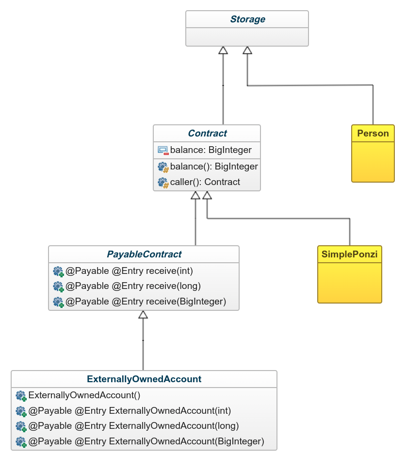

# Takamaka: Smart Contracts in Java

Takamaka is a Java framework for writing smart contracts.
This tutorial explains how Takamaka code is written and
executed in blockchain.

# Table of Contents
1. [Introduction](#introduction)
2. [A First Takamaka Program](#first-program)
    - [Create a Test Blockchain](#memory-blockchain)
    - [A Transaction that Stores a Jar in Blockchain](#jar-transaction)
    - [A Transaction that Invokes a Constructor](#constructor-transaction)
    - [A Transaction that Invokes a Method](#method-transaction)
    - [Storage Types and Constraints on Storage Classes](#storage-types)
3. [The Notion of Smart Contract](#smart-contracts)
    - [A Simple Ponzi Scheme Contract](#simple-ponzi)
    - [The `@Entry` and `@Payable` Annotations](#entry-payable)
    - [Payable Contracts](#payable-contracts)
    - [The `@View` Annotation](#view)
    - [The Hierarchy of Contracts](#hierarchy-contracts)
4. [Utility Classes](#utility-classes)
    - [Storage Lists](#storage-lists)
        - [A Gradual Ponzi Contract](#a-gradual-ponzi-contract)
        - [A Note on Re-entrancy](#a-note-on-re-entrancy)
        - [Running the Gradual Ponzi Contract](#running-the-gradual-ponzi-contract)
    - [Storage Arrays](#storage_arrays)
        - [A Tic-Tac-Toe Contract](#a-tic-tac-toe-contract)
        - [A More Realistic Tic-Tac-Toe Contract](#a-more-realistic-tic-tac-toe-contract)
        - [Running the Tic-Tac-Toe Contract](#running-the-tic-tac-toe-contract)
        - [Specialized Storage Array Classes](#specialized-storage-array-classes)
    - [Storage Maps](#storage_maps)
        - [A Blind Auction Contract](#a-blind-auction-contract)
        - [Events](#events)
        - [Running the Blind Auction Contract](#running-the-blind-auction-contract)

# Introduction <a name="introduction"></a>

Takamaka is a Java framework for writing smart contracts.
This means that it allows programmers to use Java for writing code
that can be installed and run on blockchain. Programmers will not have
to deal with the storage of objects in blockchain: this is completely
transparent to them. This makes Takamaka completely different from other
attempts at using Java for writing smart contracts, where programmers
must use specific method calls to persist data on blockchain.

Writing smart contracts in Java entails that programmers
do not have to learn yet another programming language.
Moreover, they can use a well-understood and stable development
platform, together with all its modern tools. Programmers can use
features from the latest versions of Java, such as streams and lambda
expressions.

There are, of course, limitations to the kind of code that can
be run inside a blockchain. The most important limitation is
deterministic behavior, as we will see later.

# A First Takamaka Program <a name="first-program"></a>

Let us start from a simple example of Takamaka code. Since we are
writing Java code, there is nothing special to learn or install
before starting writing programs in Takamaka. Just use your
preferred integrated development environment (IDE) for Java. Or even
do everything from command-line, if you prefer. Our examples below will be
shown for the Eclipse IDE.

Our goal will be to create a Java class that we will instantiate
and use in blockchain. Namely, we will learn how to create an object
of the class that will persist in blockchain and how we can later
call the `toString()` method on that instance in blockchain.

Let us hence create an Eclipse Java project `family`. Add
a `lib` folder inside it and copy there the two jars that contain the
Takamaka runtime and base development classes.
Add them both to the build path. The result should look
similar to the following:


Let us create a package `takamaka.tests.family`. Inside that package,
create a Java source `Person.java`, by copying and pasting
the following code:

```java
package takamaka.tests.family;

public class Person {
  private final String name;
  private final int day;
  private final int month;
  private final int year;
  public final Person parent1;
  public final Person parent2;

  public Person(String name, int day, int month, int year, Person parent1, Person parent2) {
    this.name = name;
    this.day = day;
    this.month = month;
    this.year = year;
    this.parent1 = parent1;
    this.parent2 = parent2;
  }

  public Person(String name, int day, int month, int year) {
    this(name, day, month, year, null, null);
  }

  @Override
  public String toString() {
    return name +" (" + day + "/" + month + "/" + year + ")";
  }
}
```

This is plain old Java class and should not need any comment. Compile it
(this should be automatic in Eclipse, if the Project &rarr; Build Automatically
option is set), create a folder `dist` and export there the project in jar format,
with name `family.jar` (click on the
`family` project, then right-click on the project, select Export &rarr; Java &rarr; Jar File
and choose the `dist` folder and the `family.jar` name). Only the compiled
class files will be relevant: Takamaka will ignore source files, manifest
and any resources in the jar, hence you needn't add them there. The result should
look as the following:


## Create a Test Blockchain <a name="memory-blockchain"></a>

The next step is to install that jar in blockchain, use it to create an instance
of `Person` and call `toString()` on that instance. For that, we need a running
blockchain node.

> Future versions of this document will show how to use a test network, instead of running a local simulation of a node.

Let us hence create another Eclipse project, that will start
a local simulation of a blockchain node, actually working over the disk memory
of our local machine. That blockchain simulation in memory is inside a third Takamaka jar.
Create then another Eclipse project named `blockchain`, add a `lib` folder and
include three Takamaka jars inside `lib`; both `takamaka_runtime.jar` and
`takamaka_memory.jar` must be added to the build path of this project;
do not add, instead, `takamaka_base.jar` to the build path: these base classes are
needed for developing Takamaka code (as shown before) and will be installed in blockchain
and referenced thorugh the classpath of our running code. But they must not be part of the build path
of the blockchain simulation project.
Finally, add inside `lib` and to the build path the BCEL jar that Takamaka uses for code instrumentation
and the jar that Takamaka uses for recomputing bytecode stack maps after code instrumentation.
The result should look like the following:


Let us write a main class that starts the blockchain in disk memory: create a package
`takamaka.tests.family` and add the following class `Main.java`:

```java
package takamaka.tests.family;

import java.io.IOException;
import java.math.BigInteger;
import java.nio.file.Paths;

import takamaka.blockchain.CodeExecutionException;
import takamaka.blockchain.TransactionException;
import takamaka.memory.InitializedMemoryBlockchain;

public class Main {
  public static void main(String[] args) throws IOException, TransactionException, CodeExecutionException {
    InitializedMemoryBlockchain blockchain = new InitializedMemoryBlockchain
      (Paths.get("lib/takamaka_base.jar"), BigInteger.valueOf(100_000), BigInteger.valueOf(200_000));
  }
}
```

As you can see, this class simply creates an instance of the blockchain on disk memory.
It requires to initialize that blockchain, by installing the base classes for Takamaka,
that we had previously put inside `lib`, and by creating two accounts, funded with
100,000 and 200,000 units of coin, respectively. We will use later such accounts
to run blockchain transactions. They will be available as `blockchain.account(0)`
and `blockchain.account(1)`, respectively.

So, what is the constructor of `InitializedMemoryBlockchain` doing here? Basically, it is
initializing a directory, named `chain`, and it is running a few initial transactions
that lead to the creation of two accounts. You can see the result if you run class
`takamaka.tests.family.Main`, refresh the `blockchain` project (click on it and push the F5 key)
and inspect the `chain` directory that should have appeared:


Inside this `chain` directory, you can see that a block has been created (`b0`) inside which
four transactions (`t0`, `t1`, `t2` and `t3`) have been executed, that create and fund
our two initial accounts. Each transaction is specified by a request and a corresponding
response. They are kept in serialized form (`request` and `response`) but are also
reported in textual form (`request.txt` and `response.txt`). Such textual
representations would not be kept in a real blockchain, but are useful here, for debugging
or learning purposes. We do not investigate further the content of the `chain` directory,
for now. Later, when we will run our own transactions, we will see these files in more detail.

## A Transaction that Stores a Jar in Blockchain <a name="jar-transaction"></a>

Let us consider the `blockchain` project. The `Person` class is not in its build path
nor in its class path at run time.
If we want to call the constructor of `Person`, that class must somehow be in the class path.
In order to put `Person` in the class path, we must install
`family.jar` inside the blockchain, so that we can later refer to it and call
the constructor of `Person`. Let us hence modify the `takamaka.tests.family.Main.java`
file in order to run a transaction that install `family.jar` inside the blockchain:

```java
package takamaka.tests.family;

import java.io.IOException;
import java.math.BigInteger;
import java.nio.file.Files;
import java.nio.file.Paths;

import takamaka.blockchain.CodeExecutionException;
import takamaka.blockchain.TransactionException;
import takamaka.blockchain.TransactionReference;
import takamaka.blockchain.request.JarStoreTransactionRequest;
import takamaka.memory.InitializedMemoryBlockchain;

public class Main {
  public static void main(String[] args) throws IOException, TransactionException, CodeExecutionException {
    InitializedMemoryBlockchain blockchain = new InitializedMemoryBlockchain
      (Paths.get("lib/takamaka_base.jar"), BigInteger.valueOf(100_000), BigInteger.valueOf(200_000));

    TransactionReference family = blockchain.addJarStoreTransaction(new JarStoreTransactionRequest(
      blockchain.account(0), // this account pays for the transaction
      BigInteger.valueOf(100_000L), // gas provided to the transaction
      blockchain.takamakaBase, // reference to a jar in the blockchain that includes the basic Takamaka classes
      Files.readAllBytes(Paths.get("../family/dist/family.jar")), // bytes containing the jar to install
      blockchain.takamakaBase // dependency
    ));
  }
}
```

The `addJarStoreTransaction()` method expands the blockchain with a new transaction, whose goal
is to install a jar inside the blockchain. The jar is provided as a sequence of bytes
(`Files.readAllBytes(Paths.get("../family/dist/family.jar"))`, assuming that the
`family` project is in the same workspace as `blockchain`). This transaction, as any
Takamaka transaction, must be payed. The payer is specified as `blockchain.account(0)`, that is,
the first of the two accounts created at the moment of creation of the blockchain.
It is specified that the transaction can cost up to 100,000 units of gas. The transaction request
specifies that its class path is `blockchain.takamakaBase`: this is the reference to a jar
installed in the blockchain at its creation time and containing `takamaka_base.jar`, that is,
the basic classes of Takamaka. Finally, the request specifies that `family.jar` has only
a single dependency: `takamaka_base.jar`. This means that when, below, we will refer to
`family` in a class path, this will indirectly include its dependency `takamaka_base.jar`.

Run the `Main` class again, refresh the `blockchain` project and see that the `chain` directory
is one transaction longer now:


The new `t4` transaction reports a `request` that corresponds to the request that we have
coded in the `Main` class. Namely, its textual representation `request.txt` is:

```
JarStoreTransactionRequest:
  caller: 0.2#0
  gas: 100000
  class path: 0.0 non-recursively resolved
  dependencies: [0.0 non-recursively resolved]
  jar: 504b0304140008080800d294b24e000000000000000000000000140004004d4554412d494e462f4d414e49464553542e4d46f...
```

The interesting point here is that objects, such as the caller account
`blockchain.account(0)`, are represented as _storage references_ such as `0.2#0`. You can
see a storage reference as a machine-independent, deterministic pointer to an object contained
in the blockchain. Also the `takamaka_base.jar` is represented with an internal representation.
Namely, `0.0` is a _transaction reference_, that is, a reference to the transaction that installed
`takamaka_base.jar` in the blockchain: transaction 0 of block 0. The jar is the hexadecimal
representation of its byte sequence.

Let us have a look at the `response.txt` file, which is the textual representation of the outcome of
the transaction:

```
JarStoreTransactionSuccessfulResponse:
  consumed gas: 1199
  updates:
    <0.2#0|takamaka.lang.Contract.balance:java.math.BigInteger|99880>
  instrumented jar: 504b03041400080808007ca3b24e0000000000000000000000002200040074616b616d616b612f74657374732f66616d696c792...
```

The first bit of information tells us that the transaction costed 1,199 units of gas. We had accepted to spend up to
100,000 units of gas, hence the transaction could complete correctly. The response reports also the hexadecimal representation
of a jar, which is named _instrumented_. This is because what gets installed in blockchain is not exactly the jar sent
with the transaction request, but an instrumentation of that, which adds features that are specific to Takamaka code.
For instance, the instrumented code will charge gas during its execution. Finally, the response reports _updates_. These are
state changes occurred during the execution of the transaction. In order terms, updates are the side-effects of the transaction,
i.e., the fields of the objects modified by the transaction. In this case, the balance of the payer of the transaction
`0.2#0` has been reduced to 99,880, since it payed for the gas (we initially funded that account with 100,000 units of coin).

> The actual amount of gas consumed by this transaction, the bytes of the jars and the final balance of the payer might change in future versions of Takamaka.

## A Transaction that Invokes a Constructor <a name="constructor-transaction"></a>

We are now in condition to call the constructor of `Person` and create an instance of that class in blockchain.
First of all, we must create the class path where the constructor will run. Since the class `Person` is inside
the `family.jar` archive, the class path is simply:

```java
Classpath classpath = new Classpath(family, true);
```

The `true` flag at the end means that this class path includes the dependencies of `family`. If you look
at the code above, where `family` was defined, you see that this means that the class path will include
also the dependency `takamaka_base.jar`. If `false` would be used instead, the class path would only include
the classes in `family.jar`, which would be a problem when we will use, very soon, some support classes that
Takamaka provides, in `takamaka_base.jar`, to simplify the life of developers.

Clarified which class path to use, let us trigger a transaction that runs the constructor and adds the brand
new `Person` object into blockchain. For that, modify the `takamaka.tests.family.Main.java` source as follows:

```java
package takamaka.tests.family;

import static takamaka.blockchain.types.BasicTypes.INT;

import java.io.IOException;
import java.math.BigInteger;
import java.nio.file.Files;
import java.nio.file.Paths;

import takamaka.blockchain.Classpath;
import takamaka.blockchain.CodeExecutionException;
import takamaka.blockchain.ConstructorSignature;
import takamaka.blockchain.TransactionException;
import takamaka.blockchain.TransactionReference;
import takamaka.blockchain.request.ConstructorCallTransactionRequest;
import takamaka.blockchain.request.JarStoreTransactionRequest;
import takamaka.blockchain.types.ClassType;
import takamaka.blockchain.values.IntValue;
import takamaka.blockchain.values.StorageReference;
import takamaka.blockchain.values.StringValue;
import takamaka.memory.InitializedMemoryBlockchain;

public class Main {
  private final static BigInteger _100_000 = BigInteger.valueOf(100_000L);
  private final static BigInteger _200_000 = BigInteger.valueOf(200_000L);
  private final static ClassType PERSON = new ClassType("takamaka.tests.family.Person");

  public static void main(String[] args) throws IOException, TransactionException, CodeExecutionException {
    InitializedMemoryBlockchain blockchain = new InitializedMemoryBlockchain
      (Paths.get("lib/takamaka_base.jar"), _100_000, _200_000);

    TransactionReference family = blockchain.addJarStoreTransaction(new JarStoreTransactionRequest(
      blockchain.account(0), // this account pays for the transaction
      _100_000, // gas provided to the transaction
      blockchain.takamakaBase, // reference to a jar in the blockchain that includes the basic Takamaka classes
      Files.readAllBytes(Paths.get("../family/dist/family.jar")), // bytes containing the jar to install
      blockchain.takamakaBase
    ));

    Classpath classpath = new CUpdate Takamaka.mdlasspath(family, true);

    StorageReference albert = blockchain.addConstructorCallTransaction(new ConstructorCallTransactionRequest(
      blockchain.account(0), // this account pays for the transaction
      _100_000, // gas provided to the transaction
      classpath, // reference to family.jar and its dependency takamaka_base.jar
      new ConstructorSignature(PERSON, ClassType.STRING, INT, INT, INT), // constructor Person(String,int,int,int)
      new StringValue("Albert Einstein"), new IntValue(14), new IntValue(4), new IntValue(1879) // actual arguments
    ));
  }
}
```

The `addConstructorCallTransaction()` method expands the blockchain with a new transaction that calls
a constructor. Again, we use `blockchain.account(0)` to pay for the transaction and we provide
100,000 units of gas, which should be enough for a constructor that just initializes a few fields.
The class path includes `family.jar` and its dependency `takamaka_base.jar`, although the latter
is not used yet. The signature of the constructor specifies that we are referring to the second
constructor of `Person`, the one that assumes `null` as parents. Finally, the actual parameters
are provided; they must be instances of the `takamaka.blockchain.values.StorageValue` interface.

Let us run the `Main` class. The result is disappointing:

```
Exception in thread "main" takamaka.blockchain.TransactionException: Failed transaction
    at takamaka.blockchain.AbstUpdate Takamaka.mdractBlockchain.wrapAsTransactionException(Unknown Source)
    at takamaka.blockchain.AbstractBlockchain.lambda$runConstructorCallTransaction$11(Unknown Source)
    at takamaka.blockchain.AbstractBlockchain.wrapInCaseOfException(Unknown Source)
    at takamaka.blockchain.AbstractBlockchain.runConstructorCallTransaction(Unknown Source)
    at takamaka.blockchain.AbstractBlockchain.lambda$addConstructorCallTransaction$12(Unknown Source)
    at takamaka.blockchain.AbstractBlockchain.wrapWithCodeInCaseOfException(Unknown Source)
    at takamaka.blockchain.AbstractBlockchain.addConstructorCallTransaction(Unknown Source)
    at takamaka.tests.family.Main.main(Main.java:42)
Caused by: java.lang.ClassCastException: takamaka.tests.family.Person cannot be cast to takamaka.lang.Storage
    at takamaka.blockchain.AbstractBlockchain$ConstructorExecutor.run(Unknown Source)
```

> The exact shape and line numbers of this exception trace might change in future versions of Takamaka.

The transaction failed. Nevertheless, a transaction has been added to the blockchain: refresh the
`chain` folder and look at the topmost transaction `chain/b1/t0`. There is a `request.txt`, that contains
the information that we provided in the `addConstructorCallTransaction()` specification, and there is
a `response.txt` that contains the (disappointing) outcome:

```
ConstructorCallTransactionFailedResponse:
  consumed gas: 100000
  updates:
    <0.2#0|takamaka.lang.Contract.balance:java.math.BigInteger|89880>
```

Note that the transaction costed a lot: all 100,000 gas units have been consumed! This is a sort
of punishment for running a transaction that fails. The rationale is that this punishment should
discourage potential denial-of-service attacks, when a huge number of failing transactions are thrown
at a blockchain. At least, this attack will cost a lot.

But we still have not understood why the transaction failed. The reason is in the exception
message: `takamaka.tests.family.Person cannot be cast to takamaka.lang.Storage`. Takamaka rerquires
that all objects stored in blockchain extends the `takamaka.lang.Storage` class. That superclass
provides all the machinery needed in order to keep track of updates to such objects.

> Do not get confused here. Takamaka does **not** require all objects to extend
> `takamaka.lang.Storage`. You can use objects that do not extend that superclass in your
> Takamaka code, both instances of your classes and instances of library classes
> from the `java.*` hierarchy, for instance. What Takamaka does require, instead, is that objects
> _that must be kept in blockchain_ do implement `takamaka.lang.Storage`. This is the
> case, for instance, of objects created by the constructor invoked through the
> `addConstructorCallTransaction()` method.

Let us modify the `takamaka.tests.family.Person.java` source code then:

```java
package takamaka.tests.family;

import takamaka.lang.Storage;

public class Person extends Storage {
  ... unchanged code ...
}
```

> Extending `takamaka.lang.Storage` is all a programmer needs to do in order to let instances
> of a class be stored in blockchain. There is no explicit method to call to keep track
> of updates to such objects: Takamaka will automatically deal with the updates.

Regenerate `family.jar`, since class `Person` has changed, and export it again as
`dist/family.jar`, inside the `family` Eclipse project (some versions of Eclipse
require to delete the previous `dist/family.jar` before exporting a new version).
Run again the `takamaka.tests.family.Main` class.

> We can use the `takamaka.lang.Storage` class and we can run the resulting compiled code
> since that class is inside `takamaka_base.jar`, which as been included in the
> class path as a dependency of `family.jar`.

This time, the execution should
complete without exception. Refresh the `chain/b1/t0` directory and look at the
`response.txt` file. This time the transaction was succesful:

```
ConstructorCallTransactionSuccessfulResponse:
  consumed gas: 130
  updates:
    <THIS_TRANSACTION#0.class|takamaka.tests.family.Person>
    <0.2#0|takamaka.lang.Contract.balance:java.math.BigInteger|99867>
    <THIS_TRANSACTION#0|takamaka.tests.family.Person.day:int|14>
    <THIS_TRANSACTION#0|takamaka.tests.family.Person.month:int|4>
    <THIS_TRANSACTION#0|takamaka.tests.family.Person.year:int|1879>
    <THIS_TRANSACTION#0|takamaka.tests.family.Person.name:java.lang.String|Albert Einstein>
    <THIS_TRANSACTION#0|takamaka.tests.family.Person.parent1:takamaka.tests.family.Person|null>
    <THIS_TRANSACTION#0|takamaka.tests.family.Person.parent2:takamaka.tests.family.Person|null>
  new object: THIS_TRANSACTION#0
  events:
```

You do not need to understand the content of this response file in order to program
in Takamaka. However, it can be interesting to get an idea of its content.
The file tells us that a new object has been created and stored in blockchain. It is identified as
`THIS_TRANSACTION#0` since it is the first (0th) object created during this transaction.
Its class is `takamaka.tests.family.Person`:

```
<THIS_TRANSACTION#0.class|takamaka.tests.family.Person>
```

and its fields are initialized as required:

```
<THIS_TRANSACTION#0|takamaka.tests.family.Person.day:int|14>
<THIS_TRANSACTION#0|takamaka.tests.family.Person.month:int|4>
<THIS_TRANSACTION#0|takamaka.tests.family.Person.year:int|1879>
<THIS_TRANSACTION#0|takamaka.tests.family.Person.name:java.lang.String|Albert Einstein>
<THIS_TRANSACTION#0|takamaka.tests.family.Person.parent1:takamaka.tests.family.Person|null>
<THIS_TRANSACTION#0|takamaka.tests.family.Person.parent2:takamaka.tests.family.Person|null>
```

The account that payed for the transaction sees its balance decrease:

```
<0.2#0|takamaka.lang.Contract.balance:java.math.BigInteger|99867>
```

These triples are called _updates_, since they describe how the blockchain was
updated to cope with the creation of a new object.

So where is this new `Person` object, actually? Well, it exists in blockchain only.
It did exist in RAM during the execution of the constructor. But, at the end
of the constructor,
it was deallocated from RAM and serialized in blockchain, as a set of updates.
Its storage reference has been returned to the caller of
`addConstructorCallTransaction()`:

```java
StorageReference albert = blockchain.addConstructorCallTransaction(...)
```

and can be used later to invoke methods on the object or to pass the object
as a parameter of methods or constructors: when that will occur, the object
will be deserialized from its updates in blockchain and recreated in RAM.

## A Transaction that Invokes a Method <a name="method-transaction"></a>

In our `Main` class, variable `albert` holds a machine-independent reference
to an object of class `Person`,
that has just been created in blockchain. Let us invoke the
`toString()` method on that object now. For that, we run a transaction
using `albert` as _receiver_ of `toString()`.

> In object-oriented languages, the _receiver_ of a call to a non-`static`
> method is the object over which the method is executed, that is accessible
> as `this` inside the code of the method. In our case, we want to invoke
> `albert.toString()`, hence `albert` holds the receiver of the call.

The code is the following now:

```java
package takamaka.tests.family;

import static takamaka.blockchain.types.BasicTypes.INT;

import java.io.IOException;
import java.math.BigInteger;
import java.nio.file.Files;
import java.nio.file.Paths;

import takamaka.blockchain.Classpath;
import takamaka.blockchain.CodeExecutionException;
import takamaka.blockchain.ConstructorSignature;
import takamaka.blockchain.MethodSignature;
import takamaka.blockchain.TransactionException;
import takamaka.blockchain.TransactionReference;
import takamaka.blockchain.request.ConstructorCallTransactionRequest;
import takamaka.blockchain.request.InstanceMethodCallTransactionRequest;
import takamaka.blockchain.request.JarStoreTransactionRequest;
import takamaka.blockchain.types.ClassType;
import takamaka.blockchain.values.IntValue;
import takamaka.blockchain.values.StorageReference;
import takamaka.blockchain.values.StorageValue;
import takamaka.blockchain.values.StringValue;
import takamaka.memory.InitializedMemoryBlockchain;

public class Main {
  private final static BigInteger _100_000 = BigInteger.valueOf(100_000L);
  private final static BigInteger _200_000 = BigInteger.valueOf(200_000L);
  private final static ClassType PERSON = new ClassType("takamaka.tests.family.Person");

  public static void main(String[] args) throws IOException, TransactionException, CodeExecutionException {
    InitializedMemoryBlockchain blockchain = new InitializedMemoryBlockchain
      (Paths.get("lib/takamaka_base.jar"), _100_000, _200_000);

    TransactionReference family = blockchain.addJarStoreTransaction(new JarStoreTransactionRequest(
      blockchain.account(0), // this account pays for the transaction
      _100_000, // gas provided to the transaction
      blockchain.takamakaBase, // reference to a jar in the blockchain that includes the basic Takamaka classes
      Files.readAllBytes(Paths.get("../family/dist/family.jar")), // bytes containing the jar to install
      blockchain.takamakaBase
    ));

    Classpath classpath = new Classpath(family, true);

    StorageReference albert = blockchain.addConstructorCallTransaction(new ConstructorCallTransactionRequest(
      blockchain.account(0), // this account pays for the transaction
      _100_000, // gas provided to the transaction
      classpath, // reference to family.jar and its dependency takamaka_base.jar
      new ConstructorSignature(PERSON, ClassType.STRING, INT, INT, INT), // constructor Person(String,int,int,int)
      new StringValue("Albert Einstein"), new IntValue(14), new IntValue(4), new IntValue(1879) // actual arguments
    ));

    StorageValue s = blockchain.addInstanceMethodCallTransaction(new InstanceMethodCallTransactionRequest(
      blockchain.account(1), // this account pays for the transaction
      _100_000, // gas provided to the transaction
      classpath, // reference tofamily.jar and its dependency takamaka_base.jar
      new MethodSignature(PERSON, "toString"), // method Person.toString()
      albert // receiver of toString()
    ));

    // prints the result of the call
    System.out.println(s);
  }
}
```

Look at the call to `addInstanceMethodCallTransaction()` added at its end.
This time, we let the second account `blockchain.account(1)` pay for the transaction.
We specify to resolve method `Person.toString()` using `albert` as receiver and
to run the resolved method. The result is `s`, that we subsequently print on the standard output.
If you run class `Main`, you will see the following on the screen:

```
Albert Einstein (14/4/1879)
```

After refreshing the `chain` directory, you will see that a new transaction
`chain/b1/t1` appeared, whose `request.txt` describes the transaction that we have
requested:

```
InstanceMethodCallTransactionRequest:
  caller: 0.3#0
  gas: 100000
  class path: 0.4 recursively revolved
  method: takamaka.tests.family.Person.toString()
  receiver: 1.0#0
  actuals:
```

while the `response.txt` file reports the outcome of the transaction:

```
MethodCallTransactionSuccessfulResponse:
  consumed gas: 125
  updates:
    <0.3#0|takamaka.lang.Contract.balance:java.math.BigInteger|199987>
  returned value: Albert Einstein (14/4/1879)
  events:
```

Note that, this time, the payer is `0.3#0` and, consequently, it is its balance
that has been updated to pay for the consumed gas.

> This `response.txt` could be surprising: by looking at the code
> of method `toString()` of `Person`, you can see that it computes a string
> concatenation `name +" (" + day + "/" + month + "/" + year + ")"`. As any
> Java programnmer knows, that is just syntactical sugar for a very
> complex sequence of operations, involving the construction of a
> `java.lang.StringBuilder` and its repeated update through a sequence of
> calls to its `concat()` methods, finalized with a call to `StringBuilder.toString()`.
> So, why are those updates
> not reported in `response.txt`? Simply because they are not updates
> to the state of the blockchain but rather updates to a `StringBuilder` object,
> local to the activation of `Person.toString()`, that dies at its end and
> is not accessible anymore afterwards. In other terms, the updates reported in
> the `response.txt` files are those observable outside the method or constructor, to
> objects that existed before the call or that are returned by the
> method or constructor itself.

As we have shown, method `addInstanceMethodCallTransaction()` can be used to
invoke an instance method on an object in blockchain. This requires some
clarification. First of all, note that the signature of the method to
call is resolved and the resolved method is then invoked. If
such resolved method is not found (for instance, if we tried to call `tostring` instead
of `toString`), then `addInstanceMethodCallTransaction()` would end up in
a failed transaction. Moreover, the usual resolution mechanism of Java methods is
applied. If, for instance, we called
`new MethodSignature(ClassType.OBJECT, "toString")`
instead of
`new MethodSignature(PERSON, "toString")`,
then method `toString` would be resolved from the run-time class of
`albert`, looking for the most specific implementation of `toString()`,
up to the `java.lang.Object` class, which would anyway end up in
running `Person.toString()`.

Method `addInstanceMethodCallTransaction()` can be used to invoke instance
methods with parameters. If a `toString(int)` method existed in `Person`,
then we could call it and pass 2019 as its argument, by writing:

```java
blockchain.addInstanceMethodCallTransaction(new InstanceMethodCallTransactionRequest(
  blockchain.account(1), // this account pays for the transaction
  _100_000, // gas provided to the transaction
  classpath, // reference to family.jar and its dependency takamaka_base.jar
  new MethodSignature(PERSON, "toString", INT), // method Person.toString(int)
  albert, // receiver of toString(int)
  new IntValue(2019) // actual argument(s)
));
```

where we have added the formal argument `INT`
(that is, `takamaka.blockchain.types.BasicTypes.INT`)
and the actual argument `new IntValue(2019)`.

Method `addInstanceMethodCallTransaction()` cannot be used to call a static
method. For that, use `addStaticMethodCallTransaction()` instead, that accepts
a request similar to that for `addInstanceMethodCallTransaction()`, but without
receiver.

## Storage Types and Constraints on Storage Classes <a name="storage-types"></a>

We have seen how to invoke a constructor of a class to build an object in
blockchain or to invoke a method on an object in blockchain. Both constructors and
methods can receive arguments. Constructors yield a reference to a new
object, freshly allocated; methods might yield a returned value, if they are
not declared as `void`. This means that there is a bidirectional
exchange of data from outside the blockchain to inside it, and back. But not any
kind of data can be exchanged. Namely, only _storage values_ can be exchanged,
that belong to the so called _storage types_. Storage values are

1. primitive values of Java (characters, bytes, shorts, integers, longs, floats,
doubles and booleans), or
2. reference values whose class extends `takamaka.lang.Storage` (that is, _storage objects_), or
3. `null`, or
4. elements of immutable `enum`s, or
5. a few special reference values: `java.math.BigInteger`s and `java.lang.String`s.

Storage values cross the
blockchain boundary inside wrapper objects. For instance the integer 2,019
is first wrapped into `new IntValue(2019)` and then passed
as a parameter of a method or constructor. In our previous example,
when we called `Person.toString()`, the result `s` was actually a wrapper
of a `java.lang.String` object. Boxing and unboxing into/from wrapper objects
is automatic: our class `Person` does not show that machinery.

What should be retained of the above discussion is that constructors and
methods of Takamaka classes, if we want them to be called from outside the
blockchain, must receive storage values as parameters and must return storage
values (if they are not `void` methods). A method that expects a parameter of
type `java.util.HashSet`, for instance, can be defined and called
from inside the Takamaka code, but cannot be called from outside the blockchain,
such as, for instance, from our `Main` class or from a wallet.

We conclude this section with a formal definition of storage objects.
We have already said that storage objects can be kept in blockchain
and their class must extend
`takamaka.lang.Storage`. But there are extra constraints. Namely,
fields of a storage objects are part of the representation of such
objects and must, themselves, be kept in blockchain. Hence, a storage object:
1. has a class that extends (directly or indirectly) `takamaka.lang.Storage`, and
2. is such that all its fields hold storage values (primitives, storage objects, `null`,
elements of immutable `enum`s, a `java.math.BigInteger` or a `java.lang.String`).

Note that the above conditions hold for the class `Person` defined above. Instead,
the following are examples of what is **not** allowed in a field of a storage object:
1. arrays
2. collections from `java.util.*`

We will see later how to overcome these limitations.

> Again, we stress that such limitations only apply to storage objects.
> Other objects, thet needn't be kept in blockchain but are useful for
> the implementation of Takamaka code, can be defined in a completely free way
> and used in code that runs in the blockchain.

# The Notion of Smart Contract <a name="smart-contracts"></a>

A contract is a legal agreement among two or more parties. A good contract
should be unambiguous, since otherwise its interpretation could be
questioned or misunderstood. A legal system normally enforces the
validity of a contract. In the context of software development, a *smart contract*
is a piece of software with deterministic behavior, whose semantics should be
clear and enforced by a consensus system. Blockchains provide the perfect
environment where smart contracts can be deployed and executed, since their
(typically) non-centralized nature reduces the risk that a single party
overthrows the rules of consensus, by providing for instance a non-standard
semantics for the code of the smart contract.

Contracts are allowed to hold and transfer money to other contracts. Hence,
traditionally, smart contracts are divided into those that hold money
but have no code (*externally owned accounts*), and those that,
instead, contain code (*smart contracts*).
The formers are typically controlled by an external agent (a wallet,
a human) while the latters are typically controlled by their code.
Takamaka implements both alternatives as instances of the abstract library class
`takamaka.lang.Contract` (inside `takamaka_base.jar`). That class extends
`takamaka.lang.Storage`, hence its instances can be kept in blockchain.
The Takamaka library defines subclasses of `takamaka.lang.Contract`, that
we will investigate later. Programmers can define their own subclasses.

This chapter presents a simple smart contract, whose goal is to
enforce a Ponzi investment scheme: each investor pays back the previous investor,
with at least a 10% reward; as long as new
investors keep coming, each investor gets at least a 10% reward; the last
investor, instead, will never see his/her investment back.
The contract has been inspired by a similar Ethereum contract
from Iyer and Dannen,
*Building Games with Ethereum Smart Contracts*, page 145, Apress 2018.

We will develop the contract in successive versions, in order to highlight
the meaning of each language feature of Takamaka.

## A Simple Ponzi Scheme Contract <a name="simple-ponzi"></a>

Create a new `ponzi` Java project in Eclipse. Create folders `lib`
and `dist` inside the project. Put both `takamaka_base.jar` and `takamaka_runtime.jar`
inside `lib` and add them to the build path of `ponzi`. Create package
`takamaka.tests.ponzi`; create class `SimplePonzi.java` inside that
package and copy the following code in `SimplePonzi.java`:

```java
package takamaka.tests.ponzi;

import static takamaka.lang.Takamaka.require;

import java.math.BigInteger;

import takamaka.lang.Contract;

public class SimplePonzi extends Contract {
  private final BigInteger _10 = BigInteger.valueOf(10L);
  private final BigInteger _11 = BigInteger.valueOf(11L);
  private Contract currentInvestor;
  private BigInteger currentInvestment = BigInteger.ZERO;

  public void invest(Contract investor, BigInteger amount) {
    // new investments must be 10% greater than current
    BigInteger minimumInvestment = currentInvestment.multiply(_11).divide(_10);
    require(amount.compareTo(minimumInvestment) > 0, () -> "you must invest more than " + minimumInvestment);

    // document new investor
    currentInvestor = investor;
    currentInvestment = amount;
  }
}
```

> This code is only the starting point of our discussion.
> The real final version of this contract will appear at
> the end of this section.

Look at the code of `SimplePonzi.java` above. The contract has a single
method, named `invest`. This method lets a new `investor` invest
a given `amount` of coins. This amount must be at least 10% more than
the current investment. The expression `amount.compareTo(minimumInvestment) > 0`
is a comparison between two Java `BigInteger`s and should be read as the
more familiar `amount > minimumInvestment`: the latter cannot be
written in this form, since Java does not allow comparison operators
to work on reference types.
The static method `takamaka.lang.Takamaka.require()` can be used to require
some precondition to hold. The `require(condition, message)` call throws an
exception if `condition` does not hold, with the given `message`.
If the new investment is at least 10% larger than the current, it will be
saved in the state of the contract, together with the new investor.

> You might wonder why we have written
> `require(..., () -> "you must invest more than " + minimumInvestment)`
> instead of the simpler
> `require(..., "you must invest more than " + minimumInvestment)`.
> Both are possible and semantically identical. However, the former
> uses a lambda expression that computes the string concatenaton only if
> the message is needed; the latter always computes the string concatenation.
> Hence, the first version consumes less gas, in general, and is consequently
> preferrable. This technique simulates lazy evaluation in a language, like
> Java, that has only eager evaluation for actual parameters. This technique
> has been used since years in JUnit assertions.

## The `@Entry` and `@Payable` Annotations <a name="entry-payable"></a>

The previous code of `SimplePonzi.java` is unsatisfactory, for at least two
reasons, that we will overcome in this section:

1. any contract can call `invest()` and let another contract `investor` invest
   in the game. This is against our intuition that each investor decides when
   and how much he (himself) decides to invest;
2. there is no money transfer. Anybody can call `invest()`, with an arbitrary
   `amount` of coins. The previous investor does not get the investment back
   when a new investor arrives since, well, he never really invested anything.

Let us rewrite `SimplePonzi.java` in the following way:

```java
package takamaka.tests.ponzi;

import static takamaka.lang.Takamaka.require;

import java.math.BigInteger;

import takamaka.lang.Contract;
import takamaka.lang.Entry;

public class SimplePonzi extends Contract {
  private final BigInteger _10 = BigInteger.valueOf(10L);
  private final BigInteger _11 = BigInteger.valueOf(11L);
  private Contract currentInvestor;
  private BigInteger currentInvestment = BigInteger.ZERO;

  public @Entry void invest(BigInteger amount) {
    // new investments must be 10% greater than current
    BigInteger minimumInvestment = currentInvestment.multiply(_11).divide(_10);
    require(amount.compareTo(minimumInvestment) > 0, () -> "you must invest more than " + minimumInvestment);

    // document new investor
    currentInvestor = caller();
    currentInvestment = amount;
  }
}
```

The difference with the previous version of `SimplePonzi.java`
is that the `investor` argument of `invest()` has disappeared.
At its place, `invest()` has been annotated as `@Entry`. This annotation
**restricts** the possible uses of method `invest()`. Namely, it can be
called  from another contract *c* or from an external wallet,
with a paying contract *c*, that pays for a transaction that runs
`invest()`. In both cases, the contract *c* is available, inside
`invest()`, as `caller()`. This is, indeed, saved, in the above code,
into `currentInvestor`.

> The annotation `@Entry` marks a boundary between contracts.
> An `@Entry` method can only be called from the code of another contract
> instance or from a wallet. It cannot, for instance, be called from
> the code of a class that is not a contract, nor from the same contract instance.
> If an `@Entry` method is redefined, the redefinitions must also be
> annotated as `@Entry`.

> Method `caller()` can only be used inside an `@Entry` method or
> constructor and refers to the contract that called that method or constructor
> or to the contract that pays for a method call started from a wallet.
> Hence, it will never yield `null`. If an `@Entry` method or constructor
> calls another method *m*, then `caller()` is **not** available inside *m*
> and must be passed as an explicit parameter to *m*, if needed there.

The use of `@Entry` solves the first problem. However, there is still no money
transfer in this version of `SimplePonzi.java`. What we still miss is to require
the caller of `invest()` to actually pay for the `amount` units of coin.
Since `@Entry` guarantees that the caller of `invest()` is a contract and since
contracts hold money, this means that the caller contract of `invest()`
must be charged `amount` coins at the moment of calling `invest()`.
This can be achieved with the `@Payable` annotation, that we apply to `invest()`:

```java
package takamaka.tests.ponzi;

import static takamaka.lang.Takamaka.require;

import java.math.BigInteger;

import takamaka.lang.Contract;
import takamaka.lang.Entry;
import takamaka.lang.Payable;

public class SimplePonzi extends Contract {
  private final BigInteger _10 = BigInteger.valueOf(10L);
  private final BigInteger _11 = BigInteger.valueOf(11L);
  private Contract currentInvestor;
  private BigInteger currentInvestment = BigInteger.ZERO;

  public @Payable @Entry void invest(BigInteger amount) {
    // new investments must be 10% greater than current
    BigInteger minimumInvestment = currentInvestment.multiply(_11).divide(_10);
    require(amount.compareTo(minimumInvestment) > 0, () -> "you must invest more than " + minimumInvestment);

    // document new investor
    currentInvestor = caller();
    currentInvestment = amount;
  }
}
```

When a contract calls `invest()` now, that contract will be charged `amount` coins,
automatically. These coins will be automatically transferred to the
balance of the instance of `SimplePonzi` that receives the call.
If the balance of the calling contract is too low for that, the call
will be automatically rejected with an insufficient funds exception. The caller
must be able to pay for both `amount` and the gas needed to run `invest()`. Hence,
he must hold a bit more than `amount` coins at the moment of calling `invest()`.

> The `@Payable` annotation can only be applied to a method or constructor that
> is also annotated as `@Entry`. If a `@Payable` method is redefined, the redefinitions
> must also be annotated as `@Payable`. A `@Payable` method or constructor
> must have a first argument of type `int`, `long` or `java.math.BigInteger`,
> dependending on the amount of coins that the programmer allows one to transfer
> at call time. The name of the argument is irrelevant, but we will keep
> using `amount` for it.

## Payable Contracts <a name="payable-contracts"></a>

The `SimplePonzi.java` class is not ready yet. Namely, investors have to pay
an always increasing amount of money to replace the current investor.
However, this one never gets the previous investment back, plus the 10% award
(at least). Coins keep flowing inside the `SimplePonzi` contract and remain
stuck there, forever. The code needs an apparently simple change: just add a single line
before the update of the new current investor. That line should send
`amount` units of coin back to `currentInvestor`, before it gets replaced:

```java
// document new investor
currentInvestor.receive(amount);
currentInvestor = caller();
currentInvestment = amount;
```

In other words, a new investor calls `invest()` and pays `amount` coins to
the `SimplePonzi` contract (since `invest()` is `@Payable`); then
this `SimplePonzi` contract transfers the same `amount` of coins to pay back the
previous investor. Money flows through the `SimplePonzi` contract but
does not stay there for long.

The problem with this simple line of code is that it does not compile.
There is no `receive()` method in `takamaka.lang.Contract`:
a contract can receive money only through calls to its `@Payable`
constructors and methods. Since `currentInvestor` is, very generically,
an instance of `Contract`, that has no `@Payable` methods,
there is no method
that we can call here for sending money back to `currentInvestor`.
This limitation is a deliberate choice of the design of Takamaka.

> Solidity programmers will find this very different from what happens
> in Solidity contracts. Namely, these always have a _fallback function_ that
> can be called for sending money to a contract. A problem with Solidity's approach
> is that the balance of a contract is not fully controlled by its
> payable methods, since money can always flow in through the fallback
> function. This led to software bugs, when a contract found itself
> richer then expected, which violated some (wrong) invariants about
> its state. For more information, see Antonopoulos and Wood,
> *Mastering Ethereum*, page 181 (*Unexpected Ether*), 2019, O'Reilly Media, Inc.

So how do we send money back to `currentInvestor`? The solution is to
restrict the kind of contracts that can take part in the Ponzi scheme.
Namely, we limit the game to contracts that implement class
`takamaka.lang.PayableContract`, a subclass of `takamaka.lang.Contract`
that, yes, does have a `receive()` method. This is not really a restriction,
since the typical players of our Ponzi contract are externally
owned accounts, that are instances of `PayableContract`s.

Let us hence apply the following small changes to our `SimplePonzi.java` class:

1. the type of `currentInvestment` must be restricted to `PayableContract`;
2. the `invest()` method must be an entry for `PayableContract`s only;
3. the return value of `caller()` must be cast to `PayableContract`, which is
   safe thanks to point 2 above.

The result is the following:

```java
package takamaka.tests.ponzi;

import static takamaka.lang.Takamaka.require;

import java.math.BigInteger;

import takamaka.lang.Contract;
import takamaka.lang.Entry;
import takamaka.lang.Payable;
import takamaka.lang.PayableContract;

public class SimplePonzi extends Contract {
  private final BigInteger _10 = BigInteger.valueOf(10L);
  private final BigInteger _11 = BigInteger.valueOf(11L);
  private PayableContract currentInvestor;
  private BigInteger currentInvestment = BigInteger.ZERO;

  public @Payable @Entry(PayableContract.class) void invest(BigInteger amount) {
    // new investments must be 10% greater than current
    BigInteger minimumInvestment = currentInvestment.multiply(_11).divide(_10);
    require(amount.compareTo(minimumInvestment) > 0, () -> "you must invest more than " + minimumInvestment);

    // document new investor
    currentInvestor.receive(amount);
    currentInvestor = (PayableContract) caller();
    currentInvestment = amount;
  }
}
```

Note the use of `@Entry(PayableContract.class)` in the code above:
an `@Entry(C.class)` method can only be called by a contract whose class
is `C` or a subclass of `C`. Otherwise, a run-time exception will occur.

## The `@View` Annotation <a name="view"></a>

Our `SimplePonzi.java` code can still be improved. As it is now,
an investor must call `invest()` and be ready to pay a sufficiently
large `amount` of coins to pay back and replace the previous investor.
How much is *large* actually large enough? Well, it depends on the
current investment. But that information is kept inside the contract
and there is no easy way to access it from outside.
An investor can only try with something that looks large enough,
running a transaction that might end up in two negative scenarios:

1. the amount invested was actually large enough, but larger than needed: the investor
   invested more than required in the Ponzi scheme, risking that no one
   will ever invest more and pay him back;
2. the amount invested might not be enough: the `require()` function
   will throw an exception that makes the transaction running `invest()` fail.
   The investment will not be transferred to the `SimplePonzi` contract, but
   the investor will be punished by charging him all gas provided for
   the transaction. This is unfair since, after all, the investor had no
   way to know that the investment was not enough.

Hence, it would be nice and fair to provide investors with a way of accessing
the `currentInvestment`. This is actually a piece of cake: just add
this method to `SimplePonzi.java`:

```java
public BigInteger getCurrentInvestment() {
  return currentInvestment;
}
```

This solution is pefectly fine but can be improved. Writtem this way,
an investor that wants to call `getCurrentInvestment()` must run a
blockchain transaction through the `addInstanceMethodCallTransaction()`
method of the blockchain, creating a new transaction that ends up in
blockchain. That transaction will cost gas, hence its side-effect will
be to reduce the balance of the calling investor. But that is the only
side-effect of that call! In cases like this, Takamaka allows one to
specify that a method is expected to have no side-effects on the visible
state of the blockchain, but for the change of the balance of the caller.
This is possible through the `takamaka.lang.View` annotation. Import that
class in the Java source and edit the declaration of `getCurrentInvestment()`
as follows:

```java
import takamaka.lang.View;
...
public @View BigInteger getCurrentInvestment() {
  return currentInvestment;
}
```

An investor can now call that method through another API method of the
blockchain, called `runInstanceMethodCallTransaction()`, that does not expand the
blockchain, but yields the response of the transaction, including the
returned value of the call. If method
`getCurrentInvestment()` had side-effects beyond that on the balance of
the caller, then the execution will fail with a run-time exception.
Note that the execution of a `@View` method still requires gas,
but that gas is given back at the end of the call.
The advantage of `@View` is hence that of allowing the execution
of `getCurrentInvestment()` for free and without expanding the blockchain
with useless transactions, that do not modify its state.

> The annotation `@View` is checked at run time if a transaction calls the
> `@View` method from outside the blockchain, directly. It is not checked if,
> instead, the method is called indirectly, from other Takamaka code.
> The check occurs at run time, since the presence of side-effects in
> computer code is undecidable. Future versions of Takamaka might check
> `@View` at the time of installing a jar in the blockchain, as part of
> bytecode verification. That check can only be an approximation of the
> run-time check.

## The Hierarchy of Contracts <a name="hierarchy-contracts"></a>

The figure below shows the hierarchy of contract classes in Takamaka.
The topmost class is `takamaka.lang.Contract`, an abstract class that
extends `takamaka.lang.Storage` since contracts are meant to be
stored in blockchain, as well as other classes that are not contracts,
such as our first `Person` example:

<p align="center">
  
</p>

Programmers typically extend `Contract` to define their own contracts.
This is the case, for instance, of our `SimplePonzi` class.
Class `Contract` provides two final protected methods: `caller()` can
be used inside an `@Entry` method or constructor to access the calling
contract and `balance()` can be used to access the private `balance` field
of the contract.

The abstract subclass `PayableContract` is meant for contracts that
can receive coins from other contracts, through their final
`receive()` methods. A concrete subclass is `ExternallyOwnedAccount`, that is,
payable contracts that can be used to pay for a blockchain transaction.
They are typically controlled by humans, through a wallet, but can be
subclassed and instantiated freely in Takamaka code. Their constructors
allow to build an externally owned account and fund it with an initial
amount of coins. As we have seen in sections
[A Transaction that Stores a Jar in Blockchain](#jar-transaction),
[A Transaction that Invokes a Constructor](#constructor-transaction) and
[A Transaction that Invokes a Method](#method-transaction),
blockchain methods that start a transaction require to specify a payer
for that transaction. Such a payer is required to be an instance of
`ExternallyOwnedAccount`, or an exception will be thrown. In our examples
using a blockchain in disk memory, the expressions
`blockchain.account(0)` and `blockchain.account(1)` actually refer to
`ExternallyOwnedAccount` created during initialization transactions triggered
inside the constructor of the blockchain.

# Utility Classes <a name="utility-classes"></a>

We have said that storage objects must obey to some constraints.
The strongest is that their fields of reference type can only hold
storage objects. In particular, arrays are not allowed there. This can
be problematic, in particular for contracts that deal with a variable,
potentially unbound number of other contracts.

This section presents some utility classes that help programmers
cope with such constraints, by providing fixed or variable-sized collections
that can be used in storage objects, since they are storage objects themselves.
Such utility classes implement lists, arrays and maps and are
consequently generally described as *collections*. They have the
property of being storage classes, hence their objects can be kept
blockchain, *as long as only storage objects are added as elements of
a collection*. As usual with collections, these utility classes
will have generic type, to implement collections of arbitrary, but fixed
types. Takamaka allows Java generic types.

## Storage Lists <a name="storage-lists"></a>

Lists are an ordered sequence of elements. In a list, it is typically
possible to access the first element in constant time, while accesses
to the *n*th element require the scan the list from its beginning and
consequently have a cost proportional to *n*. Because of this,
lists are **not** random-access data structures, where the *n*th
element should be accessable in constant time. It is also possible
to add an element at the beginning of a list, in constant time.
The size of a list is not fixed: lists grow in size as more elements are
added.

Java has many classes for implementing lists, all subclasses
of `java.util.List<T>`. They can be used in Takamaka, but not as
fields of a storage class. For that,
Takamaka provides an implementation of lists with the storage class
`StorageList<T>`. Its instances are storage objects and
can consequently be held in fields of storage classes and
can be stored in blockchain, *as long as only
storage objects are added to the list*. Takamaka lists provide
constant-time access and addition to both ends of a list.
We refer to the JavaDoc of `StorageList<T>` for a full list of its methods.
They include methods adding elements to both ends of the list, accessing and
removing elements, for iterating on a list and for building a Java array
`T[]` with the elements of a `StorageList<T>`.

Next section shows an example of use of `StorageList`.

### A Gradual Ponzi Contract <a name="a-gradual-ponzi-contract"></a>

Consider our previous Ponzi contract again. It is somehow irrealistic, since
an investor gets its investment back in full. In a more realistic scenario,
the investor will receive the investment back gradually, as soon as new
investors arrive. This is more complex to program, since
the Ponzi contract must take note of all investors that invested up to now,
not just of the current one as in `SimplePonzi.java`. This requires a
list of investors, of unbounded size. An implementation of this gradual
Ponzi contract is reported below and has been
inspired by a similar Ethereum contract from Iyer and Dannen,
*Building Games with Ethereum Smart Contracts*, page 150, Apress 2018:

```java
package takamaka.tests.ponzi;

import static takamaka.lang.Takamaka.require;

import java.math.BigInteger;

import takamaka.lang.Contract;
import takamaka.lang.Entry;
import takamaka.lang.Payable;
import takamaka.lang.PayableContract;
import takamaka.util.StorageList;

public class GradualPonzi extends Contract {
  public final BigInteger MINIMUM_INVESTMENT = BigInteger.valueOf(1_000L);

  /**
   * All investors up to now. This list might contain the same investor many times,
   * which is important to pay him back more than investors who only invested ones.
   */
  private final StorageList<PayableContract> investors = new StorageList<>();

  public @Entry(PayableContract.class) GradualPonzi() {
    investors.add((PayableContract) caller());
  }

  public @Payable @Entry(PayableContract.class) void invest(BigInteger amount) {
    require(amount.compareTo(MINIMUM_INVESTMENT) >= 0, () -> "you must invest at least " + MINIMUM_INVESTMENT);
    BigInteger eachInvestorGets = amount.divide(BigInteger.valueOf(investors.size()));
    investors.stream().forEach(investor -> investor.receive(eachInvestorGets));
    investors.add((PayableContract) caller());
  }
}
```

The construtcor of `GradualPonzi` is an `@Entry`, hence can only be
called from another contract, that gets added, as first investor,
in the `takamaka.util.StorageList` held in field `investors`.
That utility class implements an unbounded list of objects.
It is a storage object, as long as only storage objects are
added inside it.
Subsequently, other contracts can invest by calling method `invest()`.
A minimum investment is required, but this remains constant with the time.
The `amount` invested gets split by the number of the previous investors
and sent back to each of them. Note that Takamaka allows one to use
Java 8 lambdas and streams.
Old fashioned Java programmers, who don't feel at home with such treats,
can exploit the fact that
lists are iterable and replace the single line `forEach()` call
with a more traditional (but gas-hungrier):

```java
for (PayableContract investor: investors)
  investor.receive(eachInvestorGets);
```

It is instead **highly discouraged** to iterate the list as if it were an
array. Namely, **do not write**

```java
for (int pos = 0; pos < investors.size(); pos++)
  investors.get(i).receive(eachInvestorGets);
```

since lists are not random-access data structures and the complexity of the
last loop is quadratic in the size of the list. This is not a novelty: the
same occurs with most traditional Java lists (`java.util.LinkedList`, in particular).
But, in Takamaka, code execution costs gas and
computational complexity does matter more than in other programming contexts.

### A Note on Re-entrancy <a name="a-note-on-re-entrancy"></a>

The `GradualPonzi.java` class pays back previous investors immediately:
as soon as a new investor invests something, his investment gets
split and forwarded to all previous investors. This should
make Solidity programmers uncomfortable, since the same approach,
in Solidity, might lead to the infamous re-entrancy attack, when the
contract that receives his investment back has redefined its
fallback function in such a way to re-enter the paying contract and
re-execute the distribution of the investment.
As it is well known, such an attack has made some people rich and other
desperate. Even if such a frightening scenario does not occur,
paying previous investors immediately back is discouraged in Solidity
also for other reasons. Namely, the contract that receives his
investment back might have a redefined fallback function that
consumes too much gas or does not terminate. This would hang the
loop that pays back previous investors, actually locking the
money inside the `GradualPonzi` contract. Moreover, paying back
a contract is a relatively expensive operation in Solidity, even if the
fallback function is not redefined, and this cost is payed by the
new investor that called `invest()`, in terms of gas. The cost is linear
in the number of investors that must be payed back.

As a solution to these problems, Solidity programmers do not pay previous
investors back immediately, but let the `GradualPonzi` contract take
note of the balance of each investor, through a map.
This map is updated as soon as a new investor arrives, by increasing the
balance of every previous investor. The cost of updating the balances
is still linear in the number of previous investors, but it is cheaper
(in Solidity) than sending money back to each of them, which
requires costy inter-contract calls.
With this technique, previous investors are
now required to withdraw their balance explicitly,
through a `widthdraw()` function.
This leads to the *withdrawing pattern* used for writing Solidity contracts.

We have not used the withdrawing pattern in `GradualPonzi.java`. In general,
there is no need for such pattern in Takamaka, at least not for simple
contracts like `GradualPonzi.java`. The reason is that the
`receive()` methods of a payable contracts (corresponding to the
fallback function of Solidity) are `final` in Takamaka and very cheap
in terms of gas. In particular, inter-contract calls are not
especially expensive in Takamaka, since they are just a method
invocation in Java bytecode (one bytecode instruction). They are actually cheaper than
updating a map of balances. Moroever, avoiding the `widthdraw()` transactions
means reducing the size of the blockchain. Hence, the withdrawing pattern is both
useless in Takamaka and more expensive than paying back previous contracts
immediately.

## Running the Gradual Ponzi Contract <a name="running-the-gradual-ponzi-contract"></a>

Let us play with the `GradualPonzi` contract. Go to the
`ponzi` Eclipse project and copy `GradualPonzi.java` inside
package `takamaka.tests.ponzi`.
Then export the compiled code in jar format inside `dist`,
as `ponzi.jar`.

Go now to the `blockchain` project and create a package `takamaka.tests.ponzi`
inside that project. Copy the following code as `Main.java`. Its goal is

1. to install `ponzi.jar` in blockchain
2. to let a first player create an instance of `GradualPonzi` in blockchain
   and become the first investor of the contract
3. to let two more players invest, in sequence, in the `GradualPonzi` contract
4. to let the first player try to invest again in the contract, this time
   with a too small investment, which leads to an exception.

The last transaction fails with an exception, since the contract
requires a minimum investment.

```java
package takamaka.tests.ponzi;

import java.io.IOException;
import java.math.BigInteger;
import java.nio.file.Files;
import java.nio.file.Paths;

import takamaka.blockchain.Classpath;
import takamaka.blockchain.CodeExecutionException;
import takamaka.blockchain.ConstructorSignature;
import takamaka.blockchain.MethodSignature;
import takamaka.blockchain.TransactionException;
import takamaka.blockchain.TransactionReference;
import takamaka.blockchain.request.ConstructorCallTransactionRequest;
import takamaka.blockchain.request.InstanceMethodCallTransactionRequest;
import takamaka.blockchain.request.JarStoreTransactionRequest;
import takamaka.blockchain.types.ClassType;
import takamaka.blockchain.values.BigIntegerValue;
import takamaka.blockchain.values.StorageReference;
import takamaka.memory.InitializedMemoryBlockchain;

public class Main {
  private final static BigInteger _20_000 = BigInteger.valueOf(20_000L);
  private final static BigInteger _1_000_000 = BigInteger.valueOf(1_000_000L);
  private static final ClassType GRADUAL_PONZI = new ClassType("takamaka.tests.ponzi.GradualPonzi");

  public static void main(String[] args) throws IOException, TransactionException, CodeExecutionException {
    // creation of a test blockchain in memory with three accounts
    InitializedMemoryBlockchain blockchain = new InitializedMemoryBlockchain
      (Paths.get("lib/takamaka_base.jar"), _1_000_000, _1_000_000, _1_000_000);

    StorageReference player1 = blockchain.account(0);
    StorageReference player2 = blockchain.account(1);
    StorageReference player3 = blockchain.account(2);

    // installation in blockchain of the jar of the GradualPonzi contract
    TransactionReference ponzi = blockchain.addJarStoreTransaction(new JarStoreTransactionRequest(
      player1, // this account pays for the transaction
      _20_000, // gas provided to the transaction
      blockchain.takamakaBase, // reference to a jar in the blockchain that includes the basic Takamaka classes
      Files.readAllBytes(Paths.get("../ponzi/dist/ponzi.jar")), // bytes containing the jar to install
      blockchain.takamakaBase));

    Classpath classpath = new Classpath(ponzi, true);

    // creation of the Ponzi contract: player1 becomes the first investor
    StorageReference gradualPonzi = blockchain.addConstructorCallTransaction(new ConstructorCallTransactionRequest(
      player1, // this account pays for the transaction
      _20_000, // gas provided to the transaction
      classpath,
      new ConstructorSignature(GRADUAL_PONZI))); /// GradualPonzi()

    // player2 invests 1200
    blockchain.addInstanceMethodCallTransaction(new InstanceMethodCallTransactionRequest(
      player2, // this account pays for the transaction
      _20_000, // gas provided to the transaction
      classpath,
      new MethodSignature(GRADUAL_PONZI, "invest", ClassType.BIG_INTEGER), // method GradualPonzi.invest(BigInteger)
      gradualPonzi, // receiver of invest()
      new BigIntegerValue(BigInteger.valueOf(1_200)))); // actual argument, that is, the investment

    // player3 invests 1500
    blockchain.addInstanceMethodCallTransaction(new InstanceMethodCallTransactionRequest(
      player3, // this account pays for the transaction
      _20_000, // gas provided to the transaction
      classpath,
      new MethodSignature(GRADUAL_PONZI, "invest", ClassType.BIG_INTEGER), // method GradualPonzi.invest(BigInteger)
      gradualPonzi, // receiver of invest()
      new BigIntegerValue(BigInteger.valueOf(1_500)))); // actual argument, that is, the investment

    // player1 tries to invest 900, but it is too little and gets an exception
    blockchain.addInstanceMethodCallTransaction(new InstanceMethodCallTransactionRequest(
      player3, // this account pays for the transaction
      _20_000, // gas provided to the transaction
      classpath,
      new MethodSignature(GRADUAL_PONZI, "invest", ClassType.BIG_INTEGER), // method GradualPonzi.invest(BigInteger)
      gradualPonzi, // receiver of invest()
      new BigIntegerValue(BigInteger.valueOf(900)))); // actual argument, that is, the investment
  }
}
```

By running the above `Main.java`, the result will be a sequence of
transactions that create and invest in the contract, until the last one,
that ends up in exception:

```
Exception in thread "main" takamaka.blockchain.TransactionException: Failed transaction
  at takamaka.blockchain.AbstractBlockchain.wrapAsTransactionException(Unknown Source)
  at takamaka.blockchain.AbstractBlockchain.lambda$runInstanceMethodCallTransaction$16(Unknown Source)
  at takamaka.blockchain.AbstractBlockchain.wrapInCaseOfException(Unknown Source)
  at takamaka.blockchain.AbstractBlockchain.runInstanceMethodCallTransaction(Unknown Source)
  at takamaka.blockchain.AbstractBlockchain.lambda$addInstanceMethodCallTransaction$17(Unknown Source)
  at takamaka.blockchain.AbstractBlockchain.wrapWithCodeInCaseOfException(Unknown Source)
  at takamaka.blockchain.AbstractBlockchain.addInstanceMethodCallTransaction(Unknown Source)
  at takamaka.tests.ponzi.Main.main(Main.java:73)
Caused by: takamaka.lang.RequirementViolationException: you must invest at least 1000
  at takamaka.lang.Takamaka.require(Unknown Source)
  at takamaka.tests.ponzi.GradualPonzi.invest(GradualPonzi.java:38)
  at sun.reflect.NativeMethodAccessorImpl.invoke0(Native Method)
  at sun.reflect.NativeMethodAccessorImpl.invoke(NativeMethodAccessorImpl.java:62)
  at sun.reflect.DelegatingMethodAccessorImpl.invoke(DelegatingMethodAccessorImpl.java:43)
  at java.lang.reflect.Method.invoke(Method.java:498)
  at takamaka.blockchain.AbstractBlockchain$InstanceMethodExecutor.run(Unknown Source)
```

It might be interesting to look at the response of the transaction where
the third player invests 1500 coins: `b1/t3/response.txt`:

```
VoidMethodCallTransactionSuccessfulResponse:
  consumed gas: 447
  updates:
    <THIS_TRANSACTION#0.class|takamaka.util.StorageList$Node>
    <0.2#0|takamaka.lang.Contract.balance:java.math.BigInteger|1000211>
    <0.3#0|takamaka.lang.Contract.balance:java.math.BigInteger|999514>
    <0.4#0|takamaka.lang.Contract.balance:java.math.BigInteger|998455>
    <1.1#1|takamaka.util.StorageList.size:int|3>
    <1.1#1|takamaka.util.StorageList.last:takamaka.util.StorageList$Node|THIS_TRANSACTION#0>
    <1.2#0|takamaka.util.StorageList$Node.next:takamaka.util.StorageList$Node|THIS_TRANSACTION#0>
    <THIS_TRANSACTION#0|takamaka.util.StorageList$Node.element:java.lang.Object|0.4#0>
    <THIS_TRANSACTION#0|takamaka.util.StorageList$Node.next:takamaka.util.StorageList$Node|null>
  events:
```

The third player is `0.4#0` and sees its balance updated since it payed
for the transaction and invested money, that got distributed to the
previous players `0.2#0` and `0.3#0`. The size of the storage list
`1.1#1` containing the investors becomes 3 with that transaction.

## Storage Arrays <a name="storage_arrays"></a>

Arrays are an ordered sequence of elements, with constant-time access
to such elements, for reading and writing. The size of arrays is typically
fixed, although there are programming languages with a limited form
of dynamic arrays.

Java has native arrays, of type `T[]`, where `T` is the
type of the elements of the array. They can be used in Takamaka, but not
as fields of storage classes. For that, Takamaka provides class
`takamaka.util.StorageArray<T>`. Its instances are storage objects and
can consequently be held in fields of storage classes and
can be stored in blockchain, *as long as only
storage objects are added to the array*. Their size is fixed and decided
at time of construction. Although we consider `StorageArray<T>` as storage
replacement for Java arrays, it must be stated that the complexity of
accessing their elements if logarithmic in the size of the array, which is
a significant deviation from the standard definition of arrays. Nevertheless,
logarithmic complexity is much better than the linear complexity for
accessing elements of a `StorageList<T>` that, however, has the advantage
of dynamic size.

We refer to the JavaDoc of `StorageArray<T>` for a full list of its methods.
They include methods adding elements, accessing and
removing elements, for iterating on an array and for building a Java array
`T[]` with the elements of a `StorageArray<T>`.

Next section shows an example of use of `StorageArray<T>`.

### A Tic-Tac-Toe Contract <a name="a-tic-tac-toe-contract"></a>

Tic-tac-toe is a two-players game where players place, alternately,
a cross and a circle on a 3x3 board, initially empty. The winner is the
player who places three crosses or three circles on the same row, or
column or diagonal. For instance, in the following board the player of
the cross wins:

<p align="center">
  
</p>

There are games that end up in a draw, when the board is full but nobody won:

<p align="center">
  
</p>

A natural representation of the tic-tac-toe board is a bidimensional array
where indexes are distributed as follows:

<p align="center">
  
</p>

This can be implemented as `StorageArray<StorageArray<Tile>>`, where `Tile` is
an anumeration of the three possible tiles (empty, cross, circle). This is
possible but overkill. It is simpler and cheaper (also in terms of gas)
to use the previous diagram as a conceptual representation of the board
shown to the users, but use, internally,
a monodimensional array of 9 tiles, distributed as follows:

<p align="center">
  
</p>

which can be implemented as a `StorageArray<Tile>`. There will be functions
for translating the conecptual representation into the internal one.

This leads to the following contract:

```java
package takamaka.tests.tictactoe;

import static java.util.stream.Collectors.joining;
import static java.util.stream.IntStream.rangeClosed;
import static takamaka.lang.Takamaka.require;

import takamaka.lang.Contract;
import takamaka.lang.Entry;
import takamaka.lang.Payable;
import takamaka.lang.PayableContract;
import takamaka.lang.View;
import takamaka.util.StorageArray;

public class TicTacToe extends Contract {

  public static enum Tile {
    EMPTY(" "), CROSS("X"), CIRCLE("O");

    private final String name;

    private Tile(String name) {
      this.name = name;
    }

    @Override
    public String toString() {
      return name;
    }

    private Tile nextTurn() {
      return this == CROSS ? CIRCLE : CROSS;
    }
  }

  private final StorageArray<Tile> board = new StorageArray<>(9, Tile.EMPTY);
  private PayableContract crossPlayer, circlePlayer;
  private Tile turn = Tile.CROSS; // cross plays first
  private boolean gameOver;

  public @View Tile at(int x, int y) {
    require(1 <= x && x <= 3 && 1 <= y && y <= 3, "coordinates must be between 1 and 3");
    return board.get((y - 1) * 3 + x - 1);
  }

  private void set(int x, int y, Tile tile) {
    board.set((y - 1) * 3 + x - 1, tile);
  }

  public @Payable @Entry(PayableContract.class) void play(long amount, int x, int y) {
    require(!gameOver, "the game is over");
    require(1 <= x && x <= 3 && 1 <= y && y <= 3, "coordinates must be between 1 and 3");
    require(at(x, y) == Tile.EMPTY, "the selected tile is not empty");

    PayableContract player = (PayableContract) caller();

    if (turn == Tile.CROSS)
      if (crossPlayer == null)
        crossPlayer = player;
      else
        require(player == crossPlayer, "it's not your turn");
    else
      if (circlePlayer == null) {
        require(crossPlayer != player, "you cannot play against yourself");
        long previousBet = balance().subtract(BigInteger.valueOf(amount)).longValue();
        require(amount >= previousBet, () -> "you must bet at least " + previousBet + " coins");
        circlePlayer = player;
      }
      else
        require(player == circlePlayer, "it's not your turn");

    set(x, y, turn);
    if (isGameOver(x, y))
      player.receive(balance());
    else
      turn = turn.nextTurn();
  }

  private boolean isGameOver(int x, int y) {
    return gameOver =
      rangeClosed(1, 3).allMatch(_y -> at(x, _y) == turn) || // column x
      rangeClosed(1, 3).allMatch(_x -> at(_x, y) == turn) || // row y
      (x == y && rangeClosed(1, 3).allMatch(_x -> at(_x, _x) == turn)) || // first diagonal
      (x + y == 4 && rangeClosed(1, 3).allMatch(_x -> at(_x, 4 - _x) == turn)); // second diagonal
  }

  @Override
  public @View String toString() {
    return rangeClosed(1, 3)
      .mapToObj(y -> rangeClosed(1, 3).mapToObj(x -> at(x, y).toString()).collect(joining("|")))
      .collect(joining("\n-----\n"));
  }
}
```

The internal enumeration `Tile` represents the three alternatives that can be
put in the tic-tac-toe board. It has a `toString()` method, that yields the
usual representation for such alternatives, and a `nextTurn()` method, that
alternates between cross and circle.

> The `Tile` enumeration has been defined as `static` since it does not
> need to access the external `TicTacToe` object. It is well possible
> to get rid of that `static`: the contract will work perfectly well anyway.
> However, adding `static` is a Java feature that allows
> programmers to reduce the memory footprint of the enumeration elements and the
> cost of garbage collection. In the case of Takamaka, it also reduces the
> gas cost of using this enumeration, which is probably a more convicing
> argument for using `static`, since gas is money.

The board of the game is represented as a `new StorageArray<Tile>(9, Tile.EMPTY)`, whose
elements are indexed from 0 to 8 (inclusive) and are initialized to `Tile.EMPTY`.
It is also possible to construct the array as `new StorageArray<Tile>(9)`, but then
its elements would be the default value `null` and the array would need to be initialized
inside a constructor for `TicTacToe`:

```java
public TicTacToe() {
  rangeClosed(0, 8).forEach(index -> board.set(index, Tile.EMPTY));
}
```

Methods `at()` and `set()` read and set, respectively, the board element
at indexes (x,y). They transform the bidimensional conceptual representation
of the board into its internal monodimensional representation. Since `at()` is `public`,
we defensively check the validity of the indexes there.

Method `play()` is the heart of the contract. It is called by the contracts
that play the game, hence is an `@Entry`. It is also annotated as
`@Payable(PayableContract.class)` since players must bet money for
taking part in the game, at least for the first two moves. The first
contract that plays is registered as `crossPlayer`. The second contract
that plays is registered as `circlePlayer`. Subsequent moves must
come, alternately, from `crossPlayer` and `circlePlayer`. The contract
uses a `turn` variable to keep track of the current turn.

Note the extensive use of `require()` to check all error situations:

1. it is possible to play only if the game is not over yet;
2. a move must be inside the board and identify an empty tile;
3. players must alternate correctly;
4. the second player must bet at least as much as the first player;
5. it is not allowed to play against oneself.

The `play()` method ends with a call to `gameOver()` that checks
if the game is over. In that case, the winner receives the full
jackpot. Note that the `gameOver()` method receives the coordinates
where the current player has moved. This allows it to restrict the
check for game over: the game is over only if the row or column
where the player moved contain the same tile; if the current player
played on a diagonal, the method checks the diagonals as well.
It is of course possible to check all rows, columns and diagonals, always,
but our solution is gas-thriftier.

The `toString()` method yields a string representation of the current board, such
as

```
X|O| 
-----
 |X|O
-----
 |X| 
```

For those who do not appreciate Java 8 streams, the same result can be obtained with
a more traditional (and gas-hungrier) code:

```java
@Override
public @View String toString() {
  String result = "";
  for (int y = 0; y < 3; y++) {
    for (int x = 0; x < 3; x++) {
      result += at(x, y);
      if (x < 2)
        result += "|";
    }
    if (y < 2)
      result += "\n-----\n"
  }

  return result;
}
```

## A More Realistic Tic-Tac-Toe Contract <a name="a-more-realistic-tic-tac-toe-contract"></a>

The `TicTacToe.java` code implements the rules of a tic-tac-toe game, but has
a couple of drawbacks that make it still incomplete. Namely:

1. the creator of the game must spend gas to call its constructor,
   but has no direct incentive in doing so. He must be a benefactor,
   or hope to take part in the game after creation, in no other contract is
   faster;
2. if the game ends in a draw, money gets stuck in the `TicTacToe` contract
   instance, for ever and ever.

We provide here an improved version of the `TicTacToe` contract, that solves
both problems at once. The policy is very simple: we impose a minimum
bet, in order to avoid free games; if a winner emerges,
then we forward him only 90% of the jackpot; the remaing 10% goes to the
creator of the `TicTacToe` contract. If, instead, the game ends in a draw,
we forward the whole jackpot to the creator. The modified contract
is reported below. Note that we added an `@Entry` contructor, that takes
note of the `creator` of the game:

```java
package takamaka.tests.tictactoe;

import static java.util.stream.Collectors.joining;
import static java.util.stream.IntStream.rangeClosed;
import static takamaka.lang.Takamaka.require;

import java.math.BigInteger;

import takamaka.lang.Contract;
import takamaka.lang.Entry;
import takamaka.lang.Payable;
import takamaka.lang.PayableContract;
import takamaka.lang.View;
import takamaka.util.StorageArray;

public class TicTacToe extends Contract {

  public static enum Tile {
    EMPTY(" "), CROSS("X"), CIRCLE("O");

    private final String name;

    private Tile(String name) {
      this.name = name;
    }

    @Override
    public String toString() {
      return name;
    }

    private Tile nextTurn() {
      return this == CROSS ? CIRCLE : CROSS;
    }
  }

  private static final long MINIMUM_BET = 100L;

  private final StorageArray<Tile> board = new StorageArray<>(9, Tile.EMPTY);
  private PayableContract creator, crossPlayer, circlePlayer;
  private Tile turn = Tile.CROSS; // cross plays first
  private boolean gameOver;

  public @Entry(PayableContract.class) TicTacToe() {
    creator = (PayableContract) caller();
  }

  public @View Tile at(int x, int y) {
    require(1 <= x && x <= 3 && 1 <= y && y <= 3, "coordinates must be between 1 and 3");
    return board.get((y - 1) * 3 + x - 1);
  }

  private void set(int x, int y, Tile tile) {
    board.set((y - 1) * 3 + x - 1, tile);
  }

  public @Payable @Entry(PayableContract.class) void play(long amount, int x, int y) {
    require(!gameOver, "the game is over");
    require(1 <= x && x <= 3 && 1 <= y && y <= 3, "coordinates must be between 1 and 3");
    require(at(x, y) == Tile.EMPTY, "the selected tile is not empty");

    PayableContract player = (PayableContract) caller();

    if (turn == Tile.CROSS)
      if (crossPlayer == null) {
        require(amount >= MINIMUM_BET, () -> "you must bet at least " + MINIMUM_BET + " coins");
        crossPlayer = player;
      }
      else
        require(player == crossPlayer, "it's not your turn");
    else
      if (circlePlayer == null) {
        require(crossPlayer != player, "you cannot play against yourself");
        long previousBet = balance().subtract(BigInteger.valueOf(amount)).longValue();
        require(amount >= previousBet, () -> "you must bet at least " + previousBet + " coins");
        circlePlayer = player;
    }
    else
      require(player == circlePlayer, "it's not your turn");

    set(x, y, turn);
    if (isGameOver(x, y)) {
      // 90% goes to the winner
      player.receive(balance().multiply(BigInteger.valueOf(9L)).divide(BigInteger.valueOf(10L)));
      // the rest to the creator of the game
      creator.receive(balance());
    }
    else if (isDraw())
      // everything goes to the creator of the game
      creator.receive(balance());
    else
      turn = turn.nextTurn();
  }

  private boolean isGameOver(int x, int y) {
    return gameOver =
      rangeClosed(1, 3).allMatch(_y -> at(x, _y) == turn) || // column x
      rangeClosed(1, 3).allMatch(_x -> at(_x, y) == turn) || // row y
      (x == y && rangeClosed(1, 3).allMatch(_x -> at(_x, _x) == turn)) || // first diagonal
      (x + y == 4 && rangeClosed(1, 3).allMatch(_x -> at(_x, 4 - _x) == turn)); // second diagonal
  }

  private boolean isDraw() {
    return rangeClosed(0, 8).mapToObj(board::get).noneMatch(Tile.EMPTY::equals);
  }

  @Override
  public @View String toString() {
    return rangeClosed(1, 3)
      .mapToObj(y -> rangeClosed(1, 3).mapToObj(x -> at(x, y).toString()).collect(joining("|")))
      .collect(joining("\n-----\n"));
  }
}
```

> We have chosen to allow a `long amount` in the `@Payable` method `play()` since
> it is unlikely that users will want to invest huge quantities of money in this
> game. This gives us now the opportunity to discuss why the computation of the
> previous bet has been written as
> ```java
> long previousBet = balance().subtract(BigInteger.valueOf(amount)).longValue()
> ```
> instead of the simpler
> ```java
> long previousBet = balance().longValue() - amount
> ```
> The reason is that, when that line is executed, both players have aleady payed
> their bet, that accumulates in the balance of the `TicTacToe` contract.
> Each single bet is a `long`, but their sum could overflow the size of a `long`.
> Hence, we have to deal with a computation on `BigInteger`. The same situation
> occurs later, when we have to compute the 90% that goes to the winner:
> the jackpot might be larger than a `long` and we have to compute over
> `BigInteger`. As a final remark, note that in the line:
> `balance().multiply(BigInteger.valueOf(9L)).divide(BigInteger.valueOf(10L))`
> we first multiply by 9 and **then** divide by 10. This reduces the
> approximation inherent to integer division. For instance, if the jackpot
> (`balance()`) were 209, we have (with Java's left-to-right evaluation)
> ```math
> 209*9/10=1881/10=188
> ```
> while
> ```math
> 209/10*9=20*9=180.
> ```

## Running the Tic-Tac-Toe Contract <a name="running-the-tic-tac-toe-contract"></a>

Let us play with the `TicTacToe` contract. First of all, we need a jar
that contains the compiled code of the contract. For that, as already
done previously, you can for
instance create a new Eclipse Java project `tictactoe`, add the `lib` and
`dist` folders inside it, copy `takamaka_base.jar` and
`takamaka_runtime.jar` inside `lib` and add both to the
build path. Create a package `takamaka.tests.tictactoe` and copy
inside it the code of `TicTacToe.java` above. Then export the compiled
code as a jar inside `dist` as `tictactoe.jar`.

In the `blokchain` project that we have already created, add a package
`takamaka.tests.tictactoe` and, inside it, create a `Main.java` class
that contains the following code. It creates a test blockchain in
disk memory and runs a few transactions:

1. to install `tictactoe.jar` in blockchain
2. to create an instance of `TicTacToe` in blockchain
3. to let two players play, alternately, until the first player wins
4. to call `toString()` on the `TicTacToe` contract and print the result
5. to let the second player continue playing.

The last transaction fails with an exception, since the game is over at that point.

```java
package takamaka.tests.tictactoe;

import static takamaka.blockchain.types.BasicTypes.INT;
import static takamaka.blockchain.types.BasicTypes.LONG;

import java.io.IOException;
import java.math.BigInteger;
import java.nio.file.Files;
import java.nio.file.Paths;

import takamaka.blockchain.Classpath;
import takamaka.blockchain.CodeExecutionException;
import takamaka.blockchain.ConstructorSignature;
import takamaka.blockchain.MethodSignature;
import takamaka.blockchain.TransactionException;
import takamaka.blockchain.TransactionReference;
import takamaka.blockchain.request.ConstructorCallTransactionRequest;
import takamaka.blockchain.request.InstanceMethodCallTransactionRequest;
import takamaka.blockchain.request.JarStoreTransactionRequest;
import takamaka.blockchain.types.ClassType;
import takamaka.blockchain.values.IntValue;
import takamaka.blockchain.values.LongValue;
import takamaka.blockchain.values.StorageReference;
import takamaka.blockchain.values.StringValue;
import takamaka.memory.InitializedMemoryBlockchain;

public class Main {
  private final static BigInteger _20_000 = BigInteger.valueOf(20_000L);
  private final static BigInteger _100_000 = BigInteger.valueOf(100_000L);
  private final static BigInteger _1_000_000 = BigInteger.valueOf(1_000_000L);
  private static final ClassType TIC_TAC_TOE = new ClassType("takamaka.tests.tictactoe.TicTacToe");
  private static final IntValue _1 = new IntValue(1);
  private static final IntValue _2 = new IntValue(2);
  private static final IntValue _3 = new IntValue(3);
  private static final LongValue _0L = new LongValue(0L);
  private static final LongValue _100L = new LongValue(100L);

  public static void main(String[] args) throws IOException, TransactionException, CodeExecutionException {
    // creation of a test blockchain in memory with three accounts
    InitializedMemoryBlockchain blockchain = new InitializedMemoryBlockchain
      (Paths.get("lib/takamaka_base.jar"), _100_000, _1_000_000, _1_000_000);

    StorageReference creator = blockchain.account(0);
    StorageReference player1 = blockchain.account(1);
    StorageReference player2 = blockchain.account(2);

    // installation in blockchain of the jar of the TicTacToe contract
    TransactionReference tictactoe = blockchain.addJarStoreTransaction(new JarStoreTransactionRequest(
      creator, // this account pays for the transaction
      _20_000, // gas provided to the transaction
      blockchain.takamakaBase, // reference to a jar in the blockchain that includes the basic Takamaka classes
      Files.readAllBytes(Paths.get("../tictactoe/dist/tictactoe.jar")), // bytes containing the jar to install
      blockchain.takamakaBase
    ));

    Classpath classpath = new Classpath(tictactoe, true);

    // creation of the TicTacToe contract
    StorageReference ticTacToe = blockchain.addConstructorCallTransaction(new ConstructorCallTransactionRequest(
      creator, // this account pays for the transaction
      _20_000, // gas provided to the transaction
      classpath,
      new ConstructorSignature(TIC_TAC_TOE))); /// TicTacToe()

    // player1 plays at (1,1)
    blockchain.addInstanceMethodCallTransaction(new InstanceMethodCallTransactionRequest(
      player1, // this account pays for the transaction
      _20_000, // gas provided to the transaction
      classpath,
      new MethodSignature(TIC_TAC_TOE, "play", LONG, INT, INT), // TicTacToe.play(long, int, int)
      ticTacToe, // receiver of the call
      _100L, _1, _1)); // actual parameters

    // player2 plays at (2,1)
    blockchain.addInstanceMethodCallTransaction(new InstanceMethodCallTransactionRequest(
      player2, // this account pays for the transaction
      _20_000, // gas provided to the transaction
      classpath,
      new MethodSignature(TIC_TAC_TOE, "play", LONG, INT, INT), // TicTacToe.play(long, int, int)
      ticTacToe, // receiver of the call
      _100L, _2, _1)); // actual parameters

    // player1 plays at (1,2)
    blockchain.addInstanceMethodCallTransaction(new InstanceMethodCallTransactionRequest(
      player1, // this account pays for the transaction
      _20_000, // gas provided to the transaction
      classpath,
      new MethodSignature(TIC_TAC_TOE, "play", LONG, INT, INT), // TicTacToe.play(long, int, int)
      ticTacToe, // receiver of the call
      _0L, _1, _2)); // actual parameters

    // player2 plays at (2,2)
    blockchain.addInstanceMethodCallTransaction(new InstanceMethodCallTransactionRequest(
      player2, // this account pays for the transaction
      _20_000, // gas provided to the transaction
      classpath,
      new MethodSignature(TIC_TAC_TOE, "play", LONG, INT, INT), // TicTacToe.play(long, int, int)
      ticTacToe, // receiver of the call
      _0L, _2, _2)); // actual parameters

    // player1 plays at (1,3)
    blockchain.addInstanceMethodCallTransaction(new InstanceMethodCallTransactionRequest(
      player1, // this account pays for the transaction
      _20_000, // gas provided to the transaction
      classpath,
      new MethodSignature(TIC_TAC_TOE, "play", LONG, INT, INT), // TicTacToe.play(long, int, int)
      ticTacToe, // receiver of the call
      _0L, _1, _3)); // actual parameters

    // player1 calls toString() on the TicTacToe contract
    StringValue toString = (StringValue) blockchain.addInstanceMethodCallTransaction(new InstanceMethodCallTransactionRequest(
      player1, // this account pays for the transaction
      _20_000, // gas provided to the transaction
      classpath,
      new MethodSignature(TIC_TAC_TOE, "toString"), // TicTacToe.toString()
      ticTacToe)); // receiver of the call

    System.out.println(toString);

    // the game is over, but player2 continues playing and will get an exception
    blockchain.addInstanceMethodCallTransaction(new InstanceMethodCallTransactionRequest(
      player2, // this account pays for the transaction
      _20_000, // gas provided to the transaction
      classpath,
      new MethodSignature(TIC_TAC_TOE, "play", LONG, INT, INT), // TicTacToe.play(long, int, int)
      ticTacToe, // receiver of the call
      _0L, _2, _3)); // actual parameters
  }
}
```

If you execute the `Main.java` above, the result will be:

```
X|O| 
-----
X|O| 
-----
X| | 
Exception in thread "main" takamaka.blockchain.TransactionException: Failed transaction
  at takamaka.blockchain.AbstractBlockchain.wrapAsTransactionException(Unknown Source)
  at takamaka.blockchain.AbstractBlockchain.lambda$runInstanceMethodCallTransaction$16(Unknown Source)
  at takamaka.blockchain.AbstractBlockchain.wrapInCaseOfException(Unknown Source)
  at takamaka.blockchain.AbstractBlockchain.runInstanceMethodCallTransaction(Unknown Source)
  at takamaka.blockchain.AbstractBlockchain.lambda$addInstanceMethodCallTransaction$17(Unknown Source)
  at takamaka.blockchain.AbstractBlockchain.wrapWithCodeInCaseOfException(Unknown Source)
  at takamaka.blockchain.AbstractBlockchain.addInstanceMethodCallTransaction(Unknown Source)
  at takamaka.tests.tictactoe.Main.main(Main.java:121)
Caused by: takamaka.lang.RequirementViolationException: the game is over
  at takamaka.lang.Takamaka.require(Unknown Source)
  at takamaka.tests.tictactoe.TicTacToe.play(TicTacToe.java:67)
  at sun.reflect.NativeMethodAccessorImpl.invoke0(Native Method)
  at sun.reflect.NativeMethodAccessorImpl.invoke(NativeMethodAccessorImpl.java:62)
  at sun.reflect.DelegatingMethodAccessorImpl.invoke(DelegatingMethodAccessorImpl.java:43)
  at java.lang.reflect.Method.invoke(Method.java:498)
  at takamaka.blockchain.AbstractBlockchain$InstanceMethodExecutor.run(Unknown Source)
```

The exception, as we said, is expected since we have instructed the contract
to behave so when the game is over but somebody tries to continue playing.

It might be interesting to have a look at the response of the transaction
when the first player wins: `b2/t1/response.txt`. You should see
that the balances of the creator and of the first player are updated,
as well as that of the contract, that is emptied of all money and
reaches a balance of 0. Moreover, the `gameOver` boolean is set to true.

## Specialized Storage Array Classes <a name="specialized-storage-array-classes">

The `StorageArray` class is very general, as it can be used to hold
any type of storage values. Since it uses generics,
primitive values cannot be held in a `StorageArray`, directly,
since, for instance, `StorageArray<byte>` is not legal syntax in Java.
Instead, one could think to use `StorageArray<Byte>`, where `Byte`
is the Java wrapper class `java.lang.Byte`. However, that class is not
currently allowed in storage, hence `StorageArray<Byte>` will not work either.

> This might change: wrapper classes might be allowed to be stored
> in blockchain in the future.

One should hence define a new wrapper class for `byte`, that extends `Storage`.
That is possible, but highly discouraged:
the use of wrapper classes introduces a level of indirection
and requires the instantiation of many small objects, which costs gas. Instead,
Takamaka provides specialized storage classes implementing arrays of bytes,
without wrappers. The rationale is that such arrays arise
naturally when dealing, for instance, with hashes or encrypted data
(see next section for an example) and consequently deserve
specialized and optimized implementation.
Such specialized array classes
can have their length specified at construction time, or fixed to
a constant (for best optimization and minimal gas consumption).
Moreover, they exist in two flavors: immutable and mutable.

Below we show the hierarchy of the specialized classes for arrays of bytes,
available in Takamaka:

# Storage Maps <a name="storage_maps"></a>

Maps are dynamic associations of objects to objects. They are useful
for programming smart contracts, as their extensive use in Solidity proves.
However, most such uses are related to the withdraw pattern, that is
not needed in Takamaka. Nevertheless, there are still situations when
maps are useful in Takamaka code, as we show below.

Java has many implementations of maps, that can be used in Takamaka.
However, they are not storage ojects and consequently cannot be
stored in blockchain. This section describes the
`takamaka.util.StorageMap<K, V>` class, that extends `Storage` and
whose instances can then be held in blockchain, if keys `K` and
values `V` are types that can be stored in blockchain.

We refer to the JavaDoc of `StorageMap` for a full description of its methods,
that are similar to methods of traditional Java maps. Here, we just observe
that a key is mapped into a value by calling method
`void put(K key, V value)`, while the value bound to a key is retrieved by calling
`V get(Object key)`. It is possible to yield a default value when a key is not
in the map, by calling `V getOrDefault(Object key, V _default)` or
its sibling `V getOrDefault(Object key, Supplier<V> _default)`, that
evaluates the default value only if needed. Method `V putIfAbsent(K key, V value)`,
binds the key to the value only if the key is unbound. Similarly for
its sibling `V computeIfAbsent(K key, Supplier<V> value)` that, however,
evaluates the new value only if needed (these two methods differ for their
returned value, as in Java maps. Please refer to their JavaDoc).

Instances of `StorageMap<K, V>` keep keys in increasing order. Namely, if
type `K` has a natural order, that order is used. Otherwise, keys
(that must then be storage objects) are kept ordered by increasing storage
reference. Consequently, methods `K min()` and `K max()` yield the
minimal and the maximal key of a map. Method `List<K> keyList()` yields the
ordered list of the keys of a map; method `Stream<K> keys()` yields the
same, as an ordered stream; method `Stream<Entry<K, V>> stream()` yields the
ordered stream of the entries (ie., key/value pairs) of a map.
Compare this with Solidity, where
maps do not know the set of their keys.

## A Blind Auction Contract <a name="a-blind-auction-contract"></a>

This section exemplifies the use of class `StorageMap` with a smart
contract that implements a _blind auction_. That contract allows
a _beneficiary_ to sell an item to the buying contract that offers
the highest bid. Since data in blockchain is public, in a non-blind
auction it is possible that bidders eavesdrop the offers of other bidders
in order to place an offer that is only slightly higher than the current
best offer. A blind auction, instead, uses a two-phases
mechanism: in the initial _bidding time_, bidders place bids, hashed, so that
they do not reveal their amount. After the bidding time expires, the second
phase, called _reveal time_, allows bidders to
reveal the real values of their bids and the auction contract to determine
the actual winner.
This works since, to reveal a bid, each bidder provides the real data
of the bid. The auction contract then recomputes the hash from real data and
checks if the result matches the hash provided at bidding time.
If not, the bid is considered invalid. Bidders can even place fake offers
on purpose, in order to confuse other bidders.

A Takamaka smart contract that implements
a blind auction is shown below. Since each bidder may place more bids and since such bids
must be kept in storage until reveal time, this code uses a map
from bidders to lists of bids. This smart contract has been inspired
by a similar Solidity contract available
<a href="https://solidity.readthedocs.io/en/v0.5.9/solidity-by-example.html#id2">here</a>.

```java
package takamaka.tests.auction;

import static takamaka.lang.Takamaka.event;
import static takamaka.lang.Takamaka.now;
import static takamaka.lang.Takamaka.require;

import java.math.BigInteger;
import java.security.MessageDigest;
import java.security.NoSuchAlgorithmException;
import java.util.Arrays;
import java.util.Iterator;

import takamaka.lang.Contract;
import takamaka.lang.Entry;
import takamaka.lang.Payable;
import takamaka.lang.PayableContract;
import takamaka.lang.Storage;
import takamaka.util.Bytes32;
import takamaka.util.StorageList;
import takamaka.util.StorageMap;

/**
 * A contract for a simple auction. This class is derived from the Solidity code shown at
 * https://solidity.readthedocs.io/en/v0.5.9/solidity-by-example.html#id2
 * In this contract, bidders place bids together with a hash. At the end of
 * the bidding period, bidders are expected to reveal if and which of their bids
 * were real and their actual value. Fake bids are refunded. Real bids are compared
 * and the bidder with the highest bid wins.
 */
public class BlindAuction extends Contract {

  /**
   * A bid placed by a bidder. The deposit has been payed in full.
   * If, later, the bid will be revealed as fake, then the deposit will
   * be fully refunded. If, instead, the bid will be revealed as real, but for
   * a lower amount, then only the difference will be refunded.
   */
  private static class Bid extends Storage {

    /**
     * The hash that will be regenerated and compared at reveal time.
     */
    private final Bytes32 hash;

    /**
      * The value of the bid. Its real value might be lower and known
      * at real time only.
      */
    private final BigInteger deposit;

    private Bid(Bytes32 hash, BigInteger deposit) {
      this.hash = hash;
      this.deposit = deposit;
    }

    /**
     * Recomputes the hash of a bid at reveal time and compares it
     * against the hash provided at bidding time. If they match,
     * we can reasonably trust the bid.
     * 
     * @param revealed the revealed bid
     * @param digest the hasher
     * @return true if and only if the hashes match
     */
    private boolean matches(RevealedBid revealed, MessageDigest digest) {
      digest.update(revealed.value.toByteArray());
      digest.update(revealed.fake ? (byte) 0 : (byte) 1);
      digest.update(revealed.salt.toArray());
      return Arrays.equals(hash.toArray(), digest.digest());
    }
  }

  /**
   * A bid revealed by a bidder at reveal time. The bidder shows
   * if the corresponding bid was fake or real, and how much was the
   * actual value of the bid. This might be lower than previously communicated.
   */
  public static class RevealedBid extends Storage {
    private final BigInteger value;
    private final boolean fake;

    /**
     * The salt used to strengthen the hashing.
     */
    private final Bytes32 salt;

    public RevealedBid(BigInteger value, boolean fake, Bytes32 salt) {
      this.value = value;
      this.fake = fake;
      this.salt = salt;
    }
  }

  /**
   * The beneficiary that, at the end of the reveal time, will receive the highest bid.
   */
  private final PayableContract beneficiary;

  /**
   * The bids for each bidder. A bidder might place more bids.
   */
  private final StorageMap<PayableContract, StorageList<Bid>> bids = new StorageMap<>();

  /**
   * The time when the bidding time ends.
   */
  private final long biddingEnd;

  /**
   * The time when the reveal time ends.
   */
  private final long revealEnd;

  /**
   * The bidder with the highest bid, at reveal time.
   */
  private PayableContract highestBidder;

  /**
   * The highest bid, at reveal time.
   */
  private BigInteger highestBid;

  /**
   * Creates a blind auction contract.
   * 
   * @param biddingTime the length of the bidding time
   * @param revealTime the length of the reveal time
   */
  public @Entry(PayableContract.class) BlindAuction(int biddingTime, int revealTime) {
    require(biddingTime > 0, "Bidding time must be positive");
    require(revealTime > 0, "Reveal time must be positive");

    this.beneficiary = (PayableContract) caller();
    this.biddingEnd = now() + biddingTime;
    this.revealEnd = biddingEnd + revealTime;
  }

  /**
   * Places a blinded bid the given hash.
   * The sent money is only refunded if the bid is correctly
   * revealed in the revealing phase. The bid is valid if the
   * money sent together with the bid is at least "value" and
   * "fake" is not true. Setting "fake" to true and sending
   * not the exact amount are ways to hide the real bid but
   * still make the required deposit. The same bidder can place multiple bids.
   */
  public @Payable @Entry(PayableContract.class) void bid(BigInteger amount, Bytes32 hash) {
    onlyBefore(biddingEnd);
    bids.computeIfAbsent((PayableContract) caller(), StorageList::new).add(new Bid(hash, amount));
  }

  /**
   * Reveals the bids of the caller. The caller will get a refund for all correctly
   * blinded invalid bids and for all bids except for the totally highest.
   * 
   * @param revealedBids the revealed bids
   * @throws NoSuchAlgorithmException if the hashing algorithm is not available
   */
  public @Entry(PayableContract.class) void reveal(StorageList<RevealedBid> revealedBids) throws NoSuchAlgorithmException {
    onlyAfter(biddingEnd);
    onlyBefore(revealEnd);
    PayableContract bidder = (PayableContract) caller();
    StorageList<Bid> bids = this.bids.get(bidder);
    require(bids != null, "No bids to reveal");
    require(revealedBids != null && revealedBids.size() == bids.size(), () -> "Expecting " + bids.size() + " revealed bids");

    // any other hashing algorithm will do, as long as both bidder and auction contract use the same
    MessageDigest digest = MessageDigest.getInstance("SHA-256");
    Iterator<Bid> it = bids.iterator();
    revealedBids.stream()
      .map(revealed -> refundFor(bidder, it.next(), revealed, digest))
      .forEach(bidder::receive);

    // make it impossible for the caller to re-claim the same deposits
    this.bids.remove(bidder);
  }

  /**
   * Ends the auction and sends the highest bid to the beneficiary.
   * 
   * @return the highest bidder
   */
  public PayableContract auctionEnd() {
    onlyAfter(revealEnd);
    PayableContract winner = highestBidder;
	
    if (winner != null) {
      beneficiary.receive(highestBid);
      event(new AuctionEnd(winner, highestBid));
      highestBidder = null;
    }

    return winner;
  }

  /**
   * Checks how much of the deposit should be refunded for a given bid.
   * 
   * @param bidder the bidder that placed the bid
   * @param bid the bid, as was placed at bidding time
   * @param revealed the bid, as was revealed later
   * @param digest the hashing algorithm
   * @return the amount to refund
   */
  private BigInteger refundFor(PayableContract bidder, Bid bid, RevealedBid revealed, MessageDigest digest) {
    if (!bid.matches(revealed, digest))
      // the bid was not actually revealed: no refund
      return BigInteger.ZERO;
    else if (!revealed.fake && bid.deposit.compareTo(revealed.value) >= 0 && placeBid(bidder, revealed.value))
      // the bid was correctly revealed and is the best up to now: only the difference between promised and provided is refunded;
      // the rest might be refunded later if a better bid will be revealed
      return bid.deposit.subtract(revealed.value);
    else
      // the bid was correctly revealed and is not the best one: it is fully refunded
      return bid.deposit;
  }

  /**
   * Takes note that a bidder has correctly revealed a bid for the given value.
   * 
   * @param bidder the bidder
   * @param value the value, as revealed
   * @return true if and only if this is the best bid, up to now
   */
  private boolean placeBid(PayableContract bidder, BigInteger value) {
    if (highestBid != null && value.compareTo(highestBid) <= 0)
      // this is not the best bid seen so far
      return false;

    // if there was a best bidder already, its bid is refunded
    if (highestBidder != null)
      // Refund the previously highest bidder
      highestBidder.receive(highestBid);

    // take note that this is the best bid up to now
    highestBid = value;
    highestBidder = bidder;
    event(new BidIncrease(bidder, value));

    return true;
  }

  private static void onlyBefore(long when) {
    require(now() < when, "Too late");
  }

  private static void onlyAfter(long when) {
    require(now() > when, "Too early");
  }
}
```

Let us discuss this (long) code, starting from the inner classes.

Class `Bid` represents a bid placed by a contract that takes part to the auction.
This information will be stored in blockchain at bidding time, hence
it is known to all other participants. An instance of `Bid` contains
the `deposit` payed at time of placing the bid. This is not necessarily
the real value of the offer but must be at least as large as the real offer,
or otherwise the bid will be considered invalid at reveal time. Instances
of `Bid` contain a `hash` made up of 32 bytes. As already said, this will
be recomputed at reveal time and matched against the result.
Since arrays cannot be stored in blockchain, we use storage class
`takamaka.util.Bytes32` here, a library class that holds 32 bytes, as a
traditional array. It is well possible to use a `StorageArray` of a wrapper
of `byte` here, but `Bytes32` is much more compact and its methods
consume less gas.

Class `RevealedBid` describes a bid revealed after bidding time.
It contains the real value of the bid, the salt used to strengthen the
hashing algorithm and a boolean `fake` that, when true, means that the
bid must be considered as invalid, since it was only placed in order
to confuse other bidders. It is possible to recompute and check the hash of
a revealed bid through method `Bid.matches()`, that uses a given
hashing algorithm (`digest`, a Java `java.security.MessageDigest`) to
hash value, fake mark and salt into bytes, finally compared
against the hash provided at bidding time.

The `BlindAuction` contract stores the `beneficiary` of the auction.
It is the contract that created the contract and is consequently
initialized, in the constructor of `BlindAuction`, to its caller.
The constructor must be an `@Entry` because of that.
The same constructor receives the length of bidding time and reveal time, in
milliseconds. This allows the contract to compute tha absolute ending time
for the bidding phase and for the reveal phase, stored into fields
`biddingEnd` and `revealEnd`, respectively.
Note, in the contructor of `BlindAuction`, the
use of the static method `takamaka.lang.Takamaka.now()`, that yields the
current time, as with the traditional `System.currentTimeMillis()` of Java
(that instead cannot be used in Takamaka code). Method `now()` yields the
time at the beginning of the block of the current transaction, as seen by its miner.
That time is reported in the block and hence is independent from the
machine that runs the contract, that remains deterministic.

Method `bid()` allows a caller (the bidder) to place a bid during the bidding phase.
An instance of `Bid` is created and added to a list, specific to each
bidder. Here is where our map comes to our help. Namely, field
`bids` hold a `StorageMap<PayableContract, StorageList<Bid>>`,
that can be held in blockchain since it is a storage map of storage keys
and values. Method `bid()` computes an empty list of bids if it is the
first time that a bidder places a bid. For that, it uses method
`computerIfAbsent()` of `StorageMap`. If it used method `get()`, it would
run into a null-pointer exception the first time a bidder places a bid.
That is, storage maps default to `null`, as all Java maps, but differently to
Solidity maps, that provide a new value automatically when undefined.

Method `reveal()` is called by each bidder during the reveal phase.
It accesses the `bids` placed by the bidder during the bidding time.
They must be as many as the number of `revealedBids` passed to the method.
Then it matches each bid against the corresponding revealed bid, by calling
method `refundFor()`, that determines how much of the deposit must be
refunded to the bidder. Namely, if a bid was fake or was not the best bid,
it must be refunded entirely. If it was the best bid, it must be partially refunded
if the apparent `deposit` turns out to be higher than the actual value of the
revealed bid. While bids are refunded, method `placeBid` updates
the best bid information.

Method `auctionEnd()` is meant to be called after the reveal phase.
If there is a winner, it sends the highest bid to the beneficiary.

Note the use of methods `onlyBefore()` and `onlyAfter()` to guarantee
that some methods are only run at the right moment.

## Events <a name="events"></a[Specialized Storage Array Classes](#specialized-storage-array-classes)>

The code of the blind auction contract contains some lines that generate
_events_, such as:

```java
event(new AuctionEnd(winner, highestBid));
```

Events are milestones that are saved in blockchain and can be queried
from outside. Observers, external to the blockchain, can use events
to trigger actions when they appear on blockchain. In terms of the
Takamaka language, events are generated through the
`takamaka.lang.Takamaka.event(Event event)` method, that receives a parameter
of type `takamaka.lang.Event`. The latter is simply an abstract class that
extends `Storage`. Hence, any storage object can be used as an event and will
be stored in blockchain as part of the transaction that generated that event.

In our example, the `BlindAuction` class uses two events, that are defined as

```java
package takamaka.tests.auction;

import java.math.BigInteger;

import takamaka.lang.Event;
import takamaka.lang.PayableContract;

public class AuctionEnd extends Event {
  public final PayableContract highestBidder;
  public final BigInteger highestBid;

  AuctionEnd(PayableContract highestBidder, BigInteger highestBid) {
    this.highestBidder = highestBidder;
    this.highestBid = highestBid;
  }
}
```

and

```java
package takamaka.tests.auction;

import java.math.BigInteger;

import takamaka.lang.Event;
import takamaka.lang.PayableContract;

public class BidIncrease extends Event {
  public final PayableContract caller;
  public final BigInteger amount;

  BidIncrease(PayableContract caller, BigInteger amount) {
    this.caller = caller;
    this.amount = amount;
  }
}
```

## Running the Blind Auction Contract <a name="running-the-blind-auction-contract"></a>

Let us play with the `BlindAuction` contract. As in the previous examples,
we need a jar
that contains the compiled code of the contract. For that, as already
done previously, you can for
instance create a new Eclipse Java project `auction`, add the `lib` and
`dist` folders inside it, copy `takamaka_base.jar` and
`takamaka_runtime.jar` inside `lib` and add both to the
build path. Create a package `takamaka.tests.auction` and copy
inside it the code of `BlindAuction.java`, `AuctionEnd.java` and
`BidIncrease.java` above. Then export the compiled
code as a jar inside `dist` as `auction.jar`.

Go now to the `blockchain` Eclipse project and create a new
`takamaka.tests.auction` package inside its sources. Add the following
`Main.java` class inside that package.

```java
package takamaka.tests.auction;

import static takamaka.blockchain.types.BasicTypes.BOOLEAN;
import static takamaka.blockchain.types.BasicTypes.BYTE;
import static takamaka.blockchain.types.BasicTypes.INT;

import java.io.IOException;
import java.math.BigInteger;
import java.nio.file.Files;
import java.nio.file.Paths;
import java.security.MessageDigest;
import java.security.NoSuchAlgorithmException;
import java.util.ArrayList;
import java.util.List;
import java.util.Random;

import takamaka.blockchain.Classpath;
import takamaka.blockchain.CodeExecutionException;
import takamaka.blockchain.ConstructorSignature;
import takamaka.blockchain.MethodSignature;
import takamaka.blockchain.TransactionException;
import takamaka.blockchain.TransactionReference;
import takamaka.blockchain.request.ConstructorCallTransactionRequest;
import takamaka.blockchain.request.InstanceMethodCallTransactionRequest;
import takamaka.blockchain.request.JarStoreTransactionRequest;
import takamaka.blockchain.types.ClassType;
import takamaka.blockchain.values.BigIntegerValue;
import takamaka.blockchain.values.BooleanValue;
import takamaka.blockchain.values.ByteValue;
import takamaka.blockchain.values.IntValue;
import takamaka.blockchain.values.StorageReference;
import takamaka.memory.InitializedMemoryBlockchain;

public class Main {

  /**
   * The number of bids placed by the players.
   */
  private static final int NUM_BIDS = 100;

  /**
   * The bidding time of the experiment (in milliseconds).
   */
  private static final int BIDDING_TIME = 40_000;

  /**
   * The reveal time of the experiment (in millisecond).
   */
  private static final int REVEAL_TIME = 60_000;

  private static final BigInteger _1_000 = BigInteger.valueOf(1_000);
  private static final BigInteger _200_000 = BigInteger.valueOf(200_000);

  // useful constants that refer to classes, constructors or methods
  private static final ClassType BLIND_AUCTION = new ClassType("takamaka.tests.auction.BlindAuction");
  private static final ConstructorSignature CONSTRUCTOR_BLIND_AUCTION = new ConstructorSignature(BLIND_AUCTION, INT, INT);
  private static final ConstructorSignature CONSTRUCTOR_BYTES32 = new ConstructorSignature
  	(ClassType.BYTES32,
  	BYTE, BYTE, BYTE, BYTE, BYTE, BYTE, BYTE, BYTE, BYTE, BYTE, BYTE, BYTE, BYTE, BYTE, BYTE, BYTE,
	BYTE, BYTE, BYTE, BYTE, BYTE, BYTE, BYTE, BYTE, BYTE, BYTE, BYTE, BYTE, BYTE, BYTE, BYTE, BYTE);
  private static final ConstructorSignature CONSTRUCTOR_STORAGE_LIST = new ConstructorSignature(ClassType.STORAGE_LIST);
  private static final ConstructorSignature CONSTRUCTOR_REVEALED_BID = new ConstructorSignature(new ClassType("takamaka.tests.auction.BlindAuction$RevealedBid"),
	ClassType.BIG_INTEGER, BOOLEAN, ClassType.BYTES32);
  private static final MethodSignature BID = new MethodSignature(BLIND_AUCTION, "bid", ClassType.BIG_INTEGER, ClassType.BYTES32);
  private static final MethodSignature REVEAL = new MethodSignature(BLIND_AUCTION, "reveal", ClassType.STORAGE_LIST);
  private static final MethodSignature AUCTION_END = new MethodSignature(BLIND_AUCTION, "auctionEnd");
  private static final MethodSignature GET_BALANCE = new MethodSignature(new ClassType("takamaka.lang.TestExternallyOwnedAccount"), "getBalance");
  private static final MethodSignature ADD = new MethodSignature(ClassType.STORAGE_LIST, "add", ClassType.OBJECT);

  public static void main(String[] args) throws NoSuchAlgorithmException, TransactionException, IOException, CodeExecutionException {
    // the hashing algorithm used to hide the bids
    MessageDigest digest = MessageDigest.getInstance("SHA-256");

    // create a blockchain with four accounts
    InitializedMemoryBlockchain blockchain = new InitializedMemoryBlockchain(Paths.get("lib/takamaka_base.jar"), _200_000, _200_000, _200_000, _200_000);
    StorageReference beneficiary = blockchain.account(0);

    // install the auction jar in blockchain
    TransactionReference auctionJar = blockchain.addJarStoreTransaction
	  (new JarStoreTransactionRequest(beneficiary, _200_000, blockchain.takamakaBase,
	  Files.readAllBytes(Paths.get("../auction/dist/auction.jar")), blockchain.takamakaBase));

    Classpath classpath = new Classpath(auctionJar, true);

    /**
     * Class used to keep in memory the bids placed by each player,
     * that will be revealed at the end.
     */
    class BidToReveal {
      private final int player;
      private final BigInteger value;
      private final boolean fake;
      private final byte[] salt;

      private BidToReveal(int player, BigInteger value, boolean fake, byte[] salt) {
        this.player = player;
        this.value = value;
        this.fake = fake;
        this.salt = salt;
      }

      /**
       * Creates in blockchain a revealed bid corresponding to this object.
       * 
       * @return the storage reference to the freshly created revealed bid
       */
      private StorageReference intoBlockchain() throws TransactionException, CodeExecutionException {
        return blockchain.addConstructorCallTransaction(new ConstructorCallTransactionRequest
          (blockchain.account(player), _1_000, classpath, CONSTRUCTOR_REVEALED_BID, new BigIntegerValue(value), new BooleanValue(fake), createBytes32(player, salt, blockchain, classpath)));
      }
    }

    // create the auction contract in blockchain
    StorageReference auction = blockchain.addConstructorCallTransaction
      (new ConstructorCallTransactionRequest(beneficiary, _1_000, classpath, CONSTRUCTOR_BLIND_AUCTION, new IntValue(BIDDING_TIME), new IntValue(REVEAL_TIME)));

    long start = System.currentTimeMillis();
    List<BidToReveal> bids = new ArrayList<>();
    BigInteger maxBid = BigInteger.ZERO;
    StorageReference expectedWinner = null;
    Random random = new Random();
    int i = 1;

    // generate NUM_BIDS random bids
    while (i <= NUM_BIDS) {
      int player = 1 + random.nextInt(3);
      BigInteger deposit = BigInteger.valueOf(random.nextInt(1000));
      BigInteger value = BigInteger.valueOf(random.nextInt(1000));
      boolean fake = random.nextBoolean();
      byte[] salt = new byte[32];
      random.nextBytes(salt); // random 32 bytes of salt for each bid

      // create a Bytes32 hash of the bid in blockchain
      StorageReference bytes32 = codeAsBytes32(player, value, fake, salt, blockchain, classpath, digest);

      // keep note of the best bid, to verify the result at the end
      if (!fake && deposit.compareTo(value) >= 0)
        if (expectedWinner == null || value.compareTo(maxBid) > 0) {
          maxBid = value;
          expectedWinner = blockchain.account(player);
        }
        else if (value.equals(maxBid))
          // we do not allow ex aequos, since the winner would depend on the fastest player to reveal
          continue;

      // store the explicit bid in memory, not yet in blockchain, since it would be visible there
      bids.add(new BidToReveal(player, value, fake, salt));

      // place a hashed bid in blockchain
      blockchain.addInstanceMethodCallTransaction(new InstanceMethodCallTransactionRequest
        (blockchain.account(player), _1_000, classpath, BID, auction, new BigIntegerValue(deposit), bytes32));

      i++;
    }

    // wait until the bidding phase is over
    waitUntil(BIDDING_TIME + 2000, start, blockchain, classpath);

    // create a storage list for each of the players
    StorageReference[] lists = {
      null, // unused, since player 0 is the beneficiary and has no bids to reveal
      blockchain.addConstructorCallTransaction(new ConstructorCallTransactionRequest(blockchain.account(1), _1_000, classpath, CONSTRUCTOR_STORAGE_LIST)),
      blockchain.addConstructorCallTransaction(new ConstructorCallTransactionRequest(blockchain.account(2), _1_000, classpath, CONSTRUCTOR_STORAGE_LIST)),
      blockchain.addConstructorCallTransaction(new ConstructorCallTransactionRequest(blockchain.account(3), _1_000, classpath, CONSTRUCTOR_STORAGE_LIST))
    };

    // create the revealed bids in blockchain; this is safe now, since the bidding time is over
    for (BidToReveal bid: bids)
      blockchain.addInstanceMethodCallTransaction(new InstanceMethodCallTransactionRequest
        (blockchain.account(bid.player), _1_000, classpath, ADD, lists[bid.player], bid.intoBlockchain()));

    // reveal the bids of each player
    for (int player = 1; player <= 3; player++)
      blockchain.addInstanceMethodCallTransaction(new InstanceMethodCallTransactionRequest
        (blockchain.account(player), _200_000, classpath, REVEAL, auction, lists[player]));

    // wait until the reveal phase is over
    waitUntil(BIDDING_TIME + REVEAL_TIME + 5000, start, blockchain, classpath);

    // end the auction and get the winner according to the contract
    StorageReference winner = (StorageReference) blockchain.addInstanceMethodCallTransaction(new InstanceMethodCallTransactionRequest
      (beneficiary, _1_000, classpath, AUCTION_END, auction));

    // show that the contract computes the correct winner
    System.out.println("expected winner: " + expectedWinner);
    System.out.println("actual winner: " + winner);
  }

  /**
   * Waits for some time.
   * 
   * @param duration the time to wait
   * @param start the beginning of the waiting time
   */
  private static void waitUntil(long duration, long start, InitializedMemoryBlockchain blockchain, Classpath classpath) throws TransactionException, CodeExecutionException {
    while (System.currentTimeMillis() - start < duration) {
      sleep(100);
      // we need to perform dummy transactions, otherwise the blockchain time does not progress
      blockchain.addInstanceMethodCallTransaction(new InstanceMethodCallTransactionRequest
        (blockchain.account(0), _1_000, classpath, GET_BALANCE, blockchain.account(0)));
    }
  }

  /**
   * Hashes a bid and put it in blockchain in hashed form.
   */
  private static StorageReference codeAsBytes32(int player, BigInteger value, boolean fake, byte[] salt, InitializedMemoryBlockchain blockchain, Classpath classpath, MessageDigest digest) throws TransactionException, CodeExecutionException {
    digest.reset();
    digest.update(value.toByteArray());
    digest.update(fake ? (byte) 0 : (byte) 1);
    digest.update(salt);
    byte[] hash = digest.digest();
    return createBytes32(player, hash, blockchain, classpath);
  }

  /**
   * Creates a Bytes32 object in blockchain.
   */
  private static StorageReference createBytes32(int player, byte[] hash, InitializedMemoryBlockchain blockchain, Classpath classpath) throws TransactionException, CodeExecutionException {
    return blockchain.addConstructorCallTransaction
      (new ConstructorCallTransactionRequest(blockchain.account(player), _1_000, classpath, CONSTRUCTOR_BYTES32,
      new ByteValue(hash[0]), new ByteValue(hash[1]), new ByteValue(hash[2]), new ByteValue(hash[3]),
      new ByteValue(hash[4]), new ByteValue(hash[5]), new ByteValue(hash[6]), new ByteValue(hash[7]),
      new ByteValue(hash[8]), new ByteValue(hash[9]), new ByteValue(hash[10]), new ByteValue(hash[11]),
      new ByteValue(hash[12]), new ByteValue(hash[13]), new ByteValue(hash[14]), new ByteValue(hash[15]),
      new ByteValue(hash[16]), new ByteValue(hash[17]), new ByteValue(hash[18]), new ByteValue(hash[19]),
      new ByteValue(hash[20]), new ByteValue(hash[21]), new ByteValue(hash[22]), new ByteValue(hash[23]),
      new ByteValue(hash[24]), new ByteValue(hash[25]), new ByteValue(hash[26]), new ByteValue(hash[27]),
      new ByteValue(hash[28]), new ByteValue(hash[29]), new ByteValue(hash[30]), new ByteValue(hash[31])));
  }

  /**
   * Sleeps for some time.
   * 
   * @param milliseconds the time to sleep for
   */
  private static void sleep(long milliseconds) {
    try {
      Thread.sleep(milliseconds);
    }
    catch (InterruptedException e) {}
  }
}
```

This test class is relatively long and complex. Let us start from its beginning.
The code specifies that the test will place 100 random bids, that the bidding phase
lasts 40 seconds and that the reveal phase lasts 60 seconds:

```java
private static final int NUM_BIDS = 100;
private static final int BIDDING_TIME = 40_000;
private static final int REVEAL_TIME = 60_000;
```

Some constant signatures follow,
that will simplify the call to methods and constructors later.
The `main` method creates a `blockchain` with four accounts

```java
InitializedMemoryBlockchain blockchain = new InitializedMemoryBlockchain
  (Paths.get("lib/takamaka_base.jar"), _200_000, _200_000, _200_000, _200_000);
```

and installs the `auction.jar` archive in it:

```java
TransactionReference auctionJar = blockchain.addJarStoreTransaction
  (new JarStoreTransactionRequest(beneficiary, _200_000, blockchain.takamakaBase,
  Files.readAllBytes(Paths.get("../auction/dist/auction.jar")), blockchain.takamakaBase));
```

A method-local class `BidToReveal` is used to keep track of the bids placed
during the test, in clear. Initially, bids are kept in
memory, not in blockchain, and only their hashes will be stored in blockchain.
Then `main` creates an `auction` contract in blockchain:

```java
StorageReference auction = blockchain.addConstructorCallTransaction
  (new ConstructorCallTransactionRequest(beneficiary, _1_000, classpath,
  CONSTRUCTOR_BLIND_AUCTION, new IntValue(BIDDING_TIME), new IntValue(REVEAL_TIME)));
```

and starts a loop that generates 100 (`NUM_BIDS`) random bids:

```java
while (i <= NUM_BIDS) {
  int player = 1 + random.nextInt(3);
  BigInteger deposit = BigInteger.valueOf(random.nextInt(1000));
  BigInteger value = BigInteger.valueOf(random.nextInt(1000));
  boolean fake = random.nextBoolean();
  byte[] salt = new byte[32];
  random.nextBytes(salt);
  ...
}
```

Each random bid is hashed (including a random salt) and a `Bytes32` object
is created in blockchain, containing that hash:

```java
StorageReference bytes32 = codeAsBytes32(player, value, fake, salt, blockchain, classpath, digest);
```

The bid, in clear, is added to a list `bids` that, at the end of the loop,
will contain all bids:

```java
bids.add(new BidToReveal(player, value, fake, salt));
```

The hash is used instead to place a bid on the blockchain:

```java
blockchain.addInstanceMethodCallTransaction(new InstanceMethodCallTransactionRequest
  (blockchain.account(player), _1_000, classpath, BID, auction, new BigIntegerValue(deposit), bytes32));
```

The loop takes also care of keeping track of the best bidder, that placed
the best bid, so that it can be compared at the end with the best bidder
computed by the smart contract (they should coincide):

```java
if (!fake && deposit.compareTo(value) >= 0)
  if (expectedWinner == null || value.compareTo(maxBid) > 0) {
    maxBid = value;
    expectedWinner = blockchain.account(player);
  }
  else if (value.equals(maxBid))
    continue;
```

As you can see, the test above avoids generating a bid that
is equal to the best bid seen so far. This avoids having two bidders
that place the same bid: the smart contract will consider as winner
the first bidder that reveals its bids. To avoid this tricky case, we preferred
to assume that the best bid is unique. This is just a simplification of the
`main` method, since the smart contract perfectly deals with that case.

After all bids have been placed, the `main` method waits until the end of
the bidding time:

```java
waitUntil(BIDDING_TIME + 5000, start, blockchain, classpath);
```

with a safe distance of five seconds.

> You can see that the implementation of `waitUntil` starts dummy
> transactions during the wait. This is because the time of a blockchain
> transaction is that of the block where it occurs. In a real blockchain,
> transactions arrive continously, hence the time of the blockchain progresses.
> In this simulation, we are the only producers of transactions and we need
> to keep the blockchain active to let its time progress.

The `main` method then creates a storage list in blockchain for
each bidder and populates it with the bids to reveal:

```java
for (BidToReveal bid: bids)
  blockchain.addInstanceMethodCallTransaction(new InstanceMethodCallTransactionRequest
    (blockchain.account(bid.player), _1_000, classpath, ADD, lists[bid.player], bid.intoBlockchain()));
```

The bids are in blockchain now, in clear, but the bidding time is over, so
they cannot be used to guess a winning bid anymore. Then `main` reveals the
bids of each player:

```java
for (int player = 1; player <= 3; player++)
  blockchain.addInstanceMethodCallTransaction(new InstanceMethodCallTransactionRequest
    (blockchain.account(player), _200_000, classpath, REVEAL, auction, lists[player]));
```

and waits until the end of the reveal phase, with a security distance of five seconds:

```java
waitUntil(BIDDING_TIME + REVEAL_TIME + 5000, start, blockchain, classpath);
```

After that, `main` signals that the auction is over and reads the winner according to the
smart contract:

```java
StorageReference winner = (StorageReference) blockchain.addInstanceMethodCallTransaction(new InstanceMethodCallTransactionRequest
  (beneficiary, _1_000, classpath, AUCTION_END, auction));
```

The final `System.out.println`s allow the tester to verify that the smart contract
actually computes the right winner, since they will always print the identical storage
object (different at each run, in general), such as:

```
expected winner: 1.0#0
actual winner: 1.0#0
```